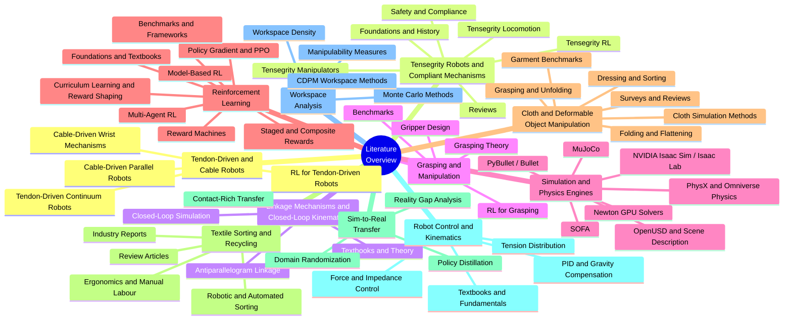

# Literature Overview

[← Project README](../../README.md)

This directory contains the annotated bibliography for the **Tendon-Driven Robot Simulation & RL** project, spanning both the **Project Thesis** and the **Master Thesis**. All references from the shared bibliography ([doc/Theses/shared/bibliography/literature.bib](../Theses/shared/bibliography/literature.bib)) are catalogued here, organized by topic, classified by source type, and rated for relevance.

## Topic Mindmap

## Topic Files

| File                                                   | Topic Area                                  | References |
| ------------------------------------------------------ | ------------------------------------------- | ---------- |
| [tendon_robots.md](tendon_robots.md)                   | Tendon-Driven & Cable Robots                | 52         |
| [tensegrity_robots.md](tensegrity_robots.md)           | Tensegrity Robots & Compliant Mechanisms    | 52         |
| [linkage_mechanisms.md](linkage_mechanisms.md)         | Linkage Mechanisms & Closed-Loop Kinematics | 13         |
| [grasping_manipulation.md](grasping_manipulation.md)   | Grasping & Manipulation                     | 17         |
| [simulation.md](simulation.md)                         | Simulation & Physics Engines                | 42         |
| [reinforcement_learning.md](reinforcement_learning.md) | Reinforcement Learning                      | 35         |
| [cloth_manipulation.md](cloth_manipulation.md)         | Cloth & Deformable Object Manipulation      | 22         |
| [textile_sorting.md](textile_sorting.md)               | Textile Sorting & Recycling                 | 6          |
| [sim_to_real.md](sim_to_real.md)                       | Sim-to-Real Transfer                        | 10         |
| [control_kinematics.md](control_kinematics.md)         | Robot Control & Kinematics                  | 14         |
| [workspace_analysis.md](workspace_analysis.md)         | Workspace Analysis                          | 11         |

## Relevance Rating Legend

Each reference is rated across three dimensions using a color-coded table:

| Rating | Meaning |
|--------|---------|
| 🟢 High | Core reference, directly used or essential |
| 🟡 Medium | Supporting reference, provides context or alternatives |
| 🔴 Low | Peripheral, cited for completeness or background only |

**Dimensions:**

- **Impl.** — Relevance for the software implementation (Isaac Sim environment, RL training pipeline, robot model)
- **Thesis** — Relevance for the written thesis (cited in text, supports arguments, fills literature review)
- **Cred.** — Credibility/believability of the source (peer-reviewed journal > preprint > documentation > blog)

## Related Project Paths

| Path                                                                                          | Description                                                 |
| --------------------------------------------------------------------------------------------- | ----------------------------------------------------------- |
| [doc/Theses/shared/bibliography/literature.bib](../Theses/shared/bibliography/literature.bib) | Shared BibTeX file (all citations)                          |
| [doc/Theses/project_thesis/](../Theses/project_thesis)                                        | Project thesis (Projektarbeit) LaTeX source                 |
| [doc/Theses/master_thesis/](../Theses/master_thesis)                                          | Master thesis (Masterarbeit) LaTeX source                   |

