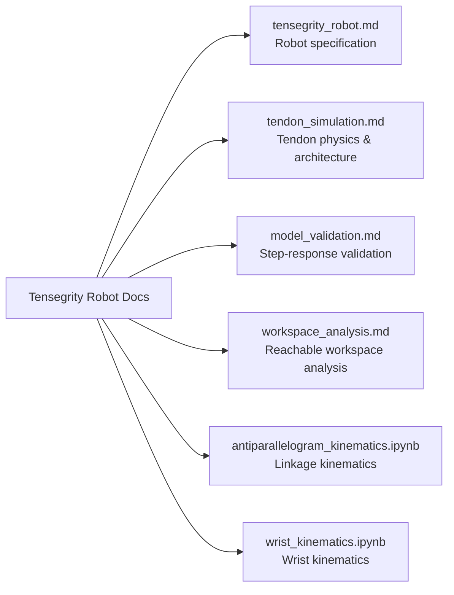

# Tensegrity Robot Documentation

[← Back to documentation index](../README.md) · [Project root](../../README.md)

This section documents the **5-DOF ceiling-mounted tensegrity manipulator**
used in the Isaac Lab simulation project.  It covers the robot's mechanical
design, simulation model, tendon actuation, model validation methodology, and
workspace analysis.

The robot consists of a **2-DOF linear base**, a **3-DOF tendon-driven arm**,
and a **Robotiq 2F-140 parallel gripper**.  Four USD model variants exist:
two with a simplified elbow disc approximation and two with a physically
accurate antiparallelogram four-bar linkage (each in full- and low-resolution
meshes).

## Contents

| Document | Description |
|----------|-------------|
| [tensegrity_robot.md](tensegrity_robot.md) | Robot structure, kinematic chain, link masses, joint specs, CAD reference points, actuation modes, and USD build pipeline |
| [tendon_simulation.md](tendon_simulation.md) | Tendon-driven simulation: physical model, Jacobian-transpose torque mapping, software architecture, and motor specifications |
| [model_validation.md](model_validation.md) | Step-response validation methodology comparing Isaac Sim against Klein (2023) Gazebo and real-robot results |
| [workspace_analysis.md](workspace_analysis.md) | Monte Carlo forward-kinematics workspace sampling, quality measures, and visualisation |
| [antiparallelogram_kinematics.ipynb](antiparallelogram_kinematics.ipynb) | Interactive notebook deriving the antiparallelogram linkage kinematics |
| [wrist_kinematics.ipynb](wrist_kinematics.ipynb) | Interactive notebook for wrist kinematics analysis |

## Related

- [Project README](../../README.md) — top-level project overview
- [Documentation index](../README.md) — all project documentation
- [Source code](../../src/tensegrity_pick/README.md) — Isaac Lab extension, registered tasks, robot configs
- [USD assets](../../res/Tensegrity/README.md) — simulation-ready USD files and source meshes
- [Test suite](../../test/README.md) — pytest tests for actuators, configs, and environments
- [Literature — Tendon robots](../literatur/tendon_robots.md) — annotated bibliography on tendon-driven robots
- [Literature — Simulation](../literatur/simulation.md) — annotated bibliography on robot simulation 