# Model Validation

[← Back to Tensegrity Robot docs](README.md) · [Project root](../../README.md)

The simulation model is validated against Klein (2023) by running
**step-response tests** on each arm joint and comparing timing metrics to the
physical robot and Gazebo reference results.  The validation pipeline supports
three targets: the PD-driven arm, the tendon-driven arm (both elbow-approx
and physical-linkage variants), and the prismatic base joints.

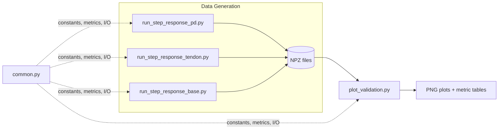

---

## 1  Methodology

Each validation script applies a **step command** to a single joint while
holding all other joints at zero.  The joint position response is recorded at
120 Hz (matching the simulation physics rate of 1/120 s substeps at
decimation 2).  Each trial consists of:

1. **Warm-up** (0.5 s) — hold at zero to settle transients (not recorded)
2. **Pre-step baseline** (0.5 s) — record at zero (visible in plots for reference)
3. **Step hold** (2.5 s) — apply step amplitude and record
4. **Return to zero** (1.0 s) — set target back to zero and record

### 1.1  Test Matrix

| Joint | Step amplitudes | Controller | Saturation | Min tension |
|-------|----------------|------------|------------|-------------|
| `elbow_joint` | 20°, 30°, 40° | PID (Kp=50, Ki=4, Kd=2) | 400 N | 6 N |
| `wrist_y_joint` | 10°, 20°, 30° | PID (Kp=10, Ki=1.5, Kd=0.6) | 600 N | 5 N |
| `wrist_x_joint` | 10°, 20°, 30° | PID (Kp=10, Ki=1.5, Kd=0.6) | 600 N | 5 N |

PID gains are scaled ~133× from Klein (2023) originals (Kp=0.3, Ki=0.03,
Kd=0.02) to match Isaac Sim's effective rotational inertia (~0.103 kg·m²
for the elbow).  The `Kd` term uses derivative-on-measurement (i.e.
`−Kd · joint_vel`) rather than derivative-on-error, which naturally filters
the PhysX velocity noise and avoids chattering on the wrist joints.

The **physical-linkage variant** uses moderately increased elbow gains
(Kp=75, Ki=6, Kd=3, saturation 500 N) to account for higher effective
inertia from the four-bar linkage.  Wrist gains are identical.

### 1.2  Gravity Compensation

Each PID controller includes feedforward gravity compensation:

$$\tau_g = m_e \cdot g \cdot l_c \cdot \sin(\theta)$$

| Joint | Moving mass $m_e$ | Lever arm $l_c$ | Components |
|-------|-------------------|-----------------|------------|
| Elbow | 2.49 kg | 0.26 m | disc (0.192) + forearm (1.9) + EE (0.4); combined CoM from elbow axis |
| Wrist | 0.40 kg | 0.068 m | `end_effector_link` mass; half wrist-to-tool distance |

### 1.3  Performance Metrics

| Metric | Definition | Target |
|--------|-----------|--------|
| Rise time $t_r$ | Time from 10% to 90% of step amplitude | — |
| Settling time $t_s$ | Time to stay within ±2% of target | 0.10–0.30 s |
| Overshoot $M_p$ | Peak % above target | < 5% |
| NRMSE | $100 \times \text{RMSE} / (\theta_{\max} - \theta_{\min})$ over the hold phase | Compare to Klein (2023) |

### 1.4  Klein (2023) NRMSE Reference

Gazebo simulation vs. real robot from Klein (2023) Table 4.2:

| Joint | 10° / 20° | 20° / 30° | 30° / 40° |
|-------|-----------|-----------|-----------|
| `wrist_x_joint` | 25.5% | 9.9% | 11.2% |
| `wrist_y_joint` | 19.2% | 11.6% | 12.5% |
| `elbow_joint` | 39.1% | 11.7% | 12.1% |

The Isaac Sim model aims to achieve comparable or better NRMSE values.

### 1.5  PD/PD Gain Tuning

#### PD Arm Tuning

The PD drives use Isaac Sim's built-in `ImplicitActuator` with stiffness
K=400 and damping D=20.  These values were determined by
`tune_pd_gains.py`, a 5-phase systematic tuning script:

1. **Step-response** — all base (2 joints × 3 amplitudes) and arm (3 joints
   × 3 amplitudes) steps at the current gains
2. **Arm damping sweep** — K=400 fixed, D swept through [120, 60, 30, 25,
   20, 15]; best D selected by average settling time across all arm joints
3. **Cross-coupling** — each arm joint steps ±0.30 rad; base drift monitored
   (threshold: 0.01 rad/m) to ensure arm motion does not destabilize the base
4. **Gripper grasp** — close on cube → lift → hold → verify grip maintained
5. **Summary** — side-by-side current vs recommended gains

The analytical critical damping for the elbow (J_eff ≈ 0.22 kg·m²) is
D_crit ≈ 18.7 N·m·s/rad.  The damping sweep confirmed **D=20** as the validated
optimum (ζ ≈ 1.07, near-critically damped, fastest settling without
significant overshoot).

#### PD Base Tuning

Base prismatic joints use K=8000, D=800, tuned for fast settling of the
comparatively heavy base+arm assembly.  A damping sweep over
[1600, 1200, 800, 600, 400, 200] confirmed D=800 as the best trade-off
between settling speed and overshoot.

### 1.6  PD Arm Validation

Uses the tuned `ImplicitActuator` PD drives (K=400, D=20).  An optional
damping sweep (D = 120, 60, 30, 25, 20, 15) can be run to generate
comparative step-response curves.

### 1.7  Tendon Arm Validation

Replaces PD drives with a PID controller that outputs tendon tensions mapped
to joint torques via the Jacobian transpose ($\tau = J^T \cdot T$).

- **Elbow-approx variant**: constant $J^T$ mapping (zero-configuration
  approximation).  The 3×5 Jacobian transpose is pre-computed from the
  tendon geometry at the neutral pose.
- **Physical-linkage variant**: elbow tendons apply body forces at physical
  attachment points on `root_link` and `forearm_link` (configuration-dependent
  torque mapping); wrist uses the same constant $J^T$.

In both variants, a minimum cable pre-tension (6 N elbow, 5 N wrist) is
maintained on inactive tendons to model realistic cable slack prevention.

### 1.8  Base Joint Validation

Tests the two prismatic base joints (`base_y_joint`, `base_z_joint`) with PD
position control (K=8000, D=800).  Gravity feedforward for the Z axis
compensates the weight of the entire arm assembly.

---

## 2  Running the Validation

The recommended workflow uses the pipeline script:

```bash
cd src/tensegrity_pick
bash scripts/model_validation/run_validation.sh
```

Individual steps can also be run separately — see
[`scripts/model_validation/README.md`](../../src/tensegrity_pick/scripts/model_validation/README.md)
for full usage.

| Script | Description |
|--------|-------------|
| `run_step_response_pd.py` | PD arm step responses (all 3 joints × 3 amplitudes); `--damping_sweep` for D-sweep |
| `run_step_response_tendon.py` | Tendon arm step responses (`--variant elbow_approx` or `physical`) |
| `run_step_response_base.py` | Base joint step responses; `--damping_sweep` for D-sweep |
| `plot_validation.py` | Reads NPZ data and generates PNG plots + metric tables |
| `common.py` | Shared constants, PID math, gravity compensation, J^T mapping, metrics, NPZ I/O |
| `tune_pd_gains.py` | 5-phase systematic PD gain tuning (arm + base + cross-coupling + gripper) |

Data is written to `outputs/model_validation/{pd,tendon,tendon_physical,base}/data/`
as compressed `.npz` files.

---

## 3  Results

### 3.1  NRMSE Comparison (Elbow Approximation)
(PD vs Tendon vs Klein Gazebo)

| Joint | Amplitude | Klein (2023) | PD (Isaac) | Tendon (Isaac) |
|-------|-----------|-------------|-----------|----------------|
| `elbow_joint` | 20° | 39.1 % | 9.5 % | 12.9 % |
| `elbow_joint` | 30° | 11.7 % | 9.5 % | 15.0 % |
| `elbow_joint` | 40° | 12.1 % | 9.5 % | 17.0 % |
| `wrist_y_joint` | 10° | 19.2 % | 8.3 % | 9.7 % |
| `wrist_y_joint` | 20° | 11.6 % | 8.3 % | 12.4 % |
| `wrist_y_joint` | 30° | 12.5 % | 8.3 % | 14.8 % |
| `wrist_x_joint` | 10° | 25.5 % | 8.3 % | 9.7 % |
| `wrist_x_joint` | 20° | 9.9 % | 8.3 % | 12.4 % |
| `wrist_x_joint` | 30° | 11.2 % | 8.3 % | 14.8 % |

Both Isaac Sim models achieve comparable or better NRMSE than the Klein (2023)
Gazebo reference.  The PD model is slightly more accurate due to its direct
joint-level control, while the tendon model introduces physically realistic
tendon-mediated dynamics.

### 3.2  Physical-Linkage Tendon Model

The physical-linkage variant uses body forces on the four-bar linkage instead
of the single-DOF elbow-joint approximation.

| Joint | Amplitude | Rise (ms) | Settle (ms) | NRMSE |
|-------|-----------|-----------|-------------|-------|
| `elbow_physical` | 20° | 92 | 133 | 12.7 % |
| `elbow_physical` | 30° | 108 | 167 | 13.1 % |
| `elbow_physical` | 40° | 117 | 183 | 14.0 % |
| `wrist_y_joint` | 10° | 83 | 150 | 9.7 % |
| `wrist_y_joint` | 20° | 100 | 183 | 12.4 % |
| `wrist_y_joint` | 30° | 142 | 217 | 14.9 % |
| `wrist_x_joint` | 10° | 83 | 283 | 10.1 % |
| `wrist_x_joint` | 20° | 100 | 192 | 12.6 % |
| `wrist_x_joint` | 30° | 133 | 225 | 14.9 % |

All joints settle within 300 ms across all amplitudes.  The physical model
achieves comparable performance to the elbow-approx variant, confirming
that the four-bar linkage kinematics and tendon-mediated actuation work
correctly.

### 3.3  Base Joint Validation

| Joint | Amplitude | Rise (ms) | Settle (ms) | NRMSE | SS Error |
|-------|-----------|-----------|-------------|-------|----------|
| `base_y_joint` | 50 mm | 92 | 183 | 11.2 % | 0.002 mm |
| `base_y_joint` | 100 mm | 92 | 183 | 11.2 % | 0.002 mm |
| `base_y_joint` | 200 mm | 92 | 183 | 11.3 % | 0.001 mm |
| `base_z_joint` | 30 mm | 100 | 183 | 11.2 % | 0.001 mm |
| `base_z_joint` | 60 mm | 100 | 183 | 11.2 % | 0.001 mm |
| `base_z_joint` | 100 mm | 100 | 183 | 11.3 % | 0.001 mm |

Steady-state errors are negligible (< 0.003 mm) with gravity feedforward.

### 3.4  Plots

#### Elbow Joint — PD Model

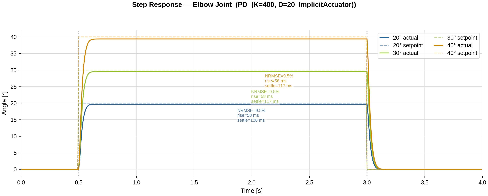

#### Elbow Joint — Tendon Model (elbow_approx)

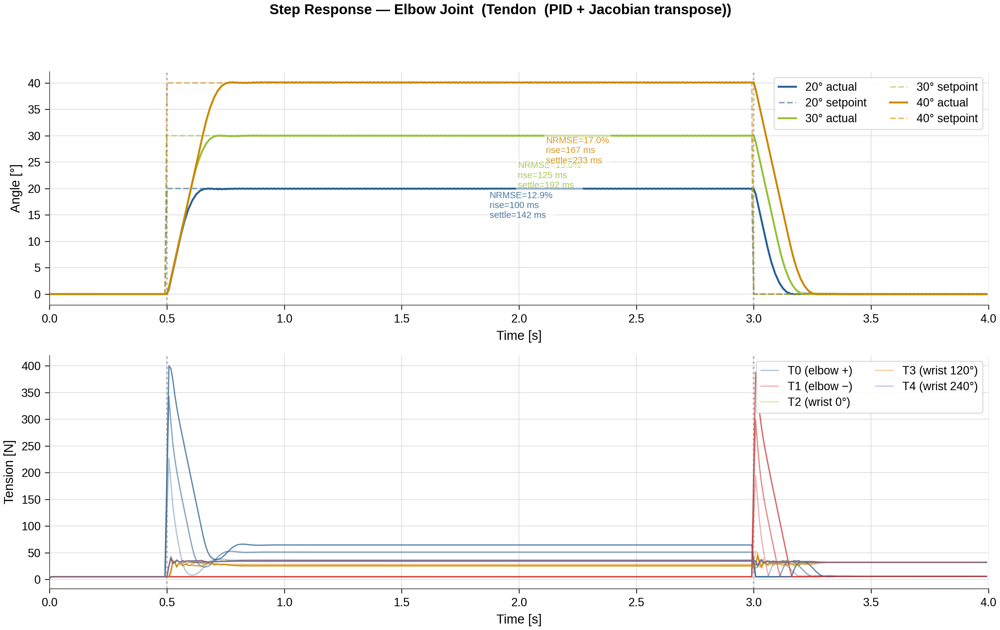

#### Elbow Joint — Physical Linkage

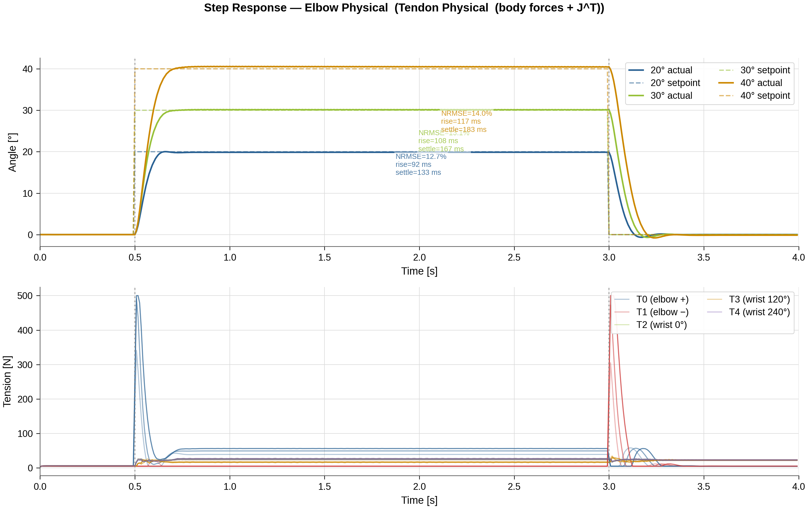

#### Wrist Y Joint — PD vs Tendon

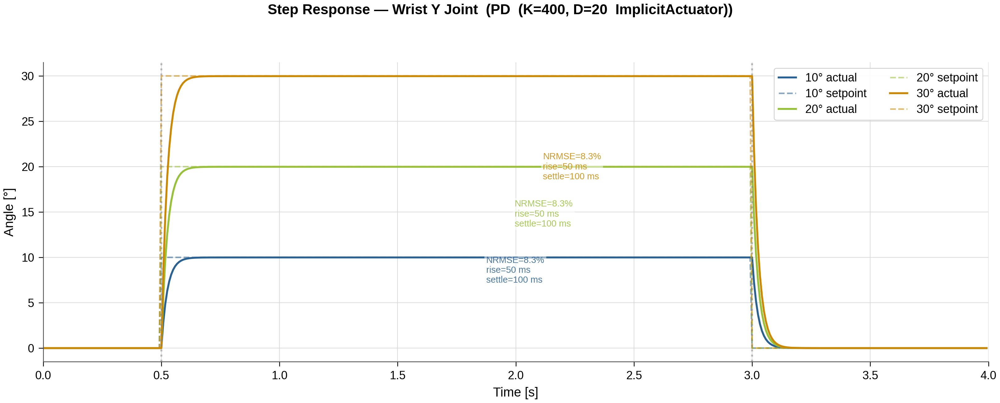
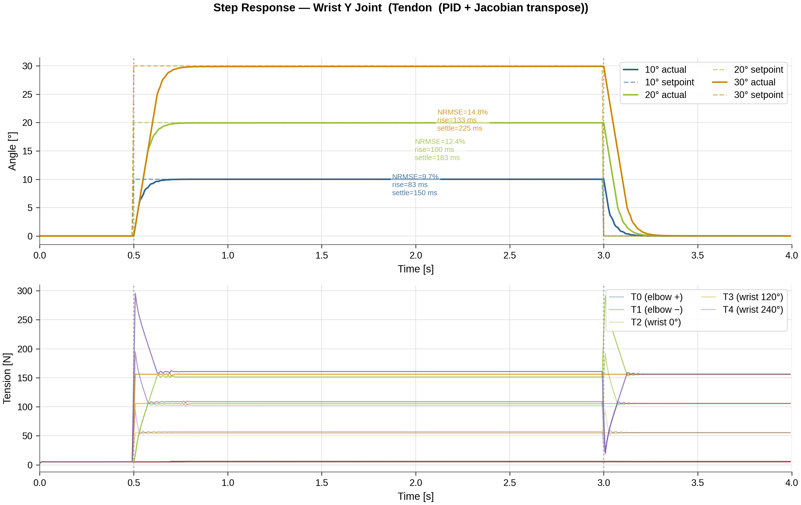

#### NRMSE Comparison

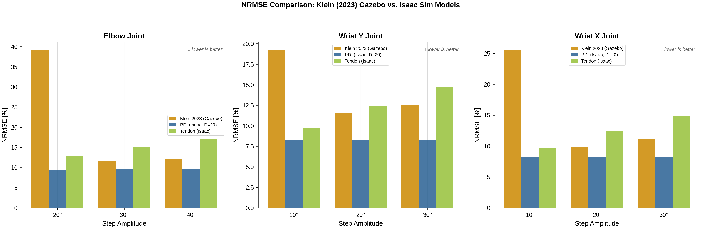

#### Settling Time Comparison

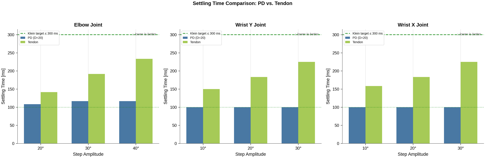

#### Damping Sweep (Elbow)

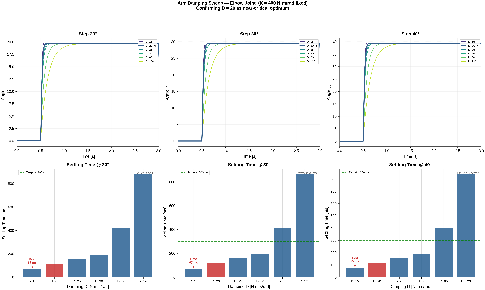

#### Base Joints

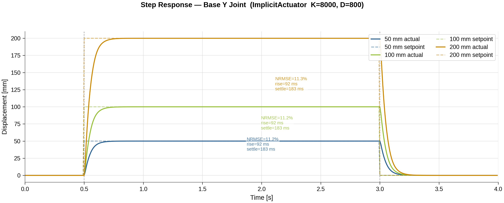
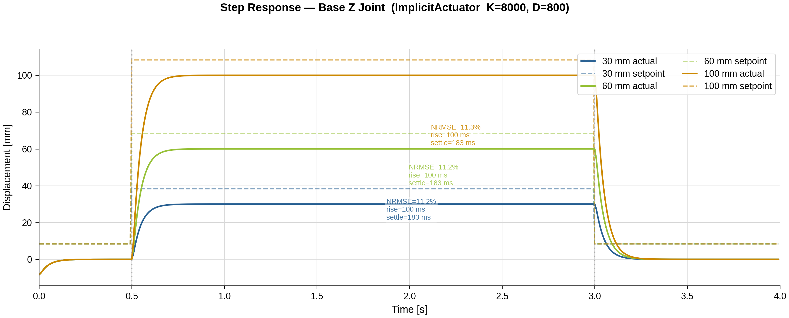

---

## Related

- [tensegrity_robot.md](tensegrity_robot.md) — robot structure, joint specs, actuation modes
- [tendon_simulation.md](tendon_simulation.md) — tendon physics model and Jacobian-transpose mapping
- [Validation scripts README](../../src/tensegrity_pick/scripts/model_validation/README.md) — detailed usage and CLI options
- [Test suite](../../test/README.md) — pytest tests for actuators, configs, and environments
- [Literature — Tendon robots](../literatur/tendon_robots.md) — annotated bibliography 