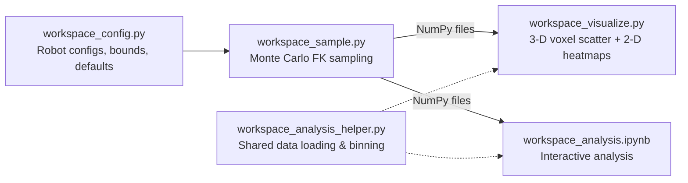
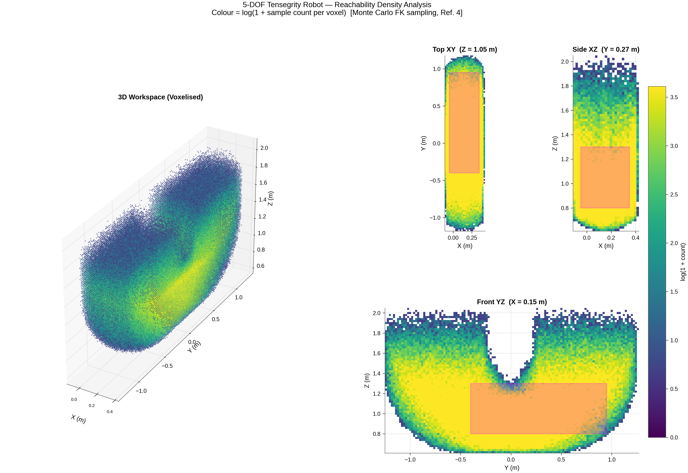
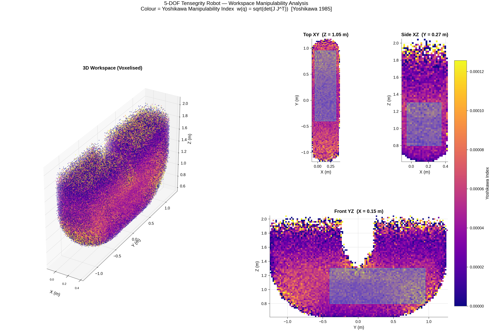

# Workspace Analysis

[← Back to Tensegrity Robot docs](README.md) · [Project root](../../README.md)

Workspace analysis characterises the reachable Cartesian space of the
tensegrity manipulator and compares it against conventional robot arms
(UR10e 6-DOF, Kinova Gen3 7-DOF).  The analysis uses **Monte Carlo
forward-kinematics sampling** to estimate reachability and manipulability
across the task-relevant volume.

> **Note — Disc approximation only.**  All workspace analysis results
> presented in this work use the **disc-approximated elbow** model
> exclusively.  Computing reliable FK samples for the physical
> antiparallelogram variant requires enforcing the McCarthy & Soh (2010)
> four-bar closure equation, resetting the PhysX loop-closure constraint
> before each batch, and rejecting samples where the constraint breaks.
> Despite these measures, the PhysX `excludeFromArticulation` loop-closure
> constraint degrades stochastically under large Monte Carlo batches,
> making the resulting workspace statistics unreliable.
>
> This limitation is acceptable for task design because the disc
> approximation **underestimates** the physical elbow's reachable workspace.
> As shown in the
> [antiparallelogram kinematic analysis](antiparallelogram_kinematics.ipynb),
> the antiparallelogram's coupler (forearm) traces a larger arc than the
> disc model's circular arc at equivalent elbow deflection angles: the
> antiparallelogram's migrating instantaneous center of rotation shifts the
> forearm tip outward at extreme angles, increasing the effective reach.
> Therefore, basing the prismatic base positioning and desired workspace
> geometry on the disc-approximation analysis is conservative — the
> physical robot will be able to reach at least as much, if not more.



---

## 1  Methodology

### 1.1  Monte Carlo Forward-Kinematics Sampling

Joint configurations are **uniformly sampled** within the joint limits
(default: 2,000,000 samples across 4,096 parallel environments).  For each
sample the Isaac Sim physics engine computes the forward kinematics and
the geometric Jacobian at the end-effector body.  A gripper-tip offset
of (0, 0, −0.225) m along the EE body's local Z axis accounts for the
Robotiq 2F-140 fingertip position.

### 1.2  Quality Measures

Two quality measures are computed per sample and aggregated into voxels
(default voxel size: 20 mm):

**Yoshikawa Manipulability Index** (Yoshikawa, 1985):

$$w(\mathbf{q}) = \sqrt{\det\!\bigl(J(\mathbf{q})\, J(\mathbf{q})^T\bigr)}$$

Higher values indicate the end effector can move equally well in all
Cartesian directions (far from singularities).  Zero at singular
configurations.

**Reachability Density**: the number of FK samples landing in each
voxel, proportional to the joint-space volume mapping to that Cartesian
region.  Higher density means more configurations can reach that area.

> **Note on inverse condition number.**  The inverse condition number
> $\kappa^{-1} = \sigma_{\min} / \sigma_{\max}$ evaluates to zero
> everywhere for the 5-DOF tensegrity manipulator.  This is expected:
> the geometric Jacobian is 6×5, making it rank-deficient by
> construction (5 DOF cannot independently control all 6 Cartesian
> directions).  The measure is therefore not informative for this robot
> and is excluded from the analysis.

### 1.3  Desired Workspace

The desired workspace is derived from the Klein (2023) task geometry:

| Axis | Min (m) | Max (m) |
|------|---------|---------|
| X | −0.05 | +0.35 |
| Y | −0.40 | +0.95 |
| Z | +0.80 | +1.30 |

A translucent box visualises this volume during sampling.

### 1.4  Supported Robots

| Key | Robot | DOF | End-Effector Body | Mount Height |
|-----|-------|-----|-------------------|-------------|
| `tensegrity` | 5-DOF Tensegrity Robot (elbow_approx) | 5 (2 base + 3 arm) | `tool_link_0` | 2.30 m |
| `ur10e` | UR10e + Robotiq 2F-140 | 6 | `robotiq_base_link` | 1.40 m |
| `kinova` | Kinova Gen3 + Robotiq 2F-140 | 7 | `end_effector_link` | 1.40 m |

> The `tensegrity_physical` configuration remains in `workspace_config.py`
> for reference but is **not used** for the reasons described above.

### 1.5  Visualisation

`workspace_visualize.py` generates publication-quality figures for each
quality measure.  Each figure contains:

- **Left**: 3-D voxelised scatter plot (colour-mapped by metric value)
- **Right**: three 2-D cross-section heatmaps — thin slices through the
  midpoint of the desired workspace along the X, Y, and Z axes

An interactive Jupyter notebook (`workspace_analysis.ipynb`) is also
available for exploratory analysis.

---

## 2  Running the Analysis

All commands are run from the `src/tensegrity_pick` directory.

### Step 1 — Sample workspace

```bash
conda run --no-capture-output -n env_isaaclab python3 -u \
    scripts/workspace_analysis/workspace_sample.py --headless
```

Optional flags:

| Flag | Default | Description |
|------|---------|-------------|
| `--robot` | `tensegrity` | Robot to analyse (`tensegrity`, `ur10e`, `kinova`) |
| `--num_samples` | 2,000,000 | Total FK samples |
| `--num_envs` | 4,096 | Parallel environments |
| `--mount_height` | per-robot | Override mount height (m) |

Data is written to `outputs/workspace_analysis/` (or
`outputs/workspace_analysis_<robot>/`) as NumPy files.

### Step 2 — Visualise

```bash
python3 scripts/workspace_analysis/workspace_visualize.py
python3 scripts/workspace_analysis/workspace_visualize.py --voxel_size 0.03
```

Plots are saved to the same output directory.

---

## 3  Results

### 3.1  Tensegrity Robot (Disc Approximation)

**Configuration:** 2,000,000 Monte Carlo FK samples, ceiling-mounted at
2.30 m, 4,096 parallel environments, voxel size 20 mm.

| Metric | Value |
|--------|-------|
| Total samples | 2,000,000 |
| Samples inside desired workspace | 701,472 (35.1 %) |
| Desired workspace coverage | 99.72 % (33,904 / 34,000 voxels) |
| Yoshikawa manipulability (inside WS, mean) | 5.2 × 10⁻⁵ |
| Yoshikawa manipulability (inside WS, median) | 1 × 10⁻⁶ |
| Yoshikawa manipulability (inside WS, p95) | 1.91 × 10⁻⁴ |

The disc-approximation model achieves near-complete coverage of the
desired workspace (99.7 %).  Manipulability is highest near the centre
of the workspace and drops toward the boundaries, as expected for the
5-DOF kinematic chain.




### 3.2  Why Only the Disc Approximation Is Used

The disc approximation replaces the antiparallelogram's migrating
instantaneous center of rotation (ICR) with a fixed pivot.  As detailed
in [`antiparallelogram_kinematics.ipynb`](antiparallelogram_kinematics.ipynb),
this produces a **shorter** forearm-tip arc at identical elbow angles,
because the physical ICR migrates outward along the fixed centrode
ellipse (Dijksman, 1977), effectively lengthening the lever.  The
[comparison plot](../Theses_typst/shared/figures/elbow_comparison_static.svg)
shows the positional deviation growing to several millimetres at ±75°,
with the disc arc always falling **inside** the antiparallelogram arc.

Consequently:

- The disc-based workspace represents a **conservative lower bound** on
  the physical robot's reachable volume.
- Prismatic base positioning, mount height, and desired workspace
  boundaries derived from this analysis remain valid — and gain
  additional margin — when the physical elbow is used.
- The RL tasks and reward functions designed within this workspace are
  therefore guaranteed to be feasible on the physical hardware.

### 3.3  Condition Number Limitation

The inverse condition number $\kappa^{-1} = \sigma_{\min}/\sigma_{\max}$
evaluates to exactly 0.0 across all samples for the 5-DOF tensegrity
robot.  The 6×5 geometric Jacobian has at most rank 5, so
$\sigma_{\min} = 0$ by construction.  This measure is only meaningful
for robots with ≥ 6 DOF and is excluded from further analysis.

---

## Related

- [tensegrity_robot.md](tensegrity_robot.md) — robot structure, kinematic chain, joint specs
- [antiparallelogram_kinematics.ipynb](antiparallelogram_kinematics.ipynb) — elbow kinematic analysis and disc-vs-antiparallelogram comparison
- [model_validation.md](model_validation.md) — step-response validation methodology
- [Source code](../../src/tensegrity_pick/README.md) — Isaac Lab extension, registered tasks
- [Literature — Tendon robots](../literatur/tendon_robots.md) — annotated bibliography
