# Markdown Graph & Diagram Showcase

A reference of every diagram type available in GitHub-flavoured Markdown
(rendered via Mermaid, GeoJSON, TopoJSON, and STL).

---

## Table of Contents

- [Mermaid Diagrams](#mermaid-diagrams)
  - [Flowchart](#flowchart)
  - [Sequence Diagram](#sequence-diagram)
  - [Class Diagram](#class-diagram)
  - [State Diagram](#state-diagram)
  - [Entity Relationship Diagram](#entity-relationship-diagram)
  - [Gantt Chart](#gantt-chart)
  - [Pie Chart](#pie-chart)
  - [Git Graph](#git-graph)
  - [Mindmap](#mindmap)
  - [Timeline](#timeline)
  - [Quadrant Chart](#quadrant-chart)
  - [XY Chart (Bar)](#xy-chart-bar)
  - [XY Chart (Line)](#xy-chart-line)
  - [Sankey Diagram](#sankey-diagram)
  - [Block Diagram](#block-diagram)
  - [Packet Diagram](#packet-diagram)
  - [Kanban Board](#kanban-board)
  - [Architecture Diagram](#architecture-diagram)
- [Mathematical Equations (LaTeX)](#mathematical-equations-latex)
- [GeoJSON Map](#geojson-map)
- [TopoJSON Map](#topojson-map)
- [STL 3D Model](#stl-3d-model)

---

## Mermaid Diagrams

All diagrams below use fenced code blocks with the `mermaid` language identifier.

### Flowchart

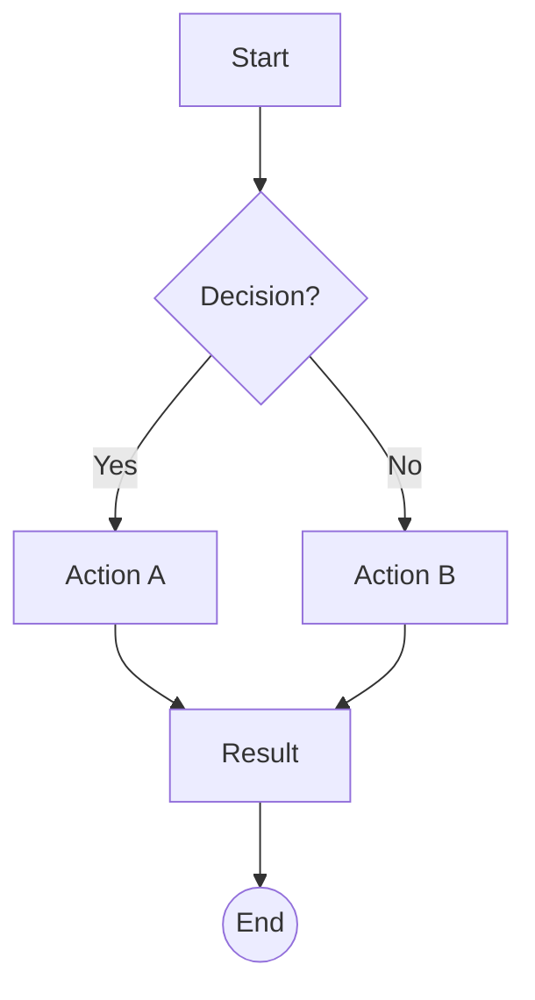

### Sequence Diagram

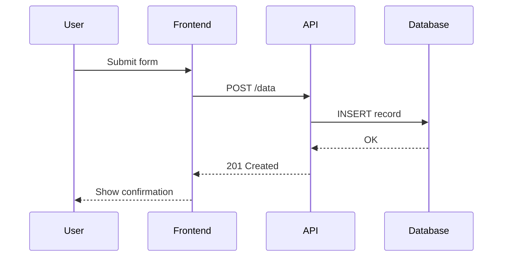

### Class Diagram

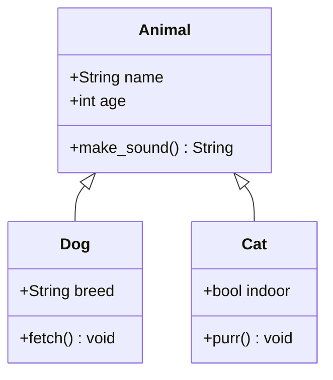

### State Diagram

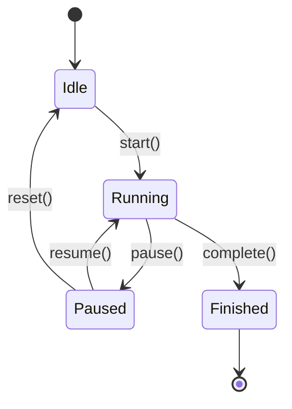

### Entity Relationship Diagram

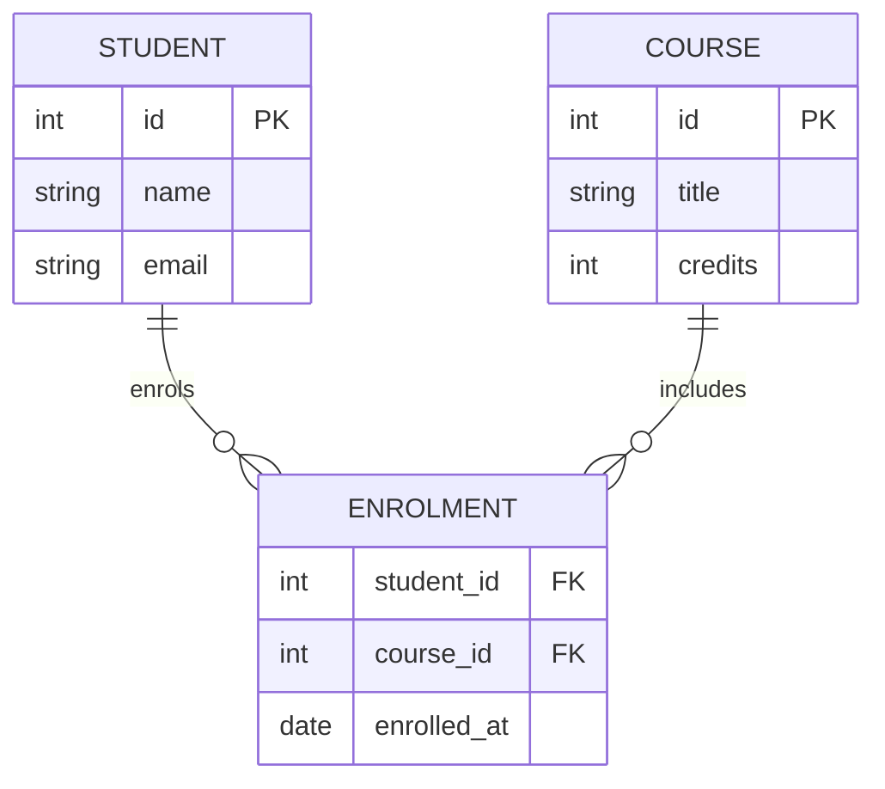

### Gantt Chart

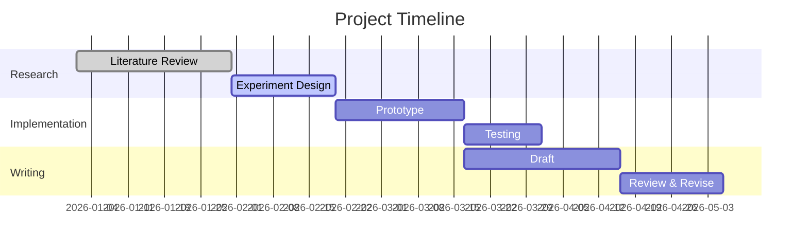

### Pie Chart

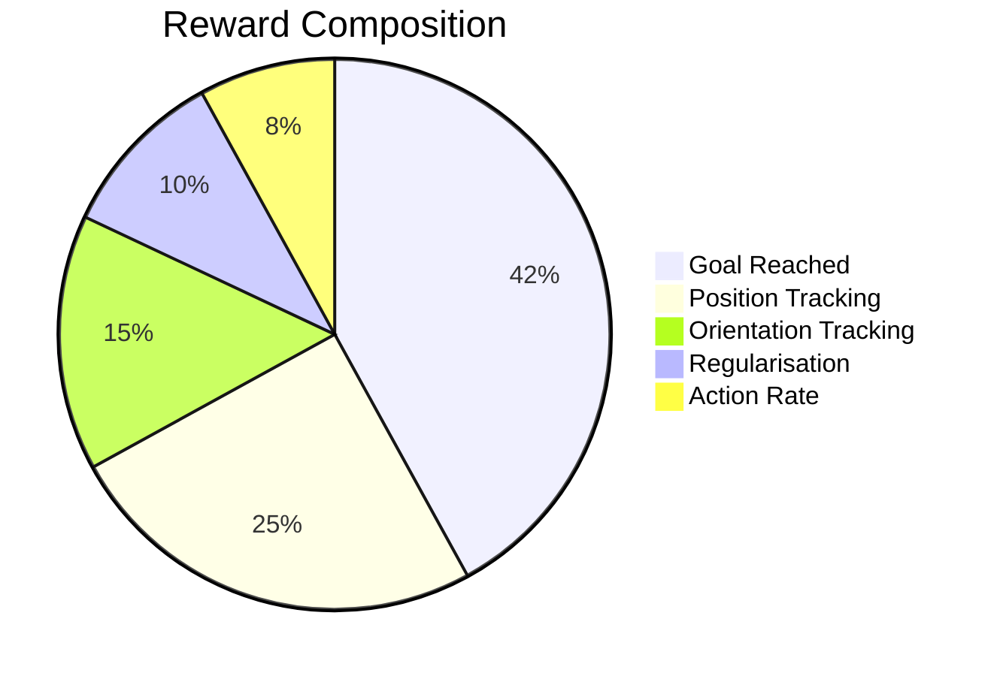

### Git Graph

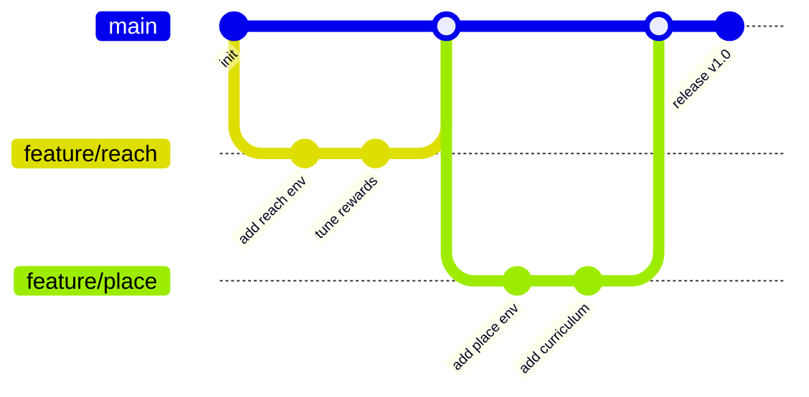

### Mindmap

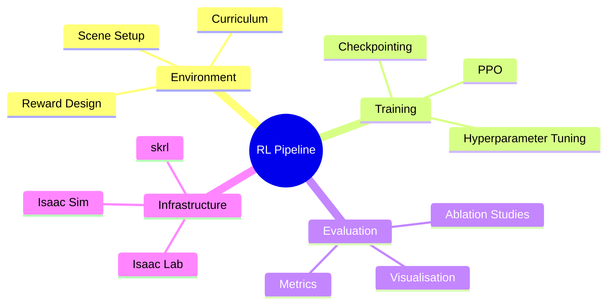

### Timeline

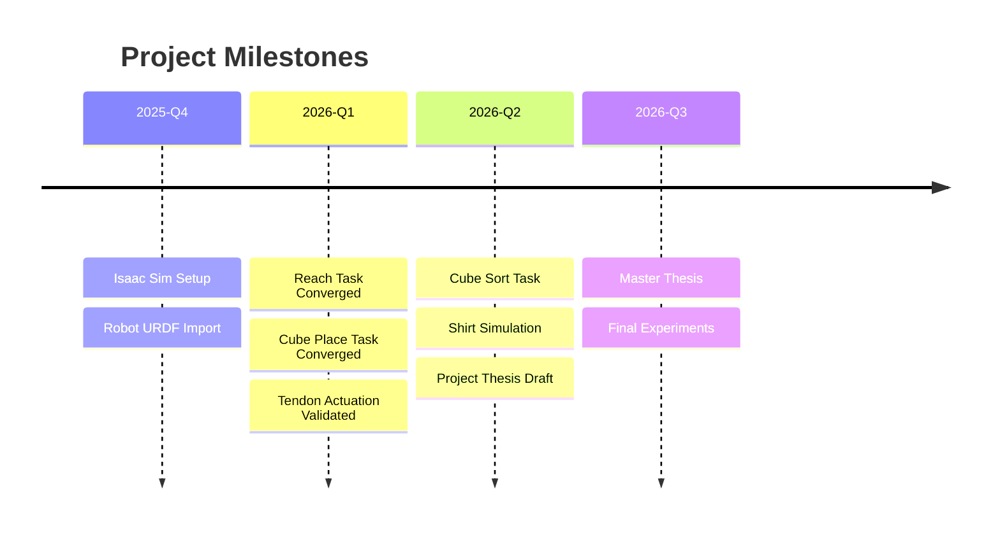

### Quadrant Chart

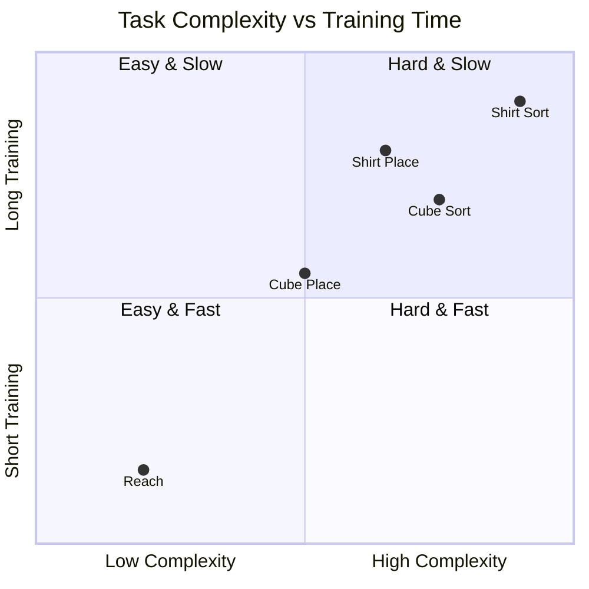

### XY Chart (Bar)

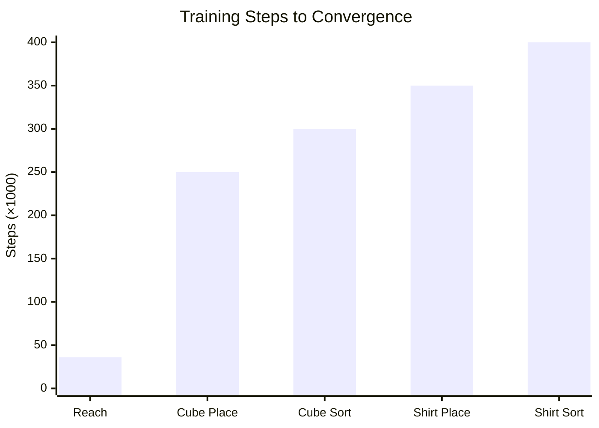

### XY Chart (Line)

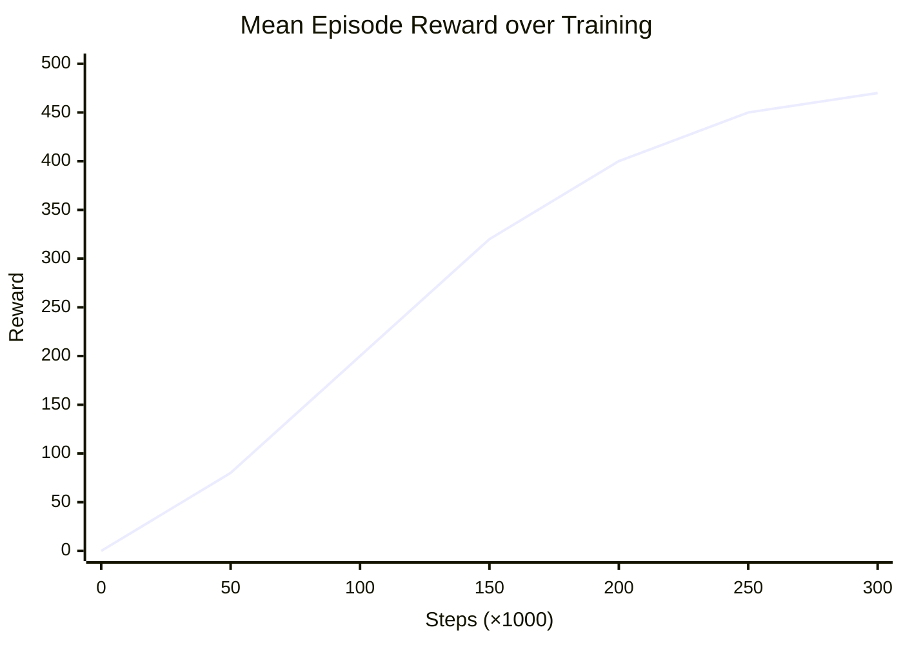

### Sankey Diagram

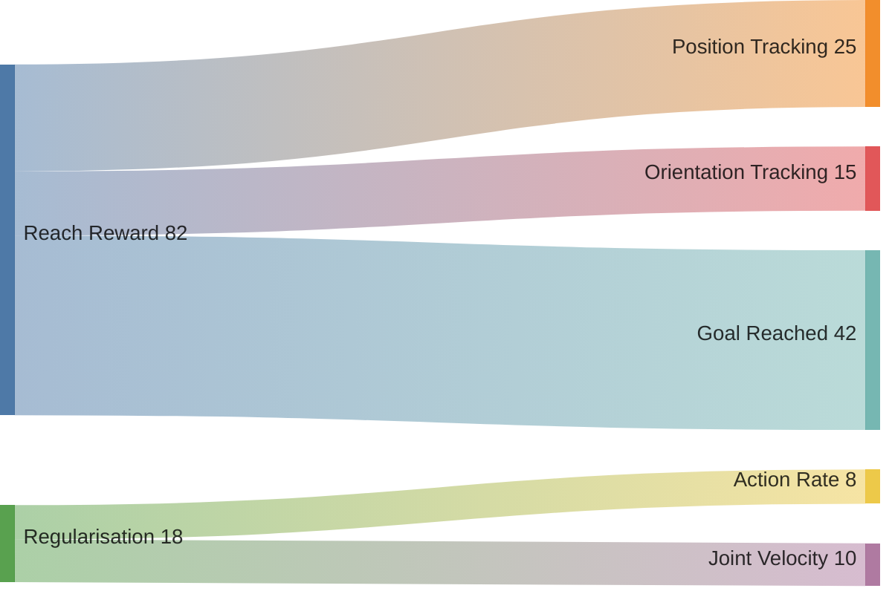

### Block Diagram

```mermaid
block-beta
    columns 3
    input["Observations (22-dim)"] :3
    space :3
    block:policy :3
        columns 2
        hidden1["Hidden 256"] hidden2["Hidden 128"]
    end
    space :3
    actions["Actions (5-dim)"] :3
```

### Packet Diagram

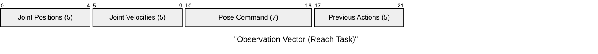

### Kanban Board

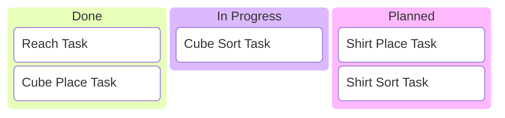

### Architecture Diagram

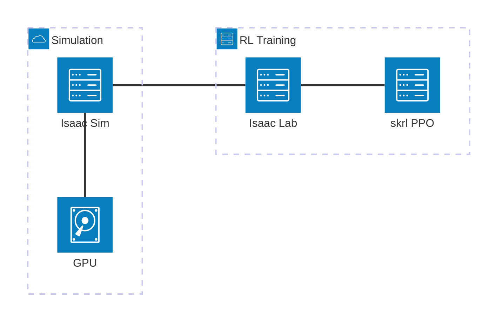

---

## Mathematical Equations (LaTeX)

GitHub renders LaTeX math in Markdown using `$` for inline and `$$` for blocks.

Inline: The policy gradient is $\nabla_\theta J(\theta) = \mathbb{E}\left[\nabla_\theta \log \pi_\theta(a|s) \cdot A(s,a)\right]$.

Block equation — PPO clipped surrogate objective:

$$
L^{CLIP}(\theta) = \hat{\mathbb{E}}_t \left[ \min\left( r_t(\theta) \hat{A}_t, \; \text{clip}\left(r_t(\theta), 1-\epsilon, 1+\epsilon\right) \hat{A}_t \right) \right]
$$

where $r_t(\theta) = \frac{\pi_\theta(a_t|s_t)}{\pi_{\theta_{old}}(a_t|s_t)}$.

Bellman equation:

$$
V^\pi(s) = \sum_a \pi(a|s) \left[ R(s,a) + \gamma \sum_{s'} P(s'|s,a) V^\pi(s') \right]
$$

---

## GeoJSON Map

GitHub renders GeoJSON maps inline when placed in a `geojson` code block.

```geojson
{
    "type": "FeatureCollection",
    "features": [
        {
            "type": "Feature",
            "geometry": {
                "type": "Point",
                "coordinates": [11.0275, 49.5732]
            },
            "properties": {
                "name": "FAPS — FAU Erlangen-Nürnberg",
                "description": "Department of Mechanical Engineering"
            }
        }
    ]
}
```

---

## TopoJSON Map

GitHub also renders TopoJSON. This example shows a simple bounding box around Erlangen.

```topojson
{
    "type": "Topology",
    "objects": {
        "erlangen": {
            "type": "GeometryCollection",
            "geometries": [
                {
                    "type": "Polygon",
                    "arcs": [[0]],
                    "properties": { "name": "Erlangen Area" }
                }
            ]
        }
    },
    "arcs": [
        [[10.95, 49.55], [11.10, 49.55], [11.10, 49.60], [10.95, 49.60], [10.95, 49.55]]
    ]
}
```

---

## STL 3D Model

GitHub renders STL files placed in `stl` code blocks as interactive 3D viewers.
Below is a minimal cube for demonstration.

```stl
solid cube
  facet normal 0 0 -1
    outer loop
      vertex 0 0 0
      vertex 1 0 0
      vertex 1 1 0
    endloop
  endfacet
  facet normal 0 0 -1
    outer loop
      vertex 0 0 0
      vertex 1 1 0
      vertex 0 1 0
    endloop
  endfacet
  facet normal 0 0 1
    outer loop
      vertex 0 0 1
      vertex 1 1 1
      vertex 1 0 1
    endloop
  endfacet
  facet normal 0 0 1
    outer loop
      vertex 0 0 1
      vertex 0 1 1
      vertex 1 1 1
    endloop
  endfacet
  facet normal 0 -1 0
    outer loop
      vertex 0 0 0
      vertex 1 0 1
      vertex 1 0 0
    endloop
  endfacet
  facet normal 0 -1 0
    outer loop
      vertex 0 0 0
      vertex 0 0 1
      vertex 1 0 1
    endloop
  endfacet
  facet normal 1 0 0
    outer loop
      vertex 1 0 0
      vertex 1 0 1
      vertex 1 1 1
    endloop
  endfacet
  facet normal 1 0 0
    outer loop
      vertex 1 0 0
      vertex 1 1 1
      vertex 1 1 0
    endloop
  endfacet
  facet normal 0 1 0
    outer loop
      vertex 0 1 0
      vertex 1 1 0
      vertex 1 1 1
    endloop
  endfacet
  facet normal 0 1 0
    outer loop
      vertex 0 1 0
      vertex 1 1 1
      vertex 0 1 1
    endloop
  endfacet
  facet normal -1 0 0
    outer loop
      vertex 0 0 0
      vertex 0 1 0
      vertex 0 1 1
    endloop
  endfacet
  facet normal -1 0 0
    outer loop
      vertex 0 0 0
      vertex 0 1 1
      vertex 0 0 1
    endloop
  endfacet
endsolid cube
```
