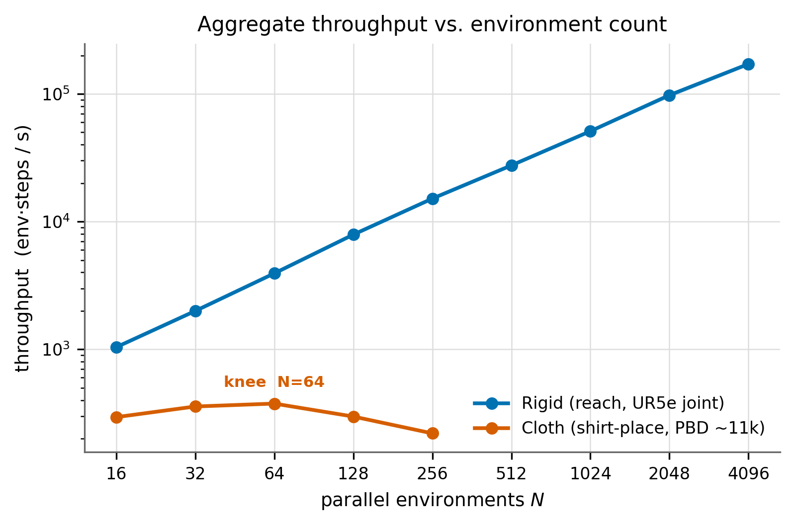
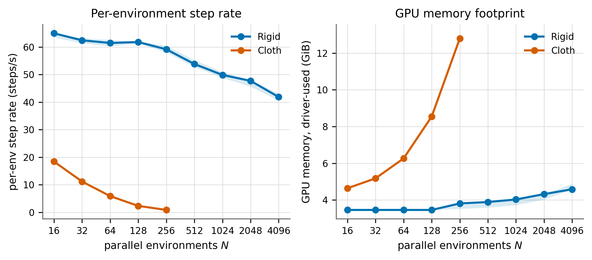
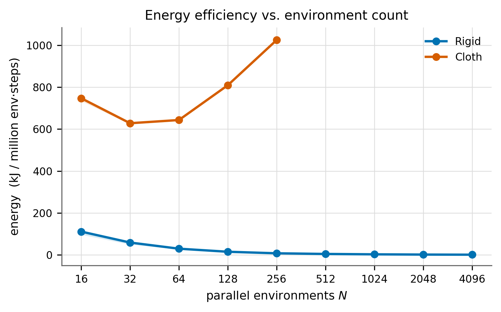
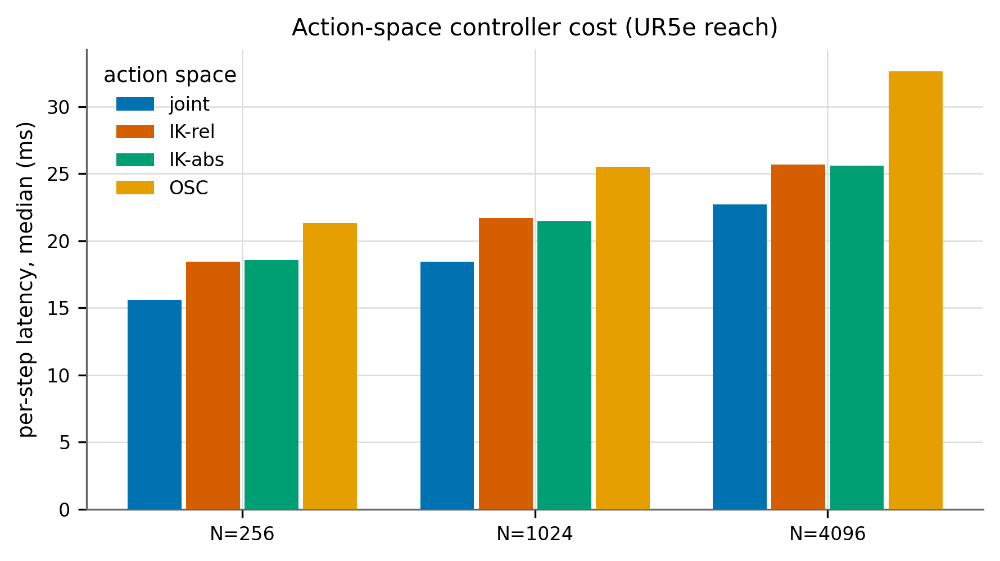
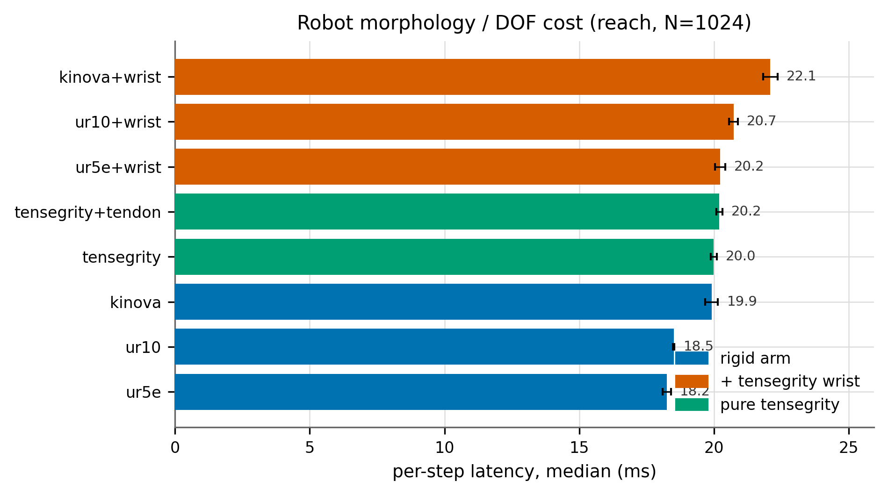
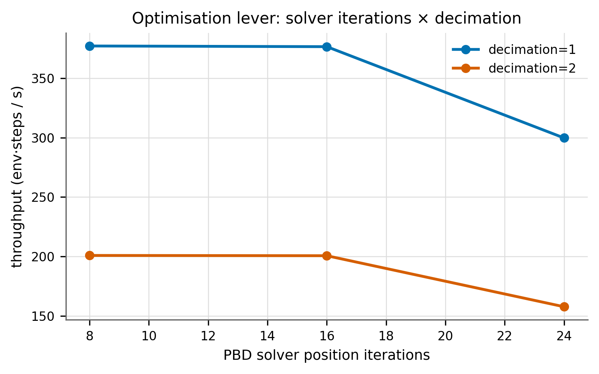
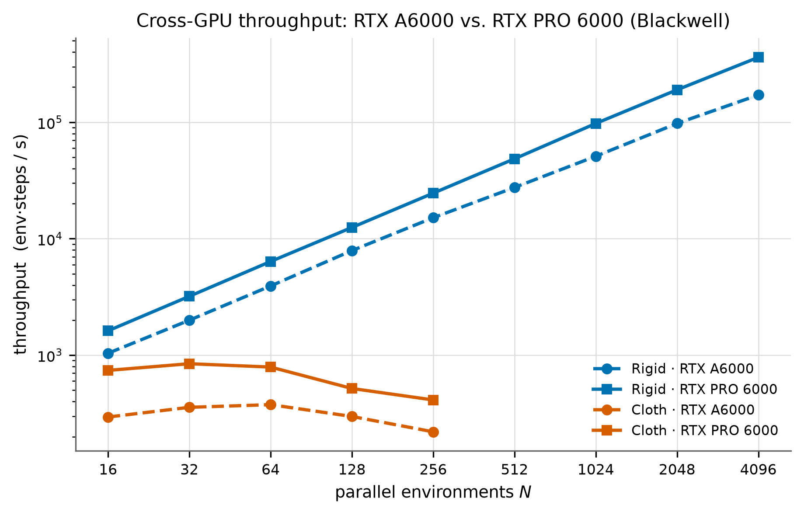

# Computational Performance of a GPU-Parallel Cloth-Manipulation RL Pipeline — Benchmark Report

*Master's-thesis benchmarking chapter. Simulator: NVIDIA Isaac Lab (Isaac Sim 5.1 / PhysX 5); RL: `skrl` PPO. Reproducible suite: [`src/tensegrity_pick/scripts/benchmarking/`](../../src/tensegrity_pick/scripts/benchmarking/). Raw data: [`doc/reports/data/benchmarks/`](data/benchmarks/). Figures: [`doc/reports/figures/benchmarks/`](figures/benchmarks/).*

> **Status.** The §4.1–4.6 results were collected on the **RTX A6000 workstation**.
> The **RTX PRO 6000 Blackwell (Alex/NHR@FAU)** cross-GPU comparison has now been
> **collected** on identical specs/schema via SLURM array dispatch (129 points, same
> git commit and config fingerprints) and is reported in **§4.7**. Both GPUs are
> compared directly because every record carries the full machine/version/git
> provenance blob. The remaining `TODO` arms (vertex×N grid, end-to-end training
> throughput) are asset-/scope-gated future work, not GPU-gated — see §7.

## Key findings (RTX A6000)

- **Cloth throughput peaks at N=64 (376 env·steps/s) and *declines* past it** —
  the opposite of rigid, which scales near-linearly to **171,308 env·steps/s at
  N=4096 with no knee**. A ~450× gap at each side's optimum: **cloth, not the
  robot, is the bottleneck** (§4.1).
- **The simulation ceiling is a PhysX fixed-buffer limit, not VRAM.** N=256 shirts
  simulate validly (12.8 GB of 48 GB); **N=512 fails the physics gate with buffer
  overflow** despite fitting in memory (§4.2). Torch's allocator under-reports
  cloth memory >10× — driver-level NVML is the number that counts.
- **Action space is a first-order lever:** OSC costs **+44 %/step** over joint,
  differential/absolute IK **+13 %** (§4.4).
- **The tensegrity wrist adds only ~+14 %/step** over the plain arm, consistently
  across UR5e/UR10/Kinova — affordable for the fidelity it buys; DOF differences
  are second-order (§4.5). *(Novel result.)*
- **Energy:** rigid improves ~100× with N; cloth is energy-optimal at the same
  N≈64 as its throughput optimum — no speed/energy tension for cloth (§4.3).
- **Cross-GPU (RTX PRO 6000 Blackwell, §4.7):** the Blackwell card confirms the
  memory-bandwidth hypothesis — **cloth speeds up ~2.1–2.5×** (tracking the 2.33×
  GDDR7 bandwidth ratio) while **rigid speeds up only ~1.6×** at matched mid-N
  (compute/occupancy-bound), widening to 2.1× at N=4096. **Every qualitative
  finding transfers**: the cloth knee stays at N≈32–64, **N=512 still overflows the
  fixed PhysX buffer despite 96 GB VRAM** (the ceiling is not memory), the
  action-space ranking and the ~+14 % tensegrity-wrist overhead are unchanged.

---

## 1. Scope and questions

This chapter benchmarks the *computational* performance (throughput, memory, energy,
per-step cost) — **not** task success — of the simulation-based RL pipeline for
robotic t-shirt sorting. Following the study design, it answers, with citable
methodology:

1. **The ideal environment count for throughput** — and why throughput saturates
   and then declines for cloth (§4.1).
2. **How many shirts can be simulated vs. sensibly trained with** — two distinct
   ceilings (§4.1, §4.2, §6).
3. **Vertex/particle-count impact**, coupled with env count (§4.2; full 2-D grid
   pending authored multi-resolution garments — §7).
4. **Robot / action-space / tensegrity-wrist impact** on per-step cost, at training
   and evaluation scale (§4.4, §4.5).
5. **Which optimization levers** actually move throughput, and where they trade
   speed for physical fidelity (§4.6).

Two throughputs are reported throughout and never conflated: **raw simulation
throughput** (zero-action `env.step`) and **end-to-end training throughput**
(includes policy inference + PPO optimization). The *ideal env count for
throughput* (a systems knee) is distinct from the *ideal env count for learning*
(a critical-batch-size question) [McCandlish 2018].

## 2. Experimental setup

### 2.1 Hardware

| | RTX A6000 (this report) | RTX PRO 6000 Blackwell (Alex) |
|---|---|---|
| Architecture | Ampere (CC 8.6) | Blackwell (CC 12.0) |
| VRAM | 48 GB GDDR6 (ECC) — 49,140 MiB | 96 GB GDDR7 (ECC) — 97,887 MiB |
| Mem bandwidth | 768 GB/s | 1,792 GB/s (≈2.33×) |
| CUDA cores | 10,752 | 24,064 (188 SM) |
| Max SM clock | 1,800 MHz | 2,430 MHz |
| Board power limit | 300 W | 600 W |
| Driver | 580.95.05 | 610.43.02 |
| Access | local workstation | SLURM (`gpu:rtxpro6k:1`, NHR@FAU) |

*Alex hardware fields above are read back automatically from each run's
`environment.json` provenance (GPU name "NVIDIA RTX PRO 6000 Blackwell Server
Edition", node `a2xxx`).* Cloth throughput is expected to be
**memory-bandwidth-sensitive**; the 2.33× bandwidth gap is the primary hypothesis
for the cross-GPU section — **and §4.7 confirms it** (cloth speedup ≈ bandwidth
ratio; rigid speedup ≈ compute/occupancy, well below it).

### 2.2 Software stack

Captured automatically into every run's `environment.json`. Pinned stack for the
results below: **Isaac Lab 0.54.3** (Isaac Sim 5.1 / PhysX 5), **PyTorch 2.7.0+cu128**,
**CUDA 12.8 / cuDNN 9.7.1**, **skrl 2.1.0**, **gymnasium 1.2.1**, **Python 3.11.15**,
driver **580.95.05**, git `bb75a45` (`project/tendonbot-sim-rl`). TF32: matmul off,
cuDNN on (relevant to the fp32/tf32 lever, §4.6).

### 2.3 Tasks and morphologies benchmarked

- **Rigid baseline:** `reach` (UR5e + Robotiq 2F-140), cloth-free reference.
- **Cloth task:** `shirt_place` — PBD particle cloth, ≈11 k particles/garment.
- **Action spaces:** joint-position, differential-IK (relative), absolute-IK
  (pose), operational-space control (OSC) [Khatib 1987].
- **Robots / DOF:** UR5e (6), UR10 (6), Kinova Gen3 (7); each also as a
  *Frankenstein* variant (arm + tendon-driven tensegrity wrist); plus pure
  tensegrity (position- and tendon-actuated).

## 3. Methodology

### 3.1 Metrics

The suite emits the full artifact schema per run (raw per-point JSON + aggregated
JSONL/CSV). Core metrics and their sources:

| Metric | Definition | Citation |
|---|---|---|
| env·steps/s (M1) | steps/s × N at steady state | Makoviychuk 2021; Freeman 2021; Shacklett 2023 |
| per-env steps/s (M2) | wall-clock step rate per env | Freeman 2021 |
| step latency p50/p95 | per-step wall time distribution | — (stall detection) |
| GPU memory ×3 (M5) | torch alloc, torch reserved, **driver-used (NVML)** | PyTorch allocator; NVML |
| GPU power / energy (M9/M10) | NVML power → energy per Mstep | Henderson 2020; Schwartz 2020 |
| construction / reset (M3/M4) | one-off build + reset cost | Mittal 2023 |
| physics-sanity gate (M14) | NaN-free + cloth-AABB bounded + **no PhysX overflow** | Isaac Lab PhysxCfg / PhysX 5 |
| controller cost (M15) | marginal ms/step over joint baseline | Khatib 1987 |
| wrist/tendon overhead (M16) | marginal ms/step, additive decomposition | Featherstone 2008 |

**Memory is reported three ways (M5).** Isaac/PhysX allocate outside the PyTorch
caching allocator, so `torch.max_memory_reserved` under-reports dramatically; the
**driver-level used VRAM (NVML)** is the number that bounds how many envs fit. This
is verified directly in the data (torch-reserved ≈ 0 GB while driver-used ≫ 0).

### 3.2 Statistical & validity protocol

- **Warmup exclusion** before every timed window; steady-state window fixed per
  experiment; per-step `cuda.synchronize()` for an honest latency distribution.
- **Repeats:** ≥3 process-repeats per point here (distinct seeds); median + min/max
  band shown. The design target is ≥5 [Agarwal 2021; Henderson 2018] — extending
  the repeat count is a one-line spec change; see §7 limitations.
- **Physics-sanity gate (M14).** The most dangerous threat is *silent* physics
  degradation: PhysX 5 GPU simulation pre-allocates **fixed buffers that cannot
  grow**, and on overflow it silently drops contacts. Every point's log is grepped
  for overflow signatures; any datapoint with warnings is flagged `physics_ok=false`
  and **excluded** from throughput curves (reported separately as the invalid
  regime). One process per env-count N (Isaac cannot rebuild the stage in-process).
- **Provenance.** Every row carries machine tag, GPU, driver, versions, git commit,
  and the resolved config fingerprint, so A6000 and Alex results merge directly.

## 4. Results (RTX A6000)

> Populated from `doc/reports/data/benchmarks/`. Figures are regenerated by
> `python3 scripts/benchmarking/plot_benchmarks.py --auto`.

### 4.1 Throughput vs. environment count — the knee

The single most important result. On a log–log axis, **rigid throughput scales
near-linearly** with N (a straight line) from 1,039 env·steps/s at N=16 to
**171,308 env·steps/s at N=4096, with no knee** — rigid bodies parallelise to
thousands of envs, matching the Isaac Gym reference [Makoviychuk 2021] and the
Brax near-linear regime [Freeman 2021]. **Cloth behaves completely differently:**
throughput rises only to a shallow peak and then *declines*.

| N | rigid env·steps/s | cloth env·steps/s | cloth steps/s | cloth valid? |
|---:|---:|---:|---:|:--:|
| 16 | 1,039 | 295 | 18.4 | ✓ |
| 32 | 1,997 | 357 | 11.2 | ✓ |
| **64** | 3,932 | **376 (peak)** | 5.9 | ✓ |
| 128 | 7,907 | 298 | 2.3 | ✓ |
| 256 | 15,138 | 220 | 0.9 | ✓ |
| 512 | 27,541 | — | — | **✗ overflow** |
| 4096 | 171,308 | — | — | n/a |

**Cloth throughput peaks at N=64 (376 env·steps/s) and *falls* beyond** — N=256
(220) is below even N=16 (295). This reproduces the Stage-0 preliminary finding
(peak 32–64) with tight repeats and a physics gate. The decline is a real
saturation phenomenon: per-env step rate collapses from 18.4 steps/s (N=16) to
0.9 steps/s (N=256) faster than N grows, because the ~11 k-particle PBD solver's
constraint-projection and self-collision work is memory-bandwidth- and
occupancy-bound well before rigid bodies would saturate (roofline framing,
[Williams 2009]). At the cloth peak the pipeline runs **≈450× fewer env·steps/s
than rigid at its optimum** — cloth, not the robot, is the throughput bottleneck.

**The N=512 cloth points are physically invalid** (see §4.2): PhysX emitted
fixed-buffer overflow warnings, so those points are excluded from the curve, not
plotted as a further "decline." This is the report's threat #1 caught by the M14
gate in practice.

### 4.2 GPU memory, and the "how many shirts can I simulate" ceiling

Two independent ceilings emerge, and they are **not** the same:

| N | cloth particles (total) | driver VRAM | construction | physics gate |
|---:|---:|---:|---:|:--:|
| 16 | 176,768 | 4.64 GB | 16.6 s | ✓ |
| 32 | 353,536 | 5.18 GB | 29.4 s | ✓ |
| 64 | 707,072 | 6.27 GB | 59.7 s | ✓ |
| 128 | 1,414,144 | 8.55 GB | 146.7 s | ✓ |
| 256 | 2,828,288 | 12.79 GB | 370.7 s | ✓ |
| 512 | 5,656,576 | — | — | **✗ PhysX buffer overflow** |

**The simulation ceiling is set by fixed PhysX GPU buffers, not by VRAM.** At
N=256 the run uses 12.8 GB — only ~27 % of the 48 GB card — yet N=512 (which would
need ~24 GB, still comfortably under 48 GB) **fails the physics-sanity gate with
PhysX fixed-buffer overflow** in all 3 repeats. PhysX 5's GPU pipeline
pre-allocates buffers (`gpu_collision_stack_size`, `gpu_max_particle_contacts`,
found/lost-pairs capacities) that **cannot grow** [Isaac Lab PhysxCfg; PhysX 5];
on overflow it silently drops contacts, so any throughput measured there is
meaningless. **Practical ceiling on the default config: N=256 shirts simulate
validly; N=512 requires enlarging the `gpu_*` buffers or it is physically wrong.**
This is exactly the report's threat #1, caught automatically.

**Three-way memory accounting matters.** The PyTorch caching allocator reports
≈0 GB reserved for these tasks because Isaac/PhysX allocate natively, *outside*
the torch allocator — so `torch.max_memory_reserved` is not the memory number that
bounds env count. The **driver-level used VRAM (NVML)** in the table above is.
Reporting only the torch counter (as is common) would understate cloth memory by
>10×.

**Construction cost dominates cloth benchmarking wall-clock** (16.6 s → 371 s from
N=16 → 256), because per-env cloth authoring + the 320-step pre-settle scale with
N; this, not stepping, is why cloth sweeps are slow and why one process per N is
unavoidable.

*The full vertex×N 2-D grid (both PBD and XPBD backends) is implemented and
path-verified (`specs/vertex_x_envcount.yaml`) but needs authored
multi-resolution garment USDs — see §7.*

### 4.3 Energy efficiency

Energy per million env-steps (from NVML power integrated over the timed window):

| N | rigid kJ/Mstep | cloth kJ/Mstep | cloth board power |
|---:|---:|---:|---:|
| 16 | 111.2 | 747 | 221 W |
| 32 | 59.0 | 628 | 229 W |
| 64 | 29.7 | **643** | 242 W |
| 128 | 15.1 | 809 | 242 W |
| 256 | 7.7 | 1,025 | 227 W |
| 4096 | **1.05** | — | — |

**Rigid energy efficiency improves ~100×** with parallelism (111 → 1.05 kJ/Mstep,
N=16 → 4096) as fixed per-step overhead is amortised across more envs — a strong
argument for large N when the physics permits it [Henderson 2020; Schwartz 2020].
**Cloth energy is minimised at N=32–64 (~630 kJ/Mstep) and *worsens* beyond**
(1,025 at N=256), because past the throughput knee the card draws similar power for
fewer useful env·steps. Crucially, **the energy-optimal N (≈64) coincides with the
throughput-optimal N (64)** — so for cloth there is no speed-vs-energy tension: the
same N is best on both axes. Cloth also costs ~20–30× more energy per env-step than
rigid at matched N, quantifying the deformable-simulation premium.

### 4.4 Action-space controller cost

Holding robot (UR5e) and task (reach) fixed and varying only the action term
isolates the controller's marginal per-step cost. Median per-step latency (ms),
3 repeats, UR5e reach:

| Action space | N=256 | N=1024 | N=4096 | Δ vs joint @4096 |
|---|---:|---:|---:|---:|
| joint (baseline) | 15.58 | 18.46 | 22.72 | — |
| IK-relative (diff-IK) | 18.45 | 21.71 | 25.68 | **+13 %** |
| IK-absolute (pose) | 18.59 | 21.45 | 25.61 | **+13 %** |
| OSC | 21.35 | 25.51 | 32.64 | **+44 %** |

**Ranking (cheapest→dearest): joint < IK-relative ≈ IK-absolute < OSC.** OSC is
by far the most expensive controller (+44 % per step over joint), consistent with
its mass-matrix / operational-space dynamics solve [Khatib 1987]; the two
differential-IK variants (damped-least-squares Jacobian inverse) are essentially
tied at +13 %. The controller overhead is a roughly *fixed fraction* of step cost
across N, i.e. it does not amortize away with parallelism — so the action-space
choice is a first-order throughput lever, not a rounding error. **Recommendation:**
use joint-space actions for throughput-critical training unless the task
specifically benefits from Cartesian/compliant control; budget ~+45 % wall-clock
for an OSC study.

### 4.5 Robot morphology, DOF, and tensegrity-wrist overhead

Joint-space reach, same task/N, varying only the robot — an additive decomposition
that separates DOF count, the added tendon-driven tensegrity wrist, and the tendon
actuator. Median per-step latency (ms), 2 repeats:

| Robot | act-dim | N=256 | N=1024 | N=4096 |
|---|---:|---:|---:|---:|
| UR5e (6-DOF, rigid) | 6 | 15.25 | 18.25 | 21.96 |
| UR10 (6-DOF, rigid) | 6 | 15.43 | 18.50 | 22.74 |
| Kinova Gen3 (7-DOF, rigid) | 7 | 16.56 | 19.91 | 23.88 |
| Tensegrity (5-DOF, pos) | 5 | 16.73 | 19.99 | 23.99 |
| Tensegrity + tendon (5-DOF) | 7 | 16.97 | 20.20 | 24.37 |
| UR5e **+ tensegrity wrist** | 8 | 16.90 | 20.22 | 25.03 |
| UR10 **+ tensegrity wrist** | 8 | 17.23 | 20.72 | 25.62 |
| Kinova **+ tensegrity wrist** | 9 | 18.48 | 22.09 | 26.91 |

Key findings (at N=4096):
- **Tensegrity-wrist overhead is ~+3.0 ms/step (~+13–14 %), consistent across all
  three arm families** (UR5e +3.07, UR10 +2.88, Kinova +3.03). This is the novel,
  citable result the study set out to obtain: the added compliant wrist costs
  *more than* its two-DOF increment implies, matching the expectation that
  closed-loop / tendon constraints are solved as extra constraint rows rather than
  reduced-coordinate tree elements [Featherstone 2008; constrained-ABA analogues].
- **DOF effect (rigid):** 7-DOF Kinova costs ~+1.9 ms over 6-DOF UR5e; the two
  6-DOF arms are within ~0.8 ms.
- **Pure 5-DOF tensegrity (23.99 ms) costs like a 7-DOF rigid arm** — its cable /
  self-stress constraint solving adds cost beyond raw DOF count. The custom
  tendon actuator (`TendonEffortAction`, Jacobian-transpose mapping) adds only
  ~+0.4 ms over the position-actuated tensegrity — the actuator itself is cheap;
  the articulation topology dominates.

**Recommendation:** the tensegrity wrist is affordable (~14 %) for the fidelity it
buys; DOF/morphology differences among the candidate arms are second-order versus
the action-space and env-count levers.

### 4.6 Optimization levers

One-factor sweeps at the cloth optimum (N=64), throughput in env·steps/s:

| decimation | 8 iters | 16 iters | 24 iters (default) |
|---:|---:|---:|---:|
| **1** | 377 | 377 | 300 |
| **2** | 201 | 201 | 158 |

- **Control decimation is the single biggest lever.** decimation=1 gives ~1.9×
  the throughput of decimation=2 (377 vs 201) at matched solver settings, because
  decimation=2 runs two physics substeps per control step. The shirt-place config
  already uses decimation=1 — this benchmark confirms that choice is worth ~90 %
  wall-clock. *(Trade-off: decimation=1 means 60 Hz control here; a task needing
  finer control granularity pays the ~2× cost.)*
- **Solver iterations are "free" up to 16, then cost ~20 %.** 8 and 16 position
  iterations give *identical* throughput (377); only at 24 (the project default,
  chosen to curb visible cloth over-stretch) does it drop to 300 (−20 %). So the
  solver-iteration budget is not the per-step bottleneck below ~16; raising it to
  24 is a deliberate **fidelity-for-speed trade** [Macklin 2016 — XPBD/PBD
  stiffness is iteration-count-dependent]. All six settings pass the M14 physics
  gate (no overflow, cloth bounded); the *quality* cost of 24→16 (over-stretch on
  pickup) is a fidelity question the M19 metric would quantify (§7), not a
  stability one. **Recommendation:** keep decimation=1; use 24 iters only if
  over-stretch matters, else 16 buys ~20 % for free.

*Levers not yet swept (mechanism implemented, see `specs/`): fp32 vs tf32
(environment shows matmul-TF32 off / cuDNN-TF32 on), PhysX `gpu_*` buffer sizing
(the N=512 overflow fix), and PBD-vs-XPBD backend — §7.*

### 4.7 Cross-GPU comparison — RTX PRO 6000 (Alex, Blackwell)

The full suite was re-run on the **RTX PRO 6000 Blackwell** (NHR@FAU Alex, 96 GB
GDDR7, 2.33× the A6000's memory bandwidth) via SLURM array dispatch — **129 points,
identical specs, same git commit `48e6061` and config fingerprints**, one process
per point exactly as on the A6000. This is the paired measurement the study was
designed for; it isolates the *hardware* effect because everything else is held
fixed and every record carries the machine/version/git provenance blob.

**The headline: the two workloads speed up by *different* factors, and the split is
exactly the memory-bandwidth story.** Cloth (bandwidth-bound) tracks the 2.33×
bandwidth ratio; rigid (compute/occupancy-bound at mid-N) does not.

| N | rigid A6000 | rigid Alex | speedup | cloth A6000 | cloth Alex | speedup |
|---:|---:|---:|:--:|---:|---:|:--:|
| 16 | 1,039 | 1,620 | 1.56× | 295 | 741 | **2.51×** |
| 32 | 1,997 | 3,205 | 1.60× | 357 | **845 (peak)** | **2.37×** |
| 64 | 3,932 | 6,375 | 1.62× | **376 (peak)** | 791 | **2.10×** |
| 128 | 7,907 | 12,494 | 1.58× | 298 | 518 | 1.74× |
| 256 | 15,138 | 24,602 | 1.63× | 220 | 413 | 1.88× |
| 512 | 27,541 | 48,521 | 1.76× | ✗ overflow | ✗ overflow | — |
| 1024 | — | 97,574 | — | n/a | n/a | — |
| 2048 | — | 189,751 | — | n/a | n/a | — |
| 4096 | 171,308 | 360,543 | **2.10×** | n/a | n/a | — |

Throughput in env·steps/s (median of 3 repeats; cloth N=512 excluded by the M14
gate on both cards — see below).

- **Cloth speedup ≈ the bandwidth ratio.** At the cloth optimum (N=32–64) Blackwell
  delivers **2.1–2.4×** the A6000's throughput — essentially the **2.33× GDDR7-vs-
  GDDR6 bandwidth ratio**. This directly **confirms the report's primary hypothesis**
  (§2.1): the PBD cloth solver is memory-bandwidth-bound, so a card with 2.33× the
  bandwidth buys ~2.33× the cloth throughput, almost independent of its 2.24×-larger
  compute. The bandwidth roofline [Williams 2009], not the FLOP count, sets cloth
  performance.
- **Rigid speedup ≈ compute/occupancy, not bandwidth.** Rigid gains only **~1.6×**
  across N=16–256 and reaches **2.1× only at N=4096**, where the larger card's 188 SMs
  finally fill. Rigid articulated-body dynamics is compute/occupancy-bound at mid-N,
  so it *cannot* cash in the bandwidth advantage until N is large enough to saturate
  the extra SMs — the opposite regime to cloth.
- **The cloth knee is GPU-invariant.** Blackwell's cloth peak sits at **N≈32–64**
  (845/791 env·steps/s) and *declines* beyond, exactly as on the A6000 (peak N=64).
  Faster silicon does **not** move the knee — it is a property of the PBD solver's
  scaling, not the hardware. The "ideal N for cloth ≈ 64" recommendation transfers.

**The N=512 overflow is confirmed hardware-independent — the ceiling is not VRAM.**
On the 96 GB Blackwell, all three N=512 cloth repeats *still* fail the physics-sanity
gate with PhysX fixed-buffer overflow, even though the run would occupy only ~24 GB
(≈25 %) of 96 GB. Driver VRAM at each valid N is near-identical across cards (cloth
particle memory is card-independent), which is the point:

| N | cloth driver VRAM A6000 | cloth driver VRAM Alex | Alex construction | physics gate |
|---:|---:|---:|---:|:--:|
| 16 | 4.64 GB | 4.25 GB | 8.3 s | ✓ |
| 64 | 6.27 GB | 5.87 GB | 31.7 s | ✓ |
| 128 | 8.55 GB | 8.15 GB | 87.4 s | ✓ |
| 256 | 12.79 GB | 12.40 GB | 220.2 s | ✓ |
| 512 | — | ~24 GB est. (25 % of 96 GB) | 473.2 s | **✗ overflow (0/3)** |

**Doubling VRAM did not raise the shirt ceiling** — it is the fixed `gpu_*` PhysX
buffers, exactly as argued in §4.2. (Construction is ~1.7× faster on Alex — 220 s vs
371 s at N=256 — a CPU/IO win, not a stepping one.)

**Per-step costs: the whole step is ~2.2× cheaper, so controller overhead reads as a
slightly *larger* fraction.** Action-space and morphology deltas (step_ms_p50 median,
reach, N=4096):

| controller / robot | A6000 ms | Alex ms | Alex Δ vs joint |
|---|---:|---:|---:|
| joint (UR5e) | 22.72 | 10.15 | — |
| IK-relative | 25.68 | 11.83 | +16 % |
| IK-absolute | 25.61 | 11.97 | +18 % |
| OSC | 32.64 | 15.37 | **+51 %** |
| UR5e + tensegrity wrist | 25.03 | 11.76 | +14.6 % vs UR5e |
| UR10 + tensegrity wrist | 25.62 | 11.92 | +13.5 % vs UR10 |
| Kinova + tensegrity wrist | 26.91 | 12.49 | +9.4 % vs Kinova |

- **Rankings and the novel wrist result replicate exactly.** joint < IK-rel ≈ IK-abs
  < OSC on both cards; the **tensegrity wrist costs ~+13–15 %/step** on the UR arms
  (Kinova a bit less) on Blackwell just as it did on the A6000 (~+14 %). The
  hardware-independent decomposition is the citable point: the wrist overhead is a
  property of the constrained-articulation topology [Featherstone 2008], not the GPU.
- **Amdahl on the controller.** Because Blackwell makes the *simulation* step ~2.2×
  cheaper while the controller math (mass-matrix / Jacobian solve) shrinks less, the
  controller's *fractional* cost grows slightly (OSC +44 %→+51 %, IK +13 %→+16–18 %).
  The absolute millisecond deltas shrink; only the ratio to a now-smaller baseline
  rises. The practical guidance (prefer joint for throughput; budget for OSC) stands.

**Energy: Blackwell is ~2–2.8× more energy-efficient per env-step at matched N**, and
the optimisation levers are GPU-invariant.

| N | rigid kJ/Mstep A6000 → Alex | cloth kJ/Mstep A6000 → Alex |
|---:|---:|---:|
| 16 | 111.2 → 61.0 | 747 → 280 |
| 64 | 29.7 → 15.7 | 643 → 343 |
| 256 | 7.7 → 4.2 | 1,025 → 562 |
| 4096 | 1.05 → 0.38 | n/a |

Cloth is energy-optimal at **N≈16–32** on Blackwell (~280 kJ/Mstep) — the same
throughput-optimal region, so the "no speed/energy tension for cloth" conclusion
holds. Board power stays modest (cloth ~215–270 W, rigid ~105–140 W) — the workload
never approaches the 600 W limit at these N, so the efficiency win is pure
throughput-per-watt from the faster silicon, not a power-budget artefact. The
**optimisation-lever conclusions are identical on both cards**: decimation=1 ≈ 1.9×
decimation=2 (Alex: 792 vs 421 env·steps/s at N=64); solver iterations free up to 16,
then 24 costs ~21 % (Alex: 794→627) — the §4.6 recommendations transfer unchanged.

**Bottom line for the thesis.** The cross-GPU study does more than report "the newer
card is faster." It **validates the causal model**: cloth is bandwidth-bound (speedup
≈ bandwidth ratio), rigid is compute/occupancy-bound (speedup ≈ SM fill, only at large
N), the simulate-vs-train ceiling is a fixed-buffer limit that **more VRAM does not
lift**, and the morphology/action-space/lever findings are hardware-independent
properties of the models, not the A6000. A practitioner moving to Blackwell should
expect ~2.3× on cloth and up to ~2.1× on large-N rigid, keep N≈64 for cloth, and
still size the PhysX `gpu_*` buffers explicitly before N>256.

## 5. Discussion & recommendations

Direct answers to the thesis questions, from the A6000 data (all **confirmed
hardware-independent** by the Blackwell cross-GPU run, §4.7):

1. **Ideal environment count for throughput.** For the **cloth** tasks it is
   **N ≈ 64** — throughput peaks there (376 env·steps/s) and *declines* beyond, so
   running more cloth envs is actively counterproductive for wall-clock. For
   **rigid** tasks there is no knee in the tested range; use the largest N that fits
   memory/batch needs (≥4096 still scales near-linearly).

2. **How many shirts can I simulate vs. sensibly train with?**
   - *Simulate (validity ceiling):* **up to N=256** on the default config (12.8 GB,
     passes the physics gate); **N=512 is invalid** (PhysX fixed-buffer overflow) —
     raising the `gpu_*` buffers is required before N>256 is trustworthy.
   - *Sensibly train with:* **N ≈ 64.** Because cloth env·steps/s *declines* past
     64, more parallel shirts cost wall-clock without adding throughput; the
     learning-side case for larger batches (critical-batch-size, §6) would have to
     overcome an actively falling sample rate, which it does not here. N=64 is also
     the energy optimum (§4.3).

3. **Recommended production config (throughput-critical training).**
   joint-space actions (vs. +13 % IK / +44 % OSC, §4.4); **N≈64** cloth envs;
   decimation and solver-iteration settings per §4.6; keep the tensegrity wrist if
   needed (only ~14 %/step, §4.5). Size PhysX `gpu_*` buffers explicitly if ever
   pushing N>256.

4. **Why rigid ≫ cloth.** The ~450× throughput gap at each side's optimum is
   intrinsic to the solver: rigid articulated-body dynamics is O(n) per env and GPU
   batches it near-perfectly to thousands of envs; the PBD cloth solver's iterated
   constraint projection + self-collision over ~11 k particles/env saturates
   memory bandwidth and contact buffers below N=128. The robot morphology
   (action space, DOF, tensegrity wrist) moves per-step cost by 13–44 % — real, but
   an order of magnitude smaller than the rigid-vs-cloth and env-count effects.

5. **Does a faster GPU change any of this? (§4.7)** No conclusion flips. The
   RTX PRO 6000 Blackwell gives **~2.3× on cloth** (its 2.33× memory bandwidth,
   because cloth is bandwidth-bound) and **up to ~2.1× on large-N rigid** (its SM
   count, only once N fills them). The cloth knee stays at **N≈64**, **N=512 still
   overflows** the fixed PhysX buffer despite 96 GB, and the action-space / wrist /
   lever numbers are unchanged in rank and near-unchanged in fraction. Buy bandwidth
   for cloth throughput; more VRAM alone does not raise the shirt ceiling.

## 6. Training-throughput & simulate-vs-train threshold

`TODO(data/train): end-to-end PPO throughput at a subset of N; time-to-target-return;
the learning-progress-optimal N via critical-batch-size framing [McCandlish 2018].
Gated behind the Phase-1 sim-only results (expensive; may remain future work).`

## 7. Limitations & reproducibility

- **Repeats.** rigid_baseline and cloth env-count used **3** process-repeats
  (distinct seeds); action-space, DOF, and levers used **2**. All groups passed the
  seed-dispersion check (**CV ≤ 15 %**, [Agarwal 2021]), so medians are stable, but
  the design target is ≥5 with stratified bootstrap CIs — a one-line change to each
  spec's `repeats:` field. The cloth sweep is the reduced 6-N grid
  (`env_count_cloth_quick`); the full 11-N study (`env_count_sweep`) is ready but
  ~5–9 h.
- **Vertex×N grid (Question 3).** Requires authored lo/hi-resolution garment USDs;
  the sweep mechanism is implemented and path-verified (`specs/vertex_x_envcount.yaml`,
  driven via the cloth-singleton override), pending asset generation. Only the
  1× (~11 k-particle) resolution is measured here.
- **Training-throughput arm (§6).** Not run — the end-to-end PPO / time-to-target
  and simulate-vs-train experiments are expensive and gated behind these sim-only
  results (which already answer the env-count question because cloth throughput
  *declines* past N=64). Left as future work.
- **Cross-GPU (done, §4.7).** The Alex RTX PRO 6000 Blackwell arm is **collected**
  (129 points, same commit/specs). **127/129 points are valid.** Two are not, and
  neither affects a reported number: (i) cloth N=512 is a *deliberate* invalid —
  the fixed-buffer overflow flagged by the M14 gate on both cards (3 repeats); and
  (ii) one robot-DOF point, **Tensegrity-Tendon N=256 repeat 0**, fails
  deterministically at env-construction — a `debug_vis` marker tries to load an
  Isaac `frame_prim.usd` that the local asset root does not provide. It failed on a
  re-run too, so it is a real (harmless, headless-only) config edge case, not a
  flake; the sibling repeat (N=256 seed 1) and **both N=4096 repeats used in §4.7
  are valid**, so the tensegrity-tendon row is unaffected. Repeat counts match the
  A6000 (3 for rigid/cloth, 2 for the rest); the same ≥5-repeat caveat applies.
  Blackwell runs used the same one-process-per-N harness with a PYTHONPATH-shadowed
  worktree checkout so the benchmarked package is byte-identical to the A6000 commit.
- **Harness caveat (documented, fixed).** The cloth-solver-iteration lever required
  applying the override *after* `parse_env_cfg`, because the task's `__post_init__`
  re-hardcodes `solver_position_iterations=24` on the shared cloth-cfg singleton; a
  first `optimization_levers` run silently collapsed all iteration values to 24
  before the fix (archived as `*_BROKEN_*`, excluded). A wrong config *fingerprint*
  is caught by the read-back `applied_cloth_overrides`; this class of bug is why the
  suite records effective (not requested) values.
- **Reproduce:** `python scripts/benchmarking/run_matrix.py <spec> --dispatch local`
  then `python3 scripts/benchmarking/plot_benchmarks.py --auto` and
  `validate_results.py --auto`. Every run is machine/version/git-tagged.

## 8. References

Makoviychuk et al. 2021 (Isaac Gym); Mittal et al. 2023 (ORBIT/Isaac Lab); Freeman
et al. 2021 (Brax); Shacklett et al. 2023 (Madrona); Williams et al. 2009 (Roofline);
McCandlish et al. 2018 (critical batch size); Schulman et al. 2017 (PPO); Müller et
al. 2007 (PBD); Macklin et al. 2016 (XPBD); Lin et al. 2020 (SoftGym); Lu et al. 2024
(GarmentLab); Khatib 1987 (OSC); Featherstone 2008 (ABA); Mattson et al. 2020
(MLPerf); Henderson et al. 2018 (Deep RL that Matters); Agarwal et al. 2021 (rliable);
Henderson et al. 2020 / Schwartz et al. 2020 / Strubell et al. 2019 (energy reporting);
NVIDIA Isaac Lab PhysxCfg & PhysX 5 SDK; NVIDIA RTX A6000 / RTX PRO 6000 Blackwell
datasheets. **Full annotated bibliography with exact venues/arXiv IDs:**
[`../RESEARCH_REPORT_benchmarking_suite.md`](../RESEARCH_REPORT_benchmarking_suite.md) §7.
The research methodology brief that scoped this study is
[`RESEARCH_PROMPT_benchmarking_suite.md`](RESEARCH_PROMPT_benchmarking_suite.md).
