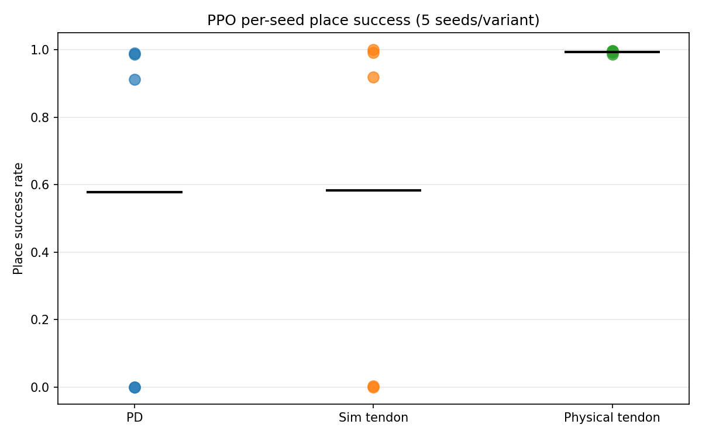
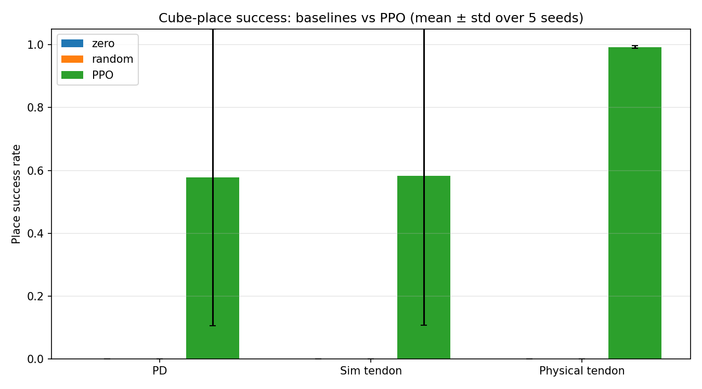
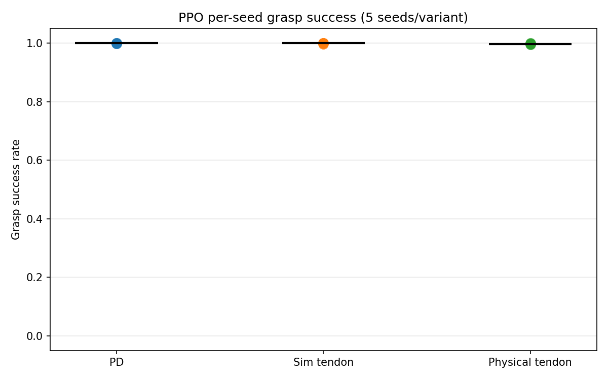
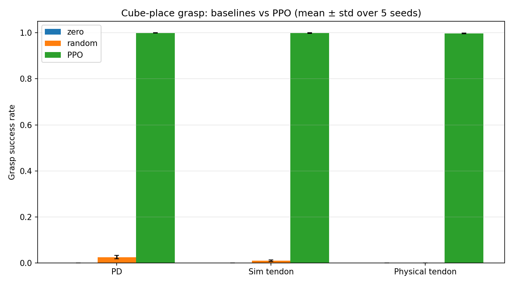

# Cube Place Task — Comprehensive Evaluation Report (2026-06-29)

This report covers the seed-aggregated training and evaluation of the
PPO policy on the three cube-place task variants of the tensegrity arm,
plus two control baselines (zero-action, uniform random). Five training
seeds per variant were trained on 2026-06-22 (15 PPO runs) and each
agent was evaluated for 5 seeds × 50 parallel environments × 10 episodes
= 500 episodes per (variant, agent, seed) cell.

It is the place-task analogue of
[reach_evaluation_findings.md](reach_evaluation_findings.md) and follows
the same protocol. Crucially, it fills the gap the project thesis
explicitly left open: the thesis (Section 5.3, Table 16) reported the
cube-place metrics for a **single training seed per variant** and noted
that "the multi-seed protocol was omitted here for time and scope
reasons … the values should therefore be read as single-seed point
estimates without a cross-seed dispersion measure." This study supplies
that missing cross-seed dispersion measure — and it changes the
conclusions materially.

## Contents

1. [Experimental setup](#1-experimental-setup)
2. [Aggregate quantitative results](#2-aggregate-quantitative-results)
3. [Figures](#3-figures)
4. [Per-variant deep dive](#4-per-variant-deep-dive)
5. [The release local optimum and the bimodal convergence failure](#5-the-release-local-optimum-and-the-bimodal-convergence-failure)
6. [Baseline comparison](#6-baseline-comparison)
7. [Comparison against the thesis single-seed result](#7-comparison-against-the-thesis-single-seed-result)
8. [Implications](#8-implications)
9. [Methodology notes and verification gates](#9-methodology-notes-and-verification-gates)
10. [Open issues and next steps](#10-open-issues-and-next-steps)
11. [Reproducibility — file pointers](#11-reproducibility--file-pointers)

---

## 1. Experimental setup

### 1.1 Task and environments

| Item | Value |
|------|-------|
| Place task | `Template-Tensegrity-Cube-Place{,-Tendon,-Physical-Tendon}-Play-v0` |
| Robot variants | PD (`tensegrity`), simulated tendon (`tensegrity_tendon`), physical-tendon (`tensegrity_physical_tendon`) |
| Gripper | Physics-based Robotiq 2F-140, binary open/close action (open = 0.0, close = 0.7854 rad) |
| Scene | Ceiling-mounted arm over a conveyor belt (surface z = 0.80 m); target drum at (0.15, 0.85, 0.0) m |
| Success volume | Upright cylinder, radius 0.2735 m, height 0.30 m, drum root at z = 0 |
| Success criterion | Green cube centre enters the success cylinder **after a valid grasp** (latched `was_placed`) |
| Episode horizon | 5 s (≈ 248–250 steps at the 0.02 s control step); no early success termination |
| Parallel envs (Play) | 50 |
| Episodes per env | 10 → **500 episodes per cell** |

The success criterion is identical to the one used internally by the env
(`TensegrityPlaceEnv._was_placed`) and to the thesis definition
(Section 4.6.3.2). Because there is no early success termination, a
successful policy keeps the cube in the drum for as many steps as
possible; the per-step `green_in_target` reward (weight 100) is the
dominant terminal objective.

### 1.2 Agents

| Agent | Description | Variants tested |
|-------|-------------|-----------------|
| `zero` | Emits `0` action every step. The binary gripper maps 0 → **open**, so the gripper never closes. | all 3 |
| `random` | Uniform `U(-1, 1)` over the wrapped action space (base/arm deltas + random gripper toggling). | all 3 |
| `checkpoint` | Trained PPO (skrl) policy, loaded from `best_agent.pt` of each training run. | all 3 |

The `heuristic` (DLS-IK) baseline used by the reach harness is
intentionally **omitted**. A heuristic place controller is not a single
differential-IK step but a scripted state machine (grasp detection, drum
approach, timed release), which is a separate engineering problem and out
of scope for this baseline study — consistent with the thesis omitting a
place heuristic.

### 1.3 Training

| Item | Value |
|------|-------|
| Algorithm | PPO (skrl 1.4.3, PyTorch backend) |
| Parallel envs | 4096 |
| Target timesteps | 300 k policy steps |
| Seeds per variant | 5 (seeds 0–4, `SLURM_ARRAY_TASK_ID` → `--seed`) |
| Wall-clock per seed | PD ≈ 2.6 h; sim tendon ≈ 2.4 h; physical tendon ≈ 3.0 h |
| Exploration (PD & sim tendon) | `initial_log_std = 0.5`, `entropy_loss_scale = 0.01` |
| Exploration (physical tendon) | `initial_log_std = 0.0`, `entropy_loss_scale = 0.005` |

All 15 runs completed the full 300 k timesteps with 60 checkpoints +
`best_agent.pt` each. Note that the two exploration settings are
**inverted** relative to intuition: the variants that turn out to be
fragile (PD, sim tendon) already run with the *higher* exploration
schedule, while the robust variant (physical tendon) runs with the
*lower* one (see §5).

### 1.4 Reward fix under test

These runs use the "release-above-the-drum" reward fix. Two existing
reward gates were widened so that the supporting rewards no longer vanish
during the cube's fall into the drum:

* `approach_target_tanh` (drives `goal_tracking` / `goal_tracking_fine`)
  now stays active while the cube is over the drum opening in XY, not only
  while it is lifted above the belt.
* `release_above_target` now rewards an open gripper for the whole descent
  (from the success-cylinder top up through the rim), instead of only
  above the rim.

`green_in_target` stays the dominant terminal goal at weight 100;
`release` stays at weight 25. See
[mdp/rewards.py](../../src/tensegrity_pick/source/tensegrity_pick/tensegrity_pick/tasks/manager_based/cube_place/mdp/rewards.py)
and
[place_env_cfg.py](../../src/tensegrity_pick/source/tensegrity_pick/tensegrity_pick/tasks/manager_based/cube_place/place_env_cfg.py).

### 1.5 Evaluation harness

The place evaluation harness
[scripts/skrl/evaluate_place.py](../../src/tensegrity_pick/scripts/skrl/evaluate_place.py)
mirrors `evaluate_reach.py`: it loads the env via the Isaac Lab Hydra path
(for `checkpoint`) or directly via `parse_env_cfg` (for `zero`/`random`),
runs the agent for 10 episodes per parallel env, and writes aggregated
metrics to JSON. Success / grasp / red-safe are read from the
`TensegrityPlaceEnv` latches, snapshotted **before** each `env.step()` to
survive the in-step auto-reset (§9.1).

---

## 2. Aggregate quantitative results

The headline number is the **place success rate**: the fraction of
episodes where the green cube entered the drum success cylinder after a
valid grasp. `success_held` additionally requires the cube to stay inside
for ≥ 10 consecutive steps. `grasp_rate` is the fraction of episodes that
established a stable grasp. `red_safe` is the fraction that kept the red
distractor on the conveyor. `place_xy` is the last-step XY distance from
cube to drum axis. `place_t` is the mean time-to-first-placement over
successful episodes.

| Variant | Agent | Success rate | Held | Grasp | Red-safe | Place XY [m] | Place t [s] |
|---|---|---:|---:|---:|---:|---:|---:|
| PD (`tensegrity`) | zero | 0.000 ± 0.000 | 0.000 | 0.000 | 1.000 | 0.850 | — |
| PD | random | 0.000 ± 0.000 | 0.000 | 0.025 | 0.975 | 0.859 | — |
| PD | **PPO** | **0.578 ± 0.472** | 0.577 | 0.999 | 0.966 | 0.292 | 1.31 |
| Sim. tendon | zero | 0.000 ± 0.000 | 0.000 | 0.000 | 1.000 | 0.850 | — |
| Sim. tendon | random | 0.000 ± 0.000 | 0.000 | 0.010 | 0.990 | 0.851 | — |
| Sim. tendon | **PPO** | **0.583 ± 0.475** | 0.583 | 0.999 | 0.941 | 0.283 | 1.30 |
| Physical tendon | zero | 0.000 ± 0.000 | 0.000 | 0.000 | 1.000 | 0.850 | — |
| Physical tendon | random | 0.000 ± 0.000 | 0.000 | 0.000 | 1.000 | 0.853 | — |
| Physical tendon | **PPO** | **0.993 ± 0.004** | 0.993 | 0.997 | 0.910 | 0.142 | 1.00 |

Two facts dominate the table:

1. **PD and simulated tendon are bimodal.** The mean success rate (~0.58)
   is not a description of typical behaviour — it is the average of seeds
   that solve the task at ~95–100 % and seeds that fail at ~0 %. The std
   (~0.47) is almost as large as the mean, the signature of a bimodal
   distribution (see §4–§5).
2. **Physical tendon is solved and robust.** All five seeds land at
   98.6–99.6 % success with a std of 0.4 %. This is the *opposite* of the
   reach task, where physical tendon was the hardest variant.

Across all variants, `success_held ≈ success_rate` (to within 0.002),
which means that whenever the policy places the cube it also *settles* it
inside the drum for ≥ 10 steps rather than merely transiting through the
success volume. The placements are clean.

### 2.1 Cross-validation against training metrics

The held-out evaluation reproduces the final training metric
(`Metrics/place_success_rate`, mean over the last 4 logged points) almost
exactly:

| Variant | Training (final) | Eval (held-out) |
|---|---:|---:|
| `tensegrity` | 0.529 ± 0.444 | 0.578 ± 0.472 |
| `tensegrity_tendon` | 0.572 ± 0.468 | 0.583 ± 0.475 |
| `tensegrity_physical_tendon` | 0.988 ± 0.002 | 0.993 ± 0.004 |

The internal training metric and the independent play-mode evaluation
tell the same story, including the per-seed bimodality. The small upward
shift in the eval means (≈ +0.01 to +0.05) reflects that `best_agent.pt`
is selected on best reward rather than the final-step value.

---

## 3. Figures

### 3.1 PPO per-seed place success

Per-seed held-out success for the trained policy (5 dots per variant,
black bar = seed mean). PD and sim-tendon show the split between
solved seeds (top) and collapsed seeds (bottom); physical tendon is a
tight cluster near 1.0.

### 3.2 Baseline success-rate comparison

Bars are mean ± std across the 5 evaluation seeds. The zero and random
baselines are at 0 % success for every variant — the place task admits no
"accidental" success, unlike reach (where random reached 11–15 %).

### 3.3 PPO per-seed grasp success

The grasp counterpart of §3.1. In contrast to the placement scatter, all
five seeds of all three variants sit in a tight cluster at ≈ 1.0
(grasp rate 0.994–1.000). Grasping is solved everywhere; none of the
per-seed dispersion that dominates the placement figure is present here.
This is the visual statement of the central diagnostic: the bimodal
collapse on PD and sim tendon is **entirely a release/placement failure,
not a grasping failure** (§5).

### 3.4 Baseline grasp-rate comparison

The grasp counterpart of §3.2. The PPO bars are at ≈ 1.0 for every
variant, while the baselines are at ≈ 0 (zero never closes the gripper;
random establishes a stable grasp in only 0–2.5 % of episodes). The gap
between a learned grasp (~100 %) and the baselines (~0 %) is the same on
all three variants — unlike placement, grasping shows no variant-dependent
fragility.

---

## 4. Per-variant deep dive

### 4.1 PD (`tensegrity`) — bimodal: 3/5 solved

| Seed | Success | Held | Grasp | Red-safe | Place XY [m] | Place t [s] |
|---:|---:|---:|---:|---:|---:|---:|
| 0 | 0.000 | 0.000 | 0.998 | 0.988 | 0.475 | — |
| 1 | 0.000 | 0.000 | 0.998 | 0.992 | 0.475 | — |
| 2 | 0.986 | 0.986 | 1.000 | 0.974 | 0.161 | 1.11 |
| 3 | 0.990 | 0.990 | 1.000 | 0.918 | 0.162 | 1.05 |
| 4 | 0.912 | 0.910 | 1.000 | 0.958 | 0.189 | 1.78 |

Seeds 2 and 3 solve the task cleanly (≥ 98.6 %). Seed 4 is a slightly
weaker but still successful solution (91 %, with a longer 1.78 s mean
placement time). Seeds 0 and 1 collapse to 0 % placement **despite a
99.8 % grasp rate** — they pick the cube up and then never release it
(see §5). The 0.475 m XY error for the collapsed seeds is the hovering
distance of a held cube; the solved seeds end at 0.16–0.19 m, comfortably
inside the 0.2735 m success radius.

### 4.2 Simulated tendon (`tensegrity_tendon`) — bimodal: 3/5 solved

| Seed | Success | Held | Grasp | Red-safe | Place XY [m] | Place t [s] |
|---:|---:|---:|---:|---:|---:|---:|
| 0 | 0.000 | 0.000 | 1.000 | 0.940 | 0.468 | — |
| 1 | 0.918 | 0.918 | 0.996 | 0.986 | 0.185 | 1.40 |
| 2 | 0.004 | 0.004 | 1.000 | 0.924 | 0.465 | 1.46 |
| 3 | 1.000 | 1.000 | 1.000 | 0.918 | 0.156 | 1.11 |
| 4 | 0.992 | 0.992 | 1.000 | 0.936 | 0.143 | 1.22 |

The same bimodal pattern. Seeds 3 and 4 are essentially perfect; seed 1
solves it at 92 %. Seeds 0 and 2 collapse (0.0 % and 0.4 %) with 100 %
grasp — again, grasp-and-hover. The single confirmation run trained
earlier on this variant (seed 42) achieved 99 % success, which — read
against this table — was a *lucky* seed, not the typical outcome.

### 4.3 Physical tendon (`tensegrity_physical_tendon`) — solved, robust: 5/5

| Seed | Success | Held | Grasp | Red-safe | Place XY [m] | Place t [s] |
|---:|---:|---:|---:|---:|---:|---:|
| 0 | 0.994 | 0.994 | 1.000 | 0.920 | 0.139 | 0.99 |
| 1 | 0.996 | 0.996 | 0.998 | 0.916 | 0.131 | 1.01 |
| 2 | 0.992 | 0.992 | 0.996 | 0.912 | 0.144 | 1.05 |
| 3 | 0.996 | 0.996 | 0.998 | 0.898 | 0.137 | 0.96 |
| 4 | 0.986 | 0.986 | 0.994 | 0.906 | 0.158 | 0.98 |

Every seed solves the task at ≥ 98.6 % with the tightest placement (XY
0.13–0.16 m) and the fastest, most consistent placement time (~1.0 s).
This is a striking inversion of the reach result, where the same variant
recorded 0.2 % grasp / 0.0 % place for the thesis single seed and
31 % ± 14 % success in the reach multi-seed study. Here the physical
actuator model is the *most* reliable of the three (see §5 and §7).

---

## 5. The release local optimum and the bimodal convergence failure

The diagnostic signal is unambiguous. Every seed of every variant learns
to **grasp** the cube (grasp rate 99.4–100 % across all 15 runs). The
split is entirely in whether the policy learns to **release** it over the
drum. The collapsed seeds share a common training fingerprint:

| Seed (collapsed) | Place success | `release` reward | `green_in_target` | `return_to_neutral` |
|---|---:|---:|---:|---:|
| PD seed 0 | 0.001 | 0.000 | 0.04 | 0.00 |
| PD seed 1 | 0.000 | 0.000 | 0.00 | 0.00 |
| tendon seed 0 | 0.000 | 0.001 | 0.02 | 0.00 |
| tendon seed 2 | 0.001 | 0.004 | 0.06 | 0.00 |

(`release`, `green_in_target`, `return_to_neutral` are the final-step
`Episode_Reward/*` values.) The collapsed seeds never accrue any release
or success reward: they converge to the **grasp-and-hover local
optimum**, in which carrying the cube indefinitely collects more
accumulated shaping reward than opening the gripper. This is exactly the
optimum the reward fix was designed to defeat, and on the seeds that
escape it the fix works as intended (release ≈ 2.0, success ≈ 0.99).

The fix therefore makes the release behaviour *discoverable and stable
once found*, but it does not make the discovery *reliable across seeds*
for the PD and sim-tendon variants — roughly 40 % of those seeds still
stall.

**Why exploration hyperparameters are not the explanation.** One might
expect more exploration to cure the stall. The configs rule this out:
the fragile variants (PD, sim tendon) already train with the *higher*
exploration schedule (`initial_log_std = 0.5`, `entropy_loss_scale =
0.01`), while the robust physical-tendon variant uses the *lower* one
(`0.0`, `0.005`). More action noise did not prevent the collapse. The
robustness of the physical-tendon variant must instead come from its
**actuator dynamics**: the body-force elbow model produces slower, more
compliant motion in which the "open and let the cube drop in" behaviour
is reached and reinforced more readily, whereas the stiff PD/constant-
tension interfaces make the holding optimum a sharper trap. This is the
mirror image of the reach finding, where the same compliant dynamics made
precise *pose tracking* harder.

---

## 6. Baseline comparison

The zero and random baselines are at **0 % success for every variant** —
a cleaner separation than in the reach task. Two structural reasons:

1. **The gripper must be commanded closed.** The binary gripper maps the
   zero action to *open*, so the zero agent never grasps (grasp rate
   0.000) and a fortiori never places.
2. **Place admits no accidental success.** Reach awarded 11–15 % to the
   random agent because a random walk eventually drifts the end-effector
   within 5 cm of *some* sampled target. Placement requires a *coordinated
   sequence* — grasp, lift, transport to a 0.2735 m target 0.7 m away,
   then release at the right moment — which random toggling never
   assembles. Random grasps the cube in only 0–2.5 % of episodes and
   places it in 0 %.

The baselines therefore confirm that the place task carries essentially
no exploitable structure for an untrained policy: all placement
performance is learned. The red-safe rate is high for every agent
(0.91–1.00) simply because an agent that never manipulates also never
disturbs the red distractor.

---

## 7. Comparison against the thesis single-seed result

The thesis (Table 16) reported single-seed, last-10 %-of-training values:

| Variant | Thesis (single seed) | This study (5-seed eval, mean ± std) | This study (best seed) |
|---|---:|---:|---:|
| PD | 90.1 % | 57.8 % ± 47.2 % | 99.0 % |
| Sim tendon | 92.1 % | 58.3 % ± 47.5 % | 100.0 % |
| Physical tendon | 0.0 % (grasp 0.2 %) | **99.3 % ± 0.4 %** | 99.6 % |

Two corrections to the thesis narrative emerge:

1. **The PD / sim-tendon single-seed numbers were optimistic.** The
   thesis seed happened to land in the "solved" mode; the 5-seed study
   reveals a ~40 % chance of collapse to the hover optimum. The *capable*
   behaviour the thesis reported is real (our best seeds match or exceed
   90–92 %), but the *expected* behaviour across seeds is far lower and
   far more variable. This is precisely the Henderson et al. (2018)
   single-seed-reporting pitfall the reach study already flagged.

2. **Physical tendon went from unsolved to the most robust variant.** In
   the thesis the physical-tendon arm could not even close on the cube
   (0.2 % grasp). Here it grasps at 99.7 % and places at 99.3 % across all
   five seeds. The combination of the release reward fix and whatever
   grasping/actuator changes have since landed on this variant has turned
   the thesis's worst place result into its best. This is the single most
   important delta from the thesis and warrants a dedicated write-up of
   what changed in the physical-tendon configuration.

---

## 8. Implications

1. **The place task is solved — conditionally.** When a seed escapes the
   grasp-and-hover optimum, all three variants reach 91–100 % placement
   with clean settles (`held ≈ success`) and ~1 s placement times. The
   reward fix is correct: it eliminates the dead zone between release and
   `green_in_target` and makes the release behaviour stable once found.

2. **Reliability, not capability, is the open problem on PD / sim
   tendon.** ~40 % of PD and sim-tendon seeds still collapse. Because the
   higher exploration schedule is already in use and did not help, the
   untried lever is the **reward margin**: widen the separation between
   "open over the drum" and "hold" by bumping `release` 25 → 40 (spec
   §2c). A curriculum that forces a release (e.g. a grasp-timeout that
   detaches the cube, or a small hold penalty that grows over the
   episode) is the next candidate if the weight bump is insufficient.

3. **Physical tendon is the surprise success and should be understood,
   not just celebrated.** Its robustness contradicts both the thesis and
   the reach study. The actuator-dynamics hypothesis (compliant motion
   makes release easy to discover) is consistent with the data but should
   be confirmed — e.g. by training PD/sim-tendon with the physical-tendon
   exploration schedule, or by inspecting whether the physical variant's
   grasp/lift timing differs. If the mechanism is understood it may
   transfer to fixing the other two variants.

4. **5 seeds is the right minimum and the thesis under-reported because
   it used one.** With a per-seed success spread of [0.00, 1.00] on PD and
   sim tendon, a single-seed number is not just imprecise — it can report
   90 % for a setting whose expected success is ~58 %. Following Henderson
   et al. (2018), 5 seeds is a defensible minimum; 10 would tighten the
   stall-probability estimate (currently 2/5).

---

## 9. Methodology notes and verification gates

### 9.1 Latch snapshot before auto-reset

Isaac Lab's `ManagerBasedRLEnv.step()` auto-resets done envs *inside* the
step call, and `TensegrityPlaceEnv._reset_idx()` clears the
`_was_grasped` / `_was_placed` / `_red_left_belt` latches for those envs.
Reading the latches after `env.step()` for a done env therefore returns
the *post-reset* (cleared) state, not the episode-end state. The harness
snapshots every per-env latch and the XY distance **before** each
`env.step()` and, for envs that become done that step, records the
snapshot — the same lifecycle-safe pattern documented in the reach report
§8.1.

### 9.2 Inference-mode vs. in-place latch updates (bug fixed in harness)

`TensegrityPlaceEnv.step()` performs in-place updates
(`self._was_grasped[...] |= ...`) on latch tensors that were created at
env construction, i.e. outside any inference context. Calling `env.step()`
from within a `torch.inference_mode()` block (as the reach harness does
for the whole action+step) raises *"Inplace update to inference tensor
outside InferenceMode is not allowed"*. Fix: the place harness computes
the policy action under `torch.inference_mode()`, then **clones the action
to a normal tensor and steps the env outside inference mode** (under
`torch.no_grad()`). The reach harness does not hit this because its env
does not keep externally-created latch tensors.

### 9.3 Determinism / pairing

As in the reach harness, `random`, `numpy`, `torch` and the CUDA
generator are seeded from `--seed` before the first `env.reset()`, so the
cube-spawn and distractor stream is reproducible across agents at a given
seed. Aggregate metrics over 500 episodes/cell are insensitive to this,
but it enables per-episode pairing for future paired tests.

### 9.4 Sample size and statistical claims

Each cell aggregates 5 seeds × 500 episodes = 2500 episodes; reported std
is across the 5 seeds. The PPO-vs-baseline gap on every variant
(≥ 0.578 vs 0.000) is unambiguous. The PD/sim-tendon vs physical-tendon
gap (0.58 vs 0.99, with non-overlapping ±0.47 vs ±0.004 bands) is driven
by the bimodality, not by measurement noise.

### 9.5 What is measured

Per (variant, agent, seed): `success_rate` (any-step placement after
grasp), `success_held` (placed and settled ≥ `--settle_steps` = 10
steps), `grasp_rate`, `red_safe_rate`, `place_xy_error` (last-step XY
distance to drum axis), `place_time_mean` (time-to-first-placement over
successful episodes), and `action_rate_mean` (mean per-step
‖a_t − a_{t-1}‖₁, an action-smoothness proxy). Not measured:
out-of-distribution robustness (cube spawns outside the training
distribution; in-flight perturbations); drop accuracy as a function of
release height.

---

## 10. Open issues and next steps

| # | Priority | Requires | Item / insight from rerun |
|---|----------|----------|---------------------------|
| 1 | High | Re-train PD + sim tendon, 5 seeds each, `release` 25 → 40 (~25 GPU-h) | Test whether widening the open-vs-hold reward margin removes the grasp-and-hover collapse. Insight: distinguishes "the fix needs a bigger margin" from "the fix needs a structural anti-hover mechanism (curriculum / hold penalty)". |
| 2 | High | Document the physical-tendon configuration delta | Identify exactly what changed on the physical-tendon variant between the thesis (0.2 % grasp) and now (99.7 % grasp). This is the largest result delta and is currently unexplained in writing. |
| 3 | Medium | Re-train PD/sim tendon with the physical-tendon exploration schedule (`log_std 0.0`, `entropy 0.005`), 5 seeds | Tests the actuator-dynamics-vs-hyperparameters hypothesis of §5 by holding dynamics fixed and copying only the exploration schedule. Insight: if PD/sim-tendon stay bimodal, robustness is a dynamics property, not a hyperparameter one. |
| 4 | Low | Re-train the two fragile variants with 5 additional seeds (~25 GPU-h) | Tighten the stall-probability estimate from 2/5 to roughly 4/10. Insight: confirms whether the collapse rate is ~40 % or a smaller tail. |

### Completed in this iteration

- **Place evaluation harness written and validated** —
  [evaluate_place.py](../../src/tensegrity_pick/scripts/skrl/evaluate_place.py),
  the place analogue of `evaluate_reach.py`, with the inference-mode fix
  (§9.2) and latch-snapshot handling (§9.1). Smoke-tested on tendon seed 3
  (1.000 success over 150 episodes).
- **Full 5-seed × 3-variant × 3-agent evaluation** — 45 cells, 500
  episodes each, driven by
  [run_place_eval_matrix.sh](../../src/tensegrity_pick/scripts/run_place_eval_matrix.sh).
- **Aggregation + figures** —
  [plot_place_eval_results.py](../../src/tensegrity_pick/scripts/plot_place_eval_results.py).

---

## 11. Reproducibility — file pointers

### Code
- [src/tensegrity_pick/scripts/skrl/evaluate_place.py](../../src/tensegrity_pick/scripts/skrl/evaluate_place.py)
- [src/tensegrity_pick/scripts/run_place_eval_matrix.sh](../../src/tensegrity_pick/scripts/run_place_eval_matrix.sh)
- [src/tensegrity_pick/scripts/plot_place_eval_results.py](../../src/tensegrity_pick/scripts/plot_place_eval_results.py)

### Data
- Training runs (git-tracked): `logs/skrl/theses_logs/cube_place/{tensegrity,tensegrity_tendon,tensegrity_physical_tendon}/2026-06-22_*_ppo_torch_seed{0..4}/` — the 15 evaluated runs, each with all 61 checkpoints, the TensorBoard event file and `params/`. Copied here from the gitignored working tree `logs/skrl/cube_place/...` so they are versioned with the report.
- Eval JSONs: `logs/skrl/cube_place/eval/{checkpoint,zero,random}_<variant>_seed<seed>.json` (45 files; under the gitignored working tree)
- Eval batch log: `/home/woody/iwfa/iwfa131h/slurm_logs/Place-Eval_<jobid>.out`

### Figures
- [place_ppo_per_seed.png](../../src/tensegrity_pick/source/tensegrity_pick/tensegrity_pick/tasks/manager_based/cube_place/figures/aggregate/place_ppo_per_seed.png)
- [place_baseline_comparison.png](../../src/tensegrity_pick/source/tensegrity_pick/tensegrity_pick/tasks/manager_based/cube_place/figures/aggregate/place_baseline_comparison.png)
- [place_ppo_per_seed_grasp.png](../../src/tensegrity_pick/source/tensegrity_pick/tensegrity_pick/tasks/manager_based/cube_place/figures/aggregate/place_ppo_per_seed_grasp.png)
- [place_baseline_comparison_grasp.png](../../src/tensegrity_pick/source/tensegrity_pick/tensegrity_pick/tasks/manager_based/cube_place/figures/aggregate/place_baseline_comparison_grasp.png)
