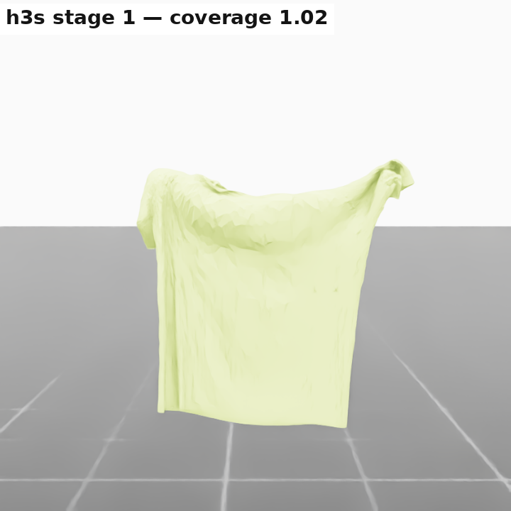
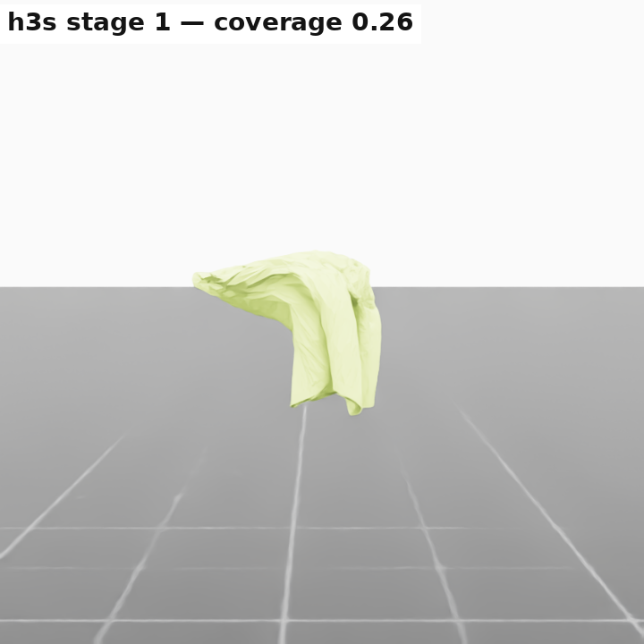
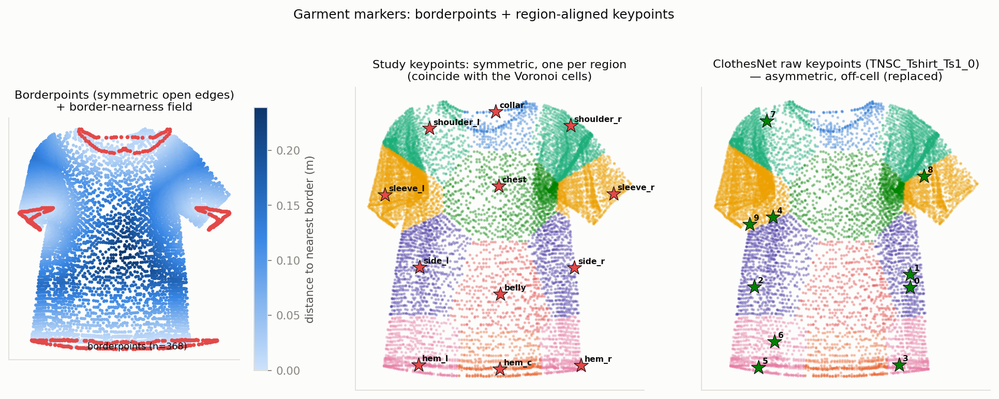
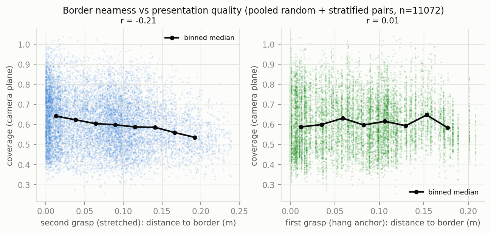
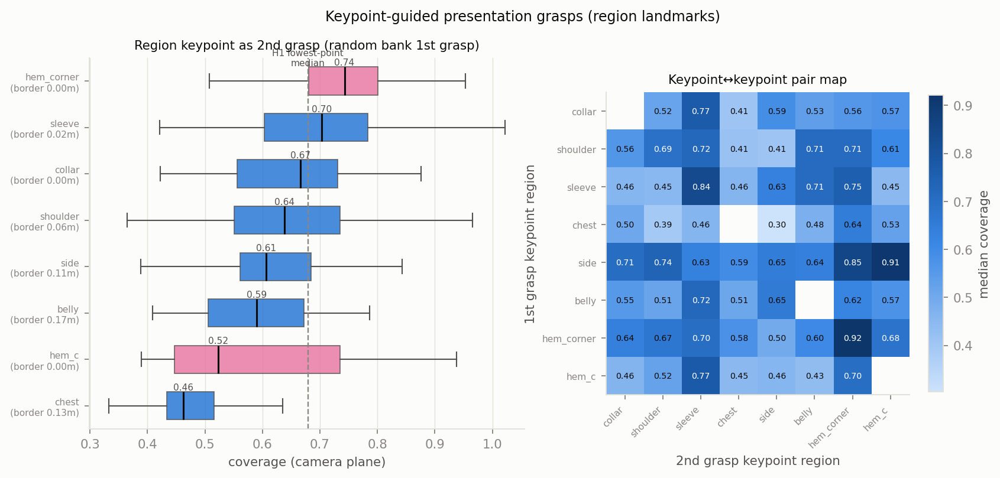
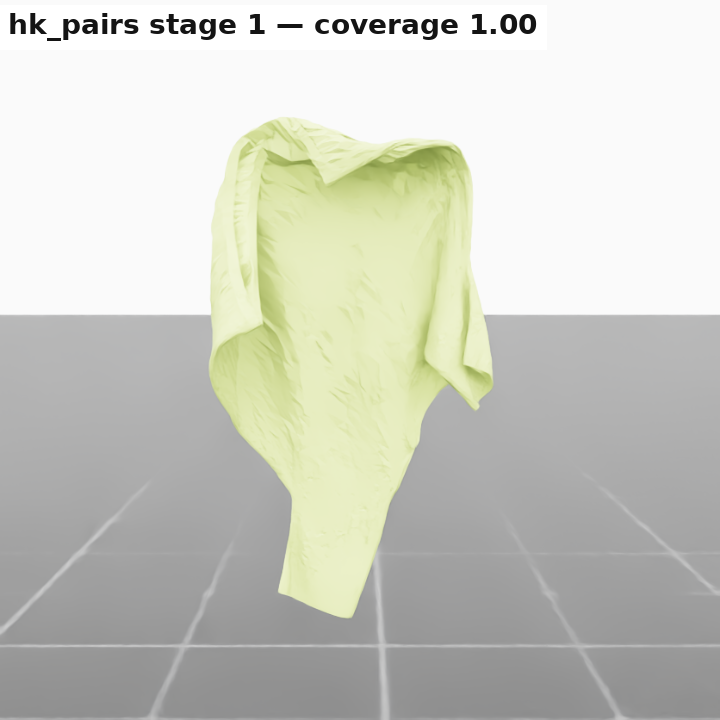
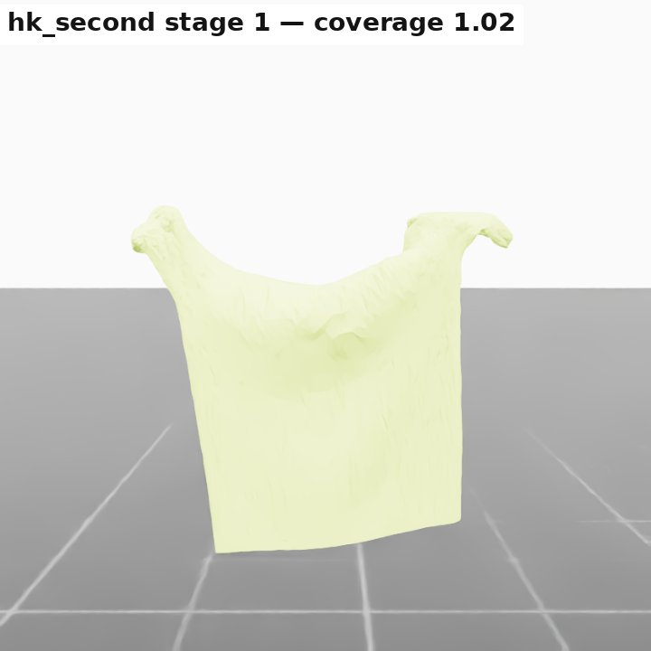

# Shirt-Presentation Grasping Heuristics — Robot-Free Simulation Study

**Scope:** which grasp points / grasp strategies give the best overall visibility of the
shirt in the inspection-camera plane (front AND back view) — the calibration study for the
`shirt_present` RL task (success threshold + best regrasp target), including the
brute-force **grasp-pair oracle** flagged in [doc/TODO.md](../TODO.md) Task 2.
**Environment:** Isaac Sim 5.1.0 + Isaac Lab, PBD particle cloth (`tshirt_clothesnet.usd`,
11 048 particles), no robots — grasps are static/scripted `ClothObject` attachment anchors.
NVIDIA RTX A6000 (48 GB), FAPS server.
**Date:** 2026-07-04, extended 2026-07-07 (balanced/opposite-side oracle map +
borderpoint & keypoint analysis), corrected 2026-07-08 (source garment fixed to
**`TNSC_Tshirt_Ts1_0`**; symmetric garment regions; **symmetric region-aligned
keypoints**; complete symmetric borderpoints). Renders are in the current garment
colour (FAPS-Grün).

Every number is reproducible: each script logs one CSV row per trial (bank state index,
augmentation, particle indices, stretch direction, all metrics) under
[doc/reports/data/](data/), and all figures regenerate offline via `plot_study.py`.
Scripts live in
[`scripts/model_validation/present_heuristics/`](../../src/tensegrity_pick/scripts/model_validation/present_heuristics/)
(usage headers in each file; run from `src/tensegrity_pick` in the `env_isaaclab` conda env).

## TL;DR

| Finding | Number |
|---|---|
| The horizontal presentation works: even the naive heuristic beats the free hang | 0.679 vs 0.563 median coverage |
| Tautness has a real, monotone (but modest) effect (ratio = held chord ÷ flat-rest grasp distance; >1.0 is partly PBD overstretch, §1.1) | 0.657 → 0.690 median for ratio 0.95 → 1.10 |
| The geometry is **self-aligning** — no yaw control needed | `cov_yaw_max − cov_plane` ≈ 0.003 |
| **Regrasping HURTS** (extremity↔extremity chords span wide but fill poorly) | paired Δ −0.031, only 37 % improve |
| Pair quality is driven by chord LENGTH, NOT orientation | r = +0.29 (distance) vs −0.04 (orientation) |
| **Balanced oracle** (100+/cell, opposite-side partner): hem targets dominate; the hem↔hem CELL reproduces the scripted winner | side→hem_c **0.82**, hem↔hem **0.82** |
| **Grasping nearer the garment BORDER helps** (2nd grasp, monotone; the 1st/anchor grasp does not) | ≤1 cm from edge 0.65 → >10 cm interior 0.57 |
| **Keypoint sampling works — via the border-near keypoints:** best keypoint pairs reach the oracle; interior keypoints fail | hem↔hem 0.92, side→hem_c 0.91; chest keypoint 0.46 |
| **Best scripted method: grasp both hem corners** (garment upside-down) | **0.820** median @1.05, 0.832 @1.10, p90 0.95 |
| The classic human shoulder↔shoulder grip FAILS here | 0.493 median, 57 % of trials < 0.55 |
| Recommended `shirt_present` success threshold (camera-plane coverage) | **0.65** to start, 0.75 stretch goal |

Full method comparison (camera-plane coverage — the number the RL task sees; all
methods at ratio 1.05 unless noted):

| method | n | median | IQR | p90 |
|---|---|---|---|---|
| shoulder↔shoulder (scripted) | 240 | 0.493 | 0.436–0.707 | 0.758 |
| free 1-point hang (bank, best yaw) | 356 | 0.567 | 0.523–0.606 | 0.633 |
| H3 grasp pair (random + stratified) | 11 072 | 0.603 | 0.511–0.701 | 0.787 |
| keypoint↔keypoint pair (any kp pair) | 2 560 | 0.620 | 0.508–0.712 | 0.805 |
| keypoint as 2nd grasp (any kp) | 896 | 0.635 | 0.519–0.732 | 0.826 |
| H2 regrasp (3-grasp) | 288 | 0.653 | 0.618–0.686 | 0.710 |
| iterated regrasp ×2 / ×3 | 288 each | 0.656 / 0.656 | — | 0.721 / 0.730 |
| H1 + shake | 240 | 0.671 | 0.603–0.728 | 0.786 |
| **H1 naive 2-grasp (the task heuristic)** | 240 | **0.679** | 0.621–0.722 | 0.778 |
| oracle-guided 2nd grasp | 240 | 0.713 | 0.628–0.756 | 0.811 |
| **hem_corner↔hem_corner (scripted)** | 240 | **0.820** | 0.701–0.896 | 0.948 |
| hem_corner↔hem_corner @1.10 | 240 | 0.832 | 0.680–0.922 | 0.965 |
| H3 oracle top decile (upper bound) | 1 107 | 0.837 | — | — |

The keypoint rows' medians undersell them: their VALUE is the upper tail — the best
keypoint pairs (hem↔hem 0.92, side→hem_c 0.91) reach the oracle (§6.2). The pooled median
is dragged down by the garment's interior keypoints (chest 0.46, hem_c 0.52), which are
poor grasps because they sit far from a garment edge or give a short central chord (§6.1).

---

## 1. Setup & metric

### 1.1 The visibility objective

The inspection camera at `INSPECTION_CAMERA_POS = (0.15, 2.0, 1.25)` looks along −Y; the
image plane is the world XZ plane (`view_axis=1`). Front + back cameras see the SAME
occluding silhouette, so one scalar serves both views: **`silhouette_coverage`**
([shared/cloth_metrics.py](../../src/tensegrity_pick/source/tensegrity_pick/tensegrity_pick/tasks/manager_based/shared/cloth_metrics.py)) —
rasterized projected-silhouette area ÷ one-sided flat area (0.294 m² for this garment).
1.0 = fully unfolded and camera-parallel; folds, bunching and out-of-plane rotation all
reduce it.

Every trial logs three orientation variants of the metric: the raw camera-plane number
`cov_plane`, the best over 12 yaw rotations `cov_yaw_max` (period π), and the
yaw-marginalized `cov_yaw_mean`. **With the horizontal presentation stretch the taut
chord lies along the camera's x axis, which pins the garment's plane: measured
`cov_yaw_max − cov_plane` ≈ 0.001** — so the presentation is self-aligned to the camera
and `cov_plane` (the number the RL task sees) is quoted everywhere below. The yaw-swept
variants remain in every CSV as a built-in check of that alignment. (`cov_yaw_mean` is
much lower by construction: it averages over deliberately rotating the presentation out
of the plane it is aligned to, so it is NOT a meaningful score here.)

### 1.2 Sanity anchors (metric calibration)

| Anchor | Coverage |
|---|---|
| Flat shirt, face-on (computed from `flat_rest_pos`) | **1.000** |
| Free one-point hang, unstretched (356 bank states, best yaw) | 0.563 median, IQR 0.520–0.602 |

**On the tautness ratio and coverage > 1.0.** The stretch's *tautness* (aka target
stretch ratio) is defined as the held chord length ÷ the two grasp particles' distance in
the FLAT REST garment: 1.0 = held at their natural spacing (all slack removed, fabric at
rest length); 1.10 = held 10 % farther apart, i.e. the fabric between the grasps elongated
10 % beyond rest. Two effects are then mixed and worth separating for the thesis: (a)
**physical** — pulling the grasps apart straightens the chord and pulls folds out (real,
and a knit jersey t-shirt genuinely stretches ~10 %); (b) **PBD overstretch** — the
solver's soft stretch constraints let the fabric elongate beyond its rest AREA, so a
coverage **> 1.0 is only possible because the projected fabric is now larger than the
flat reference**, not because more of the garment is shown. Read tautness ≤ ~1.05 as the
physically-honest regime, and any coverage > 1.0 (the best exemplars, 1.0–1.09) as
"≈ fully unfolded + overstretch," NOT as > 100 % visible. Grasp PLACEMENT (§4/§6) is the
larger, fully-physical lever; the study operates the stretch at 1.05.

### 1.3 Protocol (common to all methods)

Implemented once in
[`study_common.py`](../../src/tensegrity_pick/scripts/model_validation/present_heuristics/study_common.py):

* **Study anchor:** the clean upstream position (`UPSTREAM_SETTLE_POS`), belt + 1.30 m —
  the garment drapes at most ~0.95 m (bank max) below the grasp chord, well clear of the
  belt. No belt/drum/robot interference.
* **Initial states:** restored from `tshirt_hanging_bank.pt` (356 anchor-centred settled
  hangs, 348 distinct anchor particles — uniform over the garment by construction) with
  explicit, logged yaw + mirror augmentation; re-attached at slot 0 with the pad radius
  0.07 m; 45 damped steps to absorb the restore.
* **The horizontal presentation stretch** (the canonical procedure, every method): the
  second grasp attaches at its chosen point on the hanging shirt, then moves on a
  STRAIGHT LINE at 0.45 m/s to a target at the SAME HEIGHT as the first grasp, offset
  along world x — the camera-plane horizontal — by `target_ratio × rest_dist` (rest
  distance of the two grasp particles in the flat rest shape). The taut chord ends up
  horizontal in the image plane and **gravity provides the vertical extension** of the
  garment below it. Pull direction ±x = the side of the grasped point's current
  horizontal offset (never drags the cloth across itself); the regrasp heuristic
  stretches opposite to the previous stage. Tautness guard ≤ 1.15 — the
  Stage-0-validated two-attachment limit (same hold-centre definition as
  `test_two_attachments.py`). With the horizontal chord the tracked-particle tautness
  matches the hold-centre target within ±0.01 (median 0.953 / 1.003 / 1.059 / 1.097 for
  targets 0.95–1.10): the patch-centroid offset of `attach` and the chord's gravity sag
  cancel almost exactly.
* **Settle:** the bank generator's damped protocol (per-step velocity ×0.97) until the
  robust criteria fire (p95 particle speed < 0.10 m/s AND centroid speed < 0.08 m/s, cap
  420 steps), then 30 free steps before measuring.
* **Batching/seeding:** everything vectorized over 48–64 envs (~400 env·steps/s, the
  Stage-0 knee), explicit `torch.manual_seed`, ~45–80 trials/min including all settles.

Secondary metrics per trial: measured tautness, projected extents, drape below the grasp
chord, settle/stretch step counts, stretch direction.

### 1.4 Garment regions

Grasp locations are keyed by flat-rest coordinates and binned into 12 interpretable
regions = Voronoi cells of hand-placed landmarks (a pure x/y-threshold scheme fails — the
sleeves angle inward and overlap the shoulders in x). The landmarks are placed
**SYMMETRICALLY** about the garment's axis of bilateral symmetry `X_CENTER = 0.0355` (the
midpoint of the sleeve tips at x = −0.262 / +0.333): every left/right pair is an exact
mirror, and the central regions sit on the axis. They were tuned (2026-07-08) so the
collar owns the neck opening (not the shoulders), the sleeve cells own the whole sleeve
INCLUDING the outer tip + underside (the side cells no longer reach into the sleeves), and
the shoulder cells own the shoulder seam. Left/right regions are mirror-folded into
**8 classes** for aggregation (the bank's mirror augmentation makes them physically
equivalent): collar, shoulder, sleeve, chest, side, belly, hem_corner, hem_c. Definitions
in [`regions.py`](../../src/tensegrity_pick/scripts/model_validation/present_heuristics/regions.py);
assignment happens offline from the CSVs, so boundaries can be iterated without re-running
simulation.

Mesh-density caveat: the mesh outline is bilaterally symmetric (median left-vs-mirrored-
right particle distance ≈ 3 mm ≈ mesh spacing), but the tessellation is ~17 % denser on
the left, so uniform-*particle* sampling is only approximately uniform over area. Region
aggregates are medians *conditional on the region*, so density only affects per-cell n
(reported in every map), not the (symmetric) cells or the values.

---

## 2. Heuristic 1 — naive 2-grasp (the `shirt_present` heuristic)

**Protocol:** random first grasp (bank restore) → second grasp at the LOWEST hanging
point → horizontal presentation stretch, sweeping target ratio 0.95 / 1.00 / 1.05 /
1.10 → settle → measure. 960 trials (240 per ratio), seed 11, all valid.
Script: `run_two_grasp.py`; data: `present_h1_two_grasp.csv`.

| target ratio | median | IQR | p90 | measured tautness | settle steps (med) |
|---|---|---|---|---|---|
| 0.95 | 0.657 | 0.603–0.701 | 0.739 | 0.95 | 133 |
| 1.00 | 0.662 | 0.605–0.699 | 0.761 | 1.00 | 127 |
| 1.05 | 0.679 | 0.621–0.722 | 0.778 | 1.06 | 132 |
| 1.10 | **0.690** | 0.611–0.740 | 0.789 | 1.10 | 340 |

**Findings.**

1. **The horizontal presentation works**: the naive heuristic already reaches 0.66–0.69
   median — decisively ABOVE the free one-point hang (0.563). Gravity extends the
   garment below the taut horizontal chord, spanning the silhouette in both image axes
   (projected width ≈ 0.63 m at 1.10, vs 0.59 m flat width).
2. **Tautness has a real, monotone effect** (+0.033 median, +0.050 at p90, from 0.95 →
   1.10): tension straightens the chord, widens the top edge and pulls folds out of the
   upper half. The gradient is genuine but modest — grasp placement still moves the
   needle more (see §4).
3. Trade-off at 1.10: settle time jumps (median 340 steps vs ~130 below — the stiffer
   chord rings longer before the damped criteria fire). 1.05 is the sweet spot per
   settle-time-adjusted throughput; 1.10 buys +0.011 median if time is free.
4. Where the lowest point lands: sleeve end 76 %, hem corner 24 % — unchanged (this is a
   property of the hang, not the stretch).
5. Self-alignment: `cov_yaw_max − cov_plane` = 0.0035 mean over all 960 trials — the
   horizontal chord pins the presentation into the camera plane; no yaw control needed.

Exemplars (inspection-camera view; 3/4 views in
[figures/present_heuristics/renders/](figures/present_heuristics/renders/)):

| worst (0.41) | median (0.68) | best (0.87) | free hang reference (0.57) |
|---|---|---|---|
|  |  |  |  |

## 3. Heuristic 2 — 3-grasp with regrasp (+ iterated regrasp)

**Protocol:** stage 1 = exactly H1 at ratio 1.05; then the FIRST grasp releases (the
second keeps holding where the stretch left it, at height) → re-settle → regrasp at the
NEW lowest point → horizontal stretch in the OPPOSITE x direction → measure (stage 2).
`--regrasps 3` continues the cycle, alternating directions (stages 3–4). 288 trials × 4
stages, seed 22, all valid. Stage-1 rows double as a PAIRED H1 sample — they reproduce
the independent H1 run's median across seeds (0.677 vs 0.679).
Script: `run_three_grasp.py`; data: `present_h2_three_grasp.csv`.

| stage | median | paired Δ to previous | trials improved |
|---|---|---|---|
| 1 (naive 2-grasp) | **0.677** | — | — |
| 2 (regrasp) | 0.653 | **−0.031** | 37 % |
| 3 (iterate ×2) | 0.656 | +0.004 | 53 % |
| 4 (iterate ×3) | 0.656 | −0.001 | 48 % |

**Findings.**

1. **The regrasp HURTS in the horizontal-presentation geometry** (paired −0.031 median;
   only 37 % of trials improve), and further iterations plateau at the lower level
   instead of recovering.
2. **Why:** after the regrasp, BOTH grasps sit on garment extremities — the former
   lowest point (sleeve end / hem corner) plus the new lowest point (hem corner 78 % of
   stage-2 regrasps). A horizontal chord between two extremal points spans a WIDER
   bounding box (projected width 0.69 vs 0.61 m, drape 0.65 vs 0.55 m) but fills it
   worse: the body hangs as a diagonal fold between the two corners, opening empty
   regions in the projection. The stage-1 pair — a random (often mid-garment) anchor
   plus the lowest point — centres the drape better.
3. Contrast with intuition: regrasping is the textbook move (Maitin-Shepard) for
   *unfolding into a known pose*; for THIS objective (projected coverage of a
   two-point-held presentation) it trades fill for span at a net loss. The productive
   use of a third grasp is grasp-point CHOICE, not repetition — see §4/§5.

| worst (0.40) | median (0.65) | best (0.78) |
|---|---|---|
|  |  |  |

## 4. Heuristic 3 — the grasp-pair oracle map

**Protocol.** First grasp = a hang-bank restore, second grasp on the hanging shirt →
horizontal presentation stretch at ratio 1.05 → settle → measure. Two sampling modes
(`run_pair_map.py`, both `--ratio 1.05 --seed 33`):

* **Stratified — the headline map** (`--stratified`, `present_h3s_stratified.csv`,
  **8 192 trials, ≥128 valid in every one of the 64 region→region cells**). For each
  first-region → second-region cell the first grasp is a bank state whose pinned anchor
  lies in the first region, and the second grasp a particle of the second region. **Key
  correction (2026-07-07):** when the first region is TWO-SIDED (shoulder / sleeve /
  side / hem_corner) the second grasp is drawn from the OPPOSITE left/right half of the
  second region — never the same side, which would be a degenerate same-corner short
  chord. (Mirror-invariant: the anchor's flat-rest x-sign flips with the bank mirror
  exactly as the candidate's does, so "opposite flat-rest x-sign" ≡ "opposite physical
  side".) This makes each cell a single coherent geometry, and it is what lets the
  hem_corner→hem_corner CELL reproduce the scripted hem↔hem winner (below).
* **Random** (`--random`, `present_h3_pair_map.csv`, 2 880 trials): first grasp = random
  bank anchor, second grasp = uniform-random particle. Uniform over particles ≈ uniform
  over area, so cells are area-weighted but rare cells (collar-first, belly-first) come
  out thin — the reason the stratified map exists. Kept as a second, independent sample;
  the two are pooled (11 072 trials) for the driver/border correlations below.

(The opposite-side split uses the true symmetry axis `X_CENTER = 0.0355`, not x = 0.)

Headline numbers (stratified): the overall pair median is **0.601** — BELOW the
lowest-point heuristic (0.679), because a uniform region→region draw includes many
mid-panel second grasps; the lowest-point rule is a decent chooser precisely because it
reliably picks a LONG edge chord. But the map's structure is sharp and its upper tail is
far above both: pooled **top-decile median 0.837**, best cell 0.82, best single pair
1.04.

The stratified map (first grasp = hang anchor, rows × second grasp = stretched, columns;
mirror-folded regions, ≥128 trials/cell):

* **Best cells — hem/edge targets dominate:** side→hem_c **0.82**,
  hem_corner→hem_corner **0.82**, side→hem_corner **0.77**, hem_corner→hem_c **0.76**,
  hem_corner→sleeve **0.74**, sleeve→sleeve **0.73**. Holding the garment by its
  bottom edge (or side seam + opposite bottom corner) puts the taut chord along a long
  garment edge, and the whole body + sleeves drape below it as one wide curtain.
* **The diagonal now means something.** With the opposite-side rule the
  hem_corner→hem_corner cell is **0.82** — it reproduces the scripted hem↔hem winner
  (§5.4, 0.820) from an independent, brute-force sample, a nice consistency check. (Under
  the earlier same-side-allowed sampling this cell was 0.72, half of it degenerate
  same-corner short chords.)
* **Best 2nd-grasp is hem_corner or hem_c for 7 of the 8 first regions** (medians
  0.68–0.82): whatever you are already holding, bring the free grasp to a bottom corner /
  bottom centre. The one exception is sleeve-first, which peaks at sleeve→sleeve (0.73 —
  two opposite sleeve ends also make a long chord).
* **Worst cells:** central-region self-pairs — collar→collar **0.44**, chest→chest
  **0.45**, collar→chest 0.47 — short chords that gather fabric mid-panel.

**What drives pair quality:** in this geometry it is chord LENGTH (r = +0.29 with pair
rest distance over the pooled 11 072 trials), NOT orientation on the garment (r = −0.04).
The mechanism is simple: the horizontal chord is the presentation's top edge — the
longer it is, the wider the curtain gravity hangs below it. (The discarded
vertical-stretch variant had exactly the opposite signature — orientation r = 0.41,
distance r = −0.18 — a reminder that pair "quality" is a property of the presentation
procedure, not of the pair alone.) A second, partly-independent driver — how NEAR the
garment edge the second grasp sits — is isolated in §6.1.

The area-weighted random map (`pair_heatmap_random.png`) tells the same story with the
old thin rare cells; it is kept for the record.

Extreme stratified pairs (camera view; the garment is shown in the current FAPS-green
colour — see the render note in the iteration log):

| best cell pair (1.04) | worst cell pair (0.26) |
|---|---|
|  |  |

## 5. Further methods

Five follow-ups were tried and measured; two win, three are recorded negatives.

### 5.1 Iterated lowest-point regrasp — no gain (see §3, stages 3–4)

Alternating-direction regrasp cycles plateau at the (lower) single-regrasp level;
coverage never recovers the stage-1 starting point.

### 5.2 Oracle-guided second grasp — +0.034 from arbitrary first grasps

**Protocol:** exactly H1 except the second grasp is chosen by the pair map instead of
the lowest point: classify the first grasp's region → look up the best partner region
(policy table [present_oracle_policy.json](data/present_oracle_policy.json), from §4:
shoulder/sleeve/hem_c → hem_corner, side/chest → hem_c, belly → side, collar → sleeve,
hem_corner → hem_corner) → grasp the particle at that region's landmark (l/r variant
farther from the first grasp). Ground-truth particle lookup stands in for perception →
an upper bound for any real region-targeting chooser. 240 trials, seed 55.
Script: `run_oracle_pick.py`; data: `present_h5_oracle_pick.csv`.

**Result: median 0.713 (IQR 0.628–0.756, p90 0.811)** — +0.034 over the lowest-point
rule. Per-first-region medians: hem_corner 0.78, hem_c 0.74, sleeve 0.73, chest 0.70 —
the policy notably RESCUES mid-panel first grasps (chest-first reaches 0.70 by pairing
with the bottom-centre hem; under the lowest-point rule such trials populate H1's lower
quartile).

| worst (0.43) | median (0.71) | best (0.97) |
|---|---|---|
|  |  |  |

### 5.3 Scripted shoulder↔shoulder — the human-intuition grip FAILS (negative)

Both grasps at the shoulder landmarks (first grasp restricted to shoulder-anchored bank
states, second at the opposite shoulder), 240 trials, seed 77
(`run_oracle_pick.py --fixed_target shoulder --first_regions shoulder`).
**Median 0.493; 57 % of trials below 0.55** — the WORST method tested, despite being how
a person shows a shirt. The distribution is strongly bimodal (p75 0.707, p90 0.758):
when it works it looks like the human presentation, but in over half the trials the
short shoulder chord (≈ 0.35 m rest distance — the shortest of any scripted pair) lets
the body fall into a vertical fold, and the sleeves drape over the front. A person
implicitly fixes this with micro-adjustments; a static two-point hold does not.

| worst (0.36) | median (0.49) |
|---|---|
|  |  |

### 5.4 Scripted hem_corner↔hem_corner — the WINNER

Same protocol with both grasps at the hem-corner landmarks (garment held upside-down by
its bottom edge), 240 trials each at ratio 1.05 (seed 88) and 1.10 (seed 99).
Data: `present_h8_hem_pair.csv`, `present_h8_hem_pair_110.csv`.

**Median 0.820 @1.05 / 0.832 @1.10, p90 0.95–0.97** — within 0.02 of the ORACLE TOP
DECILE (0.837) using one fixed, perception-friendly rule (hem corners are rigid,
seam-marked, easy-to-detect features). Why it wins: the taut chord IS the garment's
longest continuous fabric edge, so the entire body panel hangs below it as one wide
curtain, with the sleeves falling outside the torso silhouette instead of over it.
Tautness beyond 1.05 adds little (+0.012 median) — the edge is already straight.

| worst (0.50) | median (0.82) | best (1.09) |
|---|---|---|
|  |  |  |

### 5.5 Out-of-plane shake before the final settle — no effect (negative)

H1 + a ±0.04 m sinusoidal Y oscillation of the moving grasp (3 cycles) between stretch
and final settle, 240 trials, seed 66 (`run_two_grasp.py --shake_amp 0.04`):
median 0.671 vs 0.679 without — no improvement (if anything, slight residual sway at
measurement). Kept for the record; the folds that cost coverage in this geometry are
held by gravity + the grasp choice, not by stiction that agitation could release.

## 6. Garment markers — borderpoints & keypoints

Two marker families are defined ON the sim garment (`build_markers.py` →
`present_markers.pt`, loaded by `markers.py`; the source ClothesNet shirt is
**`TNSC_Tshirt_Ts1_0`**, its OBJ outline registered to the flat rest by an ICP-refined
2D similarity at Chamfer 0.0125, used only for the reference overlays):

* **Borderpoints (definition A — the garment's OPEN mesh edges:** neck opening, the two
  sleeve cuffs, the hem; the body side / shoulder seams are folds, not open edges — the
  same notion ClothesNet's own border uses). Read straight from the mesh topology (edges
  used by a single face), these were broken on the RIGHT sleeve cuff by the
  re-tessellation (scattered cracks) while the left half is clean, so the border is
  reconstructed **complete and symmetric** from the clean left half mirrored about
  `X_CENTER` (the outline is symmetric to ≈3 mm): **368 borderpoints** tracing neck +
  both cuffs + hem. Each particle then gets a `border_dist` = distance to the nearest
  borderpoint (the "border nearness" field below).
* **Keypoints — 12 SYMMETRIC landmarks, one per Voronoi region, that COINCIDE with the
  cells** (each region's landmark snapped to the nearest particle: collar, shoulder_l/r,
  sleeve_l/r, chest, side_l/r, belly, hem_l/c/r). This replaces ClothesNet's raw
  keypoints, which for this garment are asymmetric and do not align to the regions
  (panel 3 of the figure — the reference the symmetric set is compared against). The
  region keypoints are perception-friendly, interpretable, and bilaterally symmetric by
  construction; their border distances span the full range (collar / hems / sleeves
  ≈ 0 m on an opening, chest 0.13 m, belly 0.17 m).

### 6.1 Border nearness — grasping near an edge helps (the second grasp)

Joining `border_dist` onto every logged grasp (pooled random + stratified pairs,
n = 11 072) isolates a second, partly-independent driver of presentation quality: **how
near an OPENING the moved (second) grasp sits.**

| 2nd-grasp distance to nearest border | median coverage |
|---|---|
| ≤ 1 cm (on an opening) | **0.649** |
| 1–3 cm | 0.629 |
| 3–6 cm | 0.620 |
| 6–10 cm | 0.601 |
| 10–25 cm (deep interior) | **0.570** |

**A clean monotone +0.08** from interior to edge (r = −0.21 over all 11 072 trials). The
mechanism: a grasp ON an opening lets that edge become the taut horizontal chord and the
panel hang cleanly below it; a grasp in the interior gathers fabric around the pinch and
folds the garment across the silhouette. The effect is **specific to the second (moved)
grasp** — the first/anchor grasp's border distance has NO effect (r = +0.01, flat binned
median): the anchor is just the pivot the garment hangs from, while the second grasp
defines the presented top edge.

Border nearness is only weakly entangled with chord length (corr(border_dist, rest_dist)
= −0.20), so it is a genuinely distinct lever, not a proxy for §4's chord-length driver:
openings tend to be both long-chord AND clean.

### 6.2 Keypoint-guided grasps — keypoint sampling works via the border-near keypoints

Two experiments (`run_keypoint_pick.py`), both with the second grasp taken on the side
opposite the first (§4's rule, split at `X_CENTER`):

**(a) Region keypoint as the second grasp** (random bank first grasp; `--mode second`,
896 trials). Ranking the region keypoints as grasp targets tracks their border nearness
(**corr(keypoint border-distance, median coverage) = −0.52**):

* the **hem_corner keypoint scores 0.74** and the **sleeve keypoint 0.70** — beating the
  H1 lowest-point rule (0.679); collar 0.67, shoulder 0.64 follow;
* the **interior chest keypoint scores 0.46** (border 0.13 m, the worst) and belly 0.59
  (0.17 m).

The one instructive exception: the **hem_c keypoint is on an opening (border ≈ 0) yet
scores only 0.52** — a bottom-CENTRE grasp gives a short, central chord, so border
nearness helps only when the edge grasp also yields a long chord (as at the hem CORNERS).
Border nearness and chord length are complementary, not redundant.

**(b) Keypoint↔keypoint pairs** (first grasp ≈ the bank hang nearest keypoint A, second
grasp = keypoint B on the opposite side; `--mode pairs`, 2 560 trials). This is pure
"keypoint sampling" — a chooser restricted to the 12 region landmarks. Pooled median
0.620, but the **upper tail reaches the oracle**: p90 0.805, p95 0.857, best pair 1.01.
The best cells are exactly the edge pairs — **hem_corner→hem_corner 0.92, side→hem_c
0.91, side→hem_corner 0.85, sleeve→sleeve 0.84** — i.e. a keypoint chooser that prefers
the hem/edge keypoints recovers the §4 oracle's best region pairs and the §5.4 scripted
winner.

**Verdict.** Keypoint sampling CAN produce oracle-quality presentations — but only
through the **border-near keypoints that also give a long chord** (hem corners above all,
then sleeves / side seams). Interior keypoints (chest centre) are poor for the §6.1
reason, and even an on-edge but central keypoint (hem centre) underperforms. So the two
marker families tell one story: **the good grasp targets are the ones on a garment
opening AND far apart, and the symmetric, perception-friendly hem-corner keypoints are a
practical, detectable realization of the pair-map oracle.**

| best keypoint pair (1.01) | best keypoint-as-2nd (1.02) |
|---|---|
|  |  |

## 7. Recommendation for the `shirt_present` RL task

**Success-threshold calibration** (camera-plane `silhouette_coverage`, the number the
task's reward/metric sees — the presentation is self-aligned, §1.1, so no swing
correction is needed):

| percentile | H1 naive scripted (the task's heuristic) | hem↔hem scripted (best) |
|---|---|---|
| p10 | 0.555 | 0.560 |
| p25 | 0.621 | 0.701 |
| median | 0.679 | 0.820 |
| p75 | 0.722 | 0.896 |
| p90 | 0.778 | 0.948 |

1. **Success threshold: coverage ≥ 0.65** (just under the scripted heuristic's median —
   a policy matching the naive heuristic succeeds ~60 % of episodes, so the signal is
   learnable from the start), with **0.75 as the curriculum end stage / report
   headline** (naive p90 — reaching it consistently requires learning better grasp
   placement or tauter, cleaner stretches).
2. **Reward tautness up to ≈ 1.05–1.10, gently.** The gradient is real (+0.033 median
   over the sweep) but modest; keep the ≤ 1.15 guard. Note 1.10 roughly doubles the
   settle time (pendulum ringing) — if the episode has a stability latch, 1.05 is the
   better operating point.
3. **Do NOT add a regrasp phase for visibility** (−0.031 paired, §3) — this also answers
   TODO Task-2 open question #2: robot 1 should KEEP HOLDING through the whole stretch;
   releasing and regrasping lowers coverage.
4. **The big lever is grasp-point choice** (+0.14 median over the naive rule): target
   the HEM CORNERS. If the upstream pick (Task 1 / shirt_pick) can be biased toward hem
   corners — or the presentation policy can select the second grasp by region — the
   scripted hem↔hem presentation already sits within 0.02 of the oracle top decile.
   The balanced, opposite-side stratified map (§4) confirms this at 100+/cell and shows
   the best 2nd grasp is a bottom corner/centre for EVERY first region. Second-best
   general rule from an ARBITRARY first grasp: pair-map policy (+0.034, §5.2).
5. **Prefer border-near grasp points, and use the keypoints to find them** (§6). The
   moved grasp's *distance to a garment opening* is a distinct, monotone quality lever
   (+0.08, §6.1); the region keypoints that sit on openings AND give a long chord — the
   hem CORNERS above all — are the perception-friendliest realization of this (keypoint
   quality vs border-distance r = −0.52, §6.2), and a keypoint chooser that prefers them
   reaches the oracle (best keypoint pairs: hem↔hem 0.92, side→hem_c 0.91). Concretely:
   bias grasp selection toward detected hem-corner keypoints; treat the second grasp's
   border distance as a useful observation/shaping feature, and AVOID interior grasps
   (chest/belly centre) and the bottom-CENTRE grasp (on-edge but short chord).
6. **No yaw control needed**: the horizontal chord self-aligns the presentation to the
   camera plane (measured gap 0.003) — spend no reward terms on orientation.

---

## Iteration log

* **2026-07-04 — study setup.** Booted `Template-Shirt-Pick-Tensegrity-v0` with manual
  stepping (bank-generator pattern); anchor at belt + 1.3 m (bank drape max 0.95 m).
  Own copy of the bank restore with explicit yaw/mirror logging so `anchor_idx` stays
  known per trial (the env-base helper randomizes internally). Smoke run (8 envs): all
  trials valid, ~400 env·steps/s end-to-end.
* **2026-07-04 — tautness definition checked** against Stage-0
  (`test_two_attachments.py`): its 1.15 limit is hold-centre-based; the tracked-particle
  ratio reads higher at the same hold-centre target (patch-centroid recentring in
  `attach`). Guard kept on the hold-centre definition; particle ratio logged as
  `meas_ratio`.
* **2026-07-04 — GEOMETRY CORRECTION (full rerun).** The first complete pass implemented
  the stretch **along the pair's current separation direction** (≈ vertically downward,
  since the second grasp hangs below the first) — a misread of the intended procedure.
  Georg's clarification: the second grasp must be brought UP to the first grasp's height
  and stretched HORIZONTALLY along the camera-plane x axis, so gravity supplies the
  vertical extension. All vertical-stretch results were discarded and every experiment
  rerun with the corrected geometry. Two artifacts of the wrong geometry are worth
  remembering: the vertical taut chord left a free yaw DOF (the garment swung
  arbitrarily out of the camera plane) and produced narrow ~0.27 m-wide silhouettes
  scoring BELOW the free hang — both disappear with the horizontal chord
  (`cov_yaw_max − cov_plane` ≈ 0.001 measured, i.e. self-aligned).
* **2026-07-04 — render lesson.** Writing saved particle states into the referenced
  garment mesh's USD points renders blank: with the sim playing, Hydra reads Fabric, so
  USD point writes never reach the camera. Fix: author the garment as real PBD cloth
  (the `render_shirt_check.py` scene) and push states through
  `ClothObject.write_nodal_state_to_sim` every frame (GPU → Fabric → renderer), zero
  velocity to pin the pose. Camera focal 35 mm.
* **2026-07-04 — calibration wobble noted.** Each boot re-adopts the settled rest shape
  (`recompute_flat_rest_from_current`), so the reference flat area varies 0.292–0.294 m²
  across processes → ~±0.7 % cross-run coverage normalization noise. All reported
  effects are ≥ 3 % — unaffected.
* **2026-07-04 — corrected H1 (960).** Tautness now monotone (0.657 → 0.690), naive
  heuristic decisively above the free hang; self-alignment confirmed at scale (yaw gap
  0.0035). The tracked-particle vs hold-centre tautness offset of the vertical variant
  (+0.07) vanished — patch-centroid offset and chord sag cancel horizontally.
* **2026-07-04 — corrected H2 (288 × 4).** REVERSAL: the regrasp that helped the
  vertical geometry (+0.031) HURTS the horizontal one (−0.031, 37 % improve) —
  extremity↔extremity chords span wider but fill worse. Stage-1 medians again reproduce
  H1 across seeds (0.677 / 0.679).
* **2026-07-04 — corrected H3 (2 880).** Second reversal: random pairs (0.606) now sit
  BELOW the lowest-point rule (0.679) — long chords win and the lowest point reliably
  provides one. Driver flipped from orientation (vertical: r = 0.41) to chord length
  (horizontal: r = 0.33). Hem/edge pairs dominate the map (side→hem_c 0.83); policy
  JSON rebuilt.
* **2026-07-04 — optimizations.** Oracle-guided second grasp 0.713 (+0.034, rescues
  mid-panel first grasps); scripted hem↔hem 0.820 @1.05 / 0.832 @1.10 (p90 0.95 —
  within 0.02 of the oracle top decile); scripted shoulder↔shoulder 0.493 (the
  human-intuition grip fails — bimodal, short chord folds the body); shake 0.671 vs
  0.679 (nil). Success threshold recalibrated to 0.65 / 0.75.
* **2026-07-07 — stratified/balanced oracle map.** Replaced the region-proportional
  random pair map with a per region→region STRATIFIED sample (`run_pair_map.py
  --stratified`, 8 192 trials, ≥128 valid in all 64 cells) so every first→second region
  pair has enough data. Random map kept as a second, pooled sample (11 072 total).
* **2026-07-07 — opposite-side partner rule (a correction Georg flagged).** The first
  stratified pass sampled the second grasp uniformly over the whole folded region, so
  same-class cells (hem↔hem, side↔side, …) mixed opposite-corner long chords with
  degenerate SAME-corner short chords. Fixed: for a two-sided first region the second
  grasp is drawn from the OPPOSITE left/right half (mirror-invariant via flat-rest
  x-sign; matches the §5.2 oracle-pick "l/r variant farther from the first grasp"). The
  whole stratified run + keypoint runs were redone. Effect: the hem_corner→hem_corner
  cell rose 0.72 → **0.82**, now reproducing the scripted hem↔hem winner from an
  independent brute-force sample — a clean consistency check. (Central first regions have
  no side, so their partner stays unrestricted.)
* **2026-07-07 — marker analysis first pass (superseded 2026-07-08, see below).**
  `build_markers.py` first recovered borderpoints from the mesh topology and used the
  auto-picked source garment + the shirt's raw ClothesNet keypoints. The border-nearness
  and keypoint-sampling FINDINGS held up qualitatively, but the source garment, region
  symmetry, keypoint definition and border completeness were all corrected on 2026-07-08;
  the current numbers are in §6, not here.
* **2026-07-07 — renders refreshed.** All exemplars re-rendered from their saved states
  in the CURRENT garment colour (FAPS-Grün `#97C139`, the shared cloth config's colour —
  the old renders predated that change and were coral) plus the new stratified and
  keypoint extremes. `render_exemplars.py --color R,G,B` can override the garment colour
  without touching the shared cloth config.
* **2026-07-08 — corrections (Georg review) + full rerun.** (1) SOURCE GARMENT fixed to
  **`TNSC_Tshirt_Ts1_0`** (`build_markers.py --source`; the outline auto-match had picked
  clo_3, a near-tie at Chamfer 0.011 vs 0.0125 — the outlines barely differ, so ground
  truth resolves it). (2) REGIONS made bilaterally SYMMETRIC about `X_CENTER = 0.0355` and
  retuned: the collar now owns the neck opening (209/221 neck particles, was leaking to
  the shoulder), the sleeves own their tips + underside (side no longer intrudes — sleeve
  underside 363 sleeve / 95 side, was 207 / 251). (3) KEYPOINTS replaced by **12 symmetric
  region-landmark keypoints that coincide with the Voronoi cells** (ClothesNet's raw
  keypoints are asymmetric + off-cell; kept only as a comparison overlay). (4) BORDERPOINTS
  fixed to a **complete, symmetric definition-A set** (the raw open-edge boundary was
  broken on the right cuff by the re-tessellation — 45 spurious crack points dropped, the
  border reconstructed from the clean left half mirrored). (5) opposite-side sampling split
  moved from x = 0 to the true axis `X_CENTER`. The stratified map + both keypoint
  experiments were rerun. Results held: hem_corner→hem_corner **0.82** still reproduces the
  scripted winner, border nearness firmed to r = −0.21 (+0.08), keypoint quality vs border
  r = −0.52 (hem_corner keypoint 0.74, chest 0.46; best keypoint pairs hem↔hem 0.92,
  side→hem_c 0.91). Also added an explicit note (§1.1) that tautness > 1.0 is partly PBD
  overstretch (coverage > 1.0 is fabric-area inflation, not > 100 % visible). Watch-out:
  a first `rm` used a path relative to `src/tensegrity_pick` and missed the repo-root
  `doc/reports/data/` CSV, so `--stratified --resume` silently reused the stale map for one
  cycle (caught via a "0 s elapsed" throughput + the file mtime); the stratified run was
  redone from scratch.
