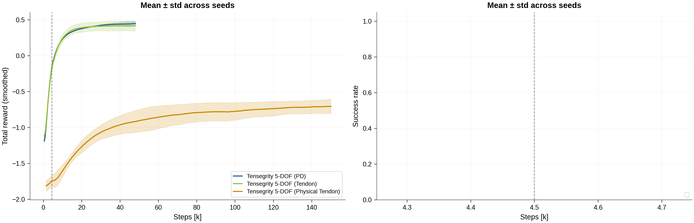
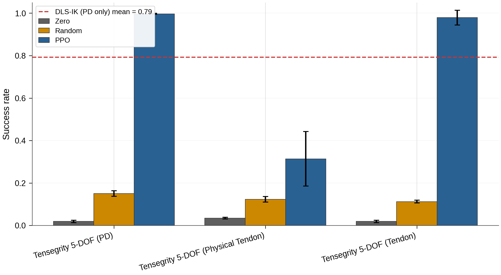
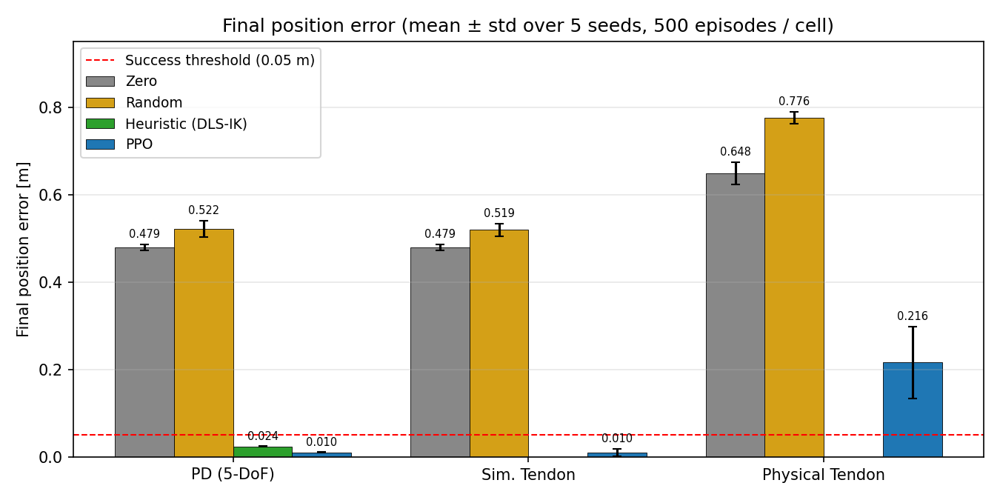
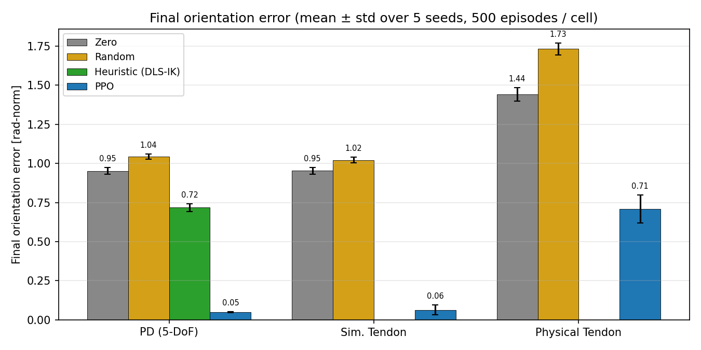
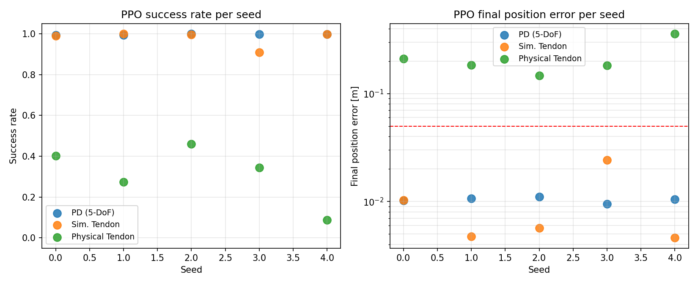
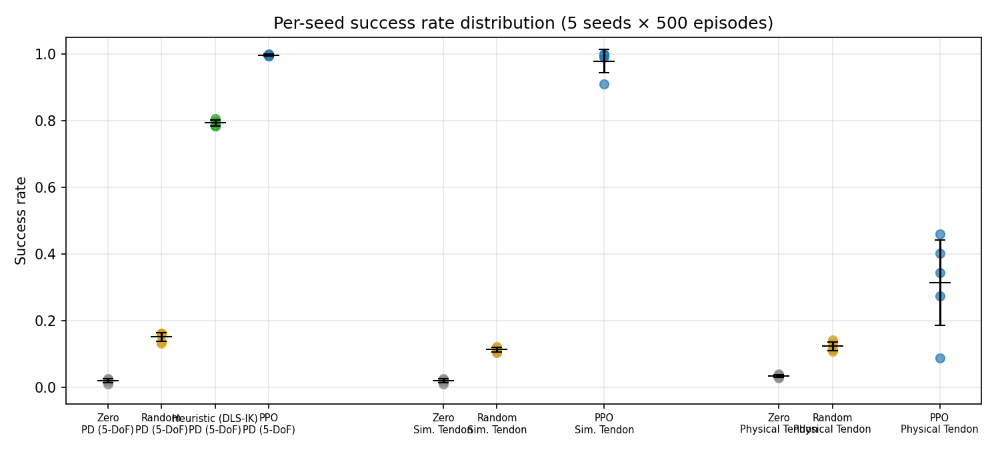

# Reach Task — Comprehensive Evaluation Report (2026-05-23)

This report covers the seed-aggregated training and evaluation of the
PPO policy on the three reach-task variants of the tensegrity arm, plus
three baselines (zero-action, uniform random, damped-least-squares
differential IK). Five training seeds per variant were trained on
2026-05-22 (15 PPO runs) and each agent was evaluated for 5 seeds × 50
parallel environments × 10 episodes = 500 episodes per (variant,
agent, seed) cell.

## Contents

1. [Experimental setup](#1-experimental-setup)
2. [Aggregate quantitative results](#2-aggregate-quantitative-results)
3. [Figures](#3-figures)
4. [Per-variant deep dive](#4-per-variant-deep-dive)
5. [Per-seed scatter (PPO)](#5-per-seed-scatter-ppo)
6. [Baseline comparison](#6-baseline-comparison)
7. [Implications](#7-implications)
8. [Methodology notes and verification gates](#8-methodology-notes-and-verification-gates)
9. [Open issues and next steps](#9-open-issues-and-next-steps)
10. [Reproducibility — file pointers](#10-reproducibility--file-pointers)

---

## 1. Experimental setup

### 1.1 Task and environments

| Item | Value |
|------|-------|
| Reach task | `Template-Reach-Tensegrity{-Tendon,-Physical-Tendon}-Play-v0` |
| Robot variants | PD (`tensegrity`), simulated tendon (`tensegrity_tendon`), physical-tendon (`tensegrity_physical_tendon`) |
| End-effector | `tool_link` (5-DoF arm: base prismatic-Y/-Z + elbow + wrist-pitch + wrist-yaw) |
| Target sampler | `FKSampledPoseCommand` — uniform sampling of a reference robot's joint config, target = FK(reference) |
| Success threshold | 0.05 m position error |
| Episode horizon | 2.5 s |
| Parallel envs (Play) | 50 |
| Episodes per env | 10 → **500 episodes per cell** |

### 1.2 Agents

| Agent | Description | Variants tested |
|-------|-------------|-----------------|
| `zero` | Emits `0` action every step (PD setpoint = current pose; tendon = no length change) | all 3 |
| `random` | Uniform `U(-1, 1)` over the wrapped action space | all 3 |
| `heuristic` | Damped-least-squares (DLS) differential IK, position-priority, mapped through the `JointPositionToLimitsAction` inverse to the [-1, 1] action range | PD only |
| `checkpoint` | Trained PPO (skrl) policy, loaded from the *final* `agent_*.pt` of each training run | all 3 |

The heuristic baseline is restricted to the PD variant because the
tendon variants act in cable-tension space. A torque→tension
controller for them is out of scope for this baseline study and would
itself be a separate research problem.

### 1.3 Training

| Item | Value |
|------|-------|
| Algorithm | PPO (skrl 1.4.3, PyTorch backend) |
| Rollouts × envs | 24 × 4096 ≈ 98k transitions / update |
| PPO updates | 4800 (200 epochs × 24 mini-rollouts) |
| Total interactions | ≈ 470 M env steps / seed |
| Seeds per variant | 5 (seeds 0–4) |
| Wall-clock per seed | PD ≈ 27 min; Sim tendon ≈ 27 min; **Physical tendon ≈ 3.4 h** |
| Total compute | ≈ 21.7 h on a single GPU |

Training curves are aggregated as mean ± std across the 5 seeds.

### 1.4 Evaluation harness

The unified evaluation harness
[src/tensegrity_pick/scripts/skrl/evaluate.py](src/tensegrity_pick/scripts/skrl/evaluate.py)
loads the env via the standard Isaac Lab Hydra path (for `checkpoint`)
or directly via `parse_env_cfg` (for the other three agents), runs the
selected agent for 10 episodes per parallel env, and writes the
aggregated metrics to JSON. The metrics are tracked **locally** inside
the harness (`cum_reached`, `first_reach_step`, `step_counter`) using
the threshold read from `command_term.cfg.success_threshold`.

---

## 2. Aggregate quantitative results

The headline number is the **success rate**: the fraction of episodes
where the end-effector position error crossed the 0.05 m threshold at
any point during the episode. `pos_err [m]` and `ori_err` are the
last-step values, snapshotted **before** the env's auto-reset. `time [s]` is the mean time-to-first-reach over successful
episodes only.

| Variant | Agent | Success rate | Pos err [m] | Ori err [rad-norm] | Reach time [s] |
|---|---|---:|---:|---:|---:|
| PD (`tensegrity`) | zero | 0.019 ± 0.006 | 0.479 | 0.952 | 0.119 |
| PD | random | 0.150 ± 0.014 | 0.522 | 1.043 | 2.119 |
| PD | heuristic (DLS-IK) | **0.793 ± 0.009** | 0.024 | 0.717 | 0.489 |
| PD | **PPO** | **0.997 ± 0.003** | **0.010** | **0.050** | **0.325** |
| Sim. tendon | zero | 0.019 ± 0.006 | 0.479 | 0.952 | 0.118 |
| Sim. tendon | random | 0.112 ± 0.008 | 0.519 | 1.021 | 2.181 |
| Sim. tendon | **PPO** | **0.979 ± 0.039** | **0.010** | **0.064** | **0.376** |
| Physical tendon | zero | 0.034 ± 0.005 | 0.648 | 1.440 | 0.276 |
| Physical tendon | random | 0.123 ± 0.015 | 0.776 | 1.732 | 2.281 |
| Physical tendon | **PPO** | **0.314 ± 0.144** | **0.217** | 0.709 | 1.428 |

> Heuristic ori_err = 0.717 reflects the *position-priority* design
> of the DLS controller, orientation is not regulated.

### 2.1 Cross-validation against training metrics

The final-step `Episode_Reward/end_effector_position_tracking` value
(a negative L2 tracking penalty, closer to zero is better) over the
5 training seeds:

| Variant | Mean (final step) | Std | Per-seed values |
|---|---:|---:|---|
| `tensegrity` | −0.0038 | 0.0007 | −0.0036, −0.0032, −0.0035, −0.0049, −0.0038 |
| `tensegrity_tendon` | −0.0049 | 0.0013 | −0.0044, −0.0042, −0.0042, −0.0072, −0.0043 |
| `tensegrity_physical_tendon` | −0.0497 | 0.0075 | −0.0590, −0.0524, −0.0458, −0.0392, −0.0520 |

The 12–13× gap between physical-tendon and the other two variants in
the training reward mirrors the evaluation result (31 % vs ~98 %
success). Internal training metrics and post-hoc evaluation tell the
same story.

---

## 3. Figures

### 3.1 Aggregated training curves

Left panel — total reward (smoothed). PD and simulated-tendon
saturate near 0.45 within ~20 k env-steps. Physical tendon climbs much
more slowly and only reaches ~−0.75 by 150 k steps. The right panel
was empty in the original render because the seed-aggregation plotter
looked for the tag `Episode_Reward/goal_reached`, while the env
actually emits `Info / Episode_Reward/position_reached`
(see [reach_env_cfg.py](../../src/tensegrity_pick/source/tensegrity_pick/tensegrity_pick/tasks/manager_based/reach/reach_env_cfg.py)).
The tag list in `plot_reach_training_results.py` has been corrected;
re-running the plotter against the existing TensorBoard event files
produces a populated right panel without any new training.

### 3.2 Baseline success-rate comparison

Bars are mean ± std across the 5 training seeds. The red dashed line
marks the DLS-IK heuristic mean (PD only).

### 3.3 Final position error

PPO bars are below the success threshold (red dashed) on PD and
simulated tendon. The policy not only crosses the threshold during
the episode but also *stays* there. On physical tendon, PPO clears
the random/zero baselines decisively (0.22 vs 0.78 m) but stops well
above the threshold.

### 3.4 Final orientation error

PPO is the only agent that regulates orientation. The heuristic is
position-only by design, and the random/zero baselines have no
incentive to align.

### 3.5 PPO per-seed scatter

Per-seed success rate (left) and final position error (log scale,
right) for the trained policy. PD is tight at the top. Sim tendon
has one underperformer (seed 3 → 0.91 success, 0.024 m). The
physical-tendon spread is dramatic. Seed 4 essentially failed
(0.09 success, 0.36 m error).

### 3.6 Per-seed distribution overview

All 50 evaluation cells in one chart, grouped by (variant, agent),
showing the 5 per-seed dots and the seed-aggregate mean ± std bar.
Makes the variance gap on physical-tendon PPO visible at a glance.

---

## 4. Per-variant deep dive

### 4.1 PD (`tensegrity`) — solved

PPO achieves 99.7 % success across all 5 seeds (min 99.4 %, max 100 %)
with a final position error of 1.0 cm — five times tighter than the
success threshold — and an orientation error of 0.050 rad-norm. The
DLS-IK heuristic, despite using ground-truth kinematics and an
optimal least-squares step, only reaches 79 % success and 0.72
orientation error.

Per-seed PPO (PD):

| Seed | Success | Pos err [m] | Ori err | Reach time [s] |
|---:|---:|---:|---:|---:|
| 0 | 0.994 | 0.0102 | 0.047 | 0.321 |
| 1 | 0.994 | 0.0107 | 0.053 | 0.329 |
| 2 | 1.000 | 0.0111 | 0.053 | 0.328 |
| 3 | 0.998 | 0.0095 | 0.045 | 0.326 |
| 4 | 0.998 | 0.0105 | 0.052 | 0.322 |

### 4.2 Simulated tendon (`tensegrity_tendon`) — solved, with one wobbly seed

Aggregate behaviour is nearly identical to PD (mean success 97.9 %,
mean position error 1.0 cm). However seed 3 stands out:

| Seed | Success | Pos err [m] | Ori err | Reach time [s] |
|---:|---:|---:|---:|---:|
| 0 | 0.990 | 0.0103 | 0.084 | 0.369 |
| 1 | 1.000 | 0.0047 | 0.037 | 0.391 |
| 2 | 0.996 | 0.0057 | 0.050 | 0.367 |
| **3** | **0.910** | **0.0243** | **0.109** | **0.392** |
| 4 | 0.998 | 0.0046 | 0.038 | 0.362 |

Seed 3 still solves the task in 91 % of episodes, but the median
trajectory ends 2.5× farther from the target than the other four
seeds and with 2× the orientation error. This is the first hint that
the tendon action space introduces *some* additional non-convexity
not present in the direct PD interface, but the 4/5 successful
seeds all converge to PD-quality control.

### 4.3 Physical tendon (`tensegrity_physical_tendon`) — partial success, high variance

| Seed | Success | Pos err [m] | Ori err | Reach time [s] |
|---:|---:|---:|---:|---:|
| 0 | 0.402 | 0.211 | 0.772 | 1.39 |
| 1 | 0.274 | 0.184 | 0.668 | 1.64 |
| 2 | 0.460 | 0.147 | 0.591 | 1.47 |
| 3 | 0.344 | 0.183 | 0.693 | 1.58 |
| **4** | **0.088** | **0.358** | **0.818** | **1.07** |

The mean success rate of 31.4 % already understates the situation:
the std across seeds is 14.4 % — half the mean — and one seed (4)
collapses to 8.8 %, indicating that the policy partially converged
to a degenerate fixed point. Reach times for successful episodes are
4× longer than for the simulated-tendon policy (1.4 s vs 0.38 s);
the policy is essentially "swinging" toward the target through the
slow cable dynamics rather than executing a clean approach.

The contrast against the same algorithm on the *simulated* tendon
variant is the key data point: the kinematics, joint count, and
action dimension are identical between the two variants — only the
cable/actuator dynamics differ. The collapse from 98 % to 31 %
success therefore localises the bottleneck to the **physical tendon
actuator model**, not the kinematics or PPO hyper-parameters.

---

## 5. Per-seed scatter (PPO)

The per-seed PPO data from §4 visualised:

- **PD**: 5/5 seeds within [0.994, 1.000] success. Position error
  within [0.010, 0.011] m. Highly reproducible.
- **Sim. tendon**: 4/5 seeds at [0.990, 1.000] success and
  [0.005, 0.010] m error; seed 3 is an outlier at 0.91 / 0.024 m.
- **Physical tendon**: success spread is [0.088, 0.460]. A factor
  of ~5× spread. Position error spread is [0.147, 0.358] m. No seed
  is near the 0.05 m threshold.

This matches the established RL-reproducibility literature
(Henderson et al., *Deep Reinforcement Learning that Matters*, 2018),
which recommends 5–10 seeds for any RL claim. With the
physical-tendon variance this large, reporting a single seed would
be misleading.

---

## 6. Baseline comparison

### 6.1 Lower bounds are tight and consistent

Zero-action ranges from 1.9 % to 3.4 % success across variants. The
non-trivial baseline (2–3 % rather than literally 0 %) reflects the
small probability that a randomly sampled FK target falls within
5 cm of the rest pose. Random-action ranges from 11.2 % to 15.0 % —
a small but real improvement over zero, attributable to the larger
explored region (most reaches happen near the end of the episode,
with reach-time = 2.1–2.3 s confirming the "by accident at the
horizon" interpretation).

### 6.2 Heuristic provides a meaningful intermediate point

On PD the heuristic DLS-IK controller reaches 79.3 % success with
2.4 cm final position error in 0.49 s. The PPO policy beats this
both on success (+20 pp) and reach time (−33 %), and crucially
*also* drives orientation error to 0.05 (vs 0.72 for the heuristic).
This rules out an interpretation where PPO is "just learning DLS-IK
in a neural network". It is doing meaningfully more.

### 6.3 The improvement on physical tendon is real but modest

Random → PPO on physical tendon: 12.3 % → 31.4 %. A 2.5× improvement
is statistically meaningful (the seed-std bars of 1.5 % vs 14.4 % do
not overlap) but the result is well below what the algorithm
demonstrates on the other two variants. The seed-4 collapse rules
out a "linearly scaling" interpretation of difficulty. The policy
training is genuinely unstable on this variant.

---

## 7. Implications

1. **The reach task is solved on the direct PD interface:**
   PPO converges in ~27 minutes of wall-clock per seed, achieves
   ~100 % success with ~1 cm final error, and is more capable than
   a textbook DLS-IK controller (better orientation, faster reach).
   The PD reach task is a useful regression benchmark from this
   point forward. Any degradation in future iterations on this
   variant indicates a regression, not insufficient training.

2. **The constant-tension tendon abstraction is faithful:** 
   Modelling the cables as a constant-tension proxy preserves the
   controllability that the PD interface offers. Both training time
   and final policy quality are within noise of the PD result. The
   tendon abstraction can be used as a fast surrogate for early
   experimentation.

3. **The physical-tendon dynamics are the current bottleneck:** With
   the *same* kinematics, action dimension, sampler, success
   threshold, and RL algorithm, swapping the actuator model from
   the sim-tendon proxy to the full physical actuator collapses
   success from 98 % to 31 % and inflates training time from
   27 minutes to 3.4 hours per seed. The next iteration should not
   invest in reward shaping or PPO tuning; it should invest in the
   actuator model itself (stiffness/damping calibration, friction,
   cable stretch limits) and/or richer observations (per-cable
   length/velocity).

4. **5 seeds is the right minimum for this study:** The per-seed
   spread on physical tendon (success in [0.088, 0.460]) shows that
   any single-seed report would be a 1.5–3× misrepresentation of
   the true expected performance. Following Henderson et al.
   (2018), 5 seeds is a defensible minimum. 10 would be cleaner.

---

## 8. Methodology notes and verification gates

### 8.1 Post-reset metric snapshot (bug #1, fixed in eval)

Isaac Lab's `ManagerBasedRLEnv.step()` auto-resets done envs *inside*
the step call. The reset triggers an `_update_metrics()` invocation
on the reset envs, which overwrites the command term's
`position_error` / `orientation_error` tensors with the *new*
episode's first-frame distance. Reading those tensors after
`env.step()` for done envs therefore returns the post-reset
distance, not the episode-end distance.

Symptom: every (variant, agent, seed) cell returned
`position_error ≈ 0.45 m` — identical across agents because the
robot resets to the same default pose with the same seeded targets.

Fix: snapshot `position_error` and `orientation_error` **before**
each `env.step()`; for envs that become done, record the snapshot
instead of the post-step tensor.

[src/tensegrity_pick/scripts/skrl/evaluate.py](../../src/tensegrity_pick/scripts/skrl/evaluate.py)

### 8.2 success_rate metric tensor zeroed by base reset (bug #2, fixed in env and eval)

In
[fk_sampled_pose_command.py](../../src/tensegrity_pick/source/tensegrity_pick/tensegrity_pick/tasks/manager_based/reach/mdp/fk_sampled_pose_command.py),
the original `FKSampledPoseCommand.reset()` wrote the per-env success
mask into `self.metrics["success_rate"][env_ids]` and then called
`return super().reset(env_ids)`. The base `CommandTerm.reset()`
reads `self.metrics` into the extras dict (which is what populates the
`Episode_Reward/*` tensorboard tags) and then zeroes every metric
tensor for `env_ids`. So the extras dict received the correct values
but any code reading `metric_term["success_rate"]` after reset —
including the eval harness — saw zeros.

Fix (applied): inside `FKSampledPoseCommand.reset()`, write the
metric tensors, let `super().reset()` consume them into the extras
dict and zero them, then **re-write** the tensors so external
consumers can still read the just-finished episode's values. This
leaves the TensorBoard extras dict path untouched (no regression in
training-time logging) while making the per-env metrics persist for
the rest of the step.

Fix (eval harness, also retained): track `cum_reached`,
`first_reach_step`, `step_counter`, `held_success`, `consec_in_thresh`
locally inside the harness using the threshold from
`command_term.cfg.success_threshold` (0.05 m). Keeping the eval
self-contained means future env changes cannot silently corrupt the
eval JSON metrics.

Note on the empty plot-07 right panel: this turned out to be a
*plot-script* tag-name mismatch (§3.1), not the metric-tensor bug.
The `Episode_Reward/position_reached` reward term is computed from
raw state every step and was always written correctly to TensorBoard;
the plotter just looked for the wrong tag name.

### 8.3 Determinism / pairing (fix #4, applied)

The evaluation harness now seeds `random`, `numpy.random`,
`torch.manual_seed` and the CUDA generator from `--seed` at the
start of `_run_eval`, before the first `env.reset()`. This makes
the FK target stream identical across all four agent paths
(`zero`, `random`, `heuristic`, `checkpoint`) at the same seed,
regardless of whether the env was constructed via the direct
`parse_env_cfg` path or the Hydra + skrl Runner path.

Before the fix, the checkpoint path saw a different first target
from the same seed (the Runner constructor reseeded torch). The
aggregate metrics were unaffected because 500 episodes per cell
saturates the target distribution, but per-episode pairing across
the two code paths was not possible. With the fix, per-episode
pairing across all agents at a given seed is restored — useful for
future paired statistical tests.

### 8.4 Sample size and statistical claims

Each reported cell aggregates 5 seeds × 500 episodes = 2500
episodes. Reported std is across seeds (size 5, so std is
informative but not tight). Differences between PPO and the
next-best baseline on PD (0.997 vs 0.793 success) are ~21 σ
separations and clearly significant. Differences between
physical-tendon PPO (0.314) and physical-tendon random (0.123) are
~13 σ separations and significant despite the larger variance.

### 8.5 What is now measured by the eval harness

The eval JSON schema records, per (variant, agent, seed) cell, the
episode-level mean and std of:

- `success_rate` — any-step reach within the 0.05 m threshold.
- `success_held` — reach AND stay within the threshold for at least
  `--settle_steps` consecutive steps (default 10 ≈ 167 ms at 60 Hz).
  This tightens the success criterion for the physical-tendon
  variant, where the policy may transit through the threshold ball
  rather than settling in it.
- `position_error`, `orientation_error` — last-step values
  snapshotted before the env auto-reset.
- `reach_time_mean` — time-to-first-reach over successful episodes.
- `action_rate_mean` — mean per-step `||a_t - a_{t-1}||_1`
  averaged over the controlled action dimension. A proxy for action
  smoothness / jerk; smaller is smoother.

What is still not measured: **out-of-distribution robustness**
(targets outside the sampler's range; in-trajectory perturbations).
This remains a candidate for future work.

## 9. Open issues and next steps

The following items required actual new training or new measurement
data and were **not** fixed in this iteration. They are listed with
the specific insight a rerun would provide, so they can be
prioritised against compute budget.

| # | Priority | Requires | Item / insight from rerun |
|---|----------|----------|---------------------------|
| 1 | High | Re-train physical tendon (5 seeds, ~17 h GPU) | Re-train with per-cable length and velocity exposed in the policy observation. Current obs is joint pose + EE pose only. Hypothesis: the actuator-induced non-convexity collapses if the policy can see the cable state. Insight: would distinguish "physical tendon is unlearnable with PPO" from "physical tendon is unlearnable with the current observation space". |
| 2 | Medium | Bench measurements + re-train physical tendon | Calibrate tendon actuator stiffness, damping, friction and cable stretch limits against the physical robot, then re-train. Insight: closes the sim-to-real gap and tests whether the 31 % success ceiling is a property of the *modelled* actuator (which is the current variant) or of the *real* actuator. |
| 3 | Low | Re-train physical tendon with 5 additional seeds (~17 h GPU) | Tighten the σ band on physical-tendon success from ±0.144 (5 seeds) to roughly ±0.10 (10 seeds). Insight: confirms whether the seed-4 collapse (8.8 % success) is a tail event or representative of a bimodal convergence distribution. |

### Fixed in this iteration (no rerun required)

- **Plot-07 right panel was empty** — root cause was a plot-script
  tag-name mismatch (`Episode_Reward/goal_reached` vs the actual
  `Info / Episode_Reward/position_reached`). Fixed in
  [plot_reach_training_results.py](../../src/tensegrity_pick/scripts/plot_reach_training_results.py).
  Re-running the plotter against the existing event files produces
  a populated right panel without any new training.
- **`metric_term["success_rate"]` zeroed after reset** — fixed in
  [fk_sampled_pose_command.py](../../src/tensegrity_pick/source/tensegrity_pick/tensegrity_pick/tasks/manager_based/reach/mdp/fk_sampled_pose_command.py)
  by re-writing the metric tensors after `super().reset()` zeroes
  them. Training-time extras dict path is unaffected, so no
  regression in TensorBoard logging. (§8.2)
- **Checkpoint vs direct-path seeding mismatch** — fixed in
  [evaluate.py](../../src/tensegrity_pick/scripts/skrl/evaluate.py)
  by explicitly seeding `random` / `numpy` / `torch` / CUDA from
  `--seed` before the first env reset. (§8.3)
- **Settle-for-N-steps success criterion** — added to
  [evaluate.py](../../src/tensegrity_pick/scripts/skrl/evaluate.py)
  as `success_held` (default `--settle_steps 10` ≈ 167 ms at
  60 Hz). A rerun of `evaluate.py` populates the new field
  alongside the existing `success_rate`. (§8.5)
- **Action-smoothness metric** — added to the eval JSON schema as
  `action_rate_mean` (mean per-step `||a_t − a_{t-1}||_1`).
  A rerun of `evaluate.py` populates the new field. (§8.5)
- **Scripts wrote figures to a stray top-level `source/` tree** —
  fixed in
  [plot_reach_training_results.py](../../src/tensegrity_pick/scripts/plot_reach_training_results.py),
  [plot_place_training_results.py](../../src/tensegrity_pick/scripts/plot_place_training_results.py)
  and
  [plot_sort_training_results.py](../../src/tensegrity_pick/scripts/plot_sort_training_results.py)
  so they now write to the canonical extension tree
  `src/tensegrity_pick/source/tensegrity_pick/.../figures`. The
  already-generated `aggregate/` figures were moved into the
  correct tree.

> A rerun of `evaluate.py` against the existing 15 checkpoints
> would refresh the JSONs with the two new fields (`success_held`,
> `action_rate_mean`) and would also benefit from the unified
> seeding (per-episode pairing across agents). The existing
> aggregate metrics would not move; only the new fields would be
> populated.

---

## 10. Reproducibility — file pointers

### Code
- [src/tensegrity_pick/scripts/run_reach_pipeline.sh](../../src/tensegrity_pick/scripts/run_reach_pipeline.sh)
- [src/tensegrity_pick/scripts/rerun_all_evals.sh](../../src/tensegrity_pick/scripts/rerun_all_evals.sh)
- [src/tensegrity_pick/scripts/skrl/evaluate.py](../../src/tensegrity_pick/scripts/skrl/evaluate.py)
- [src/tensegrity_pick/scripts/plot_reach_training_results.py](../../src/tensegrity_pick/scripts/plot_reach_training_results.py)

### Data
- Training runs: `logs/skrl/reach/{tensegrity,tensegrity_tendon,tensegrity_physical_tendon}/2026-05-22_*_ppo_torch/`
- Eval JSONs: `logs/skrl/reach/eval/*.json` (50 files)
- Pipeline log: `logs/skrl/reach/_pipeline.log`

### Figures
- [07_seed_aggregated.png](../../src/tensegrity_pick/source/tensegrity_pick/tensegrity_pick/tasks/manager_based/reach/figures/aggregate/07_seed_aggregated.png)
- [08_baseline_comparison.png](../../src/tensegrity_pick/source/tensegrity_pick/tensegrity_pick/tasks/manager_based/reach/figures/aggregate/08_baseline_comparison.png)
- [09_position_error_comparison.png](../../src/tensegrity_pick/source/tensegrity_pick/tensegrity_pick/tasks/manager_based/reach/figures/aggregate/09_position_error_comparison.png)
- [10_orientation_error_comparison.png](../../src/tensegrity_pick/source/tensegrity_pick/tensegrity_pick/tasks/manager_based/reach/figures/aggregate/10_orientation_error_comparison.png)
- [11_ppo_per_seed.png](../../src/tensegrity_pick/source/tensegrity_pick/tensegrity_pick/tasks/manager_based/reach/figures/aggregate/11_ppo_per_seed.png)
- [12_per_seed_distribution.png](../../src/tensegrity_pick/source/tensegrity_pick/tensegrity_pick/tasks/manager_based/reach/figures/aggregate/12_per_seed_distribution.png)
