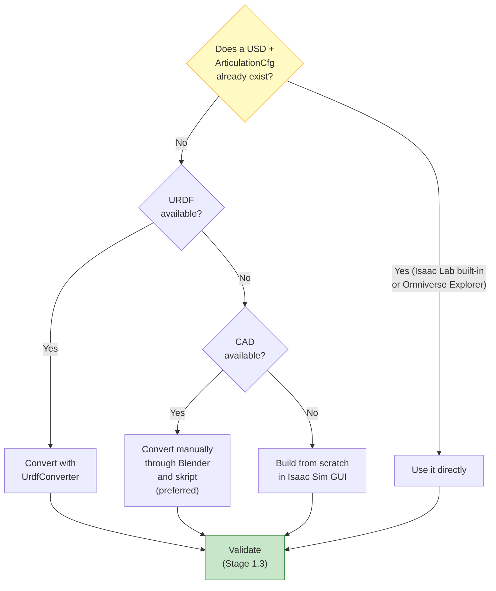
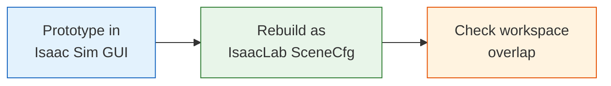
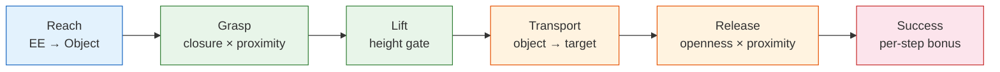
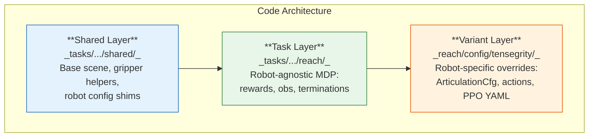
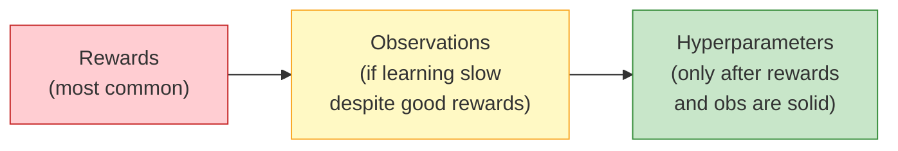

# From Task Idea to Trained Policy in Isaac Lab

**A Step-by-Step Procedural Guide for New Students**

*Georg Meyer · March 2026 · Tensegrity Cloth-Sorting Project*

---

This guide documents the complete workflow for building a reinforcement learning (RL) environment in NVIDIA Isaac Lab and training a policy using PPO. It is written as a procedural reference for students who join this or similar robotics-RL projects. Each stage includes the rationale, the concrete steps taken in our project, and pointers to the relevant helper scripts and configuration files.

---

## Table of Contents

- [Overview of the Pipeline](#overview-of-the-pipeline)
- [Stage 0: Prerequisites and Repository Setup](#stage-0-prerequisites-and-repository-setup)
- [Stage 1: Obtain or Build the Robot USD Asset](#stage-1-obtain-or-build-the-robot-usd-asset)
- [Stage 2: Validate Actuation Before Training](#stage-2-validate-actuation-before-training)
- [Stage 3: Build the Simulation Scene](#stage-3-build-the-simulation-scene)
- [Stage 4: Define the MDP — Observations, Actions, and Rewards](#stage-4-define-the-mdp--observations-actions-and-rewards)
- [Stage 5: Structure the Environment Code](#stage-5-structure-the-environment-code)
- [Stage 6: Select Hyperparameters](#stage-6-select-hyperparameters)
- [Stage 7: Train and Evaluate](#stage-7-train-and-evaluate)
- [Stage 8: Debug and Iterate Systematically](#stage-8-debug-and-iterate-systematically)
- [Stage 9: Known Pitfalls and Lessons Learned](#stage-9-known-pitfalls-and-lessons-learned)
- [References and Further Reading](#references-and-further-reading)

---

## Overview of the Pipeline

```mermaid
flowchart LR
    A["🔧 Stage 0<br/>Setup"] --> B["🤖 Stage 1<br/>Robot USD"]
    B --> C["⚙️ Stage 2<br/>Actuation"]
    C --> D["🏗️ Stage 3<br/>Scene"]
    D --> E["🧠 Stage 4<br/>MDP Design"]
    E --> F["📁 Stage 5<br/>Code Structure"]
    F --> G["🎛️ Stage 6<br/>Hyperparams"]
    G --> H["🚀 Stage 7<br/>Train & Eval"]
    H --> I["🔍 Stage 8<br/>Debug & Iterate"]
    I --> J["⚠️ Stage 9<br/>Pitfalls"]

    style A fill:#E3F2FD,stroke:#1565C0
    style B fill:#E3F2FD,stroke:#1565C0
    style C fill:#E3F2FD,stroke:#1565C0
    style D fill:#E8F5E9,stroke:#2E7D32
    style E fill:#E8F5E9,stroke:#2E7D32
    style F fill:#E8F5E9,stroke:#2E7D32
    style G fill:#FFF3E0,stroke:#E65100
    style H fill:#FFF3E0,stroke:#E65100
    style I fill:#FCE4EC,stroke:#C62828
    style J fill:#FCE4EC,stroke:#C62828
```



---

## Stage 0: Prerequisites and Repository Setup

Before writing any task code, set up the development environment. Our project requires Isaac Sim 5.1.0, the latest Isaac Lab main branch, and the skrl RL library, all running on Ubuntu 22.04 with an NVIDIA GPU (≥8 GB VRAM).

```bash
# Automated setup
cd tools
bash install_IsaacLab.sh          # installs Isaac Sim + Isaac Lab + skrl
conda activate env_isaaclab
cd ../src/tensegrity_pick
python -m pip install -e source/tensegrity_pick

# Verify the installation
python scripts/diagnostics/list_envs.py
```

> **📂 See:** `tools/README.md` for installer docs, `.config/env_vars.sh` for environment variables.

---

## Stage 1: Obtain or Build the Robot USD Asset

### 1.1 Check for an existing USD / config



Start by checking whether a USD and a matching `ArticulationCfg` already exist. Isaac Lab ships configs for many common robots (Franka, UR10, Kinova, ANYmal, etc.) in the isaaclab.robots module. Isaac Sim's **Omniverse Explorer** (`localhost:8080/omni/web3` on the Nucleus server) hosts additional USD files. For our project, we found the UR10e, the Kinova Gen3, and various Robotiq Grippers ready for use f.

> **💡 Tip:** Always check the Nucleus server and Isaac Lab's built-in configs before building from scratch. Re-using validated assets saves days of debugging inertia, collision, and joint-limit issues.

### 1.2 Building a USD from scratch in Isaac Lab

If no ready-made asset exists, building the articulation natively in Isaac Sim produces USD that is immediately compatible with Isaac Lab's physics schemas and avoids the many silent failures of URDF import (wrong inertia frames, missing collision hulls, swapped joint axes). The workflow splits into two sequential steps: first build each sub-component using the **Robot Wizard**, then combine them into one articulation using the **Robot Assembler**.

#### Step 1 — Build individual sub-USDs with the Robot Wizard

The **Robot Wizard** (`Tools > Robotics > Robot Wizard` in Isaac Sim — currently in beta, but the most reliable way to author a new articulation from scratch) guides you link by link, joint by joint through a structured UI. It writes a schema-compliant USD directly, so you do not have to manually manage `ArticulationRootAPI`, `RigidBodyAPI`, or joint-relationship targets. Build each logical sub-component as its own USD file — arm, base, end-effector — and save them separately. They will be combined in Step 2. For grippers, check Nucleus first before building; the Robotiq 2F-140 used in this project was available as a ready-made reference asset there.

There are two ways to define individual link geometry inside the wizard.

**Approach A — Import STL/OBJ meshes (used for the tensegrity arm links)**

Use this when you have manufacturer-supplied geometry. In Isaac Sim: `File > Import > STL/OBJ`, or drag the mesh file into the stage.

Each link that uses a mesh needs two separate child prims under its `Xform` node:

```
link_name  (Xform, RigidBodyAPI, MassAPI)
├── Visuals/
│   └── mesh  (Mesh, purpose = render)      ← visual only, no physics
└── Collisions/
    └── mesh  (Mesh, purpose = guide,        ← collision geometry
               PhysX CollisionAPI applied)
```

The visual mesh and the collision mesh are **different prims** — never use the same high-polygon mesh for both. To generate a collision mesh from your visual mesh in Isaac Sim:

1. Select the visual mesh prim in the Stage panel.
2. Right-click → `Add > Physics > Collider Preset` — this attaches a `PhysXCollisionAPI` to the prim in-place (quick, but uses the full polygon count, which is too slow for GPU training).
3. For training, use a simplified approximation instead: select the mesh → `Physics > Compute Collision Mesh` and choose one of:
   - **`convexHull`** — single convex shell; fast, suitable for most solid links.
   - **`convexDecomposition`** — decomposes concave shapes into multiple convex hulls; use for L-shaped or hollow links.
   - **Primitive** (box, sphere, cylinder) — fastest; use when the link shape is close to a primitive, as in the elbow disc below.

Remove `PhysXCollisionAPI` from the visual mesh after generating the collision child prim; otherwise, both are active and you double-count contacts. You can visually check the collision shapes by enabling `View > Show by Purpose > Physics > Colliders > All`.

**Getting the correct inertia for imported meshes.** Inertia is the most common source of physics explosions. Never rely on Isaac Sim's auto-generated inertia for imported meshes — it defaults to a unit sphere if MassAPI is absent, which is almost never correct. Use one of:

- **Export from CAD**: most CAD tools (SolidWorks, Fusion 360, FreeCAD) can compute the inertia tensor directly from the 3D model. Export as values (ixx, iyy, izz, ixy, ixz, iyz) relative to the link origin and enter them in the `MassAPI` property panel (`Physics > Mass`).
- **Isaac Sim Calculate Mass Properties**: select the collision mesh → `Physics > Calculate Mass Properties`. Set the material density and let Isaac Sim integrate over the mesh volume. 
- **Primitive formula for simple shapes**: the cylinder used for the elbow disc (`cylinder_approx_link`, 0.192 kg, d=166 mm, h=20 mm) was set analytically using I = ½mr² for the polar axis and I = m(3r²+h²)/12 for the diametral axes.

After setting mass properties, verify in the **Asset Validator** (`Window > Asset Validator`) that every link reports a positive-definite inertia tensor. A zero or negative eigenvalue guarantees a physics explosion. You can further visually check the inertia by enabling `View > Show by Purpose > Physics > Mass Properties > All`.

**Approach B — Build from primitives (used for the prismatic base)**

Use this when there is no physical geometry to import, or when the link is a virtual kinematic node. In the Robot Wizard, choose a primitive shape (box, cylinder, sphere) directly for the link geometry. For primitives, the same prim serves as both visual and collision geometry — apply `PhysXCollisionAPI` directly and mark `purpose = default`. This avoids the visual/collision separation overhead entirely, and inertia can be set analytically from the primitive dimensions (e.g. I = ½mr² for the polar axis of a cylinder).

Our base uses box primitives for the linear rail guides, and the wrist pivot link (`wrist_link`) is a 5 mm sphere with negligible mass (0.0001 kg). The virtual pivot carries no visual geometry — they exist solely to provide a joint-axis frame at the intersection of two orthogonal revolutes that share no physical rigid body.

**Approach C — Complete CAD to USD Pipeline via Blender (Used for the tensegrity robot arm)**

This guide is optimized for custom articulated robots designed in CAD (e.g., Fusion 360), allowing you to go from CAD to a simulation-ready robot model in Isaac Sim. As described in the project thesis, this pipeline prepares the meshes for physics simulation by cleaning the hierarchies, correcting origins to align with the physical mechanism, decimating visual meshes, and creating hand-built collision primitives to optimize GPU-accelerated PhysX performance. 

The goal is a clean hierarchical structure avoiding CAD assembly hierarchy:
```text
Robot
├── base_link
├── upper_arm
├── disk
├── forearm
└── wrist
````

with separate geometries such as:

`upper_arm_visual` / `upper_arm_collision`

`forearm_visual` / `forearm_collision`

**Phase 1: Prepare CAD**

1. **Clean Fusion 360 assembly**: Delete or suppress screws, washers, nuts, decorative parts, and labels. Keep only parts that contribute to mass, collisions, or visuals.
2. **Use meters and kilograms**: In Fusion: Document Settings → Units → Meter. Isaac Sim expects Length in meters, Mass in kilograms, and Time in seconds. Never use grams.
3. **Create one component per rigid link**: Desired structure: `base_link`, `upper_arm`, `disk`, `forearm`, `wrist`. Avoid CAD assembly hierarchy. Robot links ≠ CAD assemblies.
4. **Export FBX**: Export the robot assembly as FBX.

**Phase 2: Import into Blender**

1. **Import FBX**: File → Import → FBX. Expect deep hierarchies, many empties, and many small parts.
2. **Flatten hierarchy**: Mac: `⌥ Option + P` or Object → Parent → Clear Parent → Keep Transform.
	_Important_: Choose `Clear Parent → Keep Transform`, otherwise objects move.
3. **Delete empty objects**: Select → Select All by Type → Empty. Press `X`.
4. **Delete unnecessary parts**: Search for DIN, ISO, M4, M5. Delete screws and hardware.

**Phase 3: Create clean robot links**

1. **Merge parts belonging to one link**: Example: Select all upper-arm parts. Join: `Ctrl + J`.
    _Gotcha_: If Blender says "Active object is not a mesh", then an Empty is selected, or the active object is not a mesh. Fix: Select → Select All by Type → Mesh, then `Ctrl + J`.
2. **Rename links**: Example: `upper_arm_visual`, `forearm_visual`, `disk_visual`, `wrist_visual`.

**Phase 4: Set origins correctly**

This is the most important step. The origin becomes the robot link frame. For each link, move the origin to the joint axis so that the simulated joint axes align with the physical mechanism.

- **Procedure**: Select a vertex/face at the joint. Edit Mode: `Tab`. Select geometry. Move cursor: `Shift + S` → Cursor to Selected. Back to Object Mode. Set origin: `Object → Set Origin → Origin to 3D Cursor`.
- **Verify**: Select object. Check: `N` → Item. Origin should match joint location.
- _Gotcha_: Do NOT use `Origin to Geometry` for articulated links. Origins must be at joints.

**Phase 5: Apply transforms**

After origins are correct: `Ctrl + A` → All Transforms.
Desired result: Location: preserved, Rotation: 0 0 0, Scale: 1 1 1.
_Gotcha_: Never export with Scale = 0.001 or Rotation = 90°. These cause Isaac Sim problems. Apply transforms first.

**Phase 6: Clean visual meshes**

Optional but recommended.
- **Remove duplicate vertices**: Edit Mode: `A`. `M` → By Distance.
- **Reduce vertex count**: Add modifier: Modifier (Wrench) → Decimate. For CAD models, use Planar (Angle: 1–5°) or Collapse (Ratio: 0.1–0.3, depending on mesh complexity).
    Monitor vertex count: Viewport Overlays → Statistics.

**Phase 7: Create collision meshes**

Never use visual meshes for collision. Automatic convex-hull or convex-decomposition tools should be avoided because they produce collision shells with unnecessarily high triangle counts that significantly slow down the GPU-accelerated PhysX broad- and narrow-phase.

- **Recommended approach**: Create separate collision objects. Duplicate: `Shift + D`. Rename: `upper_arm_collision`. Replace with strongly simplified, hand-built convex primitive meshes.
- **Critical rule**: Visual and collision objects must share the origin and orientation. Only geometry should differ. The same collision meshes are shared between the full-resolution and low-resolution visual variants.

Suggested Blender structure:
```
Visual
├── upper_arm_visual
├── forearm_visual
└── wrist_visual

Collision
├── upper_arm_collision
├── forearm_collision
└── wrist_collision
```
Collections are optional but helpful.

**Phase 8: Export from Blender**

Before export verify: Every object has Scale = 1, Rotation = 0, and Origin = correct joint.
Export:
- Preferred: USDC (as used in the thesis) or USD
- Fallback: FBX

**Phase 9: Isaac Sim**

Import USD. For each link, assign: Visual Mesh, Collision Mesh, Mass, and Inertia.

- **Inertia**: Do NOT rely on automatic inertia computation. Use known link mass and simple geometric approximations (Examples: cylinder, box, capsule). Compute inertias manually.
- **Collision**: Do NOT use screws, CAD geometry, or high-poly collisions. Use simplified collision shapes.

**Final sanity checklist**

Before exporting to the final USD:

- **Geometry**: One object per rigid link, screws removed, visual meshes cleaned.
- **Origins**: Origin at joint axis, parent-child pivots verified.
- **Transforms**: Scale = 1, Rotation = 0, transforms applied.
- **Collision**: Separate collision meshes, simple primitives, same origin as visual mesh.
- **Physics**: Masses in kg, dimensions in meters, and manual inertias planned.
- **Export**: USDC/USD preferred, FBX only as fallback.

If you follow this pipeline, you'll end up with a clean USD robot that is much easier to assemble into an articulation in Isaac Sim and later use in Isaac Lab without fighting scaling, origins, collision instability, or inertia issues.

#### Step 2 — Combine sub-USDs with the Robot Assembler

Once each sub-component USD is validated on its own (drop test, inertia check — see Stage 1.3), use the **Robot Assembler** (`Tools > Robotics > Robot Assembler`) to join them into a single articulation. The assembler:

1. Takes a **base component** (e.g. the arm USD) and one or more **attach components** (e.g. gripper USD, base USD).
2. Lets you specify the **attachment prim** on the base (e.g. `tool_link`) and the **mount prim** on the attach component (e.g. gripper `base_link`), then creates a fixed joint between them.
3. Writes out a combined USD in which all links and joints form one continuous articulation under a single `ArticulationRootAPI`.

Our 5-DOF robot was assembled from three separate sub-USDs: `threedof_manipulator.usd` (the tensegrity arm, built with imported STL meshes), `linear_base.usd` (the prismatic 2-DOF base, built with primitives), and the Robotiq 2F-140 gripper (referenced from Nucleus), producing `fivedof_gripper.usd`.

> **💡 Tip:** Validate each sub-USD individually before assembly. A physics explosion in the combined asset is much harder to trace than in a single component.

> **💡 Tip:** If you see unphysical behaviour or explosions after assembly, even though the single components were validated correctly separately, make sure that under the Articulation Root, `Enable Self-collision` is disabled. A possible cause could lie in the overlapping of approximated colliders.

#### The USD robot tree — required structure and schema

Isaac Sim's physics engine requires robots to follow its `UsdPhysics` + `PhysxSchema` schema. Deviating from this structure causes silent failures at load time. The minimum compliant tree looks like this:

```
/World/Robot           (Xform)
│                       ← ArticulationRootAPI applied here
│
├── root_link           (Xform, RigidBodyAPI, MassAPI, CollisionAPI)
│   ├── Visuals/        (visual mesh)
│   └── Collisions/     (collision mesh)
│
├── link_1              (Xform, RigidBodyAPI, MassAPI)
│   ├── Visuals/
│   └── Collisions/
│
├── ...
│
├── ee_link             (Xform)
└── Joints              (Folder)
	├── joint_1         (PhysicsRevoluteJoint / PrismaticJoint)
    |    body0 = root_link   ← parent body reference
    |    body1 = link_1      ← child body reference
    ├── ...
    └── ee_joint        (PhysicsFixedJoint)
         body0 = last_actuated_link
         body1 = ee_link
```

Key rules:

- **`ArticulationRootAPI`** must be applied to exactly **one** prim — the top-level robot prim (not `root_link` itself). All links and joints in the subtree become a single PhysX articulation.
- **`root_link`** is the first rigid body in the kinematic chain.
- **`ee_link`** should be a lightweight, zero-inertia link attached to the last actuated link via a PhysicsFixedJoint. Its frame defines the tool-centre point (TCP). Never put collision geometry on `ee_link` — it is purely a reference frame for the reward functions, FK sampler and an attachment point for the robot assembler.
- Set **`upAxis = "Z"`** and **`metersPerUnit = 1.0`** in the stage metadata (`Edit > Stage Properties`). Isaac Lab assumes SI units; any other scale causes incorrect gravity direction or miscalibrated joint limits.
- Set **`defaultPrim`** to the top-level robot prim so that `UsdFileCfg.usd_path` resolves correctly when Isaac Lab references the asset.

For our tensegrity robot, the complete list of joint names that the `ArticulationCfg` must enumerate is: `base_y_joint`, `base_z_joint`, `elbow_joint`, `wrist_y_joint`, `wrist_x_joint`, `finger_joint` (active), plus the five Robotiq passive finger joints. Any joint not listed in an actuator group is treated as fully free by PhysX, which causes it to fall under gravity.

#### URDF conversion as a fallback

If you must start from a manufacturer URDF, convert it with:

```bash
./isaaclab.sh -p scripts/tools/convert_urdf.py robot.urdf robot.usd \
    --merge-joints --joint-stiffness 0.0 --joint-damping 0.0 \
    --joint-target-type none
```

Set stiffness and damping to zero during conversion — actuator dynamics belong in the `ArticulationCfg`, not baked into the USD, so the asset remains reusable across different control strategies. After conversion, always open the result in Isaac Sim, run the Asset Validator, and manually inspect inertia tensors and collision meshes before trusting the file.

### 1.3 Validate the USD asset

After conversion or creation, run these **non-negotiable checks**:

| # | Check | How | What to look for |
|---|-------|-----|-----------------|
| 1 | **Inertia check** | `Window > Asset Validator` in Isaac Sim | Every rigid body must have non-zero mass and positive-definite inertia. Incorrect inertias are the #1 cause of physics explosions. |
| 2 | **Drop test** | Press Play with robot free-standing | Should fall under gravity without links flying apart. Explosion = self-collision (see 1.4). |
| 3 | **Collision meshes** | Toggle collision viz in viewport | Use `convexHull` for most links, `convexDecomposition` for concave shapes. Remove collision from decorative links. |
| 4 | **Joint limits** | Inspect USD properties | Must match the physical robot's data sheet. Some URDF exporters produce infinite soft limits. |

### 1.4 The self-collision problem

Self-collision between adjacent links is a common cause of simulation instability, especially for compact manipulators. Use Isaac Sim's **Collision Filter** API to disable contact between link pairs connected by a joint. In our tensegrity model, we disabled collisions between the upper arm and forearm links. After applying filters, repeat the drop test.

> **🚨 Pitfall — GPU Cooking Failures:** PhysX GPU collision cooking *silently* fails on thin or high-aspect-ratio meshes and falls back to CPU, which can reduce training throughput by 10–50×. Watch the Isaac Sim console for cooking warnings. Simplify problem meshes or replace with primitives.

> **📂 See:** `res/Tensegrity/README.md` for our robot-asset documentation.

---

## Stage 2: Validate Actuation Before Training

Never train a policy on a robot whose actuators have not been validated. Isaac Lab provides two actuator families:

| Family | Behaviour | Best for |
|--------|-----------|----------|
| **Implicit** (e.g. `ImplicitActuatorCfg`) | PD recomputed every PhysX sub-step | Stability, prototyping |
| **Explicit** (e.g. `IdealPDActuator`, `DCMotor`) | Torque computed once per control step, held during decimation | Sim-to-real fidelity |

### 2.1 PD gain tuning

For PD tuning of prismatic and revolut joint the Isaac Sim built in gain tuner can be used (`Tools > Robotics > Asset Editors > Gain Tuner).

We tuned gains following Klein (2023): set damping to zero → increase stiffness until convergence → add damping for ζ ≈ 1.0 (critically damped). Our tensegrity arm settled at **Kp = 400, Kd = 20** for the arm joints and **Kp = 8000, Kd = 800** for the prismatic base. Settle time < 0.3 s, overshoot < 5%.

---

## Stage 3: Build the Simulation Scene

### 3.1 Recommended workflow



1. **Prototype in Isaac Sim GUI.** Arrange the robot, props, ground plane, lighting interactively. Save as a USD stage. This lets you visually verify spatial relationships (robot reach vs. conveyor height, camera angles, etc.). Same philosophy as for the robot assets apply, first search for validated resources before importing external meshes. Colliders for the meshes are applied analogously as with robot links.

2. **Rebuild in IsaacLab `SceneCfg`.** Translate the GUI layout into a Python `@configclass`. This is required for GPU-parallel training and for later domain randomisation. Use `{ENV_REGEX_NS}` tokens in prim paths for automatic environment cloning. Our base scene is defined in `tasks/manager_based/shared/proj_base_scene_cfg.py`.

3. **Check workspace overlap.** Verify that the robot's dexterous workspace covers the task-relevant region for this our analysis skripts can be used:

```bash
python scripts/workspace_analysis/workspace_sample.py
python scripts/workspace_analysis/workspace_visualize.py
```

Our tensegrity robot is ceiling-mounted at 2.30 m with the conveyor surface at 0.80 m. The workspace analysis confirmed overlap between the arm's reachable volume and the conveyor–drum corridor. For the UR10e and Kinova baselines, we adjusted mount height to 1.40 m based on the same analysis.

---

## Stage 4: Define the MDP — Observations, Actions, and Rewards

Design the observation space, action space, reward function, and termination conditions **on paper** before writing any code.

### 4.1 Observations

Think in categories and add each one only when it provides information the policy cannot infer from something already present. The table below lists the observation categories relevant to manipulation, roughly in order of how universally they apply.

| Category                        | What to include                                                                   | Notes                                                                                                                                                                                                               |
| ------------------------------- | --------------------------------------------------------------------------------- | ------------------------------------------------------------------------------------------------------------------------------------------------------------------------------------------------------------------- |
| **Robot state**                 | Relative joint positions, joint velocities                                        | Always required. Use *relative* positions (pos − default) so the observation is zero at the neutral pose.                                                                                                           |
| **EE state**                    | Grasp-centre position `ee_pos_w`, EE velocity `ee_vel_w`                          | Prefer the grasp centre over the wrist frame. Important for reach and all downstream tasks.                                                                                                                         |
| **EE-to-object**                | `object_pos − ee_pos` (3D vector, robot frame)                                    | Critical for any grasping task; gives the policy direct reaching information. Track the *nearest active* object so the signal is consistent across multi-object scenes.                                             |
| **Dynamic fingertip-to-object** | `object_pos − fingertip_pos(closure)`                                             | The fingertip offset changes with gripper closure — interpolate between the open and closed tip positions.                                                                                                          |
| **Gripper state**               | `gripper_closure` ∈ [0, 1], `gripper_torque_residual` ∈ [0, 1]                    | Closure is the normalised finger-joint position. Torque residual (‖applied‖ / limit) is a noisy contact proxy — expose as observation and let the policy learn the correlation rather than hard-coding a threshold. |
| **Object state**                | Object position, orientation, velocity                                            | Add velocity to reject bounced-object false positives in lift/grasp detection. For multi-object tasks, include both target and distractor relative positions.                                                       |
| **Target / goal**               | Pose command (7D: xyz + quat) for reach; target container position for place/sort | Only include the orientation component if orientation is part of the task objective.                                                                                                                                |
| **Task context**                | Episode time fraction, placed/missed counts, belt speed                           | Add for tasks with time pressure or multi-stage counters (cube sorting). Allows the policy to adapt its urgency.                                                                                                    |
| **Previous actions**            | Last action vector                                                                | Enables the policy to reason about smoothness and avoid bang-bang control.                                                                                                                                          |

```python
# Reach task (minimal — 22 dims for Tensegrity PD)
joint_pos  = ObsTerm(func=mdp.joint_pos_rel,        noise=Unoise(-0.01, 0.01))
joint_vel  = ObsTerm(func=mdp.joint_vel_rel,        noise=Unoise(-0.01, 0.01))
pose_cmd   = ObsTerm(func=mdp.generated_commands,   params={"command_name": "ee_pose"})
actions    = ObsTerm(func=mdp.last_action)

# Place / sort task (adds object and gripper state — 47 dims)
ee_pos          = ObsTerm(func=mdp.ee_pos_w)
ee_vel          = ObsTerm(func=mdp.ee_vel_w)
obj_rel         = ObsTerm(func=mdp.object_rel_ee)           # nearest active object
fingertip_rel   = ObsTerm(func=mdp.fingertip_rel_cube)      # closure-corrected tip
gripper_closure = ObsTerm(func=mdp.gripper_closure)
gripper_torque  = ObsTerm(func=mdp.gripper_torque_residual)
obj_vel         = ObsTerm(func=mdp.object_velocity)
target_rel      = ObsTerm(func=mdp.target_container_rel_ee)
```

> **💡 Philosophy — Asymmetric Actor-Critic:** For sim-to-real, give the *actor* only signals that are reproducible on real hardware (joint states, EE pose, gripper state). Give the *critic* privileged state (ground-truth object poses, contact forces) during training only. This preserves transfer while accelerating learning.

> **⚠️ Observation stability — Sticky object tracking:** In multi-object scenes, naively returning the "nearest object" can switch target mid-episode and create a noisy, unstable observation. Use sticky tracking: keep returning the same object until it is no longer valid (grasped, placed, out of range), then switch to the next nearest. See `tasks/manager_based/cube_sort/mdp/rewards.py` for the implementation.

### 4.2 Actions

**Joint position targets** are the most transfer-friendly option for sim-to-real. We use `JointPositionActionCfg` with `scale=0.5` and `use_default_offset=True`. For the tendon-driven variant, actions are split into a `JointPositionActionCfg` for the prismatic base and a custom `TendonEffortActionCfg` for the 5 cable tendons (max tension 500 N, Jacobian-transpose mapping).

> **📂 See:** `robots/tendon_actuator.py` for the tendon implementation, `doc/tendon_simulation.md` for the physics model.

### 4.3 Rewards

#### Structure rewards in phases that match the task's sequential subtasks

For any manipulation task, decompose the reward into phases that correspond to the logical subtasks. Each phase should have its own dense shaping term. Use `tanh` kernels (bounded, smooth) rather than raw L2 distances (unbounded, can dominate all other terms).



#### Reward gating with the `was_grasped` latch

For multi-phase tasks, later-phase rewards must not activate before the prerequisite is met. The standard pattern is a **persistent latch flag** stored on the environment:

```python
# In the custom env class (subclass of ManagerBasedRLEnv)
def step(self, actions):
    obs, rew, terminated, truncated, info = super().step(actions)
    # Update latch: once True, stays True for the rest of the episode
    still_running = ~(terminated | truncated)
    self._was_grasped[still_running] |= self.grasp_active[still_running]
    return obs, rew, terminated, truncated, info

def _reset_idx(self, env_ids):
    super()._reset_idx(env_ids)
    self._was_grasped[env_ids] = False  # Clear latch on reset
```

Transport and release rewards then query `env.was_grasped` as a boolean gate. This prevents the policy from collecting transport reward by pure chance (e.g. the arm sweeping past the target without ever grasping).

> **⚠️ Critical:** Mask the latch update by `~(terminated | truncated)`. If you update on the same step that a reset fires, the new episode's environments will inherit the old episode's latch state.

#### Multiplicative gating for hard conjunctive conditions

Additive terms behave as **logical OR** — the policy can satisfy any one condition and still collect the reward. Use **multiplication** to enforce **AND**:

```python
# Lift reward: object must be above belt AND near gripper AND gripper is closing
is_lifted  = (obj_height > belt + 0.06)
is_near    = (ee_to_obj_dist < 0.15)
is_closing = (finger_pos > 0.20)
is_slow    = (obj_speed < 1.0)          # Reject physics bounces
lift_rew   = weight * (is_lifted & is_near & is_closing & is_slow).float()
```

The velocity gate (`obj_speed < 1.0`) is particularly important: without it, a cube bouncing off the belt surface momentarily passes the height threshold and generates spurious lift reward.

#### Weight design rules for sequential phases

Getting the relative weights wrong produces well-known local optima:

| Rule | Rationale |
|------|-----------|
| `w_transport` > `w_lift + w_height` | Otherwise the policy learns "lift high and hover" — it maximises lift+height indefinitely without moving toward the target. |
| `w_success` large relative to all others | The per-step success bonus must dwarf the cost of releasing, otherwise the policy prefers to keep holding. |
| Prefer **per-step success reward** over **early termination** | With early termination, the policy has no incentive to release quickly once the object is placed. With per-step reward, every remaining step in the episode pays out, making fast release clearly optimal. |
| Add a **return-to-home / re-orient bonus** for multi-object tasks | After placing one object, a bonus for returning to the belt encourages the policy to immediately start on the next rather than freezing. |

#### Regularisation (always ramp via curriculum)

Start with small regularisation weights and ramp them up after the policy has learned the basic task structure. Applying heavy smoothness penalties from the beginning suppresses early exploration.

| Term | Initial weight | Final weight | Purpose |
|------|---------------|-------------|---------|
| `action_rate` (L2 action delta) | −1e-4 | −2e-3 | Smooth motor commands |
| `joint_vel` (clamped L2) | −1e-4 | −2e-3 | Prevent physics divergence |
| `joint_torque` | −0.05 | −0.05 | Reduce energy consumption |
| `belt_contact` (depth-based) | −10.0 | −10.0 | Protect belt surface |

> **📂 See:** `tasks/manager_based/reach/reach_env_cfg.py` (reach rewards), `tasks/manager_based/cube_place/place_env_cfg.py` (full sequential reward chain), `tasks/manager_based/cube_place/mdp/rewards.py` (implementation with gating).

### 4.4 Terminations and curriculum

Distinguish **truncation** from **termination**. Time-outs must set `time_out=True` so the algorithm applies value bootstrapping. True terminations (joint-velocity divergence > 100 rad/s in our case) use `time_out=False`.

For multi-stage tasks, use curriculum to introduce complexity gradually rather than presenting the full task from episode one. Our project uses two curriculum patterns:

- **Object introduction:** Start with a single target object; introduce the distractor (red cube) at 100k steps, after the policy has learned the basic pick-and-place behaviour. This prevents a reward crash on day one.
- **Regularisation ramp:** Start with very small smoothness penalties and ramp to full weight at 200k steps, so early exploration is not suppressed by a smoothness objective the policy cannot yet satisfy.

---

## Stage 5: Structure the Environment Code

Our project supports multiple tasks across multiple robots. The recommended structure uses a **three-layer pattern**:



1. **Shared layer** (`tasks/manager_based/shared/`): base scene config, gripper geometry helpers, and robot config shims shared across all tasks.

2. **Task layer** (e.g. `tasks/manager_based/reach/`): the base `ManagerBasedRLEnvCfg` with reward, observation, termination, and curriculum definitions that are robot-agnostic.

3. **Variant layer** (e.g. `reach/config/tensegrity/`): robot-specific overrides that replace the robot `ArticulationCfg`, action terms, body names, and joint names. Each variant gets its own `__init__.py` with `gym.register()` calls and a PPO hyperparameter YAML.

This ensures adding a new robot requires only a new `config/` sub-folder — no duplication of reward logic. Register each variant with a unique Gymnasium ID and add separate `-Play-v0` entries with observation noise disabled:

```python
gym.register(
    id="Template-Reach-Tensegrity-v0",
    entry_point="isaaclab.envs:ManagerBasedRLEnv",
    kwargs={
        "env_cfg_entry_point": f"{__name__}.config.tensegrity:TensegrityReachEnvCfg",
        "skrl_cfg_entry_point": f"{agents_dir}:skrl_ppo_cfg.yaml",
    },
)
```

> **📂 See:** `src/tensegrity_pick/README.md` for the full extension structure.

---

## Stage 6: Select Hyperparameters

PPO is the standard algorithm for Isaac Lab because on-policy methods scale naturally with massive parallelism. **Research similar tasks in the literature** and start from their hyperparameters. Our starting point for the reach task:

| Parameter | Value |
|-----------|-------|
| RL library | skrl (PyTorch) |
| Policy network | `[256, 128]` (separate actor-critic) |
| Learning rate | `5.0e-04` |
| Rollout horizon | 32 steps |
| Learning epochs | 8 per update |
| Discount γ / GAE λ | 0.99 / 0.95 |
| Clip range ε | 0.2 |
| Training timesteps | 36,000 (reach) — increase for complex tasks |
| Num. environments | 4,096 (train) / 50 (eval) |

YAML agent configs live alongside each task variant (e.g. `reach/config/tensegrity/agents/skrl_ppo_cfg.yaml`). Start with these defaults and **tune only after reward and observation design are solid**.

---

## Stage 7: Train and Evaluate

### 7.1 Common bash commands

```bash
# ─── TRAINING ────────────────────────────────────────────────────
# Headless training (default: 4096 envs from config)
python scripts/skrl/train.py --task=Template-Reach-Tensegrity-v0 --headless

# Override environment count
python scripts/skrl/train.py --task=Template-Reach-Tensegrity-v0 \
    --headless --num_envs=2048

# ─── EVALUATION ──────────────────────────────────────────────────
# Play back a trained policy (use the -Play-v0 variant!)
python scripts/skrl/play.py --task=Template-Reach-Tensegrity-Play-v0 --num_envs=10

# ─── SMOKE TESTS ─────────────────────────────────────────────────
# Zero-action agent (checks scene loads, physics runs)
python scripts/agents/zero_agent.py --task=Template-Reach-Tensegrity-v0 --num_envs=2 --headless

# Random-action agent (checks action space, reward computation)
python scripts/agents/random_agent.py --task=Template-Reach-Tensegrity-v0 --num_envs=2 --headless

# ─── UTILITIES ───────────────────────────────────────────────────
# List all registered environments
python scripts/diagnostics/list_envs.py

# Workspace reachability analysis
python scripts/workspace_analysis/workspace_sample.py
python scripts/workspace_analysis/workspace_visualize.py
```

### 7.2 Metrics to track during / after training

Monitor these metrics in TensorBoard for systematic reward optimisation:

| Metric | Why it matters |
|--------|---------------|
| **Mean episode reward** + per-term decomposition | The RewardManager tracks individual contributions — use this to identify which term is driving or blocking progress. |
| **Success rate** | Primary metric for manipulation tasks (binary, distance threshold). |
| **Mean episode length** | Decreasing = faster task completion; stagnant = stuck in local optimum. |
| **Action smoothness** (L2 action delta) | High values = bang-bang control that will not transfer to real hardware. |
| **Joint velocity statistics** | Watch for divergence; values > 100 rad/s trigger termination. |
| **KL divergence** | For PPO with KL-adaptive LR; should stay near target ~0.01. |
| **Curriculum progression** | Verify that weight ramps activate at the expected step counts. |

---

## Stage 8: Debug and Iterate Systematically

The debugging priority order:



| Symptom | Likely cause | Fix |
|---------|-------------|-----|
| Reward plateau | Insufficient dense shaping | Add intermediate phase rewards (reaching → grasping → lifting → placing) |
| Reward hacking | Additive composition exploited | Switch to multiplicative reward composition or add constraint penalties |
| NaN explosions | Physics instability | Reduce `sim.dt`, increase solver iterations, check reset states and inertias |
| Good sim, bad real transfer | Model mismatch | Increase domain randomisation, add action-smoothness penalties, verify actuator model |

---

## Stage 9: Known Pitfalls and Lessons Learned

> These pitfalls were encountered during this project and are documented here to save future students significant debugging time.

| #   | Pitfall                                         | What happened                                                                                                                      | Solution                                                                                                                                   |
| --- | ----------------------------------------------- | ---------------------------------------------------------------------------------------------------------------------------------- | ------------------------------------------------------------------------------------------------------------------------------------------ |
| 1   | **Infinite soft joint limits from URDF import** | Some URDFs produce infinite/NaN soft limits in the USD, causing the FK sampler to generate degenerate configurations.              | Our FK command sampler detects non-finite limits and falls back to ±0.75 rad around default. Always inspect limits after conversion.       |
| 2   | **Degenerate configurations at extremes**       | Sampling across the full joint range produces degenerate arm poses and cable geometries.                                           | Sample from the **inner 80%** of each joint's range.                                                                                       |
| 3   | **PhysX state residuals after teleport**        | After teleporting the robot for FK sampling, PhysX retains constraint-solver state from the previous configuration.                | Explicitly re-write joint velocities to zero to flush residual state.                                                                      |
| 4   | **PhysX spatial tendons unreliable**            | Isaac Sim's built-in spatial tendon API suffers from numerical instabilities and disables force reporting in `joint_force_report`. | We built a custom Jacobian-transpose tendon model (`TendonEffortAction`) — see `robots/tendon_actuator.py` and `doc/tendon_simulation.md`. |
| 5   | **Observation noise left on during eval**       | Training uses `enable_corruption=True`; forgetting to disable it during evaluation corrupts metrics.                               | Always register a separate `-Play-v0` variant with noise disabled.                                                                         |
| 6   | **Curriculum thresholds in play mode**          | Tasks with curriculum-gated object spawning (e.g. `cube_place`) show missing objects in play mode.                                 | Set curriculum thresholds to 0 in the Play config so all objects are visible from episode start.                                           |
| 7   | **PD gains tuned too aggressively**             | Initial arm damping of 120 → ζ = 6.4 → settle time 1.66 s (sluggish, overdamped).                                                  | Reduced to 20 → ζ ≈ 1.1 → settle time 0.30 s. Always validate with step-response tests.                                                    |
| 8   | **GPU collision cooking silent fallback**       | Thin or high-aspect-ratio collision meshes cause PhysX GPU cooking to silently fall back to CPU (10–50× throughput loss).          | Monitor the console for cooking warnings. Simplify problem meshes or replace with primitives.                                              |

---

## References and Further Reading

### Project documentation (in-repository)

| File | Contents |
|------|----------|
| `tools/README.md` | Installation and setup instructions |
| `res/Tensegrity/README.md` | Robot specification, kinematic chain, tendon geometry |
| `src/tensegrity_pick/README.md` | Extension structure, registered environments, usage |
| `tasks/.../reach/README.md` | Reach task details: rewards, observations, training results |
| `doc/tendon_simulation.md` | Tendon physics model, architecture, validation |
| `doc/pd_tuning_results.md` | PD gain tuning results and Klein (2023) validation |
| `doc/nv_isaac.md` | Isaac Sim / Isaac Lab external resources |

### External references

1. Mittal, M. et al. (2025). *Isaac Lab: A Unified and Modular Framework for Robot Learning.* RSS 2025 (to appear).
2. Makoviychuk, V. et al. (2021). *Isaac Gym: High Performance GPU-Based Physics Simulation for Robot Learning.* NeurIPS 2021 Datasets and Benchmarks.
3. Klein, S. (2023). *Simulation and Control of a Tensegrity-Driven Continuum Manipulator* (internal thesis).
4. Raffin, A. (2024). *On-Policy vs. Off-Policy in Massively Parallel Simulation.* arXiv preprint.
5. NVIDIA Isaac Lab Documentation: https://isaac-sim.github.io/IsaacLab/
