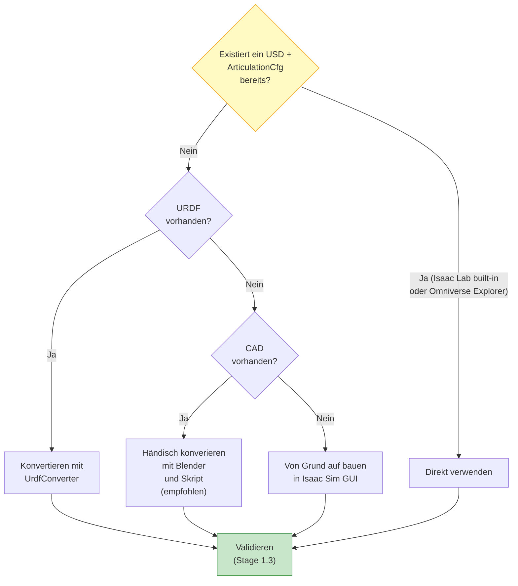
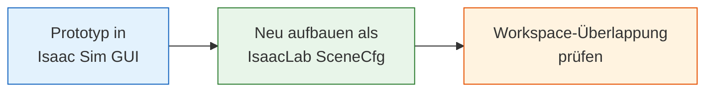
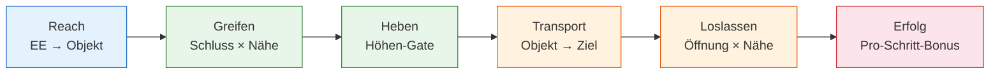
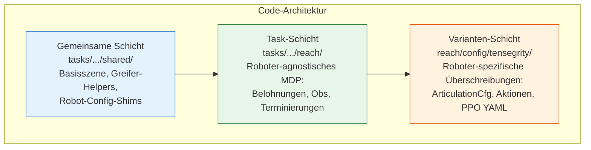
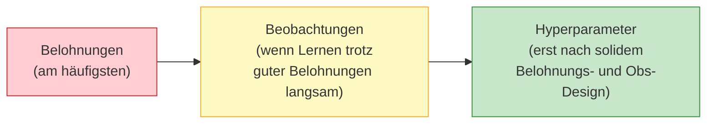

# Von der Aufgabenidee zur trainierten Policy in Isaac Lab

**Eine schrittweise Anleitung für neue Studierende**

*Georg Meyer · März 2026 · Tensegrity Cloth-Sorting Projekt*

---

Diese Anleitung dokumentiert den vollständigen Workflow zum Aufbau einer Reinforcement-Learning-(RL-)Umgebung in NVIDIA Isaac Lab und zum Training einer Policy mittels PPO. Sie richtet sich als prozedurales Nachschlagewerk an Studierende, die in dieses oder ähnliche Robotik-RL-Projekte einsteigen. Jede Stufe enthält die Begründung, die konkreten Schritte aus unserem Projekt sowie Verweise auf die relevanten Hilfsskripte und Konfigurationsdateien.

---

## Inhaltsverzeichnis

- [Überblick über die Pipeline](#überblick-über-die-pipeline)
- [Stage 0: Voraussetzungen und Repository-Einrichtung](#stage-0-voraussetzungen-und-repository-einrichtung)
- [Stage 1: Robot-USD-Asset beschaffen oder erstellen](#stage-1-robot-usd-asset-beschaffen-oder-erstellen)
- [Stage 2: Aktuierung vor dem Training validieren](#stage-2-aktuierung-vor-dem-training-validieren)
- [Stage 3: Simulationsszene aufbauen](#stage-3-simulationsszene-aufbauen)
- [Stage 4: Das MDP definieren – Beobachtungen, Aktionen und Belohnungen](#stage-4-das-mdp-definieren--beobachtungen-aktionen-und-belohnungen)
- [Stage 5: Umgebungs-Code strukturieren](#stage-5-umgebungs-code-strukturieren)
- [Stage 6: Hyperparameter auswählen](#stage-6-hyperparameter-auswählen)
- [Stage 7: Training und Auswertung](#stage-7-training-und-auswertung)
- [Stage 8: Systematisches Debuggen und Iterieren](#stage-8-systematisches-debuggen-und-iterieren)
- [Stage 9: Bekannte Fallstricke und Lessons Learned](#stage-9-bekannte-fallstricke-und-lessons-learned)
- [Referenzen und weiterführende Literatur](#referenzen-und-weiterführende-literatur)

---

## Überblick über die Pipeline

```mermaid
flowchart LR
    A["🔧 Stage 0<br/>Einrichtung"] --> B["🤖 Stage 1<br/>Robot USD"]
    B --> C["⚙️ Stage 2<br/>Aktuierung"]
    C --> D["🏗️ Stage 3<br/>Szene"]
    D --> E["🧠 Stage 4<br/>MDP Design"]
    E --> F["📁 Stage 5<br/>Code-Struktur"]
    F --> G["🎛️ Stage 6<br/>Hyperparameter"]
    G --> H["🚀 Stage 7<br/>Training & Eval"]
    H --> I["🔍 Stage 8<br/>Debuggen"]
    I --> J["⚠️ Stage 9<br/>Fallstricke"]

    style A fill:#E3F2FD,stroke:#1565C0
    style B fill:#E3F2FD,stroke:#1565C0
    style C fill:#E3F2FD,stroke:#1565C0
    style D fill:#E8F5E9,stroke:#2E7D32
    style E fill:#E8F5E9,stroke:#2E7D32
    style F fill:#E8F5E9,stroke:#2E7D32
    style G fill:#FFF3E0,stroke:#E65100
    style H fill:#FFF3E0,stroke:#E65100
    style I fill:#FCE4EC,stroke:#C62828
    style J fill:#FCE4EC,stroke:#C62828
```



---

## Stage 0: Voraussetzungen und Repository-Einrichtung

Bevor Task-Code geschrieben wird, muss die Entwicklungsumgebung eingerichtet werden. Unser Projekt benötigt Isaac Sim 5.1.0, den aktuellen Isaac Lab Main-Branch sowie die skrl-Bibliothek, alles unter Ubuntu 22.04 mit einer NVIDIA GPU (≥ 8 GB VRAM).

```bash
# Automatische Einrichtung
cd tools
bash install_IsaacLab.sh          # installiert Isaac Sim + Isaac Lab + skrl
conda activate env_isaaclab
cd ../src/tensegrity_pick
python -m pip install -e source/tensegrity_pick

# Installation überprüfen
python scripts/diagnostics/list_envs.py
```

> **📂 Siehe:** `tools/README.md` für die Installationsdokumentation, `.config/env_vars.sh` für Umgebungsvariablen.

---

## Stage 1: Robot-USD-Asset beschaffen oder erstellen

### 1.1 Vorhandenes USD / vorhandene Config prüfen



Zunächst prüfen, ob bereits ein USD und ein passendes `ArticulationCfg` existieren. Isaac Lab liefert Configs für viele gängige Roboter (Franka, UR10, Kinova, ANYmal usw.) im Modul `isaaclab.robots`. Der **Omniverse Explorer** von Isaac Sim (`localhost:8080/omni/web3` auf dem Nucleus-Server) hostet weitere USD-Dateien. In unserem Projekt fanden wir den UR10e, den Kinova Gen3 und verschiedene Robotiq-Greifer dort bereits fertig vor.

> **💡 Tipp:** Immer zuerst den Nucleus-Server und die integrierten Isaac-Lab-Configs prüfen, bevor etwas von Grund auf gebaut wird. Die Wiederverwendung validierter Assets spart Tage beim Debuggen von Trägheits-, Kollisions- und Gelenkgrenzproblemen.

### 1.2 Ein USD von Grund auf in Isaac Lab erstellen

Wenn kein fertiges Asset vorhanden ist, produziert das native Aufbauen der Artikulation in Isaac Sim ein USD, das sofort mit den Physik-Schemas von Isaac Lab kompatibel ist und die vielen stillen Fehler des URDF-Imports vermeidet (falsche Trägheitsframes, fehlende Kollisionshüllen, vertauschte Gelenkachsen). Der Workflow gliedert sich in zwei aufeinanderfolgende Schritte: Erst werden einzelne Sub-Komponenten mit dem **Robot Wizard** erstellt, dann mit dem **Robot Assembler** zu einer einzigen Artikulation kombiniert.

#### Schritt 1 — Einzelne Sub-USDs mit dem Robot Wizard erstellen

Der **Robot Wizard** (`Tools > Robotics > Robot Wizard` in Isaac Sim — aktuell in der Beta-Phase, aber die zuverlässigste Methode, eine neue Artikulation von Grund auf zu erstellen) führt Link für Link, Gelenk für Gelenk durch eine strukturierte Benutzeroberfläche. Er schreibt direkt ein schema-konformes USD, sodass `ArticulationRootAPI`, `RigidBodyAPI` oder Gelenk-Beziehungs-Targets nicht manuell verwaltet werden müssen. Jede logische Sub-Komponente — Arm, Basis, Endeffektor — wird als eigene USD-Datei gebaut und separat gespeichert. Diese werden in Schritt 2 kombiniert. Für Greifer empfiehlt sich, zuerst Nucleus zu prüfen, bevor etwas gebaut wird; der in diesem Projekt verwendete Robotiq 2F-140 war dort bereits als fertiges Referenz-Asset verfügbar.

Für die Geometrie einzelner Links innerhalb des Wizards gibt es zwei Ansätze.

**Ansatz A — STL/OBJ-Meshes importieren (verwendet für die Tensegrity-Arm-Links)**

Dieser Ansatz eignet sich, wenn vom Hersteller gelieferte Geometrie vorliegt. In Isaac Sim: `File > Import > STL/OBJ` oder die Mesh-Datei per Drag & Drop in die Stage ziehen.

Jeder Link, der ein Mesh verwendet, benötigt zwei separate Child-Prims unter seinem `Xform`-Knoten:

```
link_name  (Xform, RigidBodyAPI, MassAPI)
├── Visuals/
│   └── mesh  (Mesh, purpose = render)      ← nur visuell, keine Physik
└── Collisions/
    └── mesh  (Mesh, purpose = guide,        ← Kollisionsgeometrie
               PhysX CollisionAPI applied)
```

Das visuelle Mesh und das Kollisions-Mesh sind **unterschiedliche Prims** — niemals dasselbe hochauflösende Mesh für beides verwenden. Um ein Kollisions-Mesh aus dem visuellen Mesh in Isaac Sim zu erzeugen:

1. Das visuelle Mesh-Prim im Stage-Panel auswählen.
2. Rechtsklick → `Add > Physics > Collider Preset` — dies hängt eine `PhysXCollisionAPI` direkt an das Prim (schnell, aber verwendet die volle Polygon-Anzahl, die zu langsam für GPU-Training ist).
3. Für das Training stattdessen eine vereinfachte Approximation verwenden: Mesh auswählen → `Physics > Compute Collision Mesh`, dann eine der Optionen wählen:
   - **`convexHull`** — einzelne konvexe Hülle; schnell, geeignet für die meisten soliden Links.
   - **`convexDecomposition`** — zerlegt konkave Formen in mehrere konvexe Hüllen; für L-förmige oder hohle Links.
   - **Primitiv** (Box, Kugel, Zylinder) — am schnellsten; verwenden, wenn die Link-Form einem Primitiv ähnelt, wie bei der Elbow-Disc unten.

Die `PhysXCollisionAPI` vom visuellen Mesh entfernen, nachdem das Kollisions-Child-Prim erzeugt wurde; andernfalls sind beide aktiv und Kontakte werden doppelt gezählt. Die Kollisionsformen lassen sich visuell prüfen über `View > Show by Purpose > Physics > Colliders > All`.

**Korrekte Trägheit für importierte Meshes bestimmen.** Trägheit ist die häufigste Ursache für Physik-Explosionen. Niemals auf Isaac Sims automatisch generierte Trägheit für importierte Meshes vertrauen — ohne `MassAPI` wird eine Einheitskugel angenommen, was fast nie korrekt ist. Stattdessen eine der folgenden Methoden verwenden:

- **Export aus CAD**: Die meisten CAD-Programme (SolidWorks, Fusion 360, FreeCAD) können den Trägheitstensor direkt aus dem 3D-Modell berechnen. Die Werte (ixx, iyy, izz, ixy, ixz, iyz) relativ zum Link-Ursprung exportieren und im `MassAPI`-Eigenschaftspanel (`Physics > Mass`) eingeben.
- **Isaac Sim Calculate Mass Properties**: das Kollisions-Mesh auswählen → `Physics > Calculate Mass Properties`. Die Materialdichte festlegen und Isaac Sim über das Mesh-Volumen integrieren lassen.
- **Analytische Formel für einfache Formen**: Der für die Elbow-Disc verwendete Zylinder (`cylinder_approx_link`, 0,192 kg, d = 166 mm, h = 20 mm) wurde analytisch gesetzt: I = ½mr² für die polare Achse und I = m(3r² + h²)/12 für die Durchmesser-Achsen.

Nach dem Setzen der Masseneigenschaften im **Asset Validator** prüfen (`Window > Asset Validator`), dass jeder Link einen positiv-definiten Trägheitstensor aufweist. Ein Null- oder negativer Eigenwert garantiert eine Physik-Explosion. Die Trägheit lässt sich auch visuell kontrollieren über `View > Show by Purpose > Physics > Mass Properties > All`.

**Ansatz B — Aus Primitiven aufbauen (verwendet für die prismatische Basis)**

Dieser Ansatz eignet sich, wenn keine physische Geometrie importiert werden soll oder wenn der Link ein virtueller kinematischer Knoten ist. Im Robot Wizard eine primitive Form (Box, Zylinder, Kugel) direkt als Link-Geometrie wählen. Bei Primitiven dient dasselbe Prim als visuelles und Kollisions-Mesh — `PhysXCollisionAPI` direkt anwenden und `purpose = default` setzen. Dadurch entfällt der Overhead der Visual/Collision-Trennung vollständig, und die Trägheit kann analytisch aus den Primitivmaßen gesetzt werden (z. B. I = ½mr² für die polare Achse eines Zylinders).

Unsere Basis verwendet Box-Primitive als Linearführungen, und der Handgelenk-Pivot-Link (`wrist_link`) ist eine 5-mm-Kugel mit vernachlässigbarer Masse (0,0001 kg). Der virtuelle Pivot trägt keine visuelle Geometrie — er existiert ausschließlich, um einen Gelenk-Achsen-Frame am Schnittpunkt zweier orthogonaler Drehgelenke bereitzustellen, die keinen gemeinsamen physischen Starrkörper teilen.

**Ansatz C — Vollständige CAD-zu-USD-Pipeline über Blender (Verwendet für den Tensegrity-Roboterarm)**

Diese Anleitung ist für in CAD (z. B. Fusion 360) konstruierte, benutzerdefinierte Roboter optimiert und ermöglicht den direkten Weg vom CAD-Modell zu einem simulationsbereiten Robotermodell in Isaac Sim. Wie in der Projektarbeit beschrieben, bereitet diese Pipeline die Meshes für die Physiksimulation vor, indem Hierarchien bereinigt, Ursprünge passend zur physischen Mechanik korrigiert, visuelle Meshes dezimiert und manuell erstellte Kollisionsprimitive erzeugt werden, um die GPU-beschleunigte PhysX-Leistung zu optimieren.

Das Ziel ist eine saubere hierarchische Struktur unter Vermeidung der CAD-Baugruppenhierarchie:
```text
Robot
├── base_link
├── upper_arm
├── disk
├── forearm
└── wrist
````
mit getrennten Geometrien wie:
`upper_arm_visual` / `upper_arm_collision`
`forearm_visual` / `forearm_collision`

**Phase 1: CAD vorbereiten**

1. **Fusion 360 Baugruppe bereinigen**: Schrauben, Unterlegscheiben, Muttern, dekorative Teile und Etiketten löschen oder unterdrücken. Nur Teile behalten, die zu Masse, Kollisionen oder Visualisierung beitragen.
2. **Meter und Kilogramm verwenden**: In Fusion: Dokumenteinstellungen → Einheiten → Meter. Isaac Sim erwartet Länge in Metern, Masse in Kilogramm und Zeit in Sekunden. Niemals Gramm verwenden.
3. **Eine Komponente pro starrem Link erstellen**: Gewünschte Struktur: `base_link`, `upper_arm`, `disk`, `forearm`, `wrist`. CAD-Baugruppenhierarchie vermeiden. Roboter-Links ≠ CAD-Baugruppen.
4. **FBX exportieren**: Die Roboterbaugruppe als FBX exportieren.

**Phase 2: In Blender importieren**

1. **FBX importieren**: Datei → Importieren → FBX. Erwarte tiefe Hierarchien, viele Empties (Leere Objekte) und viele Kleinteile.
2. **Hierarchie abflachen**: Mac: `⌥ Option + P` oder Objekt → Übergeordnetes Objekt (Parent) → Übergeordnetes Objekt löschen → Transformation beibehalten.
    _Wichtig_: Wähle `Übergeordnetes Objekt löschen → Transformation beibehalten`, sonst verschieben sich die Objekte.
3. **Leere Objekte löschen**: Auswählen → Alle nach Typ auswählen → Empty. `X` drücken.
4. **Unnötige Teile löschen**: Nach DIN, ISO, M4, M5 suchen. Schrauben und Beschläge löschen.

**Phase 3: Saubere Roboter-Links erstellen**

1. **Teile zu einem Link zusammenfügen**: Beispiel: Alle Oberarm-Teile auswählen. Zusammenfügen: `Ctrl + J`.
    _Achtung_: Wenn Blender "Aktives Objekt ist kein Mesh" (Active object is not a mesh) meldet, ist ein Empty ausgewählt oder das aktive Objekt ist kein Mesh. Lösung: Auswählen → Alle nach Typ auswählen → Mesh, dann `Ctrl + J`.
2. **Links umbenennen**: Beispiel: `upper_arm_visual`, `forearm_visual`, `disk_visual`, `wrist_visual`.

**Phase 4: Ursprünge korrekt setzen**

Dies ist der wichtigste Schritt. Der Ursprung (Origin) wird zum Roboter-Link-Frame. Verschiebe den Ursprung für jeden Link auf die Gelenkachse, sodass die simulierten Gelenkachsen mit der physischen Mechanik übereinstimmen.

- **Vorgehen**: Vertex/Face am Gelenk auswählen. Edit Mode (Bearbeitungsmodus): `Tab`. Geometrie auswählen. Cursor verschieben: `Shift + S` → Cursor to Selected (Cursor zur Auswahl). Zurück in den Object Mode (Objektmodus). Ursprung setzen: `Object → Set Origin → Origin to 3D Cursor` (Objekt → Ursprung festlegen → Ursprung zum 3D-Cursor).
- **Überprüfen**: Objekt auswählen. Prüfen: `N` → Item (Artikel). Der Ursprung sollte mit der Gelenkposition übereinstimmen.
- _Achtung_: Verwende NIEMALS `Origin to Geometry` (Ursprung zur Geometrie) für Gelenk-Links. Ursprünge müssen an den Gelenken liegen.

**Phase 5: Transformationen anwenden**

Nachdem die Ursprünge korrekt sind: `Ctrl + A` → All Transforms (Alle Transformationen).
Gewünschtes Ergebnis: Position: beibehalten, Rotation: 0 0 0, Skalierung: 1 1 1.
_Achtung_: Niemals mit Skalierung = 0.001 oder Rotation = 90° exportieren. Das führt zu Problemen in Isaac Sim. Transformationen zuerst anwenden.

**Phase 6: Visuelle Meshes bereinigen**

Optional, aber empfohlen.
- **Doppelte Vertices entfernen**: Edit Mode: `A`. `M` → By Distance (Nach Abstand).
- **Vertex-Anzahl reduzieren**: Modifier hinzufügen: Modifier (Schraubenschlüssel) → Decimate (Dezimieren). Für CAD-Modelle Planar (Winkel: 1–5°) oder Collapse (Verhältnis: 0.1–0.3 je nach Mesh-Komplexität) verwenden.
    Vertex-Anzahl überwachen: Viewport Overlays (Ansichtsfenster-Overlays) → Statistics (Statistiken).

**Phase 7: Kollisions-Meshes erstellen**

Niemals visuelle Meshes für Kollisionen verwenden. Automatische Convex-Hull- oder Convex-Decomposition-Werkzeuge sollten vermieden werden, da sie Kollisionshüllen mit unnötig hoher Dreiecksanzahl erzeugen, welche die GPU-beschleunigte PhysX-Broad- und Narrow-Phase erheblich verlangsamen.

- **Empfohlene Vorgehensweise**: Separate Kollisionsobjekte erstellen. Duplizieren: `Shift + D`. Umbenennen: `upper_arm_collision`. Durch stark vereinfachte, handgefertigte konvexe Primitiv-Meshes ersetzen.
- **Bevorzugte Kollisionstypen**: Oberarm (Kapsel / Box), Unterarm (Kapsel / Box), Scheibe (Zylinder), Handgelenk (Box).
- **Kritische Regel**: Visuelle und Kollisionsobjekte müssen Ursprung und Ausrichtung teilen. Nur die Geometrie sollte abweichen. Dieselben Kollisions-Meshes werden sowohl für die hochauflösenden als auch für die niedrigauflösenden visuellen Varianten verwendet.

Vorgeschlagene Blender-Struktur:
```
Visual
├── upper_arm_visual
├── forearm_visual
└── wrist_visual

Collision
├── upper_arm_collision
├── forearm_collision
└── wrist_collision
```
Collections (Sammlungen) sind optional, aber hilfreich.

**Phase 8: Export aus Blender**

Vor dem Export prüfen: Jedes Objekt hat Scale = 1, Rotation = 0 und Origin = korrektes Gelenk.
Exportieren: 
- Bevorzugt: USDC (wie in der Projektarbeit verwendet) oder USD
- Fallback: FBX

**Phase 9: Isaac Sim**

USD importieren. Für jeden Link zuweisen: Visual Mesh, Collision Mesh, Mass und Inertia.
- **Inertia (Trägheit)**: Verlasse dich NICHT auf automatische Trägheitsberechnung. Bekannte Link-Masse und einfache geometrische Näherungen (Beispiele: Zylinder, Box, Kapsel) verwenden. Trägheiten manuell berechnen.
- **Kollision**: KEINE Schrauben, CAD-Geometrie oder High-Poly-Kollisionen verwenden. Vereinfachte Kollisionsformen verwenden.

**Abschließende Sanity-Checkliste**

Vor dem Export in die endgültige USD-Datei:
- **Geometrie**: Ein Objekt pro starrem Link, Schrauben entfernt, visuelle Meshes bereinigt.
- **Ursprünge**: Ursprung an der Gelenkachse, Parent-Child-Pivots überprüft.
- **Transformationen**: Skalierung = 1, Rotation = 0, Transformationen angewendet.
- **Kollision**: Separate Kollisions-Meshes, einfache Primitive, gleicher Ursprung wie visuelles Mesh.
- **Physik**: Massen in kg, Abmessungen in Metern, manuelle Trägheiten geplant.
- **Export**: USDC/USD bevorzugt, FBX nur als Fallback.

Wenn diese Pipeline befolgt wird, entsteht ein sauberer USD-Roboter, der sich viel einfacher zu einer Artikulation in Isaac Sim zusammensetzen und später in Isaac Lab verwenden lässt, ohne mit Skalierung, Ursprüngen, Kollisionsinstabilität oder Trägheitsproblemen kämpfen zu müssen.

#### Schritt 2 — Sub-USDs mit dem Robot Assembler kombinieren

Nachdem jedes Sub-USD einzeln validiert wurde (Falltest, Trägheitsprüfung — siehe Stage 1.3), können die Teile mit dem **Robot Assembler** (`Tools > Robotics > Robot Assembler`) zu einer einzigen Artikulation zusammengefügt werden. Der Assembler:

1. Nimmt eine **Basis-Komponente** (z. B. das Arm-USD) und eine oder mehrere **Attach-Komponenten** (z. B. Greifer-USD, Basis-USD).
2. Ermöglicht die Angabe des **Attachment-Prims** an der Basis (z. B. `tool_link`) und des **Mount-Prims** an der Attach-Komponente (z. B. Greifer `base_link`) und erzeugt dann ein Fixed Joint zwischen beiden.
3. Schreibt ein kombiniertes USD, in dem alle Links und Gelenke eine zusammenhängende Artikulation unter einem einzigen `ArticulationRootAPI` bilden.

Unser 5-DOF-Roboter wurde aus drei separaten Sub-USDs zusammengestellt: `threedof_manipulator.usd` (der Tensegrity-Arm, gebaut mit importierten STL-Meshes), `linear_base.usd` (die prismatische 2-DOF-Basis, aus Primitiven gebaut) und der Robotiq 2F-140 Greifer (referenziert von Nucleus), was `fivedof_gripper.usd` ergibt.

> **💡 Tipp:** Jedes Sub-USD vor dem Zusammenführen einzeln validieren. Eine Physik-Explosion im kombinierten Asset ist deutlich schwieriger zu lokalisieren als in einer einzelnen Komponente.

> **💡 Tipp:** Bei unphysikalischem Verhalten oder Explosionen nach dem Zusammenführen, obwohl die einzelnen Komponenten korrekt validiert wurden, sicherstellen, dass unter der Articulation Root `Enable Self-collision` deaktiviert ist. Eine mögliche Ursache kann in der Überlappung approximierter Collider liegen.

#### Der USD-Roboter-Baum — erforderliche Struktur und Schema

Isaac Sims Physik-Engine verlangt, dass Roboter dem `UsdPhysics`- und `PhysxSchema`-Schema folgen. Abweichungen von dieser Struktur führen beim Laden zu stillen Fehlern. Der minimale konforme Baum sieht so aus:

```
/World/Robot           (Xform)
│                       ← ArticulationRootAPI wird hier angewendet
│
├── root_link           (Xform, RigidBodyAPI, MassAPI, CollisionAPI)
│   ├── Visuals/        (visuelles Mesh)
│   └── Collisions/     (Kollisions-Mesh)
│
├── link_1              (Xform, RigidBodyAPI, MassAPI)
│   ├── Visuals/
│   └── Collisions/
│
├── ...
│
├── ee_link             (Xform)
└── Joints              (Ordner)
    ├── joint_1         (PhysicsRevoluteJoint / PrismaticJoint)
    |    body0 = root_link   ← Referenz auf den Eltern-Körper
    |    body1 = link_1      ← Referenz auf den Kind-Körper
    ├── ...
    └── ee_joint        (PhysicsFixedJoint)
         body0 = last_actuated_link
         body1 = ee_link
```

Wichtige Regeln:

- **`ArticulationRootAPI`** muss auf genau **einem** Prim angewendet werden — dem obersten Roboter-Prim (nicht `root_link` selbst). Alle Links und Gelenke im Teilbaum bilden eine einzige PhysX-Artikulation.
- **`root_link`** ist der erste Starrkörper in der kinematischen Kette.
- **`ee_link`** sollte ein leichter, trägheitsloser Link sein, der über ein `PhysicsFixedJoint` mit dem letzten aktuierten Link verbunden ist. Sein Frame definiert den Tool-Centre-Point (TCP). Niemals Kollisionsgeometrie auf `ee_link` legen — er ist ausschließlich ein Referenzframe für Reward-Funktionen, den FK-Sampler und ein Ankerpunkt für den Robot Assembler.
- **`upAxis = "Z"`** und **`metersPerUnit = 1.0`** in den Stage-Metadaten setzen (`Edit > Stage Properties`). Isaac Lab setzt SI-Einheiten voraus; jede andere Skalierung führt zu falscher Gravitationsrichtung oder falsch kalibrierten Gelenkgrenzen.
- **`defaultPrim`** auf das oberste Roboter-Prim setzen, damit `UsdFileCfg.usd_path` korrekt aufgelöst wird, wenn Isaac Lab das Asset referenziert.

Für unseren Tensegrity-Roboter lautet die vollständige Liste der Gelenknamen, die das `ArticulationCfg` aufführen muss: `base_y_joint`, `base_z_joint`, `elbow_joint`, `wrist_y_joint`, `wrist_x_joint`, `finger_joint` (aktiv) sowie die fünf passiven Robotiq-Fingergelenke. Jedes Gelenk, das in keiner Aktuatorgruppe aufgeführt ist, wird von PhysX als völlig frei behandelt — es fällt dann unter Schwerkraft.

#### URDF-Konvertierung als Fallback

Falls von einem Hersteller-URDF gestartet werden muss:

```bash
./isaaclab.sh -p scripts/tools/convert_urdf.py robot.urdf robot.usd \
    --merge-joints --joint-stiffness 0.0 --joint-damping 0.0 \
    --joint-target-type none
```

Steifigkeit und Dämpfung bei der Konvertierung auf null setzen — die Aktuatordynamik gehört in die `ArticulationCfg`, nicht in das USD eingebrannt, damit das Asset über verschiedene Kontrollstrategien hinweg wiederverwendbar bleibt. Nach der Konvertierung das Ergebnis stets in Isaac Sim öffnen, den Asset Validator ausführen und Trägheitstensoren sowie Kollisions-Meshes manuell prüfen.

### 1.3 Das USD-Asset validieren

Nach der Konvertierung oder Erstellung diese **nicht verhandelbaren Prüfungen** durchführen:

| # | Prüfung | Wie | Worauf achten |
|---|---------|-----|---------------|
| 1 | **Trägheitsprüfung** | `Window > Asset Validator` in Isaac Sim | Jeder Starrkörper muss eine Masse ungleich null und einen positiv-definiten Trägheitstensor haben. Falsche Trägheiten sind der häufigste Grund für Physik-Explosionen. |
| 2 | **Falltest** | Play drücken mit freistehendem Roboter | Sollte unter Schwerkraft fallen, ohne dass Links auseinanderfliegen. Explosion = Selbstkollision (siehe 1.4). |
| 3 | **Kollisions-Meshes** | Kollisionsvisualisierung im Viewport einschalten | `convexHull` für die meisten Links, `convexDecomposition` für konkave Formen. Kollision von dekorativen Links entfernen. |
| 4 | **Gelenkgrenzen** | USD-Properties inspizieren | Müssen mit dem Datenblatt des physischen Roboters übereinstimmen. Einige URDF-Exporter erzeugen unendliche Soft-Limits. |

### 1.4 Das Selbstkollisionsproblem

Selbstkollision zwischen benachbarten Links ist eine häufige Ursache für Simulationsinstabilität, besonders bei kompakten Manipulatoren. Die **Collision Filter**-API von Isaac Sim verwenden, um Kontakt zwischen Link-Paaren zu deaktivieren, die durch ein Gelenk verbunden sind. In unserem Tensegrity-Modell haben wir Kollisionen zwischen Ober- und Unterarm-Link deaktiviert. Nach dem Anwenden der Filter den Falltest wiederholen.

> **🚨 Fallstrick — GPU-Cooking-Fehler:** PhysX-GPU-Kollisionscooking schlägt *still* bei dünnen oder Meshes mit hohem Seitenverhältnis fehl und fällt auf die CPU zurück, was den Trainings-Durchsatz um 10–50× reduzieren kann. Die Isaac-Sim-Konsole auf Cooking-Warnungen beobachten. Problematische Meshes vereinfachen oder durch Primitive ersetzen.

> **📂 Siehe:** `res/Tensegrity/README.md` für unsere Roboter-Asset-Dokumentation.

---

## Stage 2: Aktuierung vor dem Training validieren

Niemals eine Policy auf einem Roboter trainieren, dessen Aktuatoren nicht validiert wurden. Isaac Lab bietet zwei Aktuatorfamilien:

| Familie | Verhalten | Geeignet für |
|---------|-----------|--------------|
| **Implicit** (z. B. `ImplicitActuatorCfg`) | PD-Regelung bei jedem PhysX-Sub-Step neu berechnet | Stabilität, Prototyping |
| **Explicit** (z. B. `IdealPDActuator`, `DCMotor`) | Drehmoment einmal pro Kontrollschritt berechnet, während Decimation gehalten | Sim-to-Real-Genauigkeit |

### 2.1 PD-Verstärkungsregelung

Für die PD-Abstimmung von prismatischen und Drehgelenken kann der in Isaac Sim integrierte Gain Tuner verwendet werden (`Tools > Robotics > Asset Editors > Gain Tuner`).

Wir haben die Verstärkungen nach Klein (2023) abgestimmt: Dämpfung auf null setzen → Steifigkeit erhöhen bis zur Konvergenz → Dämpfung hinzufügen für ζ ≈ 1,0 (kritisch gedämpft). Unser Tensegrity-Arm landete bei **Kp = 400, Kd = 20** für die Armgelenke und **Kp = 8000, Kd = 800** für die prismatische Basis. Einschwingzeit < 0,3 s, Überschwingen < 5 %.

### 2.2 Verifikationsskripte

```bash
# Sprungantworttest (repliziert Klein-2023-Protokoll)
python scripts/diagnostics/step_response_test.py --headless --num-envs 1 --output-dir ./results

# GUI-basierte Gelenksteuerung (interaktiver Schieberegler für jedes Gelenk)
python scripts/diagnostics/verify_actuation.py --task=Template-Reach-Tensegrity-v0 --num_envs=1

# Modellvalidierungs-Suite (PD + Sehnen-Sprungantworten mit Plots)
python scripts/model_validation/run_step_response_pd.py
python scripts/model_validation/run_step_response_tendon.py
python scripts/model_validation/plot_validation.py
```

> **📂 Siehe:** `doc/pd_tuning_results.md` für die vollständigen Abstimmungsergebnisse.

---

## Stage 3: Simulationsszene aufbauen

### 3.1 Empfohlener Workflow



1. **Prototyp im Isaac Sim GUI.** Roboter, Props, Bodenebene und Beleuchtung interaktiv anordnen. Als USD-Stage speichern. Dies ermöglicht die visuelle Überprüfung räumlicher Beziehungen (Roboter-Reichweite vs. Förderhöhe, Kamerawinkel usw.). Die gleiche Philosophie wie für Roboter-Assets gilt: zuerst nach validierten Ressourcen suchen, bevor externe Meshes importiert werden. Collider für die Meshes werden analog zu Roboter-Links angewendet.

2. **Neu aufbauen in IsaacLab `SceneCfg`.** Das GUI-Layout in eine Python-`@configclass` übersetzen. Dies ist für GPU-paralleles Training und spätere Domain-Randomisierung erforderlich. `{ENV_REGEX_NS}`-Tokens in Prim-Pfaden für automatisches Klonen der Umgebung verwenden. Unsere Basisszene ist in `tasks/manager_based/shared/proj_base_scene_cfg.py` definiert.

3. **Workspace-Überlappung prüfen.** Verifizieren, dass der dextre Workspace des Roboters die aufgabenrelevante Region abdeckt. Dafür können unsere Analyseskripte verwendet werden:

```bash
python scripts/workspace_analysis/workspace_sample.py
python scripts/workspace_analysis/workspace_visualize.py
```

Unser Tensegrity-Roboter ist an der Decke bei 2,30 m montiert, mit der Förderfläche bei 0,80 m. Die Workspace-Analyse bestätigte die Überlappung zwischen dem erreichbaren Volumen des Arms und dem Förderband-Trommel-Korridor. Für die UR10e- und Kinova-Baselines wurde die Montagehöhe auf 1,40 m angepasst.

---

## Stage 4: Das MDP definieren – Beobachtungen, Aktionen und Belohnungen

Den Beobachtungsraum, Aktionsraum, die Belohnungsfunktion und die Abbruchbedingungen **auf Papier** entwerfen, bevor Code geschrieben wird.

### 4.1 Beobachtungen

In Kategorien denken und jede nur dann hinzufügen, wenn sie Informationen liefert, die die Policy nicht bereits aus vorhandenen Signalen ableiten kann. Die folgende Tabelle listet die für Manipulation relevanten Beobachtungskategorien auf, grob in der Reihenfolge ihrer universellen Anwendbarkeit.

| Kategorie | Was einzuschließen ist | Anmerkungen |
|-----------|----------------------|-------------|
| **Roboterzustand** | Relative Gelenkpositionen, Gelenkgeschwindigkeiten | Immer erforderlich. *Relative* Positionen verwenden (pos − default), sodass die Beobachtung bei der Neutralpose null ist. |
| **EE-Zustand** | Greifmittelpunkt-Position `ee_pos_w`, EE-Geschwindigkeit `ee_vel_w` | Den Greifmittelpunkt dem Handgelenk-Frame vorziehen. Wichtig für Reach- und alle nachgelagerten Tasks. |
| **EE-zu-Objekt** | `object_pos − ee_pos` (3D-Vektor, Roboter-Frame) | Entscheidend für jeden Greifen-Task; liefert der Policy direkte Reach-Information. Das *nächstgelegene aktive* Objekt verfolgen, damit das Signal über Multi-Objekt-Szenen hinweg konsistent ist. |
| **Dynamische Fingerspitze-zu-Objekt** | `object_pos − fingertip_pos(closure)` | Der Fingerspitzenversatz ändert sich mit dem Greiferschluss — zwischen den offenen und geschlossenen Spitzenpositionen interpolieren. |
| **Greiferzustand** | `gripper_closure` ∈ [0, 1], `gripper_torque_residual` ∈ [0, 1] | Schluss ist die normierte Fingergelenkposition. Das Drehmoment-Residuum (‖angewendet‖ / Limit) ist ein verrauschter Kontaktproxy — als Beobachtung exponieren und der Policy erlauben, die Korrelation zu erlernen, statt einen Schwellwert hart zu kodieren. |
| **Objektzustand** | Objektposition, -orientierung, -geschwindigkeit | Geschwindigkeit hinzufügen, um Objektsprung-Falsch-Positive bei Lift-/Greif-Erkennung zu verwerfen. Bei Multi-Objekt-Tasks sowohl Ziel- als auch Ablenkungsobjekte einschließen. |
| **Ziel / Aufgabe** | Pose-Kommando (7D: xyz + Quaternion) für Reach; Zielcontainer-Position für Place/Sort | Die Orientierungskomponente nur einschließen, wenn Orientierung Teil des Task-Ziels ist. |
| **Task-Kontext** | Episodenzeitanteil, Platzierungs-/Verpassungszähler, Bandgeschwindigkeit | Für Tasks mit Zeitdruck oder mehrstufigen Zählern (Cube-Sorting) hinzufügen. Ermöglicht der Policy, ihre Dringlichkeit anzupassen. |
| **Vorherige Aktionen** | Letzter Aktionsvektor | Ermöglicht der Policy, über Glattheit nachzudenken und Bang-Bang-Steuerung zu vermeiden. |

```python
# Reach-Task (minimal — 22 Dims für Tensegrity PD)
joint_pos  = ObsTerm(func=mdp.joint_pos_rel,        noise=Unoise(-0.01, 0.01))
joint_vel  = ObsTerm(func=mdp.joint_vel_rel,        noise=Unoise(-0.01, 0.01))
pose_cmd   = ObsTerm(func=mdp.generated_commands,   params={"command_name": "ee_pose"})
actions    = ObsTerm(func=mdp.last_action)

# Place-/Sort-Task (fügt Objekt- und Greiferzustand hinzu — 47 Dims)
ee_pos          = ObsTerm(func=mdp.ee_pos_w)
ee_vel          = ObsTerm(func=mdp.ee_vel_w)
obj_rel         = ObsTerm(func=mdp.object_rel_ee)           # nächstes aktives Objekt
fingertip_rel   = ObsTerm(func=mdp.fingertip_rel_cube)      # schlusskorrigierte Spitze
gripper_closure = ObsTerm(func=mdp.gripper_closure)
gripper_torque  = ObsTerm(func=mdp.gripper_torque_residual)
obj_vel         = ObsTerm(func=mdp.object_velocity)
target_rel      = ObsTerm(func=mdp.target_container_rel_ee)
```

> **💡 Philosophie — Asymmetrischer Actor-Critic:** Für Sim-to-Real dem *Actor* nur Signale geben, die auf echter Hardware reproduzierbar sind (Gelenkzustände, EE-Pose, Greiferzustand). Dem *Critic* privilegierte Zustandsinformationen (Ground-Truth-Objektposen, Kontaktkräfte) nur während des Trainings geben. Dies bewahrt die Transferierbarkeit und beschleunigt gleichzeitig das Lernen.

> **⚠️ Beobachtungsstabilität — Sticky Object Tracking:** In Multi-Objekt-Szenen kann das naive Zurückgeben des „nächsten Objekts" während einer Episode wechseln und eine verrauschte, instabile Beobachtung erzeugen. Sticky Tracking verwenden: dasselbe Objekt zurückgeben, bis es nicht mehr gültig ist (gegriffen, platziert, außerhalb der Reichweite), dann zum nächsten wechseln. Siehe `tasks/manager_based/cube_sort/mdp/rewards.py` für die Implementierung.

### 4.2 Aktionen

**Gelenkpositionsziele** sind die am besten transferierbare Option für Sim-to-Real. Wir verwenden `JointPositionActionCfg` mit `scale=0.5` und `use_default_offset=True`. Für die sehnengetriebene Variante werden Aktionen in ein `JointPositionActionCfg` für die prismatische Basis und ein benutzerdefiniertes `TendonEffortActionCfg` für die 5 Kabelenden (max. Spannung 500 N, Jacobian-Transpose-Mapping) aufgeteilt.

> **📂 Siehe:** `robots/tendon_actuator.py` für die Sehnen-Implementierung, `doc/tendon_simulation.md` für das Physikmodell.

### 4.3 Belohnungen

#### Belohnungen in Phasen strukturieren, die den sequentiellen Teilaufgaben entsprechen

Für jeden Manipulations-Task die Belohnung in Phasen zerlegen, die den logischen Teilaufgaben entsprechen. Jede Phase sollte einen eigenen dichten Shaping-Term haben. `tanh`-Kernel (begrenzt, glatt) statt roher L2-Abstände (unbegrenzt, können alle anderen Terme dominieren) verwenden.



#### Belohnungs-Gating mit dem `was_grasped`-Latch

Bei mehrstufigen Tasks dürfen Belohnungen späterer Phasen nicht aktiviert werden, bevor die Voraussetzung erfüllt ist. Das Standardmuster ist ein **persistentes Latch-Flag**, das auf der Umgebung gespeichert wird:

```python
# In der benutzerdefinierten Env-Klasse (Unterklasse von ManagerBasedRLEnv)
def step(self, actions):
    obs, rew, terminated, truncated, info = super().step(actions)
    # Latch aktualisieren: einmal True, bleibt True für den Rest der Episode
    still_running = ~(terminated | truncated)
    self._was_grasped[still_running] |= self.grasp_active[still_running]
    return obs, rew, terminated, truncated, info

def _reset_idx(self, env_ids):
    super()._reset_idx(env_ids)
    self._was_grasped[env_ids] = False  # Latch beim Reset löschen
```

Transport- und Loslassen-Belohnungen fragen dann `env.was_grasped` als boolesches Gate ab. Dies verhindert, dass die Policy zufällig Transport-Belohnungen sammelt (z. B. indem der Arm das Ziel streift, ohne jemals zu greifen).

> **⚠️ Kritisch:** Den Latch-Update durch `~(terminated | truncated)` maskieren. Wird auf demselben Schritt aktualisiert, auf dem ein Reset ausgelöst wird, erben die Umgebungen der neuen Episode den Latch-Zustand der alten Episode.

#### Multiplikatives Gating für harte konjunktive Bedingungen

Additive Terme verhalten sich wie **logisches ODER** — die Policy kann eine beliebige Bedingung erfüllen und trotzdem die Belohnung kassieren. **Multiplikation** verwenden, um **UND** zu erzwingen:

```python
# Lift-Belohnung: Objekt muss über Band UND nah am Greifer UND Greifer schließt
is_lifted  = (obj_height > belt + 0.06)
is_near    = (ee_to_obj_dist < 0.15)
is_closing = (finger_pos > 0.20)
is_slow    = (obj_speed < 1.0)          # Physik-Bounces verwerfen
lift_rew   = weight * (is_lifted & is_near & is_closing & is_slow).float()
```

Das Geschwindigkeits-Gate (`obj_speed < 1.0`) ist besonders wichtig: Ohne es überschreitet ein vom Band abprallendes Objekt vorübergehend die Höhenschwelle und erzeugt spuriöse Lift-Belohnung.

#### Gewichtsentwurfsregeln für sequentielle Phasen

Falsche Relativgewichte erzeugen bekannte lokale Optima:

| Regel | Begründung |
|-------|-----------|
| `w_transport` > `w_lift + w_height` | Andernfalls erlernt die Policy „hoch heben und verharren" — sie maximiert Lift+Height auf unbestimmte Zeit, ohne sich dem Ziel zu nähern. |
| `w_success` groß relativ zu allen anderen | Der Pro-Schritt-Erfolgsbonus muss die Kosten des Loslassens überwiegen, sonst bevorzugt die Policy das Festhalten. |
| **Pro-Schritt-Erfolgsbelohnung** statt früher Terminierung bevorzugen | Bei früher Terminierung hat die Policy keinen Anreiz, schnell loszulassen, sobald das Objekt platziert ist. Mit Pro-Schritt-Belohnung zahlt sich jeder verbleibende Schritt in der Episode aus, was schnelles Loslassen klar optimal macht. |
| **Rückkehr-zu-Ausgangsstellung / Neuausrichtungsbonus** für Multi-Objekt-Tasks hinzufügen | Nach dem Platzieren eines Objekts ermutigt ein Bonus für die Rückkehr zum Band die Policy, sofort mit dem nächsten zu beginnen, statt einzufrieren. |

#### Regularisierung (immer per Curriculum hochrampen)

Mit kleinen Regularisierungsgewichten beginnen und diese hochrampen, nachdem die Policy die grundlegende Task-Struktur erlernt hat. Starke Glattheitsstraf-Terms von Anfang an unterdrücken die frühe Exploration.

| Term | Anfangsgewicht | Endgewicht | Zweck |
|------|---------------|-----------|-------|
| `action_rate` (L2 Aktions-Delta) | −1e-4 | −2e-3 | Gleichmäßige Motorkommandos |
| `joint_vel` (begrenzte L2) | −1e-4 | −2e-3 | Physik-Divergenz verhindern |
| `joint_torque` | −0,05 | −0,05 | Energieverbrauch reduzieren |
| `belt_contact` (tiefenbasiert) | −10,0 | −10,0 | Bandoberfläche schützen |

> **📂 Siehe:** `tasks/manager_based/reach/reach_env_cfg.py` (Reach-Belohnungen), `tasks/manager_based/cube_place/place_env_cfg.py` (vollständige sequentielle Belohnungskette), `tasks/manager_based/cube_place/mdp/rewards.py` (Implementierung mit Gating).

### 4.4 Terminierungen und Curriculum

**Abschneidung** von **Terminierung** unterscheiden. Timeouts müssen `time_out=True` setzen, damit der Algorithmus Value-Bootstrapping anwendet. Echte Terminierungen (Gelenkgeschwindigkeitsdivergenz > 100 rad/s in unserem Fall) verwenden `time_out=False`.

Für mehrstufige Tasks ein Curriculum verwenden, um Komplexität schrittweise einzuführen, statt die vollständige Aufgabe ab Episode eins zu präsentieren. Unser Projekt verwendet zwei Curriculum-Muster:

- **Objekt-Einführung:** Mit einem einzelnen Zielobjekt beginnen; Ablenkobjekt (roter Würfel) bei 100k Schritten einführen, nachdem die Policy grundlegendes Pick-and-Place erlernt hat. Dies verhindert einen Belohnungseinbruch am ersten Tag.
- **Regularisierungs-Ramp:** Mit sehr kleinen Glattheitsstraf-Gewichten beginnen und auf volles Gewicht bei 200k Schritten hochrampen, damit frühe Exploration nicht durch ein Glattheitziel unterdrückt wird, das die Policy noch nicht erfüllen kann.

---

## Stage 5: Umgebungs-Code strukturieren

Unser Projekt unterstützt mehrere Tasks über mehrere Roboter hinweg. Die empfohlene Struktur verwendet ein **Drei-Schichten-Muster**:



1. **Gemeinsame Schicht** (`tasks/manager_based/shared/`): Basisszenen-Config, Greifer-Geometrie-Helpers und Robot-Config-Shims, die über alle Tasks hinweg geteilt werden.

2. **Task-Schicht** (z. B. `tasks/manager_based/reach/`): Die Basis-`ManagerBasedRLEnvCfg` mit roboter-agnostischen Belohnungs-, Beobachtungs-, Terminierungs- und Curriculum-Definitionen.

3. **Varianten-Schicht** (z. B. `reach/config/tensegrity/`): Roboter-spezifische Überschreibungen, die das `ArticulationCfg`, die Action-Terms, Body-Namen und Joint-Namen ersetzen. Jede Variante bekommt ihre eigene `__init__.py` mit `gym.register()`-Aufrufen und eine PPO-Hyperparameter-YAML.

Dies stellt sicher, dass das Hinzufügen eines neuen Roboters nur einen neuen `config/`-Unterordner erfordert — keine Duplizierung von Belohnungslogik. Jede Variante mit einer eindeutigen Gymnasium-ID registrieren und separate `-Play-v0`-Einträge mit deaktiviertem Beobachtungsrauschen hinzufügen:

```python
gym.register(
    id="Template-Reach-Tensegrity-v0",
    entry_point="isaaclab.envs:ManagerBasedRLEnv",
    kwargs={
        "env_cfg_entry_point": f"{__name__}.config.tensegrity:TensegrityReachEnvCfg",
        "skrl_cfg_entry_point": f"{agents_dir}:skrl_ppo_cfg.yaml",
    },
)
```

> **📂 Siehe:** `src/tensegrity_pick/README.md` für die vollständige Extension-Struktur.

---

## Stage 6: Hyperparameter auswählen

PPO ist der Standardalgorithmus für Isaac Lab, da On-Policy-Methoden natürlich mit massiver Parallelisierung skalieren. **Ähnliche Tasks in der Literatur recherchieren** und von deren Hyperparametern ausgehen. Unser Ausgangspunkt für den Reach-Task:

| Parameter | Wert |
|-----------|------|
| RL-Bibliothek | skrl (PyTorch) |
| Policy-Netzwerk | `[256, 128]` (separater Actor-Critic) |
| Lernrate | `5.0e-04` |
| Rollout-Horizont | 32 Schritte |
| Lern-Epochen | 8 pro Update |
| Diskontierung γ / GAE λ | 0,99 / 0,95 |
| Clip-Bereich ε | 0,2 |
| Training-Zeitschritte | 36.000 (Reach) — für komplexe Tasks erhöhen |
| Anzahl Umgebungen | 4.096 (Training) / 50 (Eval) |

YAML-Agent-Configs liegen neben jeder Task-Variante (z. B. `reach/config/tensegrity/agents/skrl_ppo_cfg.yaml`). Mit diesen Standardwerten beginnen und **nur nach Abschluss des Belohnungs- und Beobachtungsdesigns anpassen**.

---

## Stage 7: Training und Auswertung

### 7.1 Häufige Bash-Befehle

```bash
# ─── TRAINING ────────────────────────────────────────────────────
# Headless-Training (Standard: 4096 Envs aus Config)
python scripts/skrl/train.py --task=Template-Reach-Tensegrity-v0 --headless

# Anzahl Umgebungen überschreiben
python scripts/skrl/train.py --task=Template-Reach-Tensegrity-v0 \
    --headless --num_envs=2048

# ─── AUSWERTUNG ──────────────────────────────────────────────────
# Trainierte Policy abspielen (die -Play-v0-Variante verwenden!)
python scripts/skrl/play.py --task=Template-Reach-Tensegrity-Play-v0 --num_envs=10

# ─── SMOKE TESTS ─────────────────────────────────────────────────
# Zero-Action-Agent (prüft, ob Szene lädt und Physik läuft)
python scripts/agents/zero_agent.py --task=Template-Reach-Tensegrity-v0 --num_envs=2 --headless

# Random-Action-Agent (prüft Aktionsraum, Belohnungsberechnung)
python scripts/agents/random_agent.py --task=Template-Reach-Tensegrity-v0 --num_envs=2 --headless

# ─── HILFSPROGRAMME ──────────────────────────────────────────────
# Alle registrierten Umgebungen auflisten
python scripts/diagnostics/list_envs.py

# Workspace-Erreichbarkeitsanalyse
python scripts/workspace_analysis/workspace_sample.py
python scripts/workspace_analysis/workspace_visualize.py
```

### 7.2 Während/nach dem Training zu verfolgende Metriken

Diese Metriken in TensorBoard für systematische Belohnungsoptimierung beobachten:

| Metrik | Warum sie wichtig ist |
|--------|----------------------|
| **Mittlere Episodenbelohnung** + Term-Dekomposition | Der RewardManager verfolgt einzelne Beiträge — damit lässt sich identifizieren, welcher Term Fortschritt treibt oder blockiert. |
| **Erfolgsrate** | Primärmetrik für Manipulations-Tasks (binär, Abstandsschwelle). |
| **Mittlere Episodenlänge** | Abnehmend = schnellere Task-Erfüllung; stagnierende = Policy steckt in lokalem Optimum. |
| **Aktionsglattheit** (L2 Aktions-Delta) | Hohe Werte = Bang-Bang-Steuerung, die nicht auf echter Hardware übertragbar ist. |
| **Gelenkgeschwindigkeitsstatistiken** | Auf Divergenz achten; Werte > 100 rad/s lösen Terminierung aus. |
| **KL-Divergenz** | Für PPO mit KL-adaptiver Lernrate; sollte nahe am Ziel ~0,01 bleiben. |
| **Curriculum-Fortschritt** | Prüfen, dass Gewichts-Ramps bei den erwarteten Schrittzählern aktivieren. |

---

## Stage 8: Systematisches Debuggen und Iterieren

Die Debugging-Prioritätsreihenfolge:



| Symptom | Wahrscheinliche Ursache | Lösung |
|---------|------------------------|--------|
| Belohnungsplateau | Unzureichendes dichtes Shaping | Intermediate-Phasen-Belohnungen hinzufügen (Reach → Greifen → Heben → Platzieren) |
| Reward Hacking | Additive Komposition ausgenutzt | Zu multiplikativer Belohnungskomposition wechseln oder Constraint-Penalties hinzufügen |
| NaN-Explosionen | Physik-Instabilität | `sim.dt` reduzieren, Solver-Iterationen erhöhen, Reset-Zustände und Trägheiten prüfen |
| Gute Sim, schlechter Real-Transfer | Modellmismatch | Domain-Randomisierung erhöhen, Aktionsglattheitsstraf-Terms hinzufügen, Aktuatormodell prüfen |

---

## Stage 9: Bekannte Fallstricke und Lessons Learned

> Diese Fallstricke traten während dieses Projekts auf und sind hier dokumentiert, um zukünftigen Studierenden erhebliche Debugging-Zeit zu ersparen.

| # | Fallstrick | Was passierte | Lösung |
|---|-----------|--------------|--------|
| 1 | **Unendliche Soft-Joint-Limits aus URDF-Import** | Einige URDFs erzeugen unendliche/NaN-Soft-Limits im USD, was dazu führt, dass der FK-Sampler degenerierte Konfigurationen erzeugt. | Unser FK-Kommando-Sampler erkennt nicht-endliche Limits und fällt auf ±0,75 rad um den Standardwert zurück. Limits nach der Konvertierung stets prüfen. |
| 2 | **Degenerierte Konfigurationen an Extremen** | Sampling über den vollen Gelenkbereich erzeugt degenerierte Arm-Posen und Kabelgeometrien. | Aus dem **inneren 80%-Bereich** jedes Gelenks sampeln. |
| 3 | **PhysX-Zustandsresiduen nach Teleport** | Nach dem Teleportieren des Roboters für FK-Sampling behält PhysX den Constraint-Solver-Zustand der vorherigen Konfiguration. | Gelenkgeschwindigkeiten explizit auf null zurückschreiben, um den Residualzustand zu leeren. |
| 4 | **PhysX-Spatial-Tendons unzuverlässig** | Isaac Sims integrierte Spatial-Tendon-API leidet unter numerischen Instabilitäten und deaktiviert die Kraft-Meldung in `joint_force_report`. | Wir haben ein benutzerdefiniertes Jacobian-Transpose-Sehnenmodell (`TendonEffortAction`) gebaut — siehe `robots/tendon_actuator.py` und `doc/tendon_simulation.md`. |
| 5 | **Beobachtungsrauschen während Eval aktiv gelassen** | Training verwendet `enable_corruption=True`; vergisst man, es bei der Auswertung zu deaktivieren, werden Metriken korrumpiert. | Stets eine separate `-Play-v0`-Variante mit deaktiviertem Rauschen registrieren. |
| 6 | **Curriculum-Schwellen im Play-Modus** | Tasks mit curriculum-gegateten Objekt-Spawns (z. B. `cube_place`) zeigen fehlende Objekte im Play-Modus. | Curriculum-Schwellen in der Play-Config auf 0 setzen, damit alle Objekte von Episodenbeginn an sichtbar sind. |
| 7 | **PD-Verstärkungen zu aggressiv abgestimmt** | Anfängliche Arm-Dämpfung 120 → ζ = 6,4 → Einschwingzeit 1,66 s (träge, überdämpft). | Auf 20 reduziert → ζ ≈ 1,1 → Einschwingzeit 0,30 s. Stets mit Sprungantwort-Tests validieren. |
| 8 | **GPU-Collision-Cooking stiller Fallback** | Dünne oder hochseitenverhältnisige Kollisions-Meshes führen dazu, dass PhysX-GPU-Cooking still auf die CPU zurückfällt (10–50× Durchsatzverlust). | Konsole auf Cooking-Warnungen beobachten. Problematische Meshes vereinfachen oder durch Primitive ersetzen. |

---

## Referenzen und weiterführende Literatur

### Projektdokumentation (im Repository)

| Datei | Inhalt |
|-------|--------|
| `tools/README.md` | Installations- und Einrichtungsanleitung |
| `res/Tensegrity/README.md` | Roboterspezifikation, kinematische Kette, Sehnengeometrie |
| `src/tensegrity_pick/README.md` | Extension-Struktur, registrierte Umgebungen, Verwendung |
| `tasks/.../reach/README.md` | Reach-Task-Details: Belohnungen, Beobachtungen, Trainingsergebnisse |
| `doc/tendon_simulation.md` | Sehnenphysik-Modell, Architektur, Validierung |
| `doc/pd_tuning_results.md` | PD-Verstärkungsabstimmungsergebnisse und Klein-(2023)-Validierung |
| `doc/nv_isaac.md` | Isaac Sim / Isaac Lab externe Ressourcen |

### Externe Referenzen

1. Mittal, M. et al. (2025). *Isaac Lab: A Unified and Modular Framework for Robot Learning.* RSS 2025 (erscheint demnächst).
2. Makoviychuk, V. et al. (2021). *Isaac Gym: High Performance GPU-Based Physics Simulation for Robot Learning.* NeurIPS 2021 Datasets and Benchmarks.
3. Klein, S. (2023). *Simulation and Control of a Tensegrity-Driven Continuum Manipulator* (interne Abschlussarbeit).
4. Raffin, A. (2024). *On-Policy vs. Off-Policy in Massively Parallel Simulation.* arXiv Preprint.
5. NVIDIA Isaac Lab Dokumentation: https://isaac-sim.github.io/IsaacLab/
