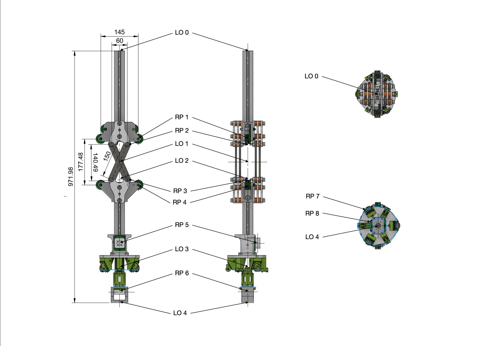

# Tensegrity Manipulator

[← Back to resources](../README.md) · [Project root](../../README.md)

## Mesh Pipeline

The simulation-ready USD files are built from the original Fusion 360 CAD
model through the following pipeline:

1. **Fusion 360** — original CAD assembly exported as FBX.
2. **Blender** — FBX imported; separate parts joined into the correct
   per-link objects; meshes cleaned up and link origins fixed to match the
   kinematic chain; low-resolution (decimated) versions of each visual mesh
   created; custom convex-hull collision meshes hand-crafted per link; all
   materials preserved.  Exported as a single USDC:
   `res/Tensegrity/meshes/tensegrity_arm_cad.usdc`.
3. **`tools/build_tensegrity_arm_usd.py`** — reads the Blender USDC and
   produces physics-ready articulation USDs for Isaac Lab (one per variant).

---

## Robot Structure

The tensegrity manipulator is a ceiling-mounted robotic arm driven by steel
cables (tendons).  The full 5-DOF system consists of a **2-DOF linear base**,
a **3-DOF tendon-driven arm**, and a **Robotiq 2F-140 parallel gripper**.

### Kinematic Chain

```
[Ceiling Frame]
    │
    ├── frame_base_y  (fixed mounting)
    │
    ├── base_y_joint  ─── prismatic, Y axis
    │       │
    │       └── base_z_joint  ─── prismatic, Z axis
    │               │
    │               └── [3-DOF Arm]
    │                       │
    │                       ├── root_link  (upper arm — fixed to base)
    │                       │
    │                       ├── elbow_joint  ─── revolute, X axis
    │                       │       │
    │                       │       └── forearm_link  (elbow disc + forearm tube)
    │                       │
    │                       ├── wrist_x_joint  ─── revolute, X axis
    │                       │       │
    │                       │       └── wrist_intermediate_link  (kinematic frame)
    │                       │
    │                       ├── wrist_y_joint  ─── revolute, Y axis
    │                       │       │
    │                       │       └── wrist_link  (lower wrist + IMU housing)
    │                       │
    │                       └── tool_joint  ─── fixed
    │                               │
    │                               └── tool_link  (TCP)
    │
    └── [Robotiq 2F-140 Gripper]  (mounted at tool_link)
            │
            ├── finger_joint  ─── active drive
            ├── right_outer_knuckle_joint  ─── passive mimic
            ├── left/right_outer_finger_joint  ─── passive mimic
            ├── left/right_inner_finger_joint  ─── passive mimic
            └── left/right_inner_finger_pad_joint  ─── passive mimic
```

### Links and Masses

| Link | Visual meshes | Mass (kg) | Description |
|------|---------------|-----------|-------------|
| `root_link` | `upper_arm` (full / low-res) | 2.000 | Upper arm bracket, fixed to base |
| `forearm_link` | `elbow_approx` + `forearm` (full / low-res) | 2.092 | Elbow disc + rigid forearm tube |
| `wrist_intermediate_link` | — (no visual) | 0.001 | Kinematic frame for 2-DOF wrist decomposition |
| `wrist_link` | `lower_wrist_imu` (full / low-res) | 0.400 | Lower wrist platform + IMU housing |
| `tool_link` | — (no visual) | 0.001 | Tool centre point (TCP) |

Total arm mass (excluding base and gripper): ≈ **4.49 kg**

> **Dummy links** (`wrist_intermediate_link`, `tool_link`): set to 0.001 kg
> with explicit diagonal inertia (1 × 10⁻⁶ kg·m²) to prevent PhysX
> solver crashes on zero-mass rigid bodies.

### Joint Specifications (3-DOF Arm)

| Joint | Type | Axis | Lower limit | Upper limit |
|-------|------|------|-------------|-------------|
| `elbow_joint` | Revolute | X | −1.50 rad (−86°) | +1.50 rad (+86°) |
| `wrist_x_joint` | Revolute | X | −0.80 rad (−46°) | +0.80 rad (+46°) |
| `wrist_y_joint` | Revolute | Y | −0.80 rad (−46°) | +0.80 rad (+46°) |
| `tool_joint` | Fixed | — | — | — |

USD drive properties (stiffness, damping, maxForce) are **zeroed** in the
generated USD.  Isaac Lab's `ImplicitActuatorCfg` overrides them at runtime
(see [Actuation Modes](#actuation-modes)).

### Key Dimensions

| Measurement | Value | Source |
|-------------|-------|--------|
| Root to elbow joint | 430 mm | build script `elbow_joint` world_z = −0.430 |
| Root to forearm mesh origin | 497.5 mm | build script forearm world_z = −0.4975 |
| Root to wrist joints | 836 mm | build script wrist world_z = −0.836 |
| Wrist to tool link | 136 mm | build script `tool_link` world_z = −0.972 |
| Total arm length (root → TCP) | 972 mm | build script `tool_link` world_z = −0.972 |
| Upper arm width | 145 mm | CAD drawing |
| Base Y travel | 1.0 m | USD: −0.5 to +0.5 m |
| Base Z travel | 0.5 m | USD: −0.5 to 0.0 m |
| Elbow tendon lever arm | ±72.5 mm | Tendon attachment y = ±0.0725 m |
| Wrist tendon circle radius (upper) | 25 mm | CAD RP 7, r = 0.025 m |
| Wrist tendon circle radius (lower) | 72.5 mm | CAD RP 8, r = 0.0725 m |

### CAD Reference Points

The following reference points and link origins are measured from the
Fusion 360 CAD model (Z-down from ceiling mount).
See [`tensegrity_cad_reference_points.png`](tensegrity_cad_reference_points.png)
for the annotated diagram.



#### Link Origins (LO)

All link origins lie on the Z-axis and match joint positioning.

| # | Description | Position (x, y, z) in m |
|---|-------------|-------------------------|
| 0 | Root Link | (0.0, 0.0, 0.0) |
| 1 | Elbow Approximation Link + Joint | (0.0, 0.0, −0.43) |
| 2 | Forearm Link | (0.0, 0.0, −0.4975) |
| 3 | Wrist Link + Joints | (0.0, 0.0, −0.836) |
| 4 | Tool Link | (0.0, 0.0, −0.972) |

#### Reference Points (RP)

Tendon and rod attachment points are symmetric along the ZX-plane.

| # | Description | Measurements (in m) | Notes |
|---|-------------|---------------------|-------|
| 1 | Tendon Attachment Upper Arm | (0.0, 0.0725, −0.34) | Symmetric along ZX-plane |
| 2 | Rod Attachment Upper Arm | (0.0, 0.03, −0.36) | Symmetric along ZX-plane |
| 3 | Rod Attachment Forearm | (0.0, 0.03, −0.4975) | |
| 4 | Tendon Attachment Forearm | (0.0, 0.0725, −0.5175) | |
| 5 | IMU Center Forearm | (0.03735, 0.0, −0.7422) | |
| 6 | IMU Center Tool Link | (0.0, 0.0, −0.93) | |
| 7 | Tendon Attachment Upper Wrist | centre (0.0, 0.0, −0.845), r = 0.025 | 3 tendons on circle, 120° spacing |
| 8 | Tendon Attachment Lower Wrist | centre (0.0, 0.0, −0.912), r = 0.0725 | 3 tendons on circle, 120° spacing |

### IMU Frames

Two IMU sensor frames are generated by the build script as guide-purpose
Xforms under their parent links.

| Frame | Parent link | Local position (m) | Local rotation (w, x, y, z) |
|-------|-------------|--------------------|-----------------------------|
| `imu_forearm_frame` | `forearm_link` | (0.03735, 0.0, −0.3122) | (0.707, 0.0, 0.707, 0.0) — 90° Y |
| `imu_wrist_frame` | `wrist_link` | (0.0, 0.0, −0.094) | (1.0, 0.0, 0.0, 0.0) — identity |

### Gripper Offsets (Robotiq 2F-140)

Measured from the `tool_link` frame.  Local +Z points downward in world frame
(ceiling mount).

- Finger base: local z = 0.150 (open) to 0.170 (closed)
- Finger tip: local z = 0.215 (open) to 0.235 (closed)
- Pad centre: local z = 0.1825 (open) to 0.2025 (closed) → average 0.1925 = `GRASP_CENTER_LOCAL_Z`

### Tendon Arrangement

The 3-DOF arm is actuated by **5 steel cables** routed from motors on the base
frame through the arm structure:

| Tendon | Xacro frame | Attachment point (m) | Joint | Direction |
|--------|-------------|----------------------|-------|-----------|
| T₀ | Force1 | forearm (+0.0725, 0, 0.1) | elbow | positive |
| T₁ | Force2 | forearm (−0.0725, 0, 0.1) | elbow | negative |
| T₂ | Force3 | end-effector (+0.008, +0.013856, 0.0697) | wrist 0° | — |
| T₃ | Force4 | end-effector (−0.016, 0, 0.0697) | wrist 120° | — |
| T₄ | Force5 | end-effector (+0.008, −0.013856, 0.0697) | wrist 240° | — |

* **Elbow:** 2 antagonistic tendons pulling in opposite directions.
* **Wrist:** 3 tendons at 120° intervals on a circle of radius ≈ 16 mm,
  providing 2-DOF control (wrist_x and wrist_y).

The torque mapping at zero configuration is:

$$
\boldsymbol{\tau} = J^T \cdot \mathbf{T}, \quad
J^T = \begin{bmatrix}
+0.0725 & -0.0725 & 0 & 0 & 0 \\
0 & 0 & -0.013856 & 0 & +0.013856 \\
0 & 0 & +0.008 & -0.016 & +0.008
\end{bmatrix}
$$

Row order: (elbow, wrist_y, wrist_x).

---

## Actuation Modes

The robot is available in two actuation modes within Isaac Lab.

### PD-Driven (Position Control)

Uses Isaac Sim's built-in **ImplicitActuator** PD drives on all joints.
The RL agent outputs desired joint positions; the PhysX PD controller
tracks them.

| Actuator group | Joints | Stiffness | Damping | Effort limit | Velocity limit |
|----------------|--------|-----------|---------|--------------|----------------|
| `base_y` | base_y_joint | 8000 | 800 | 300 N | 5.0 m/s |
| `base_z` | base_z_joint | 8000 | 800 | 200 N | 5.0 m/s |
| `elbow` | elbow_joint | 400 | 20 | 40 N·m | 1.0 rad/s |
| `wrist` | wrist_x_joint, wrist_y_joint | 400 | 20 | 10 N·m | 0.5 rad/s |
| `gripper_drive` | finger_joint | 11.25 | 0.1 | 10 N·m | 1.0 rad/s |
| `gripper_finger` | inner_finger joints (L/R) | 10 | 0.05 | 10 N·m | 10.0 rad/s |
| `gripper_passive` | passive linkage joints | 0 | 0 | 1 N·m | 1.0 rad/s |

**Configs:** `TENS_3DOF_CFG`, `TENS_3DOF_LO_CFG`, `TENS_5DOF_GRIPPER_CFG`,
`TENS_5DOF_GRIPPER_LO_CFG`

### Tendon-Driven (Effort Control)

Replaces the arm's PD actuator with an **IdealPDActuator** (stiffness = 0,
damping = 0) that acts as a pure effort passthrough.  A custom
`TendonEffortAction` converts 5 tendon tensions into 3 joint torques via the
Jacobian transpose.

| Actuator group | Joints | Type | Stiffness | Damping | Effort limit | Velocity limit |
|----------------|--------|------|-----------|---------|--------------|----------------|
| `base_y` | base_y_joint | ImplicitActuator (PD) | 8000 | 800 | 300 N | 5.0 m/s |
| `base_z` | base_z_joint | ImplicitActuator (PD) | 8000 | 800 | 200 N | 5.0 m/s |
| `elbow` | elbow_joint | IdealPDActuator (passthrough) | 0 | 0 | 40 N·m | 1.0 rad/s |
| `wrist` | wrist_x_joint, wrist_y_joint | IdealPDActuator (passthrough) | 0 | 0 | 10 N·m | 0.5 rad/s |
| `gripper_drive` | finger_joint | ImplicitActuator (PD) | 11.25 | 0.1 | 10 N·m | 1.0 rad/s |

The RL agent outputs 5 raw actions in [−1, 1] which are affine-mapped to
non-negative tensions in [0, max_tension].

**Configs:** `TENS_3DOF_TENDON_CFG`, `TENS_5DOF_GRIPPER_TENDON_CFG`

### Physical Tendon-Driven (Body-Force Elbow + J^T Wrist)

A variant of the tendon-driven mode that uses the four-bar antiparallelogram
linkage USD.  Elbow tendons apply forces at physical attachment points on
`root_link` and `forearm_link` (configuration-dependent torque mapping).
Wrist tendons use the same constant J^T as above.

The RL agent outputs 5 raw actions, same as the elbow_approx tendon mode.

**Configs:** `TENS_3DOF_PHYSICAL_TENDON_CFG`, `TENS_3DOF_PHYSICAL_TENDON_LO_CFG`,
`TENS_5DOF_GRIPPER_PHYSICAL_TENDON_CFG`, `TENS_5DOF_GRIPPER_PHYSICAL_TENDON_LO_CFG`

See [`doc/tendon_simulation.md`](../../doc/tendon_simulation.md) for the full
tendon simulation documentation, data flow, and validation methodology.

---

## Building the USD

The 3-DOF arm USD files are generated by
[`tools/build_tensegrity_arm_usd.py`](../../tools/build_tensegrity_arm_usd.py)
from the Blender-exported source mesh.

**Source mesh:** `res/Tensegrity/meshes/tensegrity_arm_cad.usdc`
**Output:** `res/Tensegrity/threedof_arm/tensegrity_threedof_arm_<variant>.usd`

### What the Script Configures

- **ArticulationRootAPI** on `/tensegrity_arm` with self-collision disabled,
  16 solver position iterations, 4 velocity iterations.
- **RigidBodyAPI + MassAPI** on every link.  Dummy links get explicit
  diagonal inertia (1 × 10⁻⁶ kg·m²) to prevent PhysX zero-mass crashes.
- **CollisionAPI + MeshCollisionAPI** on all collision meshes
  (convex-hull approximation, `purpose = guide`).
- **Zeroed PhysX drives** — stiffness, damping, and maxForce all set to 0.
  Isaac Lab `ImplicitActuatorCfg` overrides at runtime.
- **Material transfer** from Blender source, with fallback grey material.
- **IMU frame Xforms** under parent links (guide purpose).
- **Robot Schema metadata** (IsaacRobotAPI, IsaacLinkAPI, IsaacJointAPI)
  for compatibility with Robot Assembler and Gain Tuner.
- **Fixed `root_joint`** (body0 = world, body1 = root_link) — set
  `fix_root_link = None` in Isaac Lab to avoid a duplicate fixed joint.

### Quick Start

```bash
# Conda must NOT be active
conda deactivate
~/Isaac/IsaacSim/python.sh tools/build_tensegrity_arm_usd.py
```

### CLI Arguments

| Argument | Default | Description |
|----------|---------|-------------|
| `--variant`, `-v` | `elbow_approx` | Variant to build (`elbow_approx`, `elbow_approx_lo`) |
| `--src` | `res/Tensegrity/meshes/tensegrity_arm_cad.usdc` | Path to Blender source USDC |
| `--out-dir` | `res/Tensegrity/threedof_arm` | Output directory |

See [`tools/README.md`](../../tools/README.md) for full options and
troubleshooting (including the conda / pxr setup).

### USD Variants

| Variant | Filename | Visual meshes | Collision meshes | Status |
|---------|----------|---------------|------------------|--------|
| `elbow_approx` | `tensegrity_threedof_arm_elbow_approx.usd` | Full-resolution | Custom convex hulls | **Available** (default) |
| `elbow_approx_lo` | `tensegrity_threedof_arm_elbow_approx_lo.usd` | Low-resolution (decimated) | Same convex hulls | **Available** |
| `physical` | `tensegrity_threedof_arm_physical.usd` | Full-res + linkage rods | Custom convex hulls | **Available** |
| `physical_lo` | `tensegrity_threedof_arm_physical_lo.usd` | Low-res + linkage rods | Same convex hulls | **Available** |

`elbow_approx` variants use a cylinder mesh for the elbow disc.
`physical` variants replace the cylinder with an antiparallelogram four-bar
linkage with three additional revolute joints (`rod_left_joint`,
`rod_right_joint`, `coupler_left_joint`).  Low-res variants share collision
geometry with their full-res counterparts — only visual meshes are decimated.

### Assembled USD Files

The 5-DOF manipulator USDs are created via Isaac Sim **Robot Assembler** by
combining the 3-DOF arm, the 2-DOF linear base, and (optionally) the gripper:

| File | Contents |
|------|----------|
| `fivedof_manipulator/fivedof_linear_base_elbow_approx.usd` | Linear base + 3-DOF arm (elbow_approx) |
| `fivedof_manipulator/fivedof_linear_base_elbow_approx_robotiq2f140.usd` | Linear base + 3-DOF arm + Robotiq 2F-140 |
| `fivedof_manipulator/fivedof_linear_base_physical.usd` | Linear base + 3-DOF physical arm (linkage) |
| `fivedof_manipulator/fivedof_linear_base_physical_robotiq2f140.usd` | Linear base + physical arm + Robotiq 2F-140 |

After building a new 3-DOF arm variant, re-assemble the 5-DOF USDs and
update the paths in `tensegrity_robot_cfg.py`.

---

## Related

- [Tendon simulation docs](../../doc/tendon_simulation.md) — physics model, software architecture, validation
- [Reach task](../../src/tensegrity_pick/source/tensegrity_pick/tensegrity_pick/tasks/manager_based/reach/README.md) — EE pose tracking
- [Cube Place task](../../src/tensegrity_pick/source/tensegrity_pick/tensegrity_pick/tasks/manager_based/cube_place/README.md) — cube pick-and-place
- [Source code](../../src/tensegrity_pick/README.md) — Isaac Lab extension, robot configs
