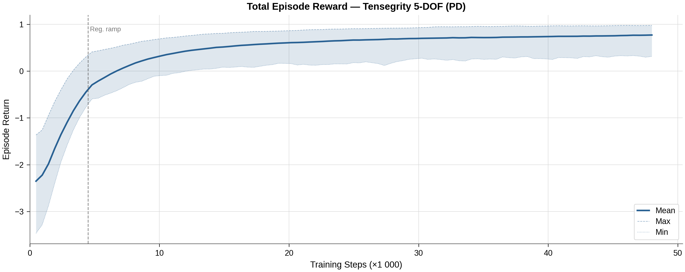
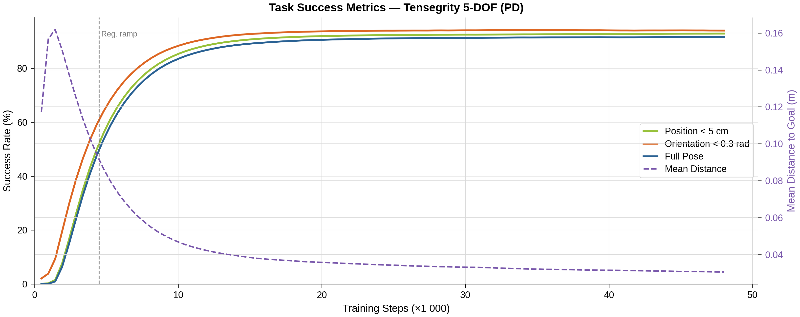
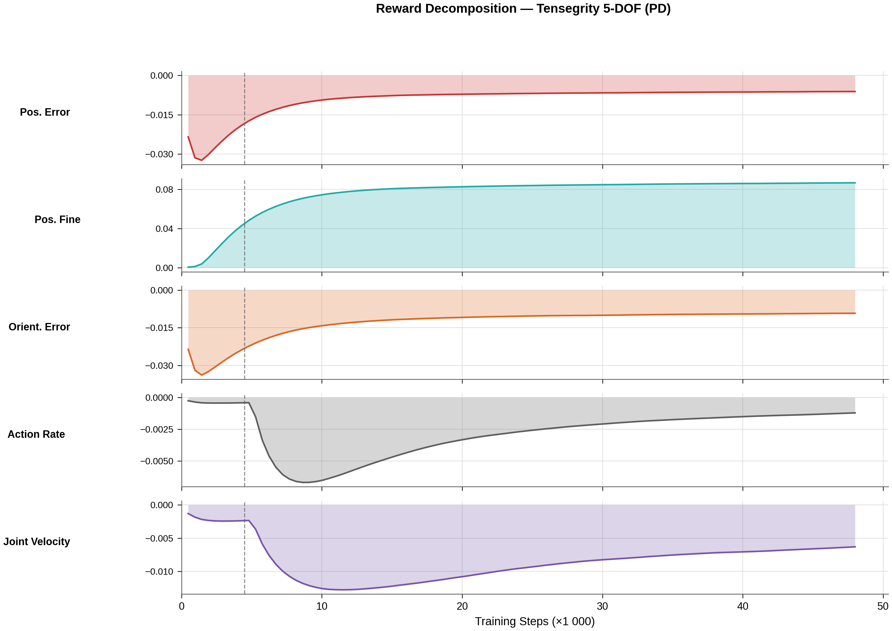
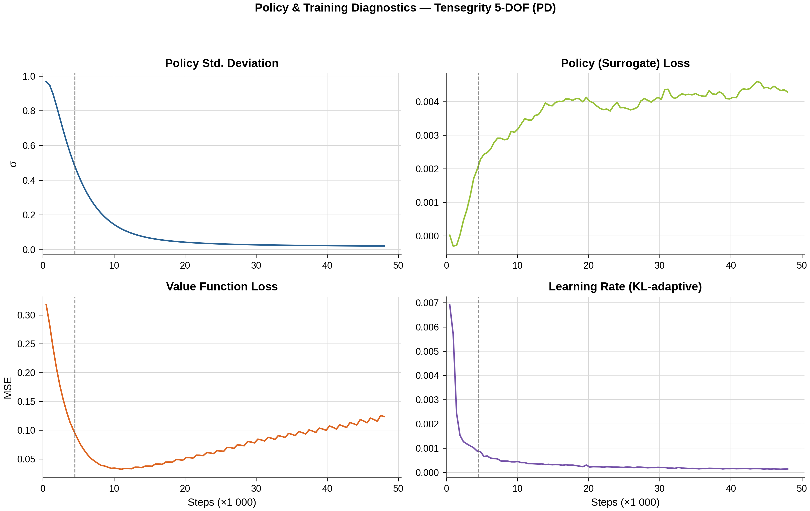
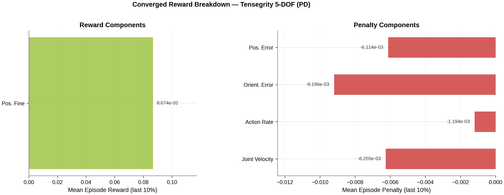
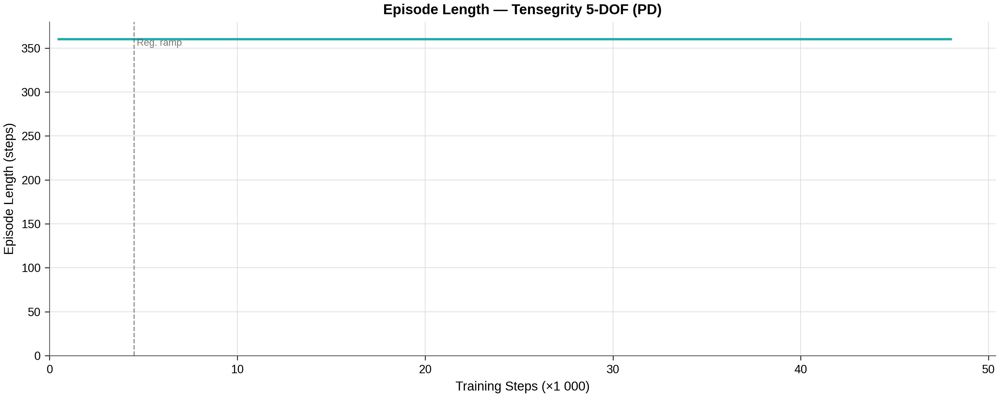

# Reach Results Report

## Run Metadata

| Field | Value |
|---|---|
| Variant | `tensegrity` |
| Run ID | `2026-04-06_17-53-45_ppo_torch` |

## Converged Metrics (last 10% of training)

| Metric | Value |
|---|---|
| Total episode reward (mean) | 0.7739 |
| Position tracking reward | -0.0061 |
| Orientation tracking reward | -0.0092 |
| Position fine-grained reward | 0.086736 |
| Position reached (< 5cm) | 0.0000 |
| Orientation reached (< 0.3 rad) | 0.0000 |
| Pose reached (both) | 0.0000 |
| Action rate penalty | -0.001194 |
| Joint velocity penalty | -0.006255 |
| Policy std deviation | 0.0206 |
| Learning rate (final) | 1.40e-04 |

## Figures

### Total Reward

### Task Success

### Reward Decomposition

### Policy Diagnostics

### Converged Breakdown

### Episode Length

