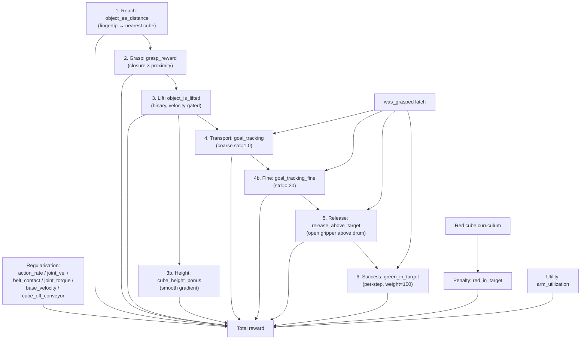
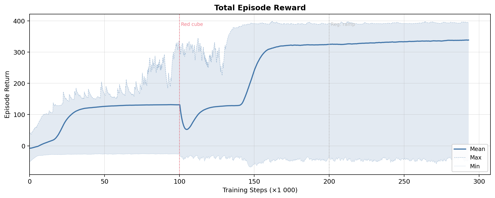
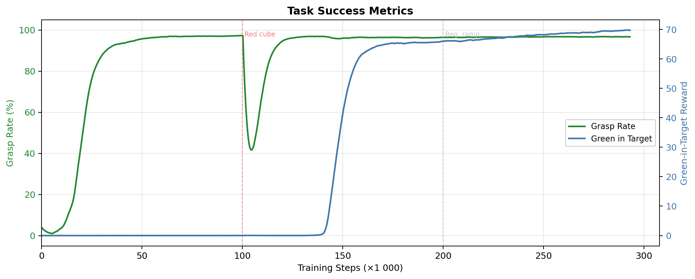
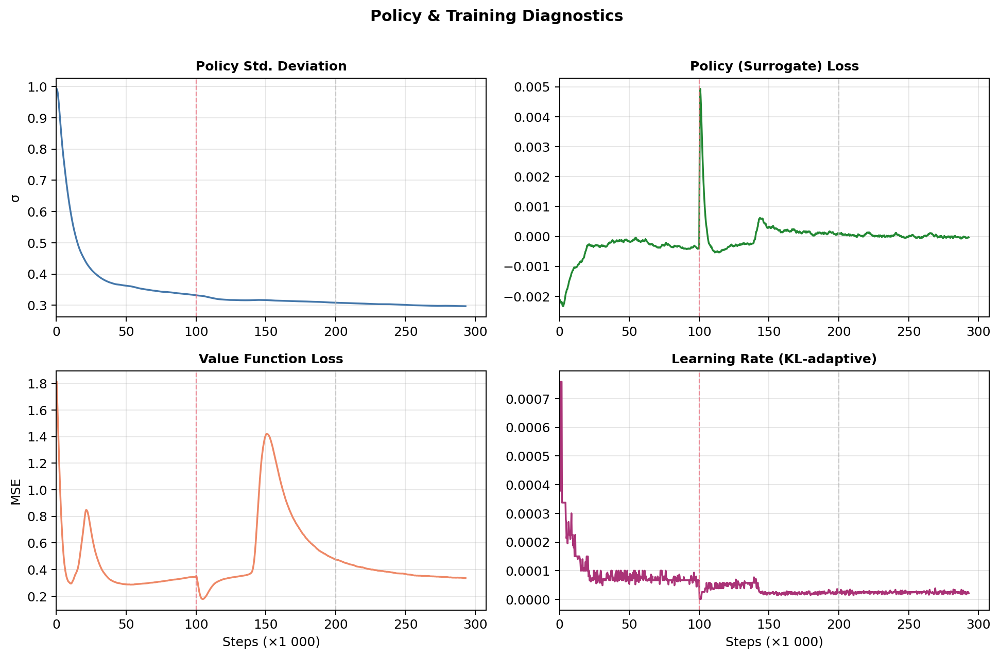
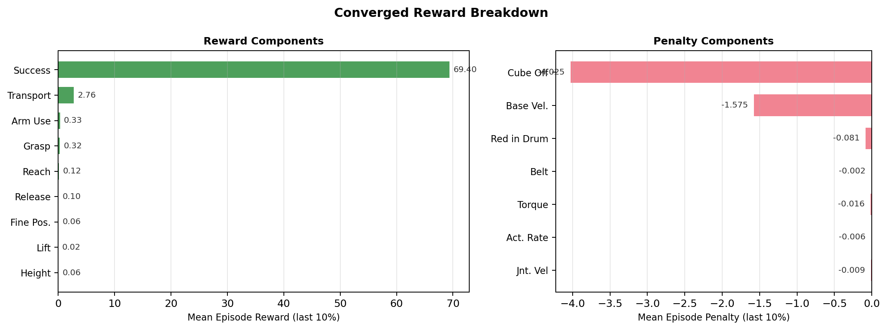

# Cube Place Task

[← Back to extension overview](../../../../../../README.md) · [Project root](../../../../../../../../README.md)

Cube pick-and-place with the 5-DOF tensegrity manipulator and Robotiq 2F
gripper.  The robot must grasp a green cube from the conveyor belt, transport
it to a target drum, and release it inside — while avoiding the red distractor
cube that is introduced mid-training via curriculum.


## Table of Contents

- [Goal](#goal)
- [Variants](#variants)
- [Scene](#scene)
- [Controlled Joints](#controlled-joints)
- [Actions](#actions)
- [Observations (policy group)](#observations-policy-group)
- [Rewards](#rewards)
- [Terminations](#terminations)
- [Curriculum](#curriculum)
- [Reset Events](#reset-events)
- [Simulation Parameters](#simulation-parameters)
- [Training](#training)
- [Design Decisions & Lessons Learned](#design-decisions--lessons-learned)
- [Running](#running)
- [Training Results](#training-results)
- [Related](#related)

## Goal

Train an RL agent to perform a full pick → transport → place sequence:

1. **Reach** the nearest cube on the conveyor belt.
2. **Grasp** it with the Robotiq 2F gripper (closure × proximity reward).
3. **Lift** it above the belt surface (velocity-gated to reject bounces).
4. **Transport** it laterally toward the target drum.
5. **Release** the cube above the drum opening.
6. **Success** accumulates per-step reward while the cube rests in the drum.

Success is defined as the green cube's centre being inside the cylindrical
drum volume (radius = 0.2735 m, height = 0.30 m).  Episodes run the full
5 s duration without early success termination — the per-step success reward
(weight=100) accumulates over remaining steps and dominates holding rewards.

## Variants

| Environment ID | Actuation | Description |
|---|---|---|
| `Template-Tensegrity-Cube-Place-v0` | PD (joint position) | Standard training (8 192 envs) |
| `Template-Tensegrity-Cube-Place-Play-v0` | PD (joint position) | Evaluation (50 envs, red always active) |
| `Template-Tensegrity-Cube-Place-Tendon-v0` | Tendon tensions | Tendon-driven training (4 096 envs) |
| `Template-Tensegrity-Cube-Place-Tendon-Play-v0` | Tendon tensions | Tendon-driven evaluation (50 envs) |

All variants use `TensegrityPlaceEnv` as the gymnasium entry point
(custom `ManagerBasedRLEnv` subclass with physics-based grasp latch).

## Scene

Extends `ProjBaseSceneCfg` with two rigid-body cubes.

| Element | Details |
|---|---|
| Robot | `TENS_5DOF_GRIPPER_CFG` at (0.15, 0.0, 2.30) m |
| Green cube | 0.05 m side, 0.05 kg, spawned in spawn box |
| Red cube | 0.05 m side, 0.05 kg, parked until curriculum activates it |
| Target drum | Plastic drum at (0.15, 0.85, 0.0) m (0.547 m diameter, 0.88 m tall) |
| Conveyor | Dual belt (4 m total), surface at 0.80 m, **inactive** (no motion) |
| Env spacing | 5.0 m |

### Cube Spawn Randomisation (at reset)

| Axis | Range |
|---|---|
| X | 0.10 … 0.20 m (relative to env origin) |
| Y | −0.10 … +0.10 m |
| Z | belt + 0.03 … belt + 0.05 m (= 0.83 … 0.85 m) |

Only the green cube is placed in the spawn box initially.  The red cube is
parked at (100, 100, 1) and activated through curriculum after 100 000 steps.
In play mode the curriculum threshold is set to 0 so both cubes are always
visible.

### Drum Success Geometry

| Parameter | Value |
|---|---|
| Cylinder radius | 0.2735 m |
| Cylinder height | 0.30 m |
| Centre | drum root position |

## Controlled Joints

| Joint | Type | Limits | Action Clip |
|---|---|---|---|
| `base_y_joint` | Prismatic | ±0.5 m | (−0.5, 0.5) |
| `base_z_joint` | Prismatic | −0.5 … 0.0 m | (−0.5, 0.0) |
| `elbow_joint` | Revolute | ±1.5 rad | (−1.5, 1.5) |
| `wrist_y_joint` | Revolute | ±0.8 rad | (−0.8, 0.8) |
| `wrist_x_joint` | Revolute | ±0.8 rad | (−0.8, 0.8) |
| `finger_joint` | Revolute | — | Binary (open=0.0, close=0.7854) |

## Actions

### PD variant (6 dims)

| Group | Dims | Type | Scale |
|---|---|---|---|
| `base_delta` | 2 | Joint position delta | 0.50 |
| `arm_delta` | 3 | Joint position delta | 1.0 |
| `gripper_action` | 1 | Binary joint position | open=0.0, close=0.7854 |

### Tendon variant (8 dims)

| Group | Dims | Type | Details |
|---|---|---|---|
| `base_delta` | 2 | Joint position delta | scale=0.50 |
| `arm_tendon` | 5 | Tendon tensions | max_tension=500 N |
| `gripper_action` | 1 | Binary joint position | open=0.0, close=0.7854 |

## Observations (policy group)

| Term | Dim | Description |
|---|---|---|
| `joint_pos_rel` | 6 | Relative joint positions (controlled joints incl. finger) |
| `joint_vel_rel` | 6 | Relative joint velocities |
| `ee_pos_w` | 3 | Grasp-centre world position |
| `ee_vel_w` | 3 | Grasp-centre linear velocity |
| `green_rel` | 3 | Green cube position relative to grasp centre |
| `red_rel` | 3 | Red cube position relative to grasp centre (zeros when parked) |
| `fingertip_green_rel` | 3 | Dynamic fingertip → green cube (closure-dependent) |
| `fingertip_red_rel` | 3 | Dynamic fingertip → red cube (closure-dependent) |
| `gripper_closure` | 1 | Normalised finger closure [0=open, 1=closed] |
| `gripper_torque` | 1 | Normalised finger torque [0=free, 1=at effort limit] |
| `green_cube_vel` | 3 | Green cube linear velocity |
| `red_cube_vel` | 3 | Red cube linear velocity |
| `drum_rel` | 3 | Drum position relative to grasp centre |
| `actions` | 6 or 8 | Previous actions |

Total (PD): **47**.  Total (tendon): **49**.

## Rewards

### Reward pipeline



### Task rewards

| Term | Weight | Function | Gate |
|---|---|---|---|
| `reaching_object` | +1.0 | `1 − tanh(d_fingertip→nearest / 0.1)` | — |
| `grasping` | +5.0 | `closure × (1 − tanh(d / 0.08))` | — |
| `lifting_object` | +8.0 | Binary: cube > belt+0.06, near gripper, closed, velocity < 1 m/s | — |
| `height_bonus` | +8.0 | Smooth: `min(Δz, 0.30) / 0.30`, velocity < 1 m/s | — |
| `goal_tracking` | +50.0 | `1 − tanh(d_xy_green→drum / 1.0)`, lift_threshold=0.02 | `was_grasped` |
| `goal_tracking_fine` | +5.0 | `1 − tanh(d_xy_green→drum / 0.20)`, lift_threshold=0.02 | `was_grasped` |
| `release` | +10.0 | `(1−closure) × in_xy × above_rim` | `was_grasped` |
| `green_in_target` | +100.0 | Green cube inside drum cylinder | `was_grasped` |
| `red_in_target` | −12.0 | Red cube inside drum (penalty) | red active |

### Regularisation & utility

| Term | Weight | Notes |
|---|---|---|
| `action_rate` | −1×10⁻⁴ → −2×10⁻³ | Ramped by curriculum at 200k steps |
| `joint_vel` | −1×10⁻⁴ → −2×10⁻³ | Ramped by curriculum at 200k steps |
| `belt_contact` | −10.0 | EE depth below belt surface |
| `joint_torque` | −0.05 | Arm joint effort fraction |
| `base_velocity` | −1.5 | Prefer arm over base movement |
| `arm_utilization` | +1.5 | Reward arm joint activity |
| `cube_off_conveyor` | −5.0 | Cubes outside belt Y∈[−0.4, 0.4] or below z=0.70 |

### Metrics (tiny weight, for TensorBoard)

| Term | Weight | Tracks |
|---|---|---|
| `metric_place_success` | +0.01 | Binary success rate |
| `metric_grasp_rate` | +0.01 | Green cube grasped and lifted |
| `metric_ee_distance` | −0.01 | EE-to-green L2 distance |

## Terminations

No early success termination — episodes always run the full 5 s.

| Term | Type | Condition |
|---|---|---|
| `time_out` | Truncation | Episode length exceeded (5.0 s / 250 steps) |
| `joint_vel_diverged` | Truncation | Any controlled joint velocity > 100 rad/s |
| `belt_collision` | Truncation | EE penetrates > 0.20 m below belt surface |

## Curriculum

| Step Threshold | Change |
|---|---|
| 100 000 | Red cube activated (moved from parking to spawn box) |
| 200 000 | `action_rate` weight: −1×10⁻⁴ → −2×10⁻³ |
| 200 000 | `joint_vel` weight: −1×10⁻⁴ → −2×10⁻³ |

## Reset Events

| Event | Details |
|---|---|
| `reset_all` | Full scene reset to defaults |
| `reset_arm` | Base + arm joints offset by ±0.10 rad; velocities zeroed |
| `reset_gripper` | `finger_joint` reset to 0.0 (fully open) |
| `reset_cubes` | Green cube randomised in spawn box; red parked or in spawn box (after curriculum) |

## Simulation Parameters

| Parameter | Value |
|---|---|
| Physics dt | 0.01 s (100 Hz) |
| Decimation | 2 (control at 50 Hz) |
| Episode length | 5.0 s (250 control steps) |
| PhysX solver | TGS (type 1) |
| Bounce threshold | 0.2 m/s |
| Stabilisation | Enabled |
| Friction correlation distance | 0.00625 m |
| Default num_envs | 8 192 (PD) / 4 096 (tendon) / 50 (play) |

## Training

Training converges at approximately 200–250k steps (PPO via SKRL with 8 192
parallel environments).  The `skrl_ppo_cfg.yaml` is configured for 300 000
timesteps.

## Design Decisions & Lessons Learned

### No early success termination

With success termination, the robot gets one step of `green_in_target` reward
(100 × 0.02 = 2.0) before the episode ends.  Meanwhile, holding the cube above
the drum yields ~0.8/step × remaining steps ≈ 80+ total.  **Holding dominates
release, so the robot never drops the cube.**  Removing success termination lets
the per-step success reward accumulate (2.0/step × 79 remaining ≈ 158), making
release clearly optimal.

### Transport must dominate lift + height

If lift (8) + height (8) yields more per-step reward than transport (50 × tanh),
the agent learns to hold the cube high instead of moving toward the drum.  The
transport weight must be large enough that lateral progress is always more
valuable than vertical hold.  A low lift threshold (belt + 0.02 m) keeps the
transport reward active even when the cube dips during arm extension.

### Velocity gate rejects bounces

Without velocity gating, the robot discovers an exploit: push the cube into the
belt to bounce it upward, then catch it mid-air.  The bounce satisfies
lift + height + proximity gates instantaneously.  Adding `max_velocity=1.0`
to lift and height rewards filters out bounced cubes (velocity > 1 m/s at
bounce peak) while passing genuine controlled lifts.

### Dynamic fingertip for reach reward

Using the fixed grasp-centre offset for the reach reward incentivises lateral
approach (the offset is between the finger pads at a fixed height).  Switching
to `_dynamic_finger_tip_w` — which interpolates between open-tip and closed-tip
positions based on actual gripper closure — naturally produces a top-down
approach since the open fingertips are closer to the cube from above.

### Multi-cube reach (nearest active cube)

The reach and grasp rewards target the nearest active cube rather than only the
green cube.  This ensures the agent learns to navigate around the red cube when
it appears, and the proximity gradient always pulls toward the closest object.

### Gripper torque as observation, not detection

Torque-based grasp detection was investigated but rejected: implicit actuator
torques have transient spikes during fast closure, no clean separation from
movement-induced dynamics, and Isaac Lab has no reference implementations.
Instead, `gripper_torque` is provided as an observation so the policy can learn
to correlate torque residual with grasp state, while reward gating uses the
more robust closure + proximity + lift combination.

### Red cube curriculum timing

Introducing the red distractor too early (e.g. 30k steps) causes a ~60% reward
crash that destabilises learning.  At 100k steps the green-only policy has
mastered reach→grasp→lift→transport→place and can absorb the distractor
gracefully.

### `was_grasped` latch sequencing

Isaac Lab resets terminated environments inside `super().step()` before
returning.  The `was_grasped` latch update must mask out terminated/timed-out
environments to prevent the latch from being spuriously re-set on freshly
reset states (where spawn geometry can satisfy the grasp detector).

## Running

```bash
cd src/tensegrity_pick

# PD-driven training
conda run --no-capture-output -n env_isaaclab python3 scripts/skrl/train.py \
    --task Template-Tensegrity-Cube-Place-v0 --headless

# Play latest checkpoint
conda run --no-capture-output -n env_isaaclab python3 scripts/skrl/play.py \
    --task Template-Tensegrity-Cube-Place-Play-v0 --num_envs 10

# Tendon-driven training
conda run --no-capture-output -n env_isaaclab python3 scripts/skrl/train.py \
    --task Template-Tensegrity-Cube-Place-Tendon-v0 --headless
```

## Training Results

Results from training run `2026-03-06_21-05-45` (PPO, 8 192 envs, 293k steps).
Plots generated with `scripts/plot_training_results.py`.

### Total Episode Reward

The total reward curve shows the complete learning trajectory.  The min/max
envelope reveals the spread across the environment population.  Two curriculum
events are marked: the red distractor cube introduction at 100k steps causes a
brief reward crash (~365 → ~55), and the regularisation ramp begins at 200k
steps.



### Task Success

Grasp rate (left axis) and green-in-target reward (right axis) track the two
key task milestones.  The agent learns to grasp within the first 10k steps and
achieves consistent placement around 150k steps.  The red cube introduction at
100k causes a temporary dip in both metrics as the agent adapts to the
distractor.



### Sequential Skill Acquisition

Each reward component activates in sequence, revealing the learning order:
reach → grasp → lift → transport → release → success.  The transport reward
(goal tracking) shows the largest magnitude, confirming the design goal that
lateral progress dominates holding.  The success reward (green in target)
rises steeply once the agent masters the full pipeline.


### Penalties & Regularisation

Penalty evolution over training.  The cube-off-conveyor penalty increases
sharply after the red cube is introduced (the agent's movements displace the
distractor).  Base velocity and belt contact penalties remain stable.  The
action rate and joint velocity penalties ramp up over the regularisation
curriculum from 200k steps onward, smoothing the policy's motor commands.


### Policy Diagnostics

Policy standard deviation, surrogate loss, value loss, and learning rate
(KL-adaptive) over training.  The standard deviation decreases monotonically,
indicating growing exploitation.  The value loss spikes briefly when the red
cube curriculum activates (new dynamics to model) then settles.  The adaptive
learning rate responds to KL-divergence, dropping when the policy changes too
rapidly.



### Converged Reward Breakdown

Final performance averaged over the last 10% of training.  The success reward
(green in target) dominates as intended, confirming that release-and-accumulate
is the optimal strategy.  The cube-off-conveyor penalty is the largest negative
component — a known consequence of manipulating cubes near the belt edge.



### Regenerating Plots

```bash
cd src/tensegrity_pick
conda run --no-capture-output -n env_isaaclab python3 scripts/plot_place_training_results.py
# Or specify a run:
conda run --no-capture-output -n env_isaaclab python3 scripts/plot_place_training_results.py \
    --run 2026-03-06_21-05-45_ppo_torch
```

## Related

- [GEOMETRY.md](GEOMETRY.md) — empirical gripper geometry measurements
- [Robot specification](../../../../../../../../res/Tensegrity/README.md) — kinematic chain, joint constraints, tendon geometry
- [Reach task](../tensegrity_reach/README.md) — EE pose tracking task
- [Extension overview](../../../../../../README.md) — all registered tasks and scripts
