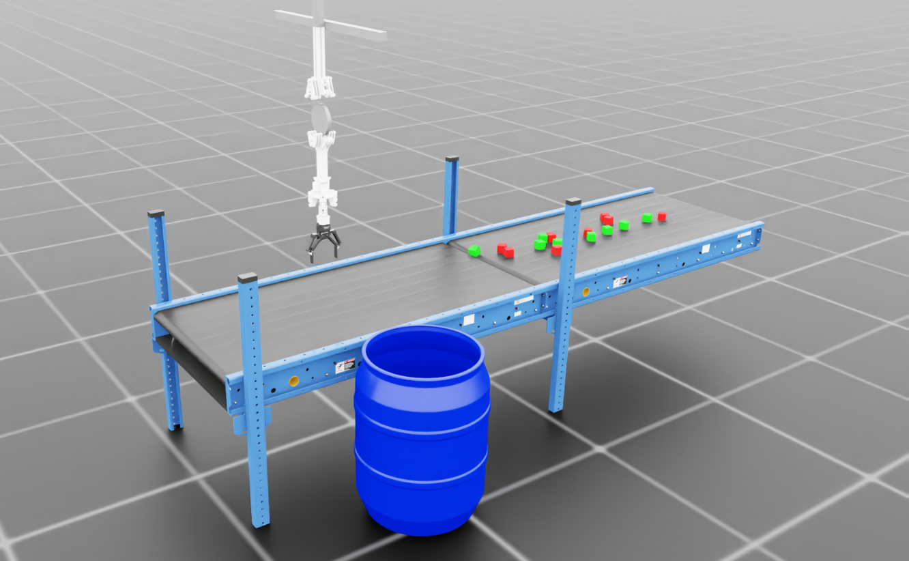
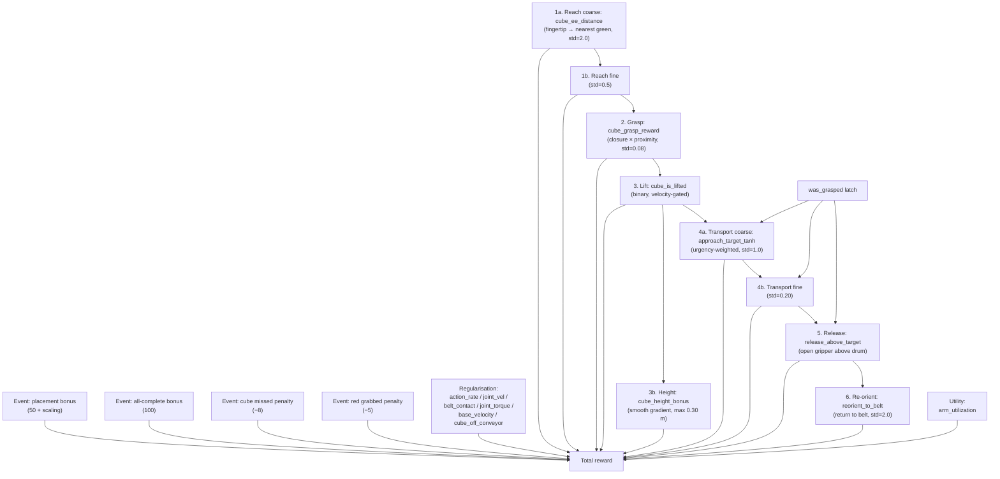
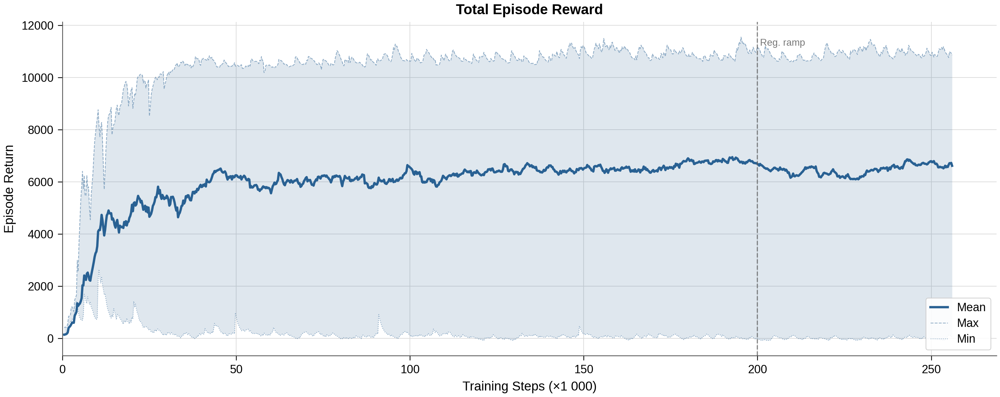
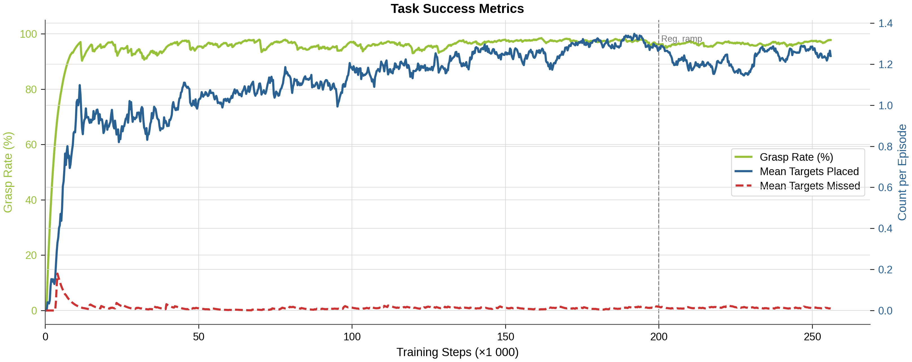
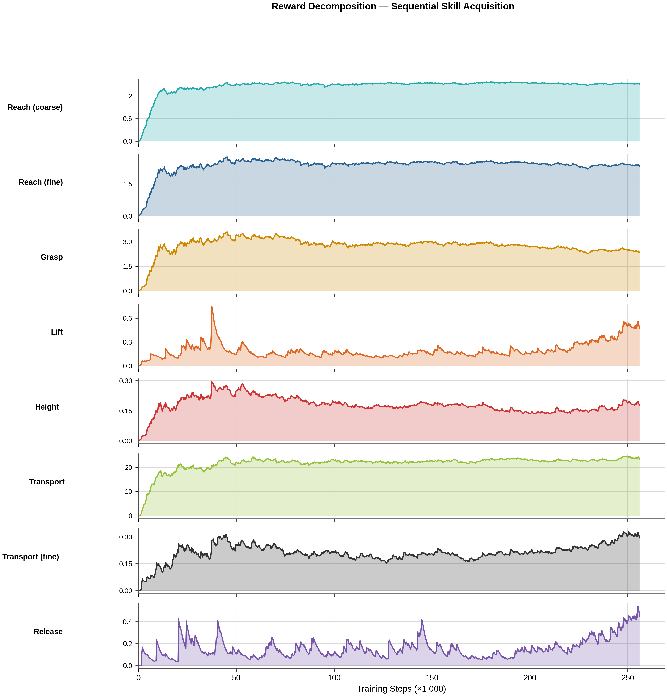
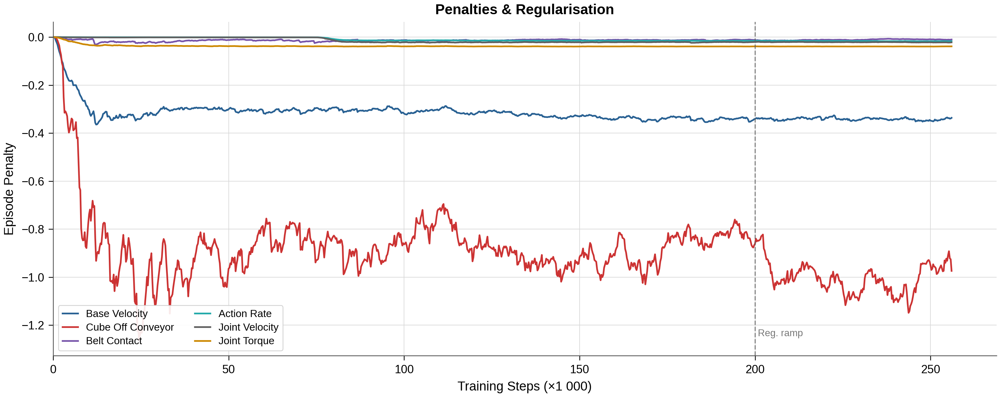
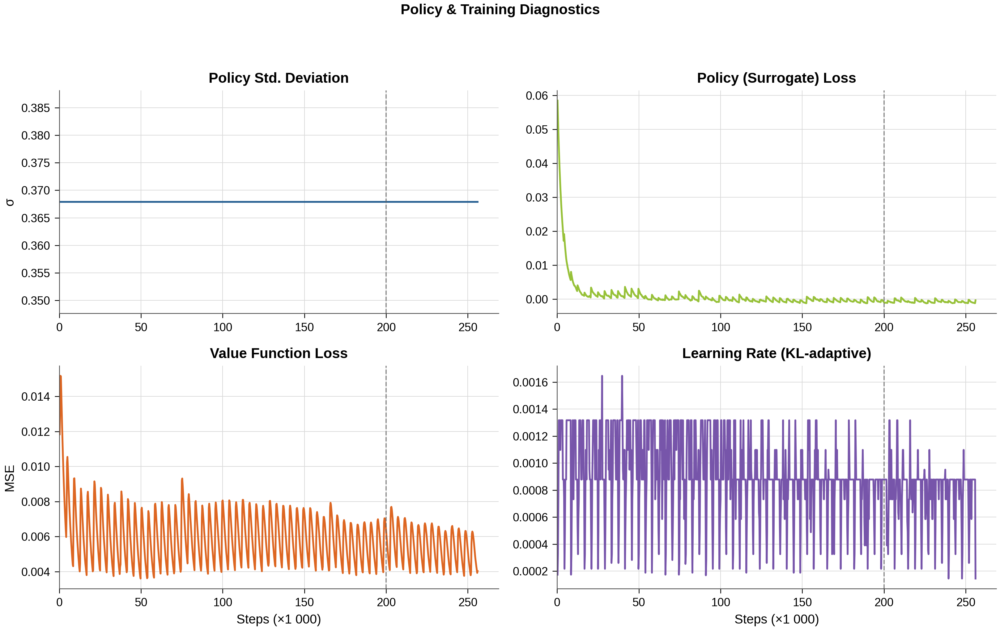
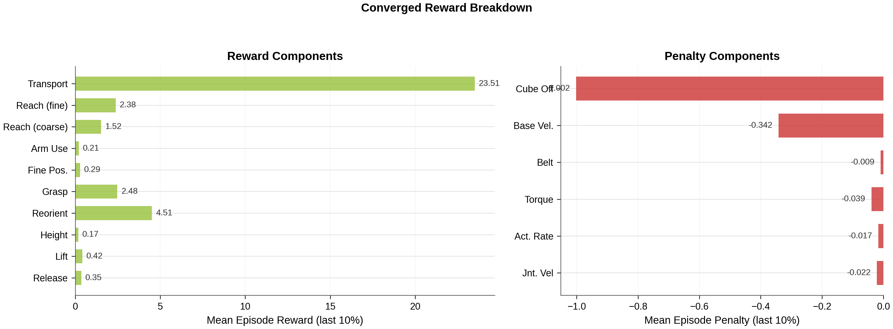

# Cube Sort Task

> **Rework in progress — Iteration 1 Complete (2G+1R), Iteration 2 Incomplete (4G+2R).**
> The prior Iterations 0–3 were invalidated by post-play assessment that revealed
> the robot was pushing cubes into the bin rather than grasping+lifting them.
> After fixing the conveyor stop mechanism and replacing the exploitable
> `cube_held` reward with a `1-tanh` reach/grasp shape, Iter 1 reached **peak 100%
> placement** on 2G+1R (both cubes in drum every episode at peak) with zero
> sorting errors. Iter 2 (4G+2R) plateaus at peak 26% placement — scaling from 2
> to 4 cubes needs further reward/observation changes. See [optimization tracking](../../../../../../../../doc/reports/cube_sort_optimization_tracking.md)
> for the full Iteration 2 plateau diagnosis and proposed next steps.

[← Back to extension overview](../../../../../../README.md) · [Project root](../../../../../../../../README.md)

Cube **sorting** with the 5-DOF tensegrity manipulator and Robotiq 2F gripper.
The robot must pick target (green) cubes from a **moving conveyor belt**,
transport them to a drum beside the belt, and place them inside — while ignoring
distractor (red) cubes.  Up to 16 labelled cubes (8 green + 8 red) are managed
as a `RigidObjectCollection`.



## Table of Contents

- [Goal](#goal)
- [Variants](#variants)
- [Scene](#scene)
- [Controlled Joints](#controlled-joints)
- [Actions (6 dims)](#actions-6-dims)
- [Observations (policy group)](#observations-policy-group)
- [Rewards](#rewards)
- [Terminations](#terminations)
- [Curriculum](#curriculum)
- [Reset Events](#reset-events)
- [Simulation Parameters](#simulation-parameters)
- [Training](#training)
- [Design Decisions & Lessons Learned](#design-decisions--lessons-learned)
- [Running](#running)
- [Training Results](#training-results)
- [Related](#related)

## Goal

Train an RL agent to sort cubes from a moving conveyor into a target drum:

1. **Reach** the nearest green (target) cube on the belt.
2. **Grasp** it with the Robotiq 2F gripper.
3. **Lift** it above the belt surface.
4. **Transport** it laterally toward the target drum (with urgency — belt moves).
5. **Release** the cube above the drum opening.
6. **Re-orient** back toward the belt for the next cube.

Success per cube: placement bonus when the cube rests inside the drum cylinder.
Missed cube penalty when a green cube falls off the belt end.  Episodes run the
full 8 s duration without early success termination — the per-step and event
rewards accumulate over the remaining steps.

## Variants

| Environment ID | Description |
|---|---|
| `Template-Tensegrity-Cube-Sort-v0` | Standard training (4 096 envs) |
| `Template-Tensegrity-Cube-Sort-Play-v0` | Evaluation (50 envs) |

Both use `TensegrityCubeSortEnv` (custom `ManagerBasedRLEnv` with event-based
rewards for placement, miss, and red-grab).

## Scene

Extends `ProjBaseSceneCfg` with a `RigidObjectCollection` of 16 labelled cubes.

| Element | Details |
|---|---|
| Robot | `TENS_5DOF_GRIPPER_CFG` at (0.15, 0.0, 2.30) m — ceiling-mounted |
| Green cubes | 6 active × 0.05 m side, 0.05 kg, label 0 (target) |
| Red cubes | 4 active × 0.05 m side, 0.05 kg, label 1 (distractor) |
| Target drum | Plastic drum at (0.15, ~0.85, 0.0) m (0.547 m diameter, 0.88 m tall) |
| Conveyor | Dual belt (4 m total), surface at 0.80 m, **active** (belt speed randomised) |
| Env spacing | 5.0 m |

### Cube Spawn Randomisation (at reset)

Iteration 3: 6 green + 4 red cubes active. Remaining cube slots parked at (100, 100, 1).

| Axis | Range |
|---|---|
| X | −1.50 … −0.30 m (CONVEYOR_START_X + 1.50 … + 2.70) |
| Y | −0.20 … +0.20 m |
| Z | belt + 0.03 … belt + 0.05 m (= 0.83 … 0.85 m) |

### Belt Speed Randomisation

| Parameter | Value |
|---|---|
| Speed range | 0.2 … 0.5 m/s (sampled per episode) |
| Direction | +X (downstream) |
| Applied to | All cubes on belt surface (height tolerance ±0.10 m) |

### Drum Success Geometry

| Parameter | Value |
|---|---|
| Cylinder radius | 0.2735 m |
| Cylinder height | 0.30 m |
| Centre | drum root position |

## Controlled Joints

| Joint | Type | Limits | Action Clip |
|---|---|---|---|
| `base_y_joint` | Prismatic | ±0.5 m | (−0.5, 0.5) |
| `base_z_joint` | Prismatic | −0.5 … 0.0 m | (−0.5, 0.0) |
| `elbow_joint` | Revolute | ±1.2217 rad | (−1.2217, 1.2217) |
| `wrist_y_joint` | Revolute | ±0.8727 rad | (−0.8727, 0.8727) |
| `wrist_x_joint` | Revolute | ±0.8727 rad | (−0.8727, 0.8727) |
| `finger_joint` | Revolute | — | Binary (open=0.0, close=0.7854) |

## Actions (6 dims)

| Group | Dims | Type | Scale |
|---|---|---|---|
| `base_delta` | 2 | Joint position delta | 0.50 |
| `arm_delta` | 3 | Joint position delta | 1.0 |
| `gripper_action` | 1 | Binary joint position | open=0.0, close=0.7854 |

## Observations (policy group)

| Term | Dim | Description |
|---|---|---|
| `joint_pos_rel` | 6 | Relative joint positions (controlled joints incl. finger) |
| `joint_vel_rel` | 6 | Relative joint velocities |
| `ee_pos_w` | 3 | Grasp-centre world position |
| `ee_vel_w` | 3 | Grasp-centre linear velocity |
| `nearest_target_rel` | 3 | Nearest green cube position relative to grasp centre |
| `nearest_distractor_rel` | 3 | Nearest red cube position relative to grasp centre |
| `fingertip_target_rel` | 3 | Dynamic fingertip → nearest green cube (closure-dependent) |
| `fingertip_distractor_rel` | 3 | Dynamic fingertip → nearest red cube (closure-dependent) |
| `gripper_closure` | 1 | Normalised finger closure [0=open, 1=closed] |
| `gripper_torque` | 1 | Normalised finger torque [0=free, 1=at effort limit] |
| `target_cube_vel` | 3 | Nearest green cube linear velocity |
| `distractor_cube_vel` | 3 | Nearest red cube linear velocity |
| `drum_rel` | 3 | Drum position relative to grasp centre |
| `belt_speed` | 1 | Current belt speed (m/s) |
| `time_remaining` | 1 | Normalised time remaining in episode |
| `placed_count` | 1 | Number of target cubes placed so far |
| `missed_count` | 1 | Number of target cubes missed so far |
| `actions` | 6 | Previous actions |

Total: **51**.

## Rewards

### Reward pipeline



### Task rewards

| Term | Weight | Function | Gate |
|---|---|---|---|
| `reaching_object` | +2.0 | `exp(−d_fingertip→nearest / 2.0)` | — |
| `reaching_object_fine` | +5.0 | `exp(−d_fingertip→nearest / 0.5)` | — |
| `grasping` | +3.0 | `closure × exp(−d / 0.08)` | — |
| `lifting_object` | +5.0 | Binary: cube > belt+0.06, near gripper, closed, vel < 1 m/s | — |
| `height_bonus` | +5.0 | Smooth: `min(Δz, 0.30) / 0.30`, vel < 1 m/s | — |
| `goal_tracking` | +30.0 | `1 − tanh(d_xy / 1.0)` × urgency(α=4, β=0.5) | `was_grasped` |
| `goal_tracking_fine` | +5.0 | `1 − tanh(d_xy / 0.20)` × urgency | `was_grasped` |
| `release` | +25.0 | `(1−closure) × in_xy × above_rim` | `was_grasped` |
| `reorient` | +2.0 | `exp(−d_ee→belt / 2.0)`, open gripper only | post-place |
| `target_in_drum` | +40.0 | Raw count of green cubes in drum (unnormalized) | — |
| `cube_held` | +3.0 | Binary: cube near gripper, closed, vel < 1 m/s | — |

### Event-based rewards (in env class, not dt-scaled)

| Event | Value | Condition |
|---|---|---|
| Placement bonus | +50 + scaling × placed_count | Green cube enters drum |
| All-complete bonus | +100 | All active green cubes placed |
| Cube missed | −8 | Green cube falls off belt end |
| Red grabbed | −5 | Red cube detected as grasped |

### Regularisation & utility

| Term | Weight | Notes |
|---|---|---|
| `action_rate` | −1×10⁻⁴ → −2×10⁻³ | Ramped by curriculum at 200k steps |
| `joint_vel` | −1×10⁻⁴ → −2×10⁻³ | Ramped by curriculum at 200k steps |
| `belt_contact` | −10.0 | EE depth below belt surface |
| `joint_torque` | −0.05 | Arm joint effort fraction |
| `base_velocity` | −1.5 | Prefer arm over base movement |
| `arm_utilization` | +0.5 | Reward arm joint activity |
| `cube_off_conveyor` | −5.0 | Cubes outside belt Y ∈ [−0.4, 0.4] or below z = 0.70 |

## Terminations

No early success termination — episodes always run the full length.

| Term | Type | Condition |
|---|---|---|
| `time_out` | Truncation | Episode length exceeded (82.5 s / 4125 steps) |
| `all_targets_placed` | Truncation | All active green cubes placed in drum (time\_out=True) |
| `all_cubes_passed` | Disabled | — |
| `joint_vel_diverged` | Truncation | Any controlled joint velocity > 100 rad/s |
| `belt_collision` | Truncation | EE penetrates > 0.20 m below belt surface |

## Curriculum

| Step Threshold | Change |
|---|---|
| 200 000 | `action_rate` weight: −1×10⁻⁴ → −2×10⁻³ |
| 200 000 | `joint_vel` weight: −1×10⁻⁴ → −2×10⁻³ |

Iteration 3 uses 6 green + 4 red cubes with PROCESSING\_MARGIN\_S=70.0
(4125 episode steps = 82.5 s). The regularisation ramp remains at 200k steps.

## Reset Events

| Event | Details |
|---|---|
| `reset_all` | Full scene reset to defaults |
| `reset_arm` | Base + arm joints offset by ±0.10 rad; velocities zeroed |
| `reset_gripper` | `finger_joint` reset to 0.0 (fully open) |
| `reset_cubes` | 6 green + 4 red cubes in spawn box; remaining parked at (100, 100, 1) |
| `sample_belt_speed` | Belt speed sampled uniformly from [0.2, 0.5] m/s |
| `apply_conveyor` | Continuous interval event — pushes on-belt cubes along +X |

## Simulation Parameters

| Parameter | Value |
|---|---|
| Physics dt | 0.01 s (100 Hz) |
| Decimation | 2 (control at 50 Hz) |
| Episode length | 82.5 s (4125 control steps) |
| PhysX solver | TGS (type 1) |
| Bounce threshold | 0.2 m/s |
| Stabilisation | Enabled |
| Friction correlation distance | 0.00625 m |
| `gpu_max_rigid_contact_count` | 2²² (4 194 304) |
| `gpu_max_rigid_patch_count` | 2²⁰ (1 048 576) |
| `gpu_collision_stack_size` | 2²⁸ (268 435 456) |
| `gpu_found_lost_aggregate_pairs_capacity` | 4 194 304 |
| `gpu_total_aggregate_pairs_capacity` | 65 536 |
| Default `num_envs` | 4 096 (train) / 50 (play) |

## Training

Multi-cube sorting requires extended training. With 4096 parallel environments
and 128-step rollouts, Iteration 3 (6G+4R) converges after ~1024K steps across
four 256K-step runs (fresh + 3 extensions). See the
[optimization tracking](../../../../../../../../doc/reports/cube_sort_optimization_tracking.md)
for the full training history.

### PPO Hyperparameters (SKRL)

| Parameter | Value |
|---|---|
| Rollout length | 128 steps |
| Discount γ | 0.995 |
| GAE λ | 0.95 |
| Learning rate | 1 × 10⁻⁴ (KL-adaptive, threshold 0.008) |
| Epochs per update | 8 |
| Mini-batches | 4 |
| Entropy coefficient | 0.005 |
| Reward shaper scale | 0.5 |
| Min log-std | −1.0 |
| Network | [128, 64] ELU (shared policy/value) |
| Num envs | 4096 |
| Timesteps per extension | 256 000 |
| Checkpoint interval | 5 000 steps |
| Time-limit bootstrap | Enabled |

## Design Decisions & Lessons Learned

### No early success termination

Same rationale as the cube place task: without time to accumulate per-step
rewards after success, the agent has no incentive to release.  The 8 s fixed
episode length provides ample time for multi-cube sorting in future stages.

### Multi-resolution reaching

A single `exp(−d/0.1)` reaching reward saturated to zero for cubes beyond
~0.5 m.  Splitting into coarse (std=2.0, weight=2) + fine (std=0.5, weight=5)
provides gradient at any distance while sharpening near the target.

### Exponential vs tanh proximity

`1 − tanh(d/std)` is S-shaped and wastes gradient budget in the middle range.
`exp(−d/std)` provides stronger gradient near the target while still reaching
zero at large distances.  Changed for reach, grasp, and reorient functions.
Transport intentionally keeps `tanh` because the urgency multiplier needs the
bounded [0, 1] output.

### Transport must dominate lift + height

If lift (5) + height (5) yields more per-step reward than transport (30 × tanh),
the agent learns to hold the cube high instead of moving toward the drum.  The
transport weight must be large enough that lateral progress is always more
valuable than vertical hold.

### Spawn geometry tuning

Initial spawn range x = (−2.9, −1.2) placed cubes too far upstream — by the
time the robot reached them, they had moved to the belt end.  Narrowed to
(−1.5, −0.3) to match the robot's workspace, improving grasp rate from 0% to
84%.

### Belt speed calibration

Initial belt speed of (0.1, 0.3) m/s was too slow to create meaningful
urgency.  Increased to (0.2, 0.5) m/s — cubes now transit the reachable zone
in ~3–4 s, forcing the agent to act quickly.

### Exploration preservation

`min_log_std = −2.5` caused exploration collapse — the policy converged to a
narrow action distribution before discovering the grasp strategy.  Raising to
−1.0 with entropy coefficient 0.03 maintains sufficient exploration through
the critical learning phases.

### PhysX buffer sizing

16 cubes × 4096 envs with collection-based physics requires significantly
larger PhysX buffers than the cube place task (2 cubes × 4096 envs).  Buffer
overflows manifest as silent crashes or physics instability.

### Nearest-only observation scales to 10 cubes

Despite only observing the nearest target/distractor cube (not all cubes), the
agent learns cycle behavior: grasp → lift → transport → release → return →
repeat. The sticky tracking in the nearest-cube observation provides temporal
consistency that k-nearest sorting lacks.  k-nearest observation was tested
(K\_TARGET=4, K\_DISTRACTOR=2, obs=75 dims) but failed completely (0%
placement) due to permutation noise confusing the flat MLP.

### Unnormalized target\_in\_drum for multi-cube

The persistent `target_in_drum` reward uses raw placed count (not normalized
by active count). This creates a stacking incentive: 2 placed cubes give
2×weight per step, dominating holding rewards and driving multi-cube placement.
Normalized rewards at scale give weight/N per cube which is too weak.

## Running

```bash
cd src/tensegrity_pick

# Standard training
conda run --no-capture-output -n env_isaaclab python3 scripts/skrl/train.py \
    --task Template-Tensegrity-Cube-Sort-v0 --headless

# Play latest checkpoint
conda run --no-capture-output -n env_isaaclab python3 scripts/skrl/play.py \
    --task Template-Tensegrity-Cube-Sort-Play-v0 --num_envs 10
```

> **Note:** Isaac Sim 5.1 RC requires `CARB_ASSERT_MODE=ignore` set before
> launching to avoid mutex crashes in `carb.events`.

## Training Results

Results from Iteration 3 (6 green + 4 red cubes) — Extension 3 run
`2026-04-15_00-14-15_ppo_torch`, 1024K total steps across 4 runs.
Plots generated with `scripts/plot_sort_training_results.py`.

### Summary

| Metric | Stable Range | Best Snapshot | Peak |
|---|---|---|---|
| green\_placement\_rate | 15-20% | **21.6%** | **33.3%** |
| green\_placed\_count | 0.9-1.2 / 6 | **1.30** | **2.00** |
| green\_grasp\_rate | 25-29% | 28.5% | 41.1% |
| red\_in\_drum\_count | 0 | 0 | 0.076 |
| target\_in\_drum | 30-42 | **45.55** | — |

### Total Episode Reward

The total reward curve across ext3 (256K steps, continuing from 768K). The
reward oscillates in a 5k-8k band due to high exploration noise
(min\_log\_std=-1.0) but trends upward. Peak mean reward 10618.



### Task Success

Grasp rate (left) and placement metrics (right). The agent grasps ~28% of
green cubes per episode and places ~18% into the drum (1.1 cubes/episode on
average). Peak placement of 33.3% = 2 cubes per episode.



### Sequential Skill Acquisition

Each reward component shows the full sorting pipeline: reach → grasp → lift →
transport → release → reorient. Transport (goal\_tracking, 30w) dominates as
designed. The target\_in\_drum persistent reward (40w) is the primary placement
incentive.



### Penalties & Regularisation

Penalty evolution. The `cube_off_conveyor` penalty is the main penalty,
reflecting cubes pushed off the belt by stochastic exploration. Other
penalties are well-controlled.



### Policy Diagnostics

Policy standard deviation is pinned at the min\_log\_std=-1.0 floor (0.368),
maintaining exploration. The KL-adaptive learning rate converges near 0.001.



### Converged Reward Breakdown

Final reward decomposition averaged over the last 10% of ext3 training.
target\_in\_drum (38.9) and goal\_tracking (24.5) dominate — the agent spends
most of its time transporting cubes toward and placing them in the drum.



### Generalization (Iteration 4)

The Iter 3 policy (6G+4R) was evaluated on different cube configurations without
retraining. The evaluation used `agent_250000.pt` (best snapshot) with 50 training
iterations (~6400 timesteps) per configuration — negligible policy change due to
decayed LR.

| Config | green\_place% | peak | green\_grasp% | placed/ep | red\_drum |
|--------|:-----------:|:----:|:-----------:|:---------:|:--------:|
| 1G+0R  |    65.0     | 97.6 |    86.9     |   0.65    |  0.000   |
| 2G+1R  |    77.4     | 100  |    92.7     |   1.55    |  0.000   |
| 4G+2R  |    32.0     | 32.0 |    51.9     |   1.28    |  0.000   |
| 6G+4R  |    21.6     | 33.3 |    28.5     |   1.30    |  0.000   |
| 8G+6R  |     5.0     | 13.3 |    12.8     |   0.40    |  0.000   |

**Key findings:** The policy generalizes well to fewer cubes (77% at 2G+1R),
maintains ~1.0–1.5 cubes/episode throughput across 1–6 green configurations,
and achieves **zero red sorting errors** at all cube counts. Throughput is bounded
by cycle time (~15s/cube), not scene complexity.

### Regenerating Plots

```bash
cd src/tensegrity_pick
conda run --no-capture-output -n env_isaaclab python3 scripts/plot_sort_training_results.py
# Or specify a run:
conda run --no-capture-output -n env_isaaclab python3 scripts/plot_sort_training_results.py \
    --run 2026-03-08_04-40-18_ppo_torch
```

## Related

- [Robot specification](../../../../../../../../res/Tensegrity/README.md) — kinematic chain, joint constraints
- [Cube Place task](../cube_place/README.md) — single-cube pick-and-place (predecessor)
- [Extension overview](../../../../../../README.md) — all registered tasks and scripts
