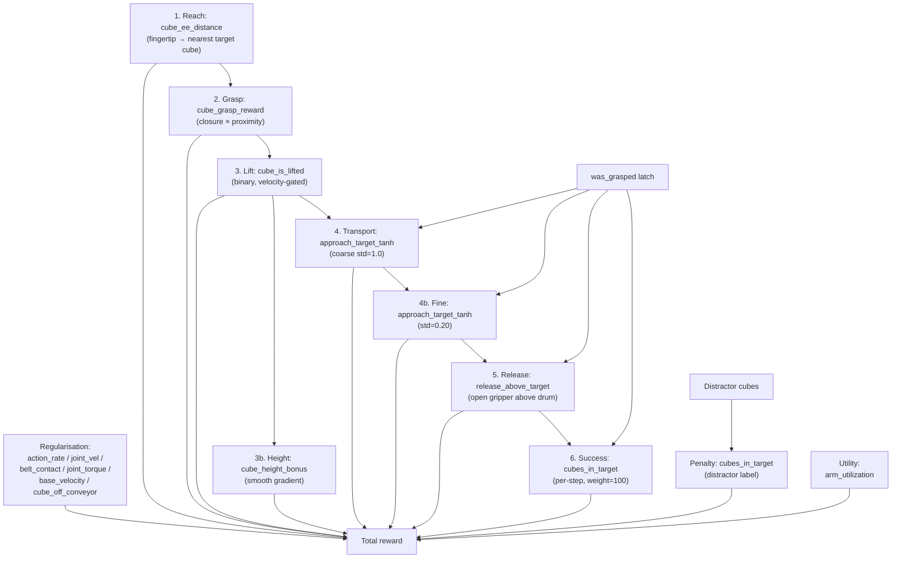

# Cube Sort Task

[← Back to extension overview](../../../../../../README.md) · [Project root](../../../../../../../../README.md)

Cube sorting with the 5-DOF tensegrity manipulator and Robotiq 2F gripper on
an active conveyor belt.  The robot must selectively grasp target (green) cubes
from the moving belt, transport them to a target drum, and release them
inside — while ignoring distractor (red) cubes that share the same belt.


## Goal

Train an RL agent to perform label-based sorting on a moving conveyor:

1. **Reach** the nearest target cube on the moving belt.
2. **Grasp** it with the Robotiq 2F gripper (closure × proximity reward).
3. **Lift** it above the belt surface (velocity-gated to reject bounces).
4. **Transport** it laterally toward the target drum.
5. **Release** the cube above the drum opening.
6. **Success** accumulates per-step reward while the cube rests in the drum.

Success is defined as a target cube's centre being inside the cylindrical drum
volume (radius = 0.2735 m, height = 0.30 m).  Episodes run the full 8 s
duration without early success termination — the per-step success reward
(weight=100) accumulates over remaining steps and dominates holding rewards.

## Variants

| Environment ID | Description |
|---|---|
| `Template-Tensegrity-Cube-Sort-v0` | Standard training (8 192 envs) |
| `Template-Tensegrity-Cube-Sort-Play-v0` | Evaluation (50 envs) |

All variants use `TensegrityCubeSortEnv` as the gymnasium entry point
(custom `ManagerBasedRLEnv` subclass with physics-based grasp latch).

## Scene

Extends `ProjBaseSceneCfg` with a unified labelled cube collection.

| Element | Details |
|---|---|
| Robot | `TENS_5DOF_GRIPPER_CFG` at (0.15, 0.0, 2.30) m |
| Cubes | 16 total: 8 target (green, label 0) + 8 distractor (red, label 1) |
| Cube size | 0.05 m side, 0.05 kg each |
| Target drum | Plastic drum at (0.15, 0.85, 0.0) m (0.547 m diameter, 0.88 m tall) |
| Conveyor | Dual belt (4 m total), surface at 0.80 m, **active** (0.2–0.8 m/s along +X) |
| Env spacing | 5.0 m |

### Label System

Cubes are stored in a single `RigidObjectCollectionCfg` with integer labels
assigned per-cube.  Functions filter by label using vectorised boolean masks
for peak GPU throughput.

| Label | Category | Colour | Count |
|---|---|---|---|
| 0 | Target | Green | 8 |
| 1 | Distractor | Red | 8 |

### Cube Spawn Randomisation (at reset)

| Axis | Range |
|---|---|
| X | 0.10 … 1.80 m (relative to conveyor start) |
| Y | −0.20 … +0.20 m |
| Z | belt + 0.03 … belt + 0.05 m (= 0.83 … 0.85 m) |

All 16 cubes are spawned in the spawn box at every reset.

### Drum Success Geometry

| Parameter | Value |
|---|---|
| Cylinder radius | 0.2735 m |
| Cylinder height | 0.30 m |
| Centre | drum root position |

## Controlled Joints

| Joint | Type | Limits | Action Clip |
|---|---|---|---|
| `base_y_joint` | Prismatic | ±0.5 m | (−0.5, 0.5) |
| `base_z_joint` | Prismatic | −0.5 … 0.0 m | (−0.5, 0.0) |
| `elbow_joint` | Revolute | ±1.5 rad | (−1.5, 1.5) |
| `wrist_y_joint` | Revolute | ±0.8 rad | (−0.8, 0.8) |
| `wrist_x_joint` | Revolute | ±0.8 rad | (−0.8, 0.8) |
| `finger_joint` | Revolute | — | Binary (open=0.0, close=0.7854) |

## Actions (6 dims)

| Group | Dims | Type | Scale |
|---|---|---|---|
| `base_delta` | 2 | Joint position delta | 0.50 |
| `arm_delta` | 3 | Joint position delta | 1.0 |
| `gripper_action` | 1 | Binary joint position | open=0.0, close=0.7854 |

## Observations (policy group)

| Term | Dim | Description |
|---|---|---|
| `joint_pos_rel` | 6 | Relative joint positions (controlled joints incl. finger) |
| `joint_vel_rel` | 6 | Relative joint velocities |
| `ee_pos_w` | 3 | Grasp-centre world position |
| `ee_vel_w` | 3 | Grasp-centre linear velocity |
| `nearest_target_rel` | 3 | Target cube position relative to grasp centre |
| `nearest_distractor_rel` | 3 | Distractor cube position relative to grasp centre |
| `fingertip_target_rel` | 3 | Dynamic fingertip → nearest target cube |
| `fingertip_distractor_rel` | 3 | Dynamic fingertip → nearest distractor cube |
| `gripper_closure` | 1 | Normalised finger closure [0=open, 1=closed] |
| `gripper_torque` | 1 | Normalised finger torque [0=free, 1=at effort limit] |
| `target_cube_vel` | 3 | Nearest target cube linear velocity |
| `distractor_cube_vel` | 3 | Nearest distractor cube linear velocity |
| `drum_rel` | 3 | Drum position relative to grasp centre |
| `actions` | 6 | Previous actions |

Total: **47**.

## Rewards

### Reward pipeline



### Task rewards

| Term | Weight | Function | Gate |
|---|---|---|---|
| `reaching_object` | +1.0 | `1 − tanh(d_fingertip→nearest_target / 0.1)` | — |
| `grasping` | +5.0 | `closure × (1 − tanh(d / 0.08))` | — |
| `lifting_object` | +8.0 | Binary: cube > belt+0.06, near gripper, closed, velocity < 1 m/s | — |
| `height_bonus` | +8.0 | Smooth: `min(Δz, 0.30) / 0.30`, velocity < 1 m/s | — |
| `goal_tracking` | +50.0 | `1 − tanh(d_xy_target→drum / 1.0)`, lift_threshold=0.02 | `was_grasped` |
| `goal_tracking_fine` | +5.0 | `1 − tanh(d_xy_target→drum / 0.20)`, lift_threshold=0.02 | `was_grasped` |
| `release` | +10.0 | `(1−closure) × in_xy × above_rim` | `was_grasped` |
| `target_in_drum` | +100.0 | Target cubes inside drum cylinder | `was_grasped` |
| `distractor_in_drum` | −12.0 | Distractor cubes inside drum (penalty) | — |
| `target_missed` | −6.0 | Target cubes past conveyor end without being in drum | — |

### Regularisation & utility

| Term | Weight | Notes |
|---|---|---|
| `action_rate` | −1×10⁻⁴ → −2×10⁻³ | Ramped by curriculum at 200k steps |
| `joint_vel` | −1×10⁻⁴ → −2×10⁻³ | Ramped by curriculum at 200k steps |
| `belt_contact` | −10.0 | EE depth below belt surface |
| `joint_torque` | −0.05 | Arm joint effort fraction |
| `base_velocity` | −1.5 | Prefer arm over base movement |
| `arm_utilization` | +1.5 | Reward arm joint activity |
| `cube_off_conveyor` | −5.0 | Any cube outside belt Y∈[−0.4, 0.4] or below z=0.70 |

## Terminations

No early success termination — episodes always run the full 8 s.

| Term | Type | Condition |
|---|---|---|
| `time_out` | Truncation | Episode length exceeded (8.0 s / 400 steps) |
| `all_cubes_passed` | Termination | All active cubes have passed x_threshold |
| `joint_vel_diverged` | Truncation | Any controlled joint velocity > 100 rad/s |
| `belt_collision` | Truncation | EE penetrates > 0.20 m below belt surface |

## Curriculum

| Step Threshold | Change |
|---|---|
| 200 000 | `action_rate` weight: −1×10⁻⁴ → −2×10⁻³ |
| 200 000 | `joint_vel` weight: −1×10⁻⁴ → −2×10⁻³ |

## Reset Events

| Event | Details |
|---|---|
| `reset_all` | Full scene reset to defaults |
| `reset_arm` | Base + arm joints offset by ±0.10 rad; velocities zeroed |
| `reset_gripper` | `finger_joint` reset to 0.0 (fully open) |
| `reset_cubes` | All 16 cubes randomised in spawn box (8 target + 8 distractor) |
| `sample_belt_speed` | Per-env belt speed sampled uniformly from [0.2, 0.8] m/s |
| `apply_conveyor` | Interval event injecting belt velocity to on-belt cubes |

## Simulation Parameters

| Parameter | Value |
|---|---|
| Physics dt | 0.01 s (100 Hz) |
| Decimation | 2 (control at 50 Hz) |
| Episode length | 8.0 s (400 control steps) |
| PhysX solver | TGS (type 1) |
| Bounce threshold | 0.2 m/s |
| Stabilisation | Enabled |
| Friction correlation distance | 0.00625 m |
| Default num_envs | 8 192 (training) / 50 (play) |

## Training

<!-- TODO: Add training results once available -->

## Design Decisions & Lessons Learned

<!-- TODO: Add lessons learned from training -->

## Running

```bash
cd src/tensegrity_pick

# Training
conda run --no-capture-output -n env_isaaclab python3 scripts/skrl/train.py \
    --task Template-Tensegrity-Cube-Sort-v0 --headless

# Play latest checkpoint
conda run --no-capture-output -n env_isaaclab python3 scripts/skrl/play.py \
    --task Template-Tensegrity-Cube-Sort-Play-v0 --num_envs 10
```

## Related

- [Cube place task](../cube_place/README.md) — single-cube pick-and-place (simpler predecessor)
- [Robot specification](../../../../../../../../res/Tensegrity/README.md) — kinematic chain, joint constraints, tendon geometry
- [Reach task](../tensegrity_reach/README.md) — EE pose tracking task
- [Extension overview](../../../../../../README.md) — all registered tasks and scripts
