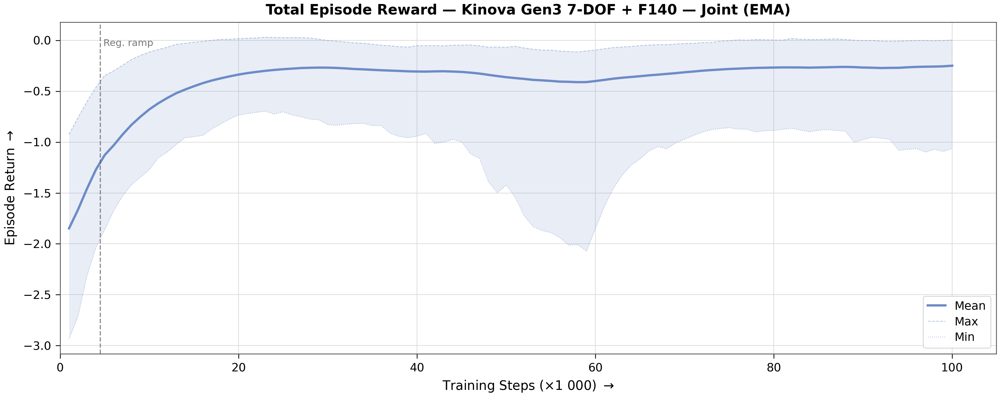
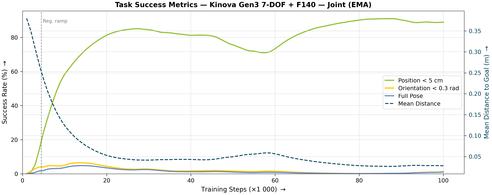
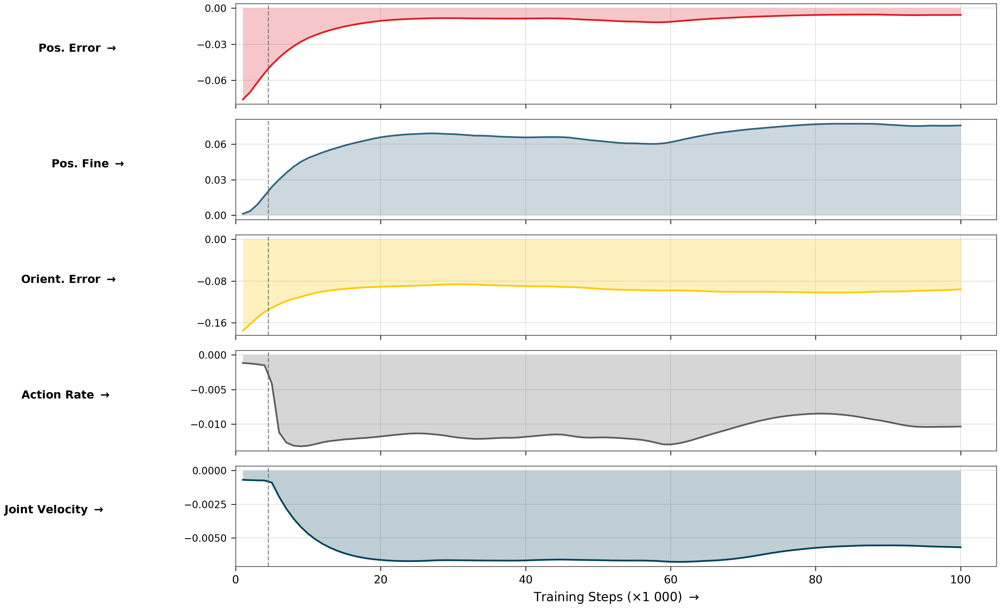
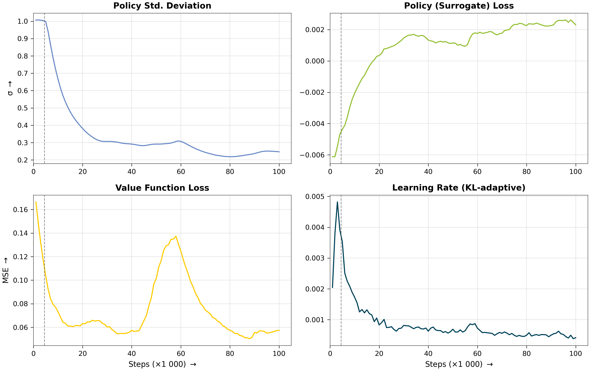
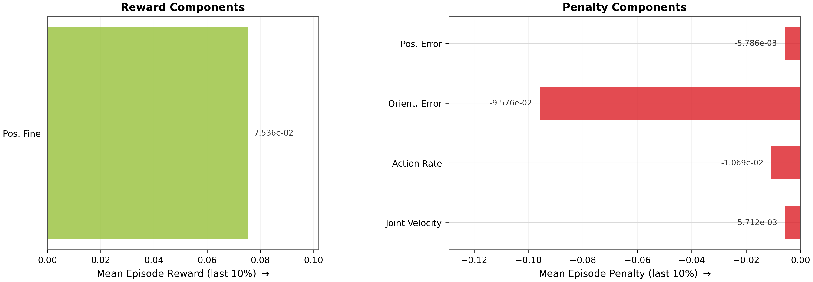
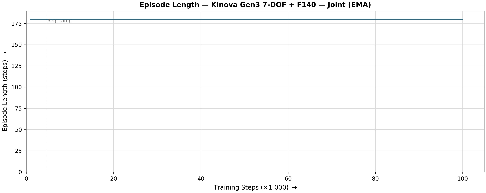

# Reach Results Report

## Run Metadata

| Field | Value |
|---|---|
| Variant | `kinova_f140` |
| Run ID | `2026-07-02_10-33-04_ppo_torch_seed42` |

## Converged Metrics (last 10% of training)

| Metric | Value |
|---|---|
| Total episode reward (mean) | -0.2532 |
| **Mean position error** | **2.9 cm** |
| **Position reached (< 5 cm)** | **88 % of steps** |
| Orientation reached (< 0.3 rad) | 1 % of steps |
| Pose reached (both) | 1 % of steps |
| Position tracking reward | -0.0058 |
| Orientation tracking reward | -0.0958 |
| Position fine-grained reward | 0.075357 |
| Action rate penalty | -0.010692 |
| Joint velocity penalty | -0.005712 |
| Mean episode length | 180.0 steps |
| Policy std deviation | 0.2537 |
| Learning rate (final) | 4.95e-04 |

## Figures

### Total Reward

### Task Success

### Reward Decomposition

### Policy Diagnostics

### Converged Breakdown

### Episode Length

