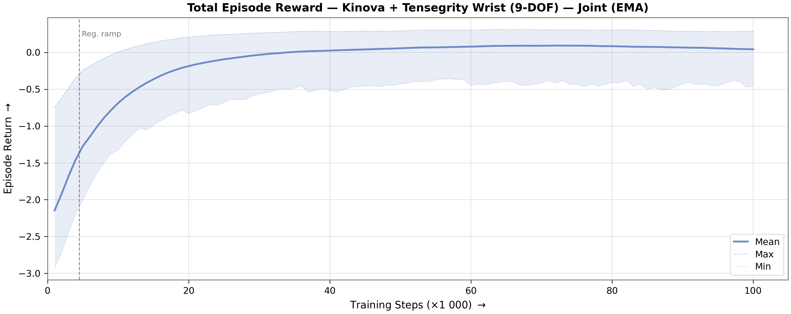
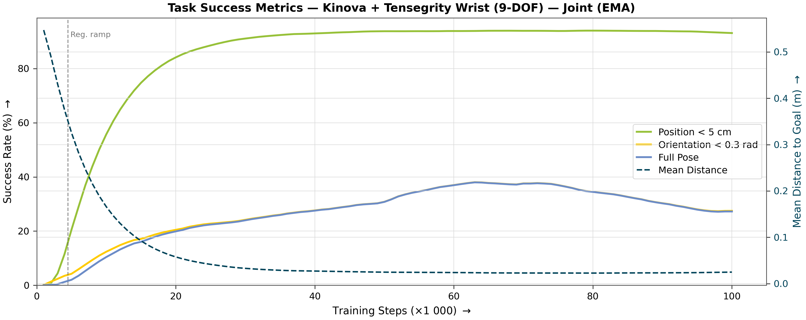
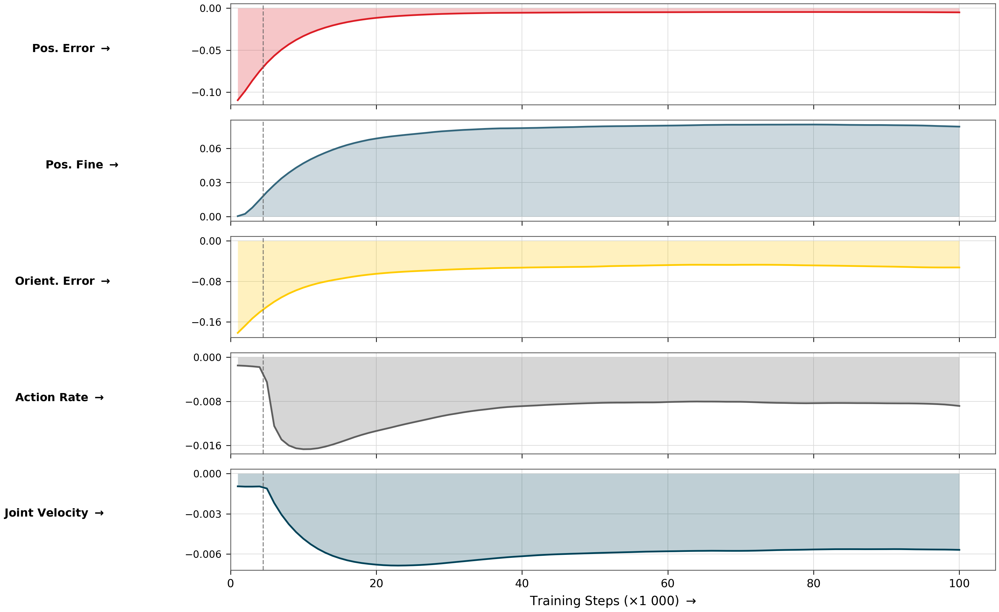
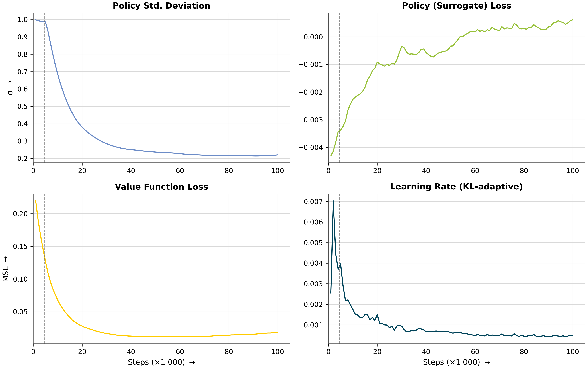
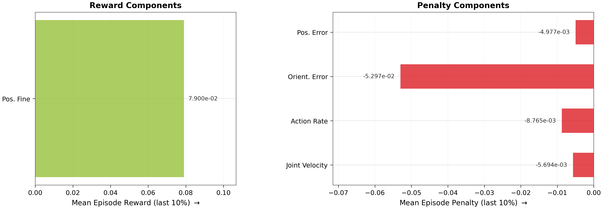
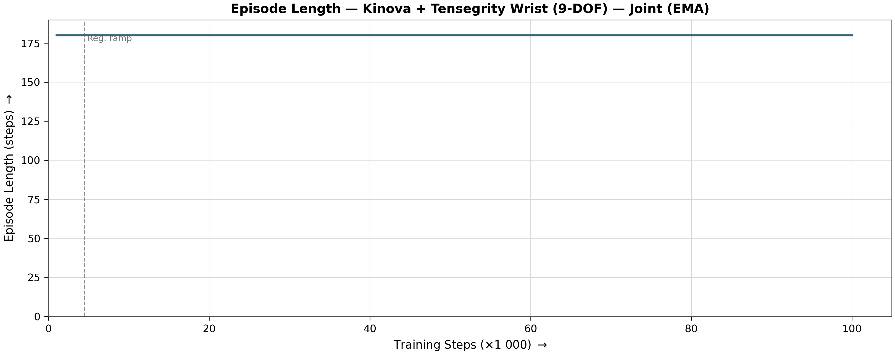

# Reach Results Report

## Run Metadata

| Field | Value |
|---|---|
| Variant | `kinova_frankenstein` |
| Run ID | `2026-07-02_10-33-04_ppo_torch_seed42` |

## Converged Metrics (last 10% of training)

| Metric | Value |
|---|---|
| Total episode reward (mean) | 0.0409 |
| **Mean position error** | **2.5 cm** |
| **Position reached (< 5 cm)** | **93 % of steps** |
| Orientation reached (< 0.3 rad) | 27 % of steps |
| Pose reached (both) | 26 % of steps |
| Position tracking reward | -0.0050 |
| Orientation tracking reward | -0.0530 |
| Position fine-grained reward | 0.079001 |
| Action rate penalty | -0.008765 |
| Joint velocity penalty | -0.005694 |
| Mean episode length | 180.0 steps |
| Policy std deviation | 0.2195 |
| Learning rate (final) | 4.61e-04 |

## Figures

### Total Reward

### Task Success

### Reward Decomposition

### Policy Diagnostics

### Converged Breakdown

### Episode Length

