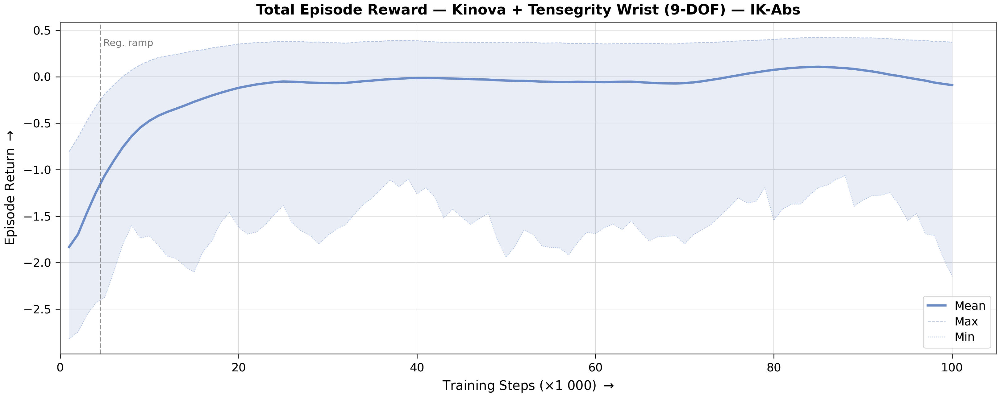
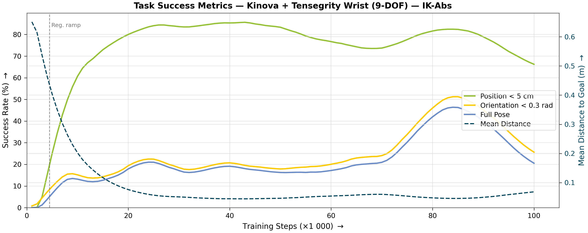
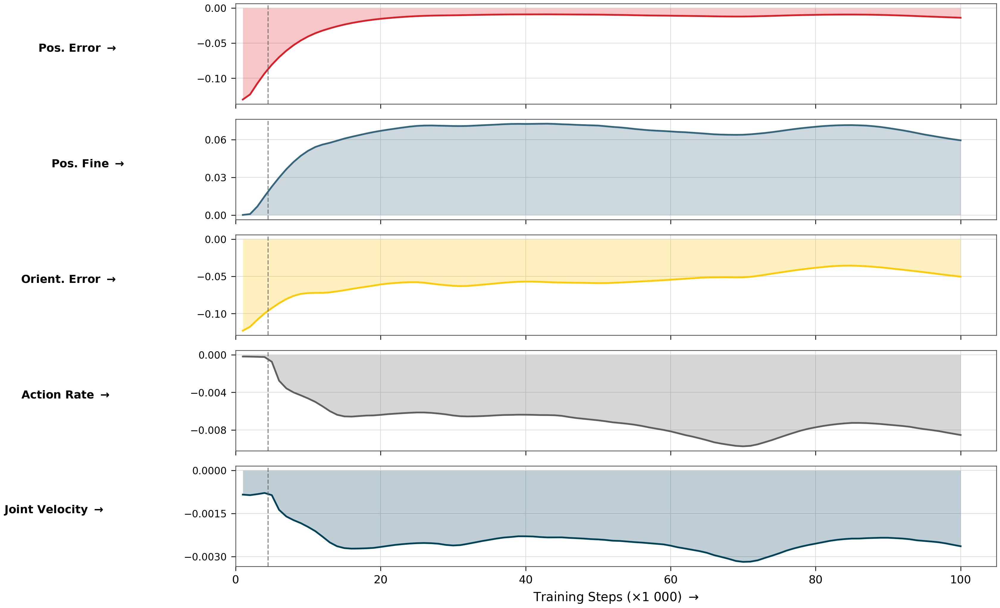
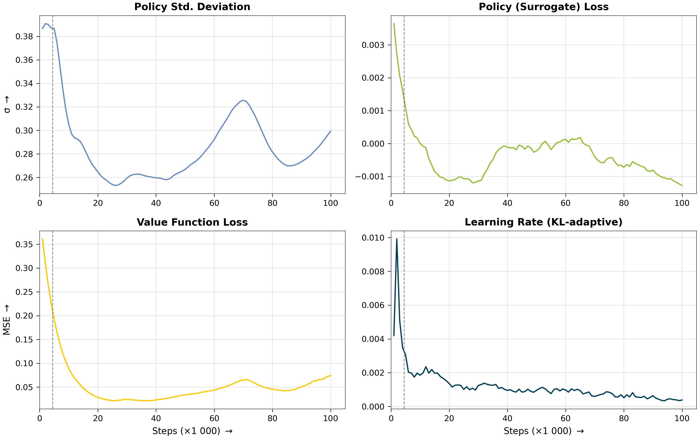
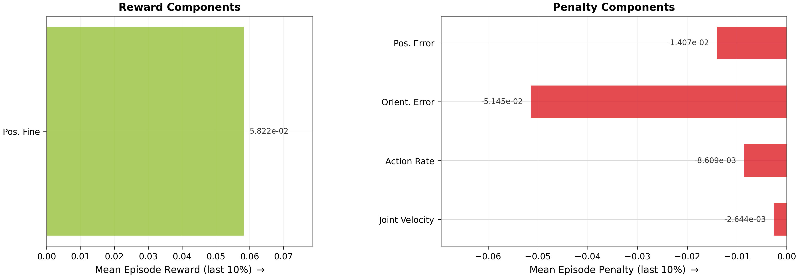
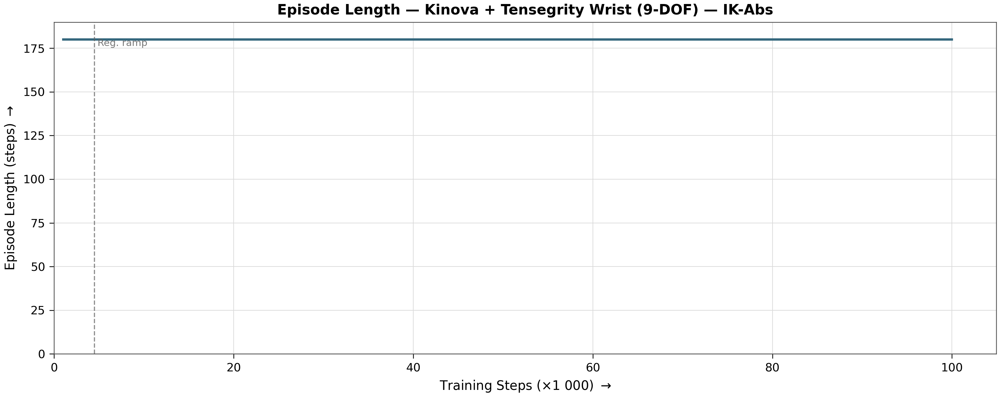

# Reach Results Report

## Run Metadata

| Field | Value |
|---|---|
| Variant | `kinova_frankenstein_ikabs` |
| Run ID | `2026-07-13_00-50-19_ppo_torch_seed42` |

## Converged Metrics (last 10% of training)

| Metric | Value |
|---|---|
| Total episode reward (mean) | -0.1087 |
| **Mean position error** | **7.0 cm** |
| **Position reached (< 5 cm)** | **65 % of steps** |
| Orientation reached (< 0.3 rad) | 23 % of steps |
| Pose reached (both) | 18 % of steps |
| Position tracking reward | -0.0141 |
| Orientation tracking reward | -0.0514 |
| Position fine-grained reward | 0.058222 |
| Action rate penalty | -0.008609 |
| Joint velocity penalty | -0.002644 |
| Mean episode length | 180.0 steps |
| Policy std deviation | 0.3006 |
| Learning rate (final) | 4.03e-04 |

## Figures

### Total Reward

### Task Success

### Reward Decomposition

### Policy Diagnostics

### Converged Breakdown

### Episode Length

