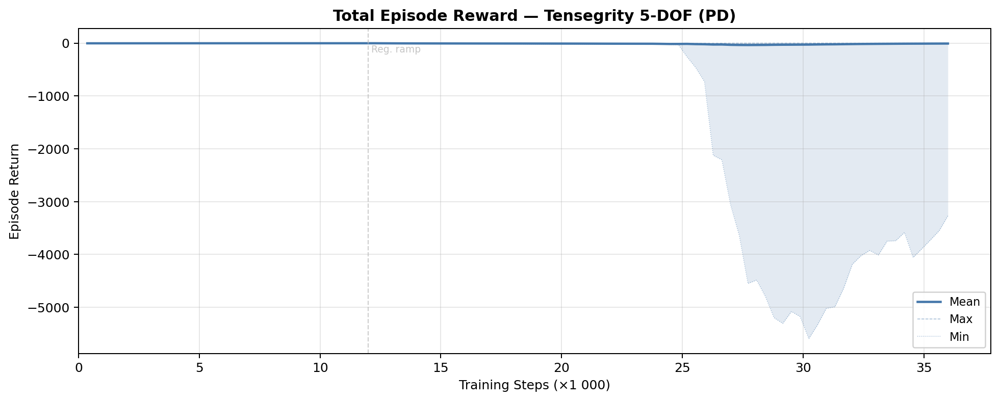
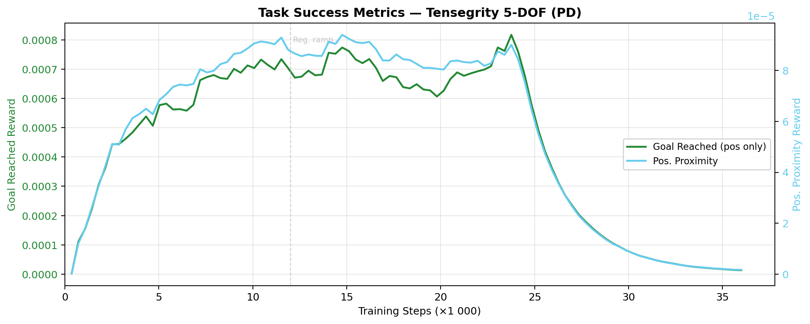
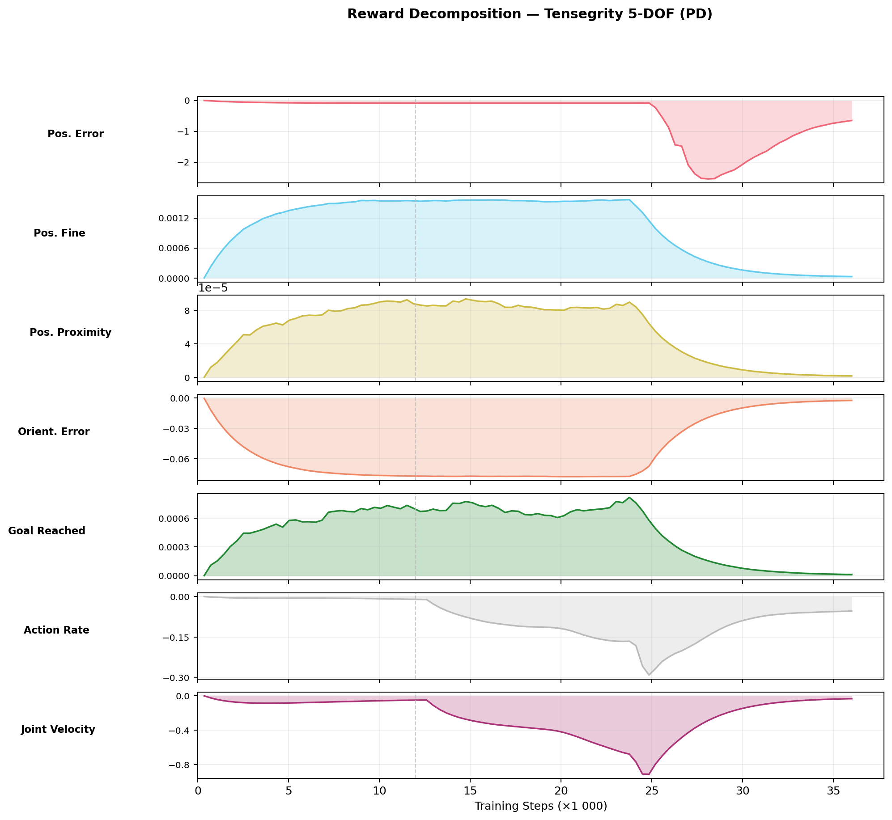
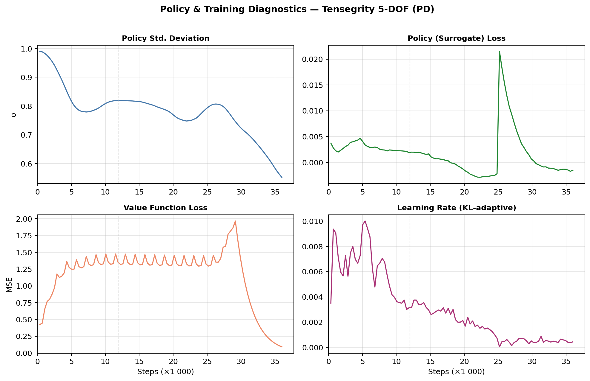
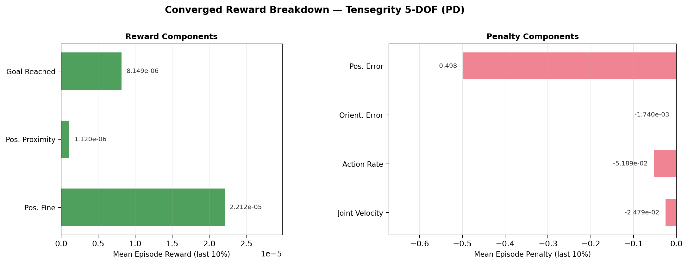

# Reach Results Report

## Run Metadata

| Field | Value |
|---|---|
| Variant | `tensegrity` |
| Run ID | `2026-03-15_02-29-28_ppo_torch` |

## Converged Metrics (last 10% of training)

| Metric | Value |
|---|---|
| Total episode reward (mean) | -4.6958 |
| Position tracking reward | -0.0961 |
| Orientation tracking reward | -0.0966 |
| Position fine-grained reward | 0.002156 |
| Orientation fine-grained reward | 0.000000 |
| Pose goal reached reward | 0.000000 |
| Action rate penalty | -0.002924 |
| Joint velocity penalty | -0.140891 |
| Policy std deviation | 0.1739 |
| Learning rate (final) | 4.68e-04 |

## Figures

### Total Reward

### Task Success

### Reward Decomposition

### Policy Diagnostics

### Converged Breakdown

