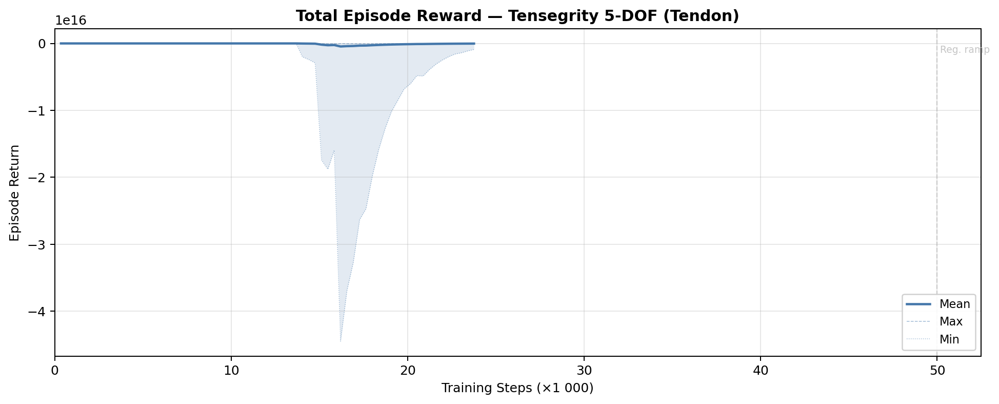
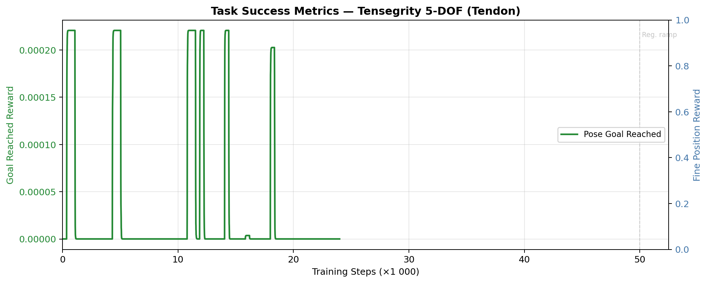
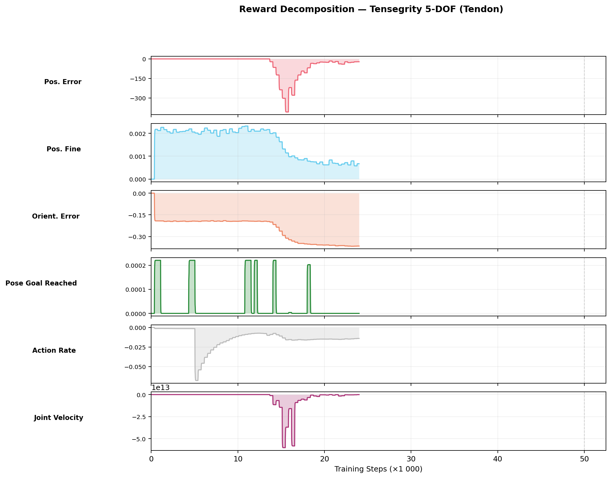
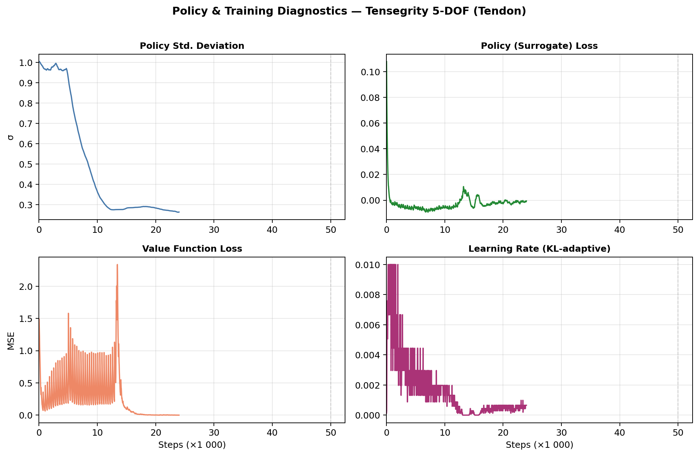
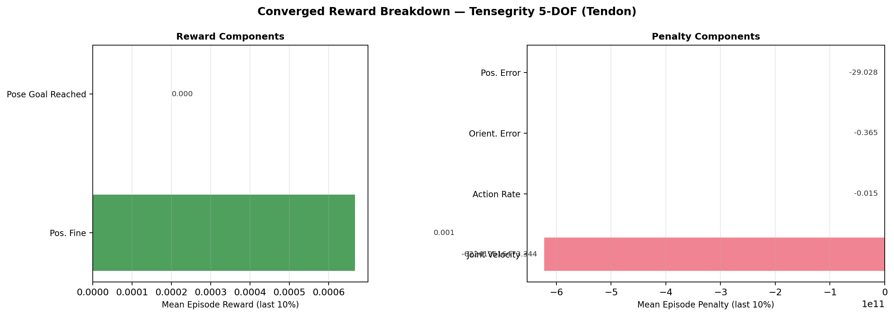

# Reach Results Report

## Run Metadata

| Field | Value |
|---|---|
| Variant | `tensegrity_tendon` |
| Run ID | `2026-03-15_00-14-43_ppo_torch` |

## Converged Metrics (last 10% of training)

| Metric | Value |
|---|---|
| Total episode reward (mean) | -934757475328.0000 |
| Position tracking reward | -29.0281 |
| Orientation tracking reward | -0.3651 |
| Position proximity reward | 0.000000 |
| Pose goal reached reward | 0.000000 |
| Action rate penalty | -0.014719 |
| Joint velocity penalty | -622419516473.343994 |
| Policy std deviation | 0.2679 |
| Learning rate (final) | 5.06e-04 |

## Figures

### Total Reward

### Task Success

### Reward Decomposition

### Policy Diagnostics

### Converged Breakdown

