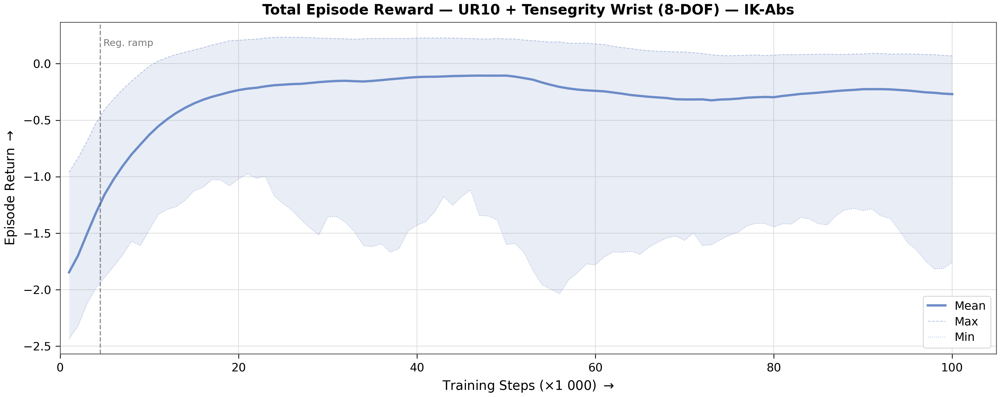
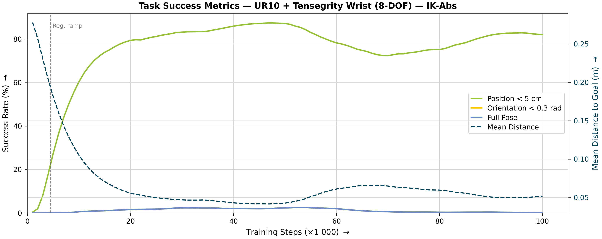
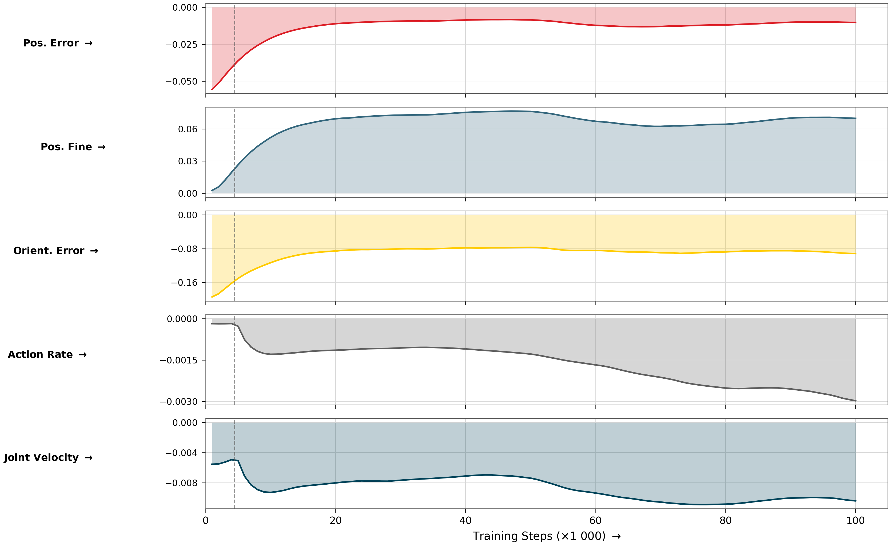
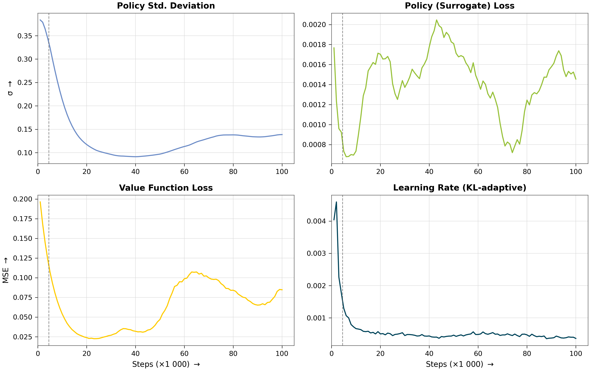
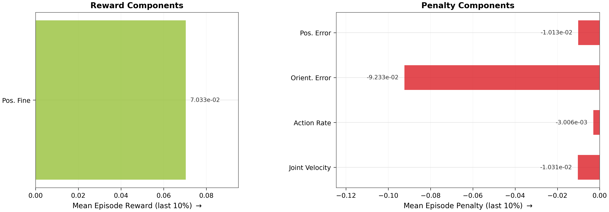
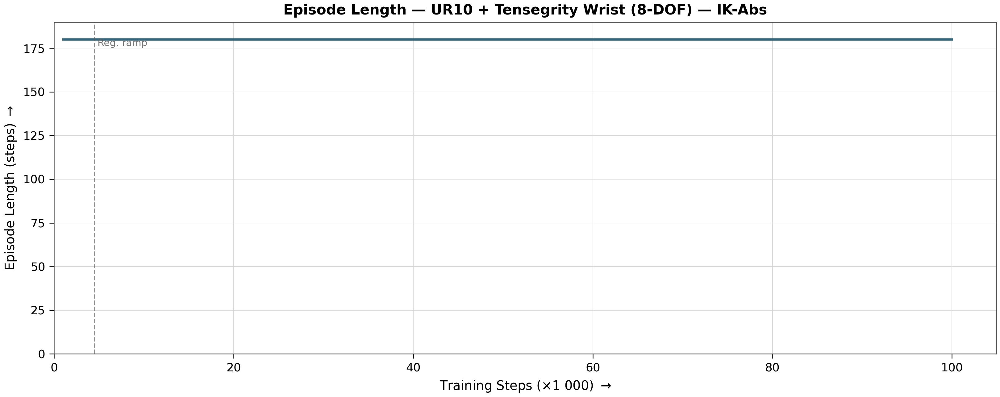

# Reach Results Report

## Run Metadata

| Field | Value |
|---|---|
| Variant | `ur10_frankenstein_ikabs` |
| Run ID | `2026-07-02_10-33-04_ppo_torch_seed42` |

## Converged Metrics (last 10% of training)

| Metric | Value |
|---|---|
| Total episode reward (mean) | -0.2685 |
| **Mean position error** | **5.1 cm** |
| **Position reached (< 5 cm)** | **83 % of steps** |
| Orientation reached (< 0.3 rad) | 0 % of steps |
| Pose reached (both) | 0 % of steps |
| Position tracking reward | -0.0101 |
| Orientation tracking reward | -0.0923 |
| Position fine-grained reward | 0.070325 |
| Action rate penalty | -0.003006 |
| Joint velocity penalty | -0.010306 |
| Mean episode length | 180.0 steps |
| Policy std deviation | 0.1388 |
| Learning rate (final) | 3.94e-04 |

## Figures

### Total Reward

### Task Success

### Reward Decomposition

### Policy Diagnostics

### Converged Breakdown

### Episode Length

