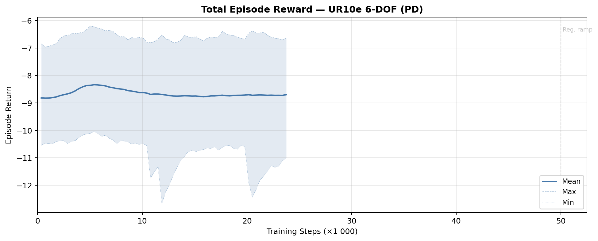
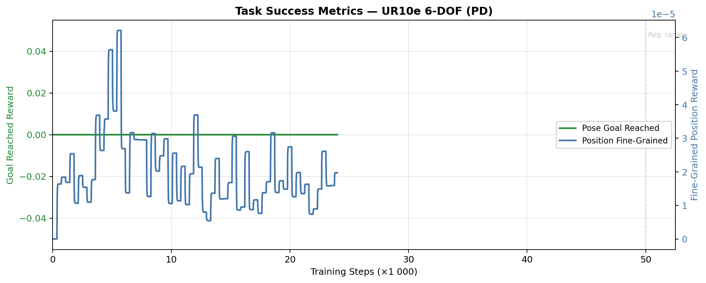
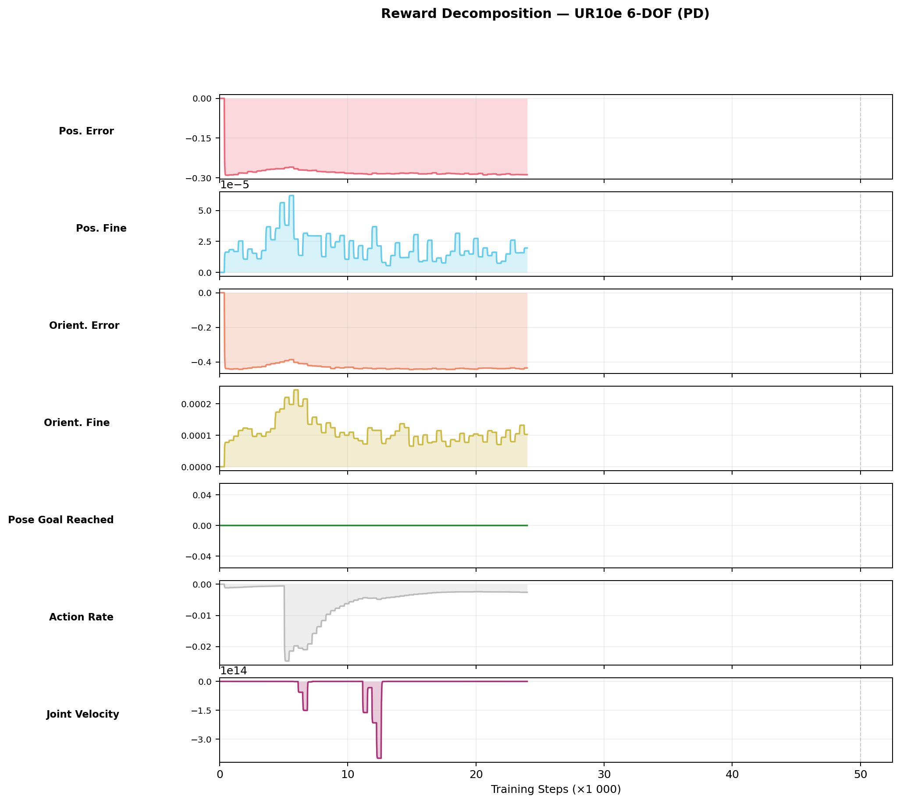
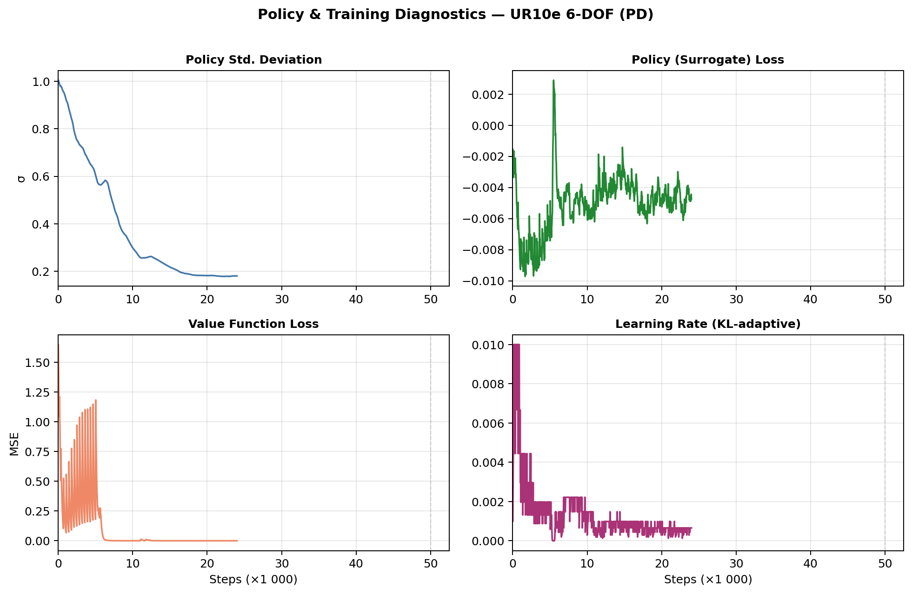
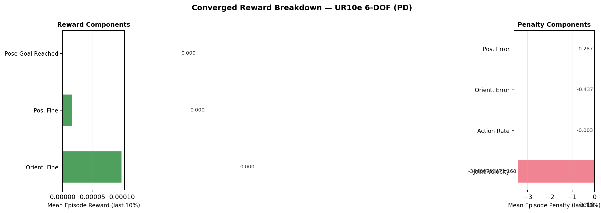

# Reach Results Report

## Run Metadata

| Field | Value |
|---|---|
| Variant | `ur10e` |
| Run ID | `2026-03-15_00-36-40_ppo_torch` |

## Converged Metrics (last 10% of training)

| Metric | Value |
|---|---|
| Total episode reward (mean) | -8.7091 |
| Position tracking reward | -0.2874 |
| Orientation tracking reward | -0.4371 |
| Position fine-grained reward | 0.000015 |
| Orientation fine-grained reward | 0.000099 |
| Pose goal reached reward | 0.000000 |
| Action rate penalty | -0.002505 |
| Joint velocity penalty | -34406702471.167999 |
| Policy std deviation | 0.1798 |
| Learning rate (final) | 5.63e-04 |

## Figures

### Total Reward

### Task Success

### Reward Decomposition

### Policy Diagnostics

### Converged Breakdown

