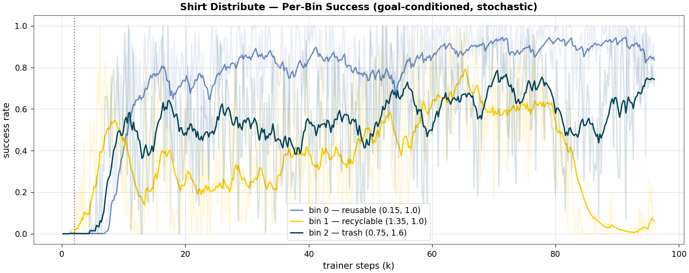

# Shirt Distribute Task

[← Back to extension overview](../../../../../../README.md) · [Project root](../../../../../../../../README.md)

**Task 3 of the cloth-sorting pipeline.** After the (black-box) condition
classification, the second robot throws/places the T-shirt into the drum
matching its label (reusable / recyclable / trash).

**Goal-conditioned formulation** (research report §4, TossingBot precedent):
the condition label never enters the observation directly — it only selects
**which bin's position** is observed (`target_bin_rel`).  The per-episode
target bin is resampled uniformly, so "nearest bin" and "correct bin" diverge
and the policy cannot ignore the goal.

> **Status: mode collapse SOLVED; §2 met on 2/3 bins, bin 2 at a task ceiling
> (2026-07-10, Alex agent).** The episode starts with the shirt already hanging
> from the robot's own closed gripper at a sampled end-of-Task-2 holding pose;
> rewards are the shirt_place release design retargeted to the commanded bin.
> Phase 1 was blocked by a diagnosed **goal-conditioned mode collapse** (per-seed
> 2-of-3-bin specialisation); a literature review
> ([research report](../../../../../../../../doc/reports/tmp/RESEARCH_REPORT_goal_conditioned_mode_collapse))
> traced it to cross-goal critic interference under an aggregate return
> normalizer. Three rounds of the report's levers — **per-goal value/advantage
> normalization + multi-head critic + goal one-hot** (Phase 2), difficulty-
> proportional goal sampling (2b), and **FiLM goal-gating + per-goal actor heads**
> (2c) — drove a monotonic **0.596 → 0.882** and **eliminated the collapse on all
> seeds**. The best policy (`…-PerGoal-FiLM-v0`) places into all three bins in
> balance; **bins 0 and 1 clear ≥ 0.85 robustly**, and the one holdout — **bin 2
> (trash, behind the pedestal arm) at 0.83** — is a single-drum reachability
> ceiling (the scripted baseline itself tops out at 0.88), a **task-side**
> refinement (e.g. a TossingBot throw for the far drum), not a learning one.
> Full analysis in the
> [optimization tracking](../../../../../../../../doc/reports/tracking/shirt_distribute_optimization_tracking.md)
> (Phases 2 / 2b / 2c).

## Results (UR5e-F140)

**FiLM per-goal PPO** (`Template-Shirt-Distribute-UR5e-F140-PerGoal-FiLM-v0`),
best checkpoint **seed 1 `agent_92000`** — deterministic (mean actions), 270
episodes/eval seed:

| eval seed | overall | bin0 reusable | bin1 recyclable | bin2 trash |
|---|---|---|---|---|
| 7  | 0.841 | 0.883 | 0.872 | 0.756 |
| 8  | **0.911** | 0.934 | 0.909 | 0.887 |
| 9  | 0.881 | 0.880 | 0.920 | 0.846 |
| 10 | 0.893 | 0.944 | 0.895 | 0.840 |
| **mean** | **0.882** | **0.910** | **0.899** | **0.832** |

**Mode collapse solved; §2 met on 2 of 3 bins.**  bins 0 and 1 clear ≥ 0.85 on
every eval seed (0.91 / 0.90 mean); all three clear it on eval seed 8
(0.93/0.91/0.89).  The one holdout is **bin 2 (trash) at 0.832** — mounted
*behind* the pedestal arm, the hardest to reach; a single-drum ceiling that
persists across FiLM seeds and B5 (not interference).  Progression across rounds:
Phase-1 baseline **0.596** (one bin hard-zeroed 0.00–0.09) → per-goal PPO
**0.856** → +B5 **0.872** → +FiLM **0.882**.  The scripted baseline
(`baseline_shirt_distribute.py`) places **21/24 = 0.88**, near which the RL
policy now sits.  Closing bin 2 is task-side follow-up (see
[Planned Work](#planned-work-stub--trainable-task) #4, TossingBot throw).
Training curves + per-bin success in [figures/ur5e_f140/](figures/ur5e_f140/).



## Table of Contents

- [Goal](#goal)
- [Variants](#variants)
- [Scene](#scene)
- [Goal Conditioning](#goal-conditioning)
- [Controlled Joints](#controlled-joints)
- [Actions](#actions)
- [Observations (policy group)](#observations-policy-group)
- [Rewards (stub)](#rewards-stub)
- [Terminations](#terminations)
- [Reset Events](#reset-events)
- [Simulation Parameters](#simulation-parameters)
- [Planned Work (stub → trainable task)](#planned-work-stub--trainable-task)
- [Running](#running)
- [Related](#related)

## Goal

Train an RL agent (the second arm) to sort the inspected garment:

1. Start **holding the shirt** — hanging from the robot's own closed gripper
   at one random particle patch, arm at a sampled end-of-Task-2 holding pose
   (later: the real Task-2 terminal-state bank — the seam is documented in
   `shirt_distribute_env.py`).
2. **Carry** it toward the commanded bin (goal-conditioned; nearest ≠ correct).
3. **Release** it over the bin opening so the garment falls inside, then
   return the arm toward neutral.

Success metric (TensorBoard `Metrics/…`): `distribute_success_rate` — after a
release (`~grasp_active`), ≥ 15 % of cloth particles inside the **commanded**
drum's interior cylinder (radius 0.2735 m, height 0.85 m — the same
interior-depth geometry as shirt_place, since draped cloth rarely reaches the
drum bottom).  Requiring the release closes the "lower the still-gripped
shirt into the drum" reward hack found in shirt_place.  Also logged:
`grasp_rate`.  Target from the staged plan: **> 85 % correct-bin placement**
across all three labels (and randomized layouts, once added).

## Variants

| Environment ID | Robot | Description |
|---|---|---|
| `Template-Shirt-Distribute-Kinova-F140-v0` | Kinova Gen3 (7 DOF) + Robotiq 2F-140 | Joint-position control |
| `Template-Shirt-Distribute-Kinova-F140-Play-v0` | 〃 | 50-env play/eval configuration |
| `Template-Shirt-Distribute-UR5e-F140-v0` | UR5e (6 DOF) + Robotiq 2F-140 | Joint-position control; mounted yaw +90° (showcase pose) |
| `Template-Shirt-Distribute-UR5e-F140-Play-v0` | 〃 | 50-env play/eval configuration |

Planned: UR10 and "Frankenstein" (+ tensegrity wrist) variants; task-space
(IK/OSC) action variants.

## Scene

Uses the **central cloth-sorting scene**
[shared/cloth_sorting_scene_cfg.py](../shared/cloth_sorting_scene_cfg.py)
(full entity table in the [shirt_pick README](../shirt_pick/README.md#scene)).
Task-specific configuration:

| Entity | Description |
|---|---|
| `robot` | Second robot on the pedestal at `(0.75, 1.0, 0.75)`; UR5e yaw +90° |
| `drum_reusable` | `(0.15, 1.0, 0)` — left of the robot (showcase position) |
| `drum_recyclable` | `(1.35, 1.0, 0)` — right of the robot |
| `drum_trash` | `(0.75, 1.6, 0)` — behind the robot |
| `holder_robot` | not spawned (`None`) |
| shirt | Hanging from the robot's own gripper (slot-0 weld at the sampled fingertip; hanging-bank restore, drape bucketed by the pose-dependent limit) |

## Goal Conditioning

Implemented in [shirt_distribute_env.py](shirt_distribute_env.py):

- `self._target_bin ∈ {0, 1, 2}` is resampled **uniformly per episode**
  (before the parent reset, so reset-step observations already see the new
  goal).
- `target_bin_pos_w` gathers the commanded drum's world position;
  the observation `target_bin_rel` = commanded bin − shirt centroid.
- The semantic label → bin mapping is a wrapper concern at deployment time;
  during training only the bin *position* matters, which is exactly what
  makes the policy transfer to any label assignment or (later) randomized
  bin layout.

## Controlled Joints

| Variant | Arm joints | Gripper |
|---|---|---|
| Kinova Gen3 | `joint_1` … `joint_7` | `finger_joint` (+ 7 mimic joints) |
| UR5e | `shoulder_pan/lift`, `elbow`, `wrist_1/2/3` | `finger_joint` (+ 7 mimic joints) |

## Actions

| Term | Dims (Kinova / UR5e) | Type | Scale |
|---|---|---|---|
| `arm_action` | 7 / 6 | **RelativeJointPositionAction** (target = current + scale·action) | 0.05 |
| `gripper_action` | 1 | BinaryJointPositionAction (**action ≥ 0 ⇒ OPEN**) | open 0.0 / close 0.7854 |

Total: **8 dims (Kinova) / 7 dims (UR5e)**.

Why relative (not offset-from-default): the episode starts at a sampled
far-from-default holding pose, where a zero offset-from-default action would
yank the arm home at full PD speed on step 1, whipping the held cloth.  With
relative actions the null action holds the pose.  Scale 0.05 rad/step @ 60 Hz
caps joint speed at ≈ 3 rad/s.

## Observations (policy group)

**45 dims (Kinova) / 42 dims (UR5e)**, no noise corruption:

| Term | Dims (Kinova / UR5e) | Description |
|---|---|---|
| `joint_pos_rel` | 8 / 7 | Controlled joint positions relative to defaults (arm + finger) |
| `joint_vel_rel` | 8 / 7 | Controlled joint velocities |
| `ee_pos_w` | 3 | Grasp-centre position (env-local) |
| `shirt_rel` | 3 | Shirt centroid relative to grasp centre |
| `shirt_vel` | 3 | Shirt centroid velocity |
| `shirt_lowest_rel` | 3 | Lowest cloth particle rel. grasp centre (drape length; depth-camera-trivial) |
| `target_bin_rel` | 3 | Commanded bin relative to the shirt (the goal) |
| `target_bin_rel_ee` | 3 | **Commanded bin relative to the grasp centre** (EE-centric carry error) |
| `gripper_closure` | 1 | Normalized closure |
| `grasp_active` | 1 | 1.0 while the attachment grasp holds |
| `was_distributed` | 1 | 1.0 once the placement latched (post-success phase flag) |
| `actions` | 8 / 7 | Previous action |

## Rewards

shirt_place's validated release-into-drum design, retargeted to the commanded
bin (dt-scaled: per-step weight w pays ≈ w × episode-seconds; one-shots w/60):

| Term | Weight | Description |
|---|---|---|
| `approach_bin` / `approach_bin_fine` | 15 / 6 | Grasp-point→bin XY tanh (std 1.0 / 0.2), grasp-gated, faded by `clearance_fraction` (anti-hover) |
| `clearance_over_bin` | 4 | Lowest particle above the commanded rim while over its footprint |
| `release_hint` | 5 | Per-step openness over the commanded bin |
| `release_event` | 240 | **One-shot graded** (centering × whole-shirt-lift, 0.25–1.0) |
| `bad_release` | −120 | **One-shot**: opened NOT over the goal (incl. instant t=0 drops) |
| `in_target_bin` | 120 | Released-cloth fraction inside the commanded drum |
| `in_wrong_bin` | −60 | Released fraction in a non-commanded drum (the sorting error) |
| `dropped_on_floor` | −5 | Centroid < 0.70 m outside all drums |
| `carry_time` | −1.5 | Holding an undistributed shirt bleeds |
| `return_to_neutral` | 200 | Post-success return to defaults (`was_distributed`-gated) |
| `action_rate` / `joint_vel` | −3e-4 → −3e-3 / −2e-3 (curriculum @ 2000) | Smoothness |
| `belt_contact` | −10 | Fingertips below the belt surface |

No settled-early termination — shirt_place measured that ending the episode
after the drop cut total return below hover-to-timeout and PPO reverted to
hovering; post-drop per-step rewards make releasing strictly dominant.

## Terminations

| Term | Condition |
|---|---|
| `time_out` | Episode length 8.0 s |
| `joint_vel_diverged` | Any controlled joint > 100 rad/s |
| `belt_collision` | Fingertip > 0.12 m below the belt surface |

## Reset Events

Same event set as shirt_pick (conveyor collider swap, cloth prestartup,
scene/arm/gripper reset); the env's `_reset_cloth` then overrides the arm with
a sampled holding pose, forces the gripper closed and restores a hanging-bank
state at the recorded fingertip (slot 0) — see the initial-state section of
the [optimization tracking](../../../../../../../../doc/reports/tracking/shirt_distribute_optimization_tracking.md).

## Simulation Parameters

Identical to shirt_pick — `configure_cloth_sim()` profile (60 Hz, 24 PBD
iterations, self-collision on, enlarged GPU buffers, `replicate_physics=False`).
See the [shirt_pick table](../shirt_pick/README.md#simulation-parameters).

## Planned Work

Full staged plan: [doc/TODO.md — Master-Thesis Goal Tasks](../../../../../../../../doc/TODO.md).
Headlines:

1. **Init from the real Task-2 terminal-state bank** once shirt_present
   produces it (the current sampled holding poses + hanging-bank restore are
   the stand-in; seam documented in `shirt_distribute_env.py`).
2. **Bin-layout randomization** so nearest ≠ correct generalizes beyond the
   three fixed showcase drums.
3. **TossingBot-style throw** (release-velocity conditioning) if a drum
   proves outside comfortable placing reach (baseline measures this).

## Running

```bash
# from src/tensegrity_pick, conda env env_isaaclab

# Env validation (reset integrity, hold persistence, release, diversity)
python scripts/model_validation/check_shirt_distribute_env.py --headless --num_envs 8

# Scripted MDP baseline (DLS-IK carry->release over each drum)
python scripts/model_validation/baseline_shirt_distribute.py --headless --num_envs 8

# Smoke tests (NOTE: zero/random agents RELEASE immediately — the binary
# gripper term opens for any action >= 0; that is expected, not a bug)
python scripts/zero_agent.py   --task=Template-Shirt-Distribute-UR5e-F140-v0   --num_envs 4 --headless
python scripts/random_agent.py --task=Template-Shirt-Distribute-Kinova-F140-v0 --num_envs 4 --headless

# Train (Alex: tools/train_alex.sh wraps sbatch)
./tools/train_alex.sh Template-Shirt-Distribute-UR5e-F140-v0 --headless --num_envs 64

# Deterministic eval with per-bin breakdown
python scripts/skrl/evaluate_shirt_distribute.py --headless \
    --task Template-Shirt-Distribute-UR5e-F140-v0 --num_envs 32 --seed 7 \
    --num_episodes 96 --checkpoint <ckpt.pt>
```

## Related

- [Optimization tracking](../../../../../../../../doc/reports/tracking/shirt_distribute_optimization_tracking.md)
- [Research report (pipeline plan)](../../../../../../../../doc/reports/tmp/RESEARCH_cloth_sorting_pipeline.md)
- [shirt_present](../shirt_present/README.md) — pipeline task 2 (produces this task's initial states)
- [shirt_place](../shirt_place/README.md) — the validated release-into-drum reference (reward design donor)
- [shirt_sort](../shirt_sort/README.md) — legacy template, superseded by this task
- [Shared scene](../shared/cloth_sorting_scene_cfg.py) · [Shared env base](../shared/cloth_sorting_env.py)
