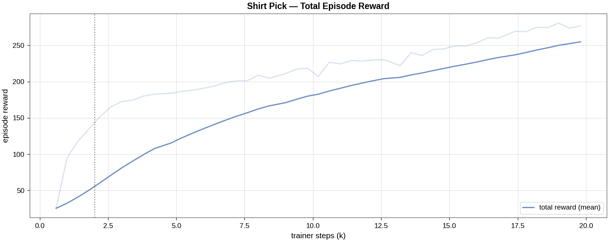
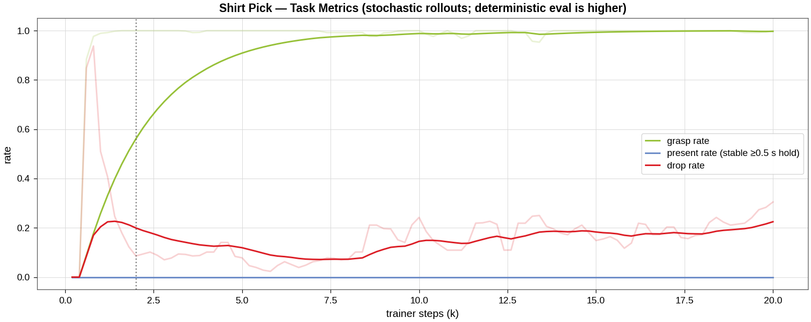
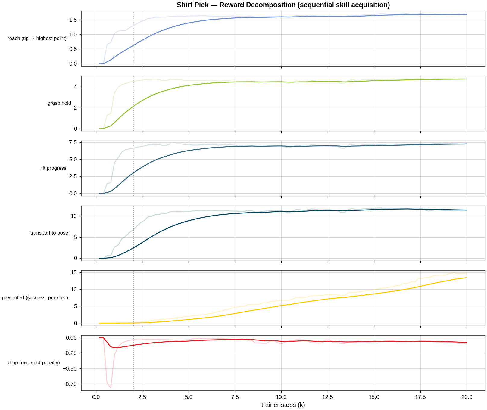
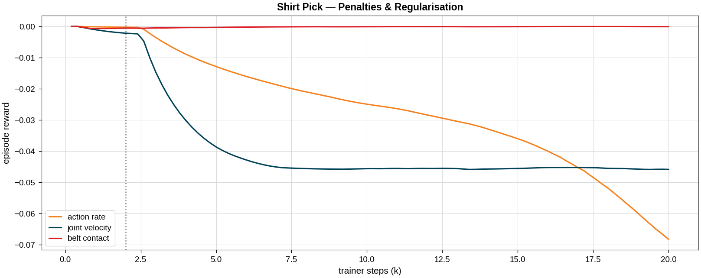
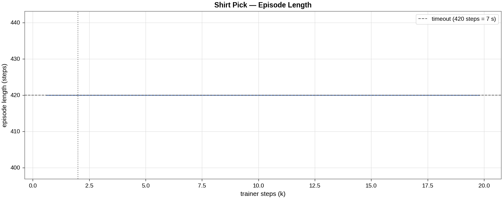

# Shirt Pick Task

[← Back to extension overview](../../../../../../README.md) · [Project root](../../../../../../../../README.md)

**Task 1 of the cloth-sorting pipeline.** The retrieving robot picks a
PBD-cloth-simulated T-shirt from the conveyor belt at its **highest point**
and holds it in front of the inspection camera (presentation pose), where the
condition-assessment cameras (task 2) take over.

> **Status: trained (2026-07-03).**  First 20 k-step PPO run reaches
> **deterministic present_rate ≈ 0.85** (grasp 0.90, drop 0.02; 96 episodes ×
> 2 seeds) on **fully crumpled** bank initial states — vs 0.125 for the
> scripted baseline.  Checkpoint:
> `logs/skrl/shirt_pick/2026-07-03_02-47-24_ppo_torch_seed1/checkpoints/agent_20000.pt`
> (a +6 k fine-tune was evaluated and REJECTED: it zeroed drops but lost
> grasp robustness, net present 0.80).  Stage-0 physics de-risk closed —
> see [cloth_stage0_physics_derisk.md](../../../../../../../../doc/reports/cloth_stage0_physics_derisk.md);
> full run log in the
> [optimization tracking](../../../../../../../../doc/reports/shirt_pick_optimization_tracking.md).

## Table of Contents

- [Goal](#goal)
- [Variants](#variants)
- [Scene](#scene)
- [Cloth Grasp](#cloth-grasp)
- [Controlled Joints](#controlled-joints)
- [Actions](#actions)
- [Observations (policy group)](#observations-policy-group)
- [Rewards](#rewards)
- [Terminations](#terminations)
- [Reset Events](#reset-events)
- [Simulation Parameters](#simulation-parameters)
- [Heuristic Baseline & Reachability](#heuristic-baseline--reachability)
- [Training Results](#training-results)
- [Open Work](#open-work)
- [Running](#running)
- [Related](#related)

## Goal

Train an RL agent to retrieve a garment from the (trash) conveyor and present
it for inspection:

1. **Reach** the shirt lying on the conveyor belt.
2. **Grasp** it at its highest point (the canonical, depth-camera-trivial
   pick per the [research report](../../../../../../../../doc/reports/RESEARCH_cloth_sorting_pipeline.md) §2).
3. **Lift** it clear of the belt.
4. **Present** it at the presentation pose `PRESENTATION_POS = (0.15, 0.50, 1.10)`
   — on the inspection camera's optical axis, inside the retriever's reach
   envelope — and **hold it stable** there.

Success metrics (TensorBoard `Metrics/…`): `grasp_rate` (episode saw an
attached grasp), `present_rate` (**windowed stable hold**: ≥ 80 % of the last
1 s with grasp point < 0.15 m of the pose, EE speed < 0.25 m/s, and grasped —
a consecutive-steps latch at 0.20 m/s was measurably too brittle for the PD
arm's ~0.18 m/s residual sway, see the tracking report), and `drop_rate`
(an established grasp was lost — the task never releases).
Note: training-time (stochastic) `present_rate` under-reports badly — the
exploration noise breaks the speed gate; judge checkpoints by
**deterministic** eval (`scripts/skrl/evaluate_shirt_pick.py`).

The terminal states of this task (particle positions/velocities + joint state
+ attachment) form the **initial-state bank of shirt_present** — the pipeline
is chained through cached state banks, not live policy hand-off.

## Variants

| Environment ID | Robot | Description |
|---|---|---|
| `Template-Shirt-Pick-Tensegrity-v0` | 5-DOF tensegrity + Robotiq 2F-140 | PD joint-position control (first target robot) |
| `Template-Shirt-Pick-Tensegrity-Play-v0` | 〃 | 50-env play/eval configuration |

Planned retriever variants (same `_set_robot_params` pattern, mounts from
[proj_base_scene_cfg.py](../shared/proj_base_scene_cfg.py)): UR5e, UR10,
Kinova Gen3 — each plain-F140 and "Frankenstein" (+ tensegrity wrist), as in
the [reach task](../reach/README.md).

## Scene

Uses the **central cloth-sorting scene**
[shared/cloth_sorting_scene_cfg.py](../shared/cloth_sorting_scene_cfg.py),
shared by all three pipeline tasks (change it once, all tasks follow).  It
rebuilds the hand-authored showcase stage
[res/Scenes/cloth_sorting_showcase.usd](../../../../../../../../res/Scenes/cloth_sorting_showcase.usd):

| Entity | Description |
|---|---|
| `robot` | Retrieving robot, hanging mount above the belt at `(0.15, 0.0, 2.30)` (tensegrity) |
| `conveyor`, `conveyor_upstream` | Two belts end-to-end along +X (visual; complex colliders disabled for cloth) |
| `conveyor_collider` | Invisible box, top face at belt height 0.80 m (PBD cloth support surface) |
| `shirt` (`{ENV}/Shirt`) | ClothesNet T-shirt, ~11 048 PBD particles, spawned by a prestartup event |
| `shirt_proxy` | Kinematic rigid body synced to the cloth centroid each step (rewards/obs read this) |
| `drum_reusable` / `drum_recyclable` / `drum_trash` | The three sorting drums at `(0.15, 1.0)` / `(1.35, 1.0)` / `(0.75, 1.6)` (unused in this task, present for scene consistency) |
| `pedestal` | Visual column under the second-robot mount `(0.75, 1.0, 0.75)` (robot itself not spawned here) |
| — | Inspection-camera **frame constants** `INSPECTION_CAMERA_POS = (0.15, 2.0, 1.25)` looking −Y; no camera sensor is spawned — observations stay camera-derivable without camera simulation |

### Initial states: the crumpled-state bank

At reset the shirt is restored from the **cached crumpled-state bank**
(`res/Props/Cloth/banks/tshirt_crumpled_bank.pt`, 256 states): a SoftGym-style
drop-and-settle protocol (random pick, lift 0.15–0.45 m with lateral drag,
release, settle) generated by
[scripts/generate_crumpled_bank.py](../../../../../../../../src/tensegrity_pick/scripts/generate_crumpled_bank.py).
Each reset samples a state and applies **yaw + mirror augmentation** plus
±3 cm XY jitter around `SHIRT_REST_XY = (0.18, 0.0)`; positions AND
velocities are written (the Stage-0-validated deterministic restore path,
1.2 ms/reset).  `ShirtPickEnv.bank_fraction` mixes in flat lays as a
curriculum knob (currently 1.0 = crumpled only); a missing bank file falls
back to the flat lay with a warning.  Pile heights: ⌀0.07 m (max 0.13) vs
~0.02 m flat.

## Cloth Grasp

Inherited unchanged from shirt_place via
[shared/cloth_sorting_env.py](../shared/cloth_sorting_env.py): the gripper
closes near the cloth's highest point → the pad-sized particle cluster
(radius 0.07 m) is pinned to the dynamic finger tip (`GraspMode.ANCHOR`,
solver anchors); opening releases it.  Full rationale and tuning history in
the [shirt_place README](../shirt_place/README.md#deterministic-cloth-grasp).

> Note: the dynamic finger-tip offsets are calibrated on the tensegrity
> `tool_link_0` frame; UR/Kinova EE frames need re-calibration before those
> variants grasp reliably (tracked in [doc/TODO.md](../../../../../../../../doc/TODO.md)).

## Controlled Joints

Tensegrity variant (same as shirt_place):

| Group | Joints |
|---|---|
| Base (prismatic) | `base_y_joint`, `base_z_joint` |
| Arm | `elbow_joint`, `wrist_y_joint`, `wrist_x_joint` |
| Gripper | `finger_joint` (+ 7 mimic joints driven kinematically) |

## Actions

Tensegrity variant — 6 dims:

| Term | Dims | Type | Scale / Clip |
|---|---|---|---|
| `base_delta` | 2 | JointPositionAction (delta from default) | scale 0.5; y ∈ [−0.5, 0.5], z ∈ [−0.5, 0] |
| `arm_action` | 3 | JointPositionAction (delta from default) | scale 1.0; elbow ±1.5, wrists ±0.8 |
| `gripper_action` | 1 | BinaryJointPositionAction | open 0.0 / close 0.7854 |

## Observations (policy group)

35 dims (tensegrity variant), no noise corruption:

| Term | Dims | Description |
|---|---|---|
| `joint_pos_rel` | 6 | Controlled joint positions relative to defaults |
| `joint_vel_rel` | 6 | Controlled joint velocities |
| `ee_pos_w` | 3 | Grasp-centre position (env-local) |
| `shirt_rel` | 3 | Shirt centroid relative to grasp centre |
| `grasp_target_rel` | 3 | **Highest point relative to the dynamic finger tip** — the exact attach-trigger geometry (depth-camera-trivial in reality) |
| `shirt_vel` | 3 | Shirt centroid velocity |
| `present_rel` | 3 | Presentation pose relative to the shirt |
| `gripper_closure` | 1 | Normalized closure [0 = open, 1 = closed] |
| `grasp_active` | 1 | 1.0 while the attachment grasp holds |
| `actions` | 6 | Previous action |

Planned camera-realistic additions (report §6): highest-point position
(`cloth.highest_point_w` already exists), N down-sampled surface points, cloth
bounding box.  **No semantic keypoints on the crumpled state** (unreliable per
the literature); privileged cloth state goes to a critic-only group once
asymmetric actor–critic is verified for skrl 2.1.0.

## Rewards

Sequential pick-and-present structure ([mdp/rewards.py](mdp/rewards.py)),
ported from the validated shirt_place design and adapted from
release-into-drum to present-and-HOLD:

| Term | Weight | Description |
|---|---|---|
| `reaching` | 2.0 | `1 − tanh(‖tip − highest point‖ / 0.25)` — the attach geometry |
| `grasp_hold` | 5.0 | Per-step while the attachment grasp holds |
| `lift` | 8.0 | Clamped grasp-point height progress above the belt (0–0.30 m, grasp-gated) |
| `to_presentation` | 15.0 | `1 − tanh(‖grasp point − pose‖ / 0.35)`, **grasp-gated** (closes the fling hack) |
| `presented` | 30.0 | Per-step: held at the pose (< 0.15 m) AND slow (< 0.2 m/s) — the success reward |
| `drop` | −120.0 | **One-shot** the step an established grasp is lost (dt-scaled ≈ −2) |
| `belt_contact` | −10.0 | Finger tips pressing below the belt surface |
| `action_rate` | −1e-4 → −3e-3 | L2, curriculum-ramped @ 2000 trainer steps |
| `joint_vel` | −1e-4 → −2e-3 | L2, curriculum-ramped @ 2000 trainer steps |

> **dt-scaling (from shirt_place):** Isaac Lab multiplies rewards by dt
> (1/60 s) — a per-step weight w earns ≈ w × episode-seconds per episode; a
> one-shot earns w/60, so the drop penalty is sized ~60× the per-step terms.
>
> **No anti-hover fade needed here** (unlike shirt_place): holding at the
> goal IS the task, so the per-step `presented` bonus is the success reward
> and accrues fastest for an early, stable arrival.

## Terminations

| Term | Condition |
|---|---|
| `time_out` | Episode length **7.0 s** (the scripted baseline needs ~7.5 s serially; RL overlaps phases and needs 0.5 s hold on top) |
| `joint_vel_diverged` | Any controlled joint > 100 rad/s (solver divergence guard) |
| `belt_collision` | Finger tips > 0.12 m below the belt surface (validated threshold from shirt_place) |

## Reset Events

| Event | Mode | Description |
|---|---|---|
| `disable_conveyor_colliders` | prestartup | Swap conveyor tri-mesh colliders for the box (PBD tunnelling fix) |
| `apply_cloth` | prestartup | Reference garment per env + author PBD schemas (before `sim.reset()`) |
| `reset_all` | reset | Scene to default state |
| `reset_arm` | reset | Arm joints ±0.10 rad around defaults |
| `reset_gripper` | reset | Finger joint to 0 (open) |
| cloth reset | (env-owned) | Crumpled-bank restore (or flat-lay fallback) via `ClothSortingEnvBase._reset_cloth` — not an EventTerm because the cloth view is owned by the env |

## Simulation Parameters

Applied by `configure_cloth_sim()` in
[shared/cloth_sorting_scene_cfg.py](../shared/cloth_sorting_scene_cfg.py) —
the profile validated in shirt_place:

| Parameter | Value |
|---|---|
| Physics dt / decimation | 1/60 s / 1 (60 Hz control) |
| PBD solver iterations | 24 (stretch inextensibility) |
| Cloth self-collision | on; CCD off |
| `gpu_max_particle_contacts` | 2²² |
| `gpu_collision_stack_size` | 2³¹ − 1 (signed-32-bit max; 2³¹ overflows negative → silent contact drops) |
| `replicate_physics` | **False** (PBD cloth needs per-env physics) |
| Default envs | 512 (train) / 50 (play) / 4 (smoke tests) |

## Heuristic Baseline & Reachability

[scripts/model_validation/baseline_shirt_pick.py](../../../../../../../../src/tensegrity_pick/scripts/model_validation/baseline_shirt_pick.py)
is a scripted P-servo pick (align over the highest point → descend → close →
lift → servo to the pose → hold) — the report-recommended pre-RL baseline and
the reachability gate for `PRESENTATION_POS`.

Results (8 envs, crumpled bank, 2026-07-03): **ever-grasped 6/8, presented
1/8** (best env held at 0.042 m with stable-hold fraction 1.00).  The gate
caught that the original pose `(0.15, 0.45, 1.25)` was **outside** the
tensegrity carry envelope (max grasp-point z ≈ 1.2) → moved to
`(0.15, 0.50, 1.10)`, which also keeps the task-2 hanging shirt clear of the
belt footprint.  The RL policy must beat 1/8.

## Training Results

Run `2026-07-03_02-47-24_ppo_torch_seed1`: 128 envs (the Stage-0 benchmark
optimum band — cloth throughput FALLS above ~128 envs), seed 1, 20 000
trainer timesteps (~4.8 h on an RTX A6000), all episodes from the crumpled
bank.  Deterministic (mean-action) checkpoint evaluation, 96 episodes each:

| Checkpoint | Seed | present_rate | grasp_rate | drop_rate |
|---|---|---|---|---|
| agent_16000 | 7 | 0.729 | 0.885 | 0.000 |
| **agent_20000 (selected)** | 7 | **0.844** | 0.896 | 0.021 |
| **agent_20000 (selected)** | 12 | **0.854** | 0.906 | 0.021 |
| fine-tune +6 k, agent_6000 | 7 | 0.802 | 0.812 | 0.000 |

Scripted baseline on the same distribution: 0.125.  Residual failures are
dominated by grasp misses on hard crumple geometries (grasp_rate caps
present_rate — 94–99 % of *grasped* episodes present successfully); drops are
rare.  A +6 k fine-tune zeroed the drops and perfected the hold but LOST
grasp robustness → rejected by deterministic eval (details in the
[tracking report](../../../../../../../../doc/reports/shirt_pick_optimization_tracking.md)).
Path to > 90 %: pre-grasp alignment shaping, not more hold polishing.







Regenerate: `/home/robot/Isaac/IsaacLab/_isaac_sim/python.sh
scripts/plot_shirt_pick_training_results.py --run <run> --label tensegrity`.

## Open Work

Tracked in [doc/TODO.md](../../../../../../../../doc/TODO.md): fine-tune to
> 90 % present (grasp misses on hard piles are the residual), terminal-state
bank generation for the shirt_present handoff
(`ShirtPickEnv.snapshot_terminal_states` hook exists), camera-realistic
observations (N surface points, bbox), retriever robot variants
(UR/Kinova ± Frankenstein wrist), curriculum over `bank_fraction` if needed.

## Running

```bash
# from src/tensegrity_pick, conda env env_isaaclab

# Smoke tests
python scripts/zero_agent.py   --task=Template-Shirt-Pick-Tensegrity-v0 --num_envs 4 --headless
python scripts/random_agent.py --task=Template-Shirt-Pick-Tensegrity-v0 --num_envs 4 --headless

# (Re)generate the crumpled-state bank (64 envs x 4 rounds = 256 states, ~5 min)
python scripts/generate_crumpled_bank.py --headless --num_envs 64 --rounds 4

# Scripted heuristic baseline + reachability check
python scripts/model_validation/baseline_shirt_pick.py --headless --num_envs 8

# Train (~2.5 h @ 128 envs on an RTX A6000; see the Stage-0 benchmark —
# do NOT go above 128 envs, cloth throughput scales sub-linearly)
python scripts/skrl/train.py --task=Template-Shirt-Pick-Tensegrity-v0 --num_envs 128 --seed 1 --headless

# Play a checkpoint (deterministic mean actions)
python scripts/skrl/play.py --task=Template-Shirt-Pick-Tensegrity-Play-v0 --num_envs 4 \
    --checkpoint <path/to/agent.pt>
```

Note: cold-cache startup of cloth tasks can take ~10–15 min (shader/Kit
caches); warm starts ~3 min.  Use `PYTHONUNBUFFERED=1` when redirecting logs.

## Related

- [Optimization tracking](../../../../../../../../doc/reports/shirt_pick_optimization_tracking.md)
- [Research report (pipeline plan)](../../../../../../../../doc/reports/RESEARCH_cloth_sorting_pipeline.md)
- [shirt_place](../shirt_place/README.md) — the validated predecessor task (grasp mechanics, cloth model, PPO determinism profile)
- [shirt_present](../shirt_present/README.md) — pipeline task 2 (consumes this task's terminal states)
- [shirt_distribute](../shirt_distribute/README.md) — pipeline task 3
- [Shared scene](../shared/cloth_sorting_scene_cfg.py) · [Shared env base](../shared/cloth_sorting_env.py) · [Cloth asset](../../../../../../../../res/Props/Cloth/README.md)
