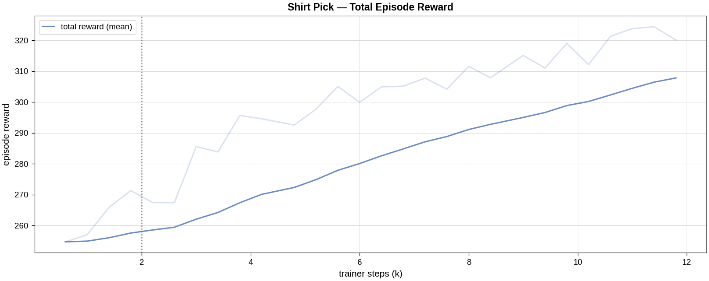
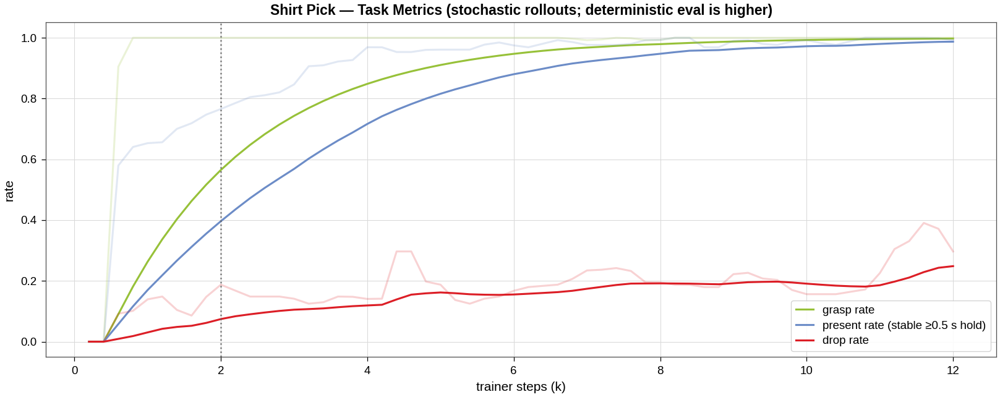
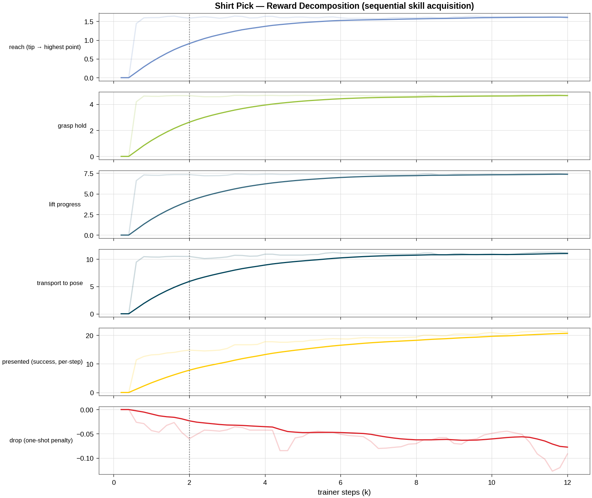
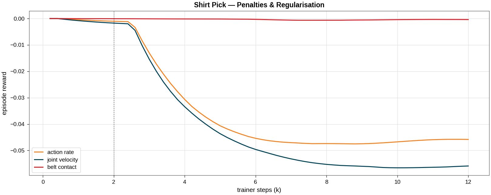
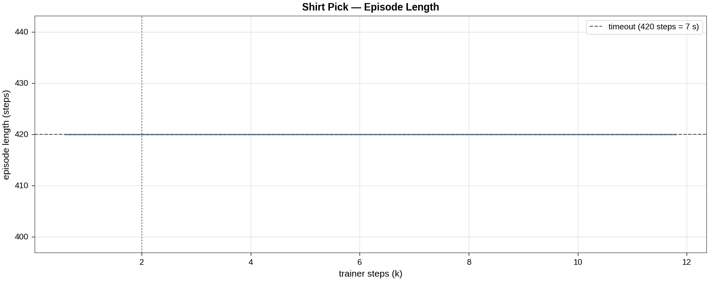

# Shirt Pick Task

[← Back to extension overview](../../../../../../README.md) · [Project root](../../../../../../../../README.md)

**Task 1 of the cloth-sorting pipeline.** The retrieving robot picks a
PBD-cloth-simulated T-shirt from the conveyor belt at its **highest point**
and holds it in front of the inspection camera (presentation pose), where the
condition-assessment cameras (task 2) take over.

> **Status: trained & deployable (2026-07-03, Phase 3).**  Deterministic
> **present_rate 1.000 / grasp_rate 1.000** (96 episodes × 2 seeds) at the
> workspace-analysis presentation pose **(0.15, 0.9, 1.6)** on trash-toss
> crumpled initial states.  Selected checkpoint:
> `logs/skrl/shirt_pick/2026-07-03_19-33-17_ppo_torch_seed3/checkpoints/agent_12000.pt`
> (low-drop alternative: `agent_8000`, present 0.979 / drop 0.01–0.02).
> Stage-0 physics de-risk closed —
> see [cloth_stage0_physics_derisk.md](../../../../../../../../doc/reports/cloth_stage0_physics_derisk.md);
> full run log in the
> [optimization tracking](../../../../../../../../doc/reports/shirt_pick_optimization_tracking.md).

## Table of Contents

- [Goal](#goal)
- [Variants](#variants)
- [Scene](#scene)
- [Cloth Grasp](#cloth-grasp)
- [Controlled Joints](#controlled-joints)
- [Actions](#actions)
- [Observations (policy group)](#observations-policy-group)
- [Rewards](#rewards)
- [Terminations](#terminations)
- [Reset Events](#reset-events)
- [Simulation Parameters](#simulation-parameters)
- [Heuristic Baseline & Reachability](#heuristic-baseline--reachability)
- [Training Results](#training-results)
- [Open Work](#open-work)
- [Running](#running)
- [Related](#related)

## Goal

Train an RL agent to retrieve a garment from the (trash) conveyor and present
it for inspection:

1. **Reach** the shirt lying on the conveyor belt.
2. **Grasp** it at its highest point (the canonical, depth-camera-trivial
   pick per the [research report](../../../../../../../../doc/reports/RESEARCH_cloth_sorting_pipeline.md) §2).
3. **Lift** it clear of the belt.
4. **Present** it at the presentation pose `PRESENTATION_POS = (0.15, 0.90, 1.60)`
   — the Project-Thesis workspace-analysis pose, probe-verified reachable
   with the shirt held (8/8 envs, no joint-limit or torque saturation:
   `scripts/model_validation/probe_present_pose.py`) — and **hold it
   stable** there.

Success metrics (TensorBoard `Metrics/…`): `grasp_rate` (episode saw an
attached grasp), `present_rate` (**windowed stable hold**: ≥ 80 % of the last
1 s with grasp point < 0.15 m of the pose, **cloth centroid speed** < 0.20 m/s,
and grasped).  Both stability gates are measured decisions: consecutive-steps
latches are too brittle for PD-arm sway, and at the raised presentation
posture the EE sways 0.24–0.27 m/s while the hanging garment filters that to
0.06–0.20 m/s — the camera inspects the cloth, so the cloth's stillness is
the honest criterion (see the tracking report).  Also logged: `drop_rate`
(an established grasp was lost — the task never releases).
Note: training-time (stochastic) `present_rate` under-reports badly — the
exploration noise breaks the speed gate; judge checkpoints by
**deterministic** eval (`scripts/skrl/evaluate_shirt_pick.py`).

The terminal states of this task (particle positions/velocities + joint state
+ attachment) form the **initial-state bank of shirt_present** — the pipeline
is chained through cached state banks, not live policy hand-off.

## Variants

| Environment ID | Robot | Description |
|---|---|---|
| `Template-Shirt-Pick-Tensegrity-v0` | 5-DOF tensegrity + Robotiq 2F-140 | PD joint-position control (first target robot) |
| `Template-Shirt-Pick-Tensegrity-Play-v0` | 〃 | 50-env play/eval configuration |
| `Template-Shirt-Pick-Head-Tensegrity-v0` | 〃 | **Stage-2 S2**: + learned grasp-point refinement head ([mdp/grasp_head.py](mdp/grasp_head.py)) — 2-dim xy offset around the highest point (surface-snapped), 12 region-keypoint + border-dist observations, coverage terminal bonus |
| `Template-Shirt-Pick-Head-Tensegrity-Play-v0` | 〃 | 50-env play/eval for the head variant |

Planned retriever variants (same `_set_robot_params` pattern, mounts from
[proj_base_scene_cfg.py](../shared/proj_base_scene_cfg.py)): UR5e, UR10,
Kinova Gen3 — each plain-F140 and "Frankenstein" (+ tensegrity wrist), as in
the [reach task](../reach/README.md).

## Scene

Uses the **central cloth-sorting scene**
[shared/cloth_sorting_scene_cfg.py](../shared/cloth_sorting_scene_cfg.py),
shared by all three pipeline tasks (change it once, all tasks follow).  It
rebuilds the hand-authored showcase stage
[res/Scenes/cloth_sorting_showcase.usd](../../../../../../../../res/Scenes/cloth_sorting_showcase.usd):

| Entity | Description |
|---|---|
| `robot` | Retrieving robot, hanging mount above the belt at `(0.15, 0.0, 2.30)` (tensegrity) |
| `conveyor`, `conveyor_upstream` | Two belts end-to-end along +X (visual; complex colliders disabled for cloth) |
| `conveyor_collider` | Invisible box, top face at belt height 0.80 m (PBD cloth support surface) |
| `shirt` (`{ENV}/Shirt`) | ClothesNet T-shirt, ~11 048 PBD particles, spawned by a prestartup event |
| `shirt_proxy` | Kinematic rigid body synced to the cloth centroid each step (rewards/obs read this) |
| `drum_reusable` / `drum_recyclable` / `drum_trash` | The three sorting drums at `(0.15, 1.0)` / `(1.35, 1.0)` / `(0.75, 1.6)` (unused in this task, present for scene consistency) |
| `pedestal` | Visual column under the second-robot mount `(0.75, 1.0, 0.75)` (robot itself not spawned here) |
| — | Inspection-camera **frame constants** `INSPECTION_CAMERA_POS = (0.15, 2.0, 1.25)` looking −Y; no camera sensor is spawned — observations stay camera-derivable without camera simulation |

### Initial states: the crumpled-state bank

At reset the shirt is restored from the **cached crumpled-state bank**
(`res/Props/Cloth/banks/tshirt_crumpled_bank.pt`, 288 states): a **trash-toss**
protocol — full lift-off (pick height 0.45–0.80 m at 1.2 m/s with lateral
drag), momentum release, 50 % half-folded lays, 50 % double tosses, and
on-belt/settled validation of every state — generated by
[scripts/generate_crumpled_bank.py](../../../../../../../../src/tensegrity_pick/scripts/generate_crumpled_bank.py).
Each reset samples a state and applies **yaw + mirror augmentation** plus
±3 cm XY jitter around `SHIRT_REST_XY = (0.18, 0.0)`; positions AND
velocities are written (the Stage-0-validated deterministic restore path,
1.2 ms/reset).  `ShirtPickEnv.bank_fraction` mixes in flat lays as a
curriculum knob (currently 1.0 = crumpled only); a missing bank file falls
back to the flat lay with a warning.  Crumpledness (v2): pile height ⌀0.10 m
(max 0.15) and xy footprint shrunk to 0.71–0.77× the flat lay.

## Cloth Grasp

Inherited unchanged from shirt_place via
[shared/cloth_sorting_env.py](../shared/cloth_sorting_env.py): the gripper
closes near the cloth's highest point → the pad-sized particle cluster
(radius 0.07 m) is pinned to the dynamic finger tip (`GraspMode.ANCHOR`,
solver anchors); opening releases it.  Full rationale and tuning history in
the [shirt_place README](../shirt_place/README.md#deterministic-cloth-grasp).

> Note: the dynamic finger-tip offsets are calibrated on the tensegrity
> `tool_link_0` frame; UR/Kinova EE frames need re-calibration before those
> variants grasp reliably (tracked in [doc/TODO.md](../../../../../../../../doc/TODO.md)).

## Controlled Joints

Tensegrity variant (same as shirt_place):

| Group | Joints |
|---|---|
| Base (prismatic) | `base_y_joint`, `base_z_joint` |
| Arm | `elbow_joint`, `wrist_y_joint`, `wrist_x_joint` |
| Gripper | `finger_joint` (+ 7 mimic joints driven kinematically) |

## Actions

Tensegrity variant — 6 dims:

| Term | Dims | Type | Scale / Clip |
|---|---|---|---|
| `base_delta` | 2 | JointPositionAction (delta from default) | scale 0.5; y ∈ [−0.5, 0.5], z ∈ [−0.5, 0] |
| `arm_action` | 3 | JointPositionAction (delta from default) | scale 1.0; elbow ±1.5, wrists ±0.8 |
| `gripper_action` | 1 | BinaryJointPositionAction | open 0.0 / close 0.7854 |

**Head variant only** (+2 dims, 8 total):

| Term | Dims | Type | Scale / Clip |
|---|---|---|---|
| `grasp_offset` | 2 | `GraspOffsetAction` — xy offset of the grasp target around the highest point | clamp [−1, 1] × 0.15 m; snapped to the local cloth top (top-20 particles within 0.05 m); frozen (falls back to the plain highest point) once the grasp latches; zero action ≡ stage-1 target |

## Observations (policy group)

35 dims (tensegrity variant), no noise corruption:

| Term | Dims | Description |
|---|---|---|
| `joint_pos_rel` | 6 | Controlled joint positions relative to defaults |
| `joint_vel_rel` | 6 | Controlled joint velocities |
| `ee_pos_w` | 3 | Grasp-centre position (env-local) |
| `shirt_rel` | 3 | Shirt centroid relative to grasp centre |
| `grasp_target_rel` | 3 | **Highest point relative to the dynamic finger tip** — the exact attach-trigger geometry (depth-camera-trivial in reality) |
| `shirt_vel` | 3 | Shirt centroid velocity |
| `present_rel` | 3 | Presentation pose relative to the shirt |
| `gripper_closure` | 1 | Normalized closure [0 = open, 1 = closed] |
| `grasp_active` | 1 | 1.0 while the attachment grasp holds |
| `actions` | 6 | Previous action |

**Head variant only** (+39 dims → 74 total; `actions` grows to 8):

| Term | Dims | Description |
|---|---|---|
| `region_keypoints` | 36 | The study's 12 region-landmark keypoint particle positions relative to the finger tip (privileged stand-in for INF's estimated keypoints + visibility flags — rebase when merged) |
| `grasp_border_dist` | 1 | Flat-rest border distance of the particle nearest the current grasp target (border-near holds present better, study §5) |

Planned camera-realistic additions (report §6): highest-point position
(`cloth.highest_point_w` already exists), N down-sampled surface points, cloth
bounding box.  **No semantic keypoints on the crumpled state** (unreliable per
the literature); privileged cloth state goes to a critic-only group once
asymmetric actor–critic is verified for skrl 2.1.0.

## Rewards

Sequential pick-and-present structure ([mdp/rewards.py](mdp/rewards.py)),
ported from the validated shirt_place design and adapted from
release-into-drum to present-and-HOLD:

| Term | Weight | Description |
|---|---|---|
| `reaching` | 2.0 | `1 − tanh(‖tip − highest point‖ / 0.25)` — the attach geometry |
| `grasp_hold` | 5.0 | Per-step while the attachment grasp holds |
| `lift` | 8.0 | Clamped grasp-point height progress above the belt (0–0.30 m, grasp-gated) |
| `to_presentation` | 15.0 | `1 − tanh(‖grasp point − pose‖ / 0.35)`, **grasp-gated** (closes the fling hack) |
| `presented` | 30.0 | Per-step: held at the pose (< 0.15 m) AND cloth still (centroid < 0.2 m/s) — the success reward |
| `drop` | −120.0 | **One-shot** the step an established grasp is lost (dt-scaled ≈ −2) |
| `belt_contact` | −10.0 | Finger tips pressing below the belt surface |
| `action_rate` | −1e-4 → −3e-3 | L2, curriculum-ramped @ 2000 trainer steps |
| `joint_vel` | −1e-4 → −2e-3 | L2, curriculum-ramped @ 2000 trainer steps |

**Head variant only:**

| Term | Weight | Description |
|---|---|---|
| `coverage_bonus` | 1800.0 | **One-shot** at the present latch: min-max-normalised `REGION_COVERAGE_LUT[hold region]` — predicted downstream Task-2 coverage of the achieved first grasp (dt-scaled ≈ 30 × norm-coverage; hem_corner/side ≈ +30, chest ≈ 0). LUT derived offline from the stratified pair map: `scripts/model_validation/build_pick_region_coverage_lut.py` |

> **dt-scaling (from shirt_place):** Isaac Lab multiplies rewards by dt
> (1/60 s) — a per-step weight w earns ≈ w × episode-seconds per episode; a
> one-shot earns w/60, so the drop penalty is sized ~60× the per-step terms.
>
> **No anti-hover fade needed here** (unlike shirt_place): holding at the
> goal IS the task, so the per-step `presented` bonus is the success reward
> and accrues fastest for an early, stable arrival.

## Terminations

| Term | Condition |
|---|---|
| `time_out` | Episode length **7.0 s** (the scripted baseline needs ~7.5 s serially; RL overlaps phases and needs 0.5 s hold on top) |
| `joint_vel_diverged` | Any controlled joint > 100 rad/s (solver divergence guard) |
| `belt_collision` | Finger tips > 0.12 m below the belt surface (validated threshold from shirt_place) |

## Reset Events

| Event | Mode | Description |
|---|---|---|
| `disable_conveyor_colliders` | prestartup | Swap conveyor tri-mesh colliders for the box (PBD tunnelling fix) |
| `apply_cloth` | prestartup | Reference garment per env + author PBD schemas (before `sim.reset()`) |
| `reset_all` | reset | Scene to default state |
| `reset_arm` | reset | Arm joints ±0.10 rad around defaults |
| `reset_gripper` | reset | Finger joint to 0 (open) |
| cloth reset | (env-owned) | Crumpled-bank restore (or flat-lay fallback) via `ClothSortingEnvBase._reset_cloth` — not an EventTerm because the cloth view is owned by the env |

## Simulation Parameters

Applied by `configure_cloth_sim()` in
[shared/cloth_sorting_scene_cfg.py](../shared/cloth_sorting_scene_cfg.py) —
the profile validated in shirt_place:

| Parameter | Value |
|---|---|
| Physics dt / decimation | 1/60 s / 1 (60 Hz control) |
| PBD solver iterations | 24 (stretch inextensibility) |
| Cloth self-collision | on; CCD off |
| `gpu_max_particle_contacts` | 2²² |
| `gpu_collision_stack_size` | 2³¹ − 1 (signed-32-bit max; 2³¹ overflows negative → silent contact drops) |
| `replicate_physics` | **False** (PBD cloth needs per-env physics) |
| Default envs | 512 (train) / 50 (play) / 4 (smoke tests) |

## Heuristic Baseline & Reachability

[scripts/model_validation/baseline_shirt_pick.py](../../../../../../../../src/tensegrity_pick/scripts/model_validation/baseline_shirt_pick.py)
is a scripted P-servo pick (align over the highest point → descend → close →
lift → servo to the pose → hold) — the report-recommended pre-RL baseline and
the reachability gate for `PRESENTATION_POS`.

Results (8 envs, v1 bank, interim pose): **ever-grasped 6/8, presented 1/8**.
Superseded for reachability questions by
[probe_present_pose.py](../../../../../../../../src/tensegrity_pick/scripts/model_validation/probe_present_pose.py)
(unclipped numeric-Jacobian servo + joint-limit/torque report), which showed
the earlier "unreachable" verdicts were probe artifacts — the current pose
(0.15, 0.9, 1.6) is reached 8/8 with hold distance 0.000 m and no limit or
torque binding.

## Training Results (Phase 3 — final task definition)

Two-stage training at 128 envs (the Stage-0 benchmark optimum band — cloth
throughput FALLS above ~128 envs), all episodes from the trash-toss bank:

1. `2026-07-03_12-05-56_ppo_torch_seed1` — 20 k timesteps from scratch.
   Reached present 0.37 deterministically: the gate diagnosis showed the
   raised posture's EE sway (0.24–0.27 m/s) sat permanently above the EE
   speed gate → the success reward was unharvestable.  Fix: gate on the
   **cloth centroid speed** (the hanging garment filters the sway to
   0.06–0.20 m/s, and the camera inspects the cloth anyway).
2. `2026-07-03_19-33-17_ppo_torch_seed3` — +12 k continuation with the
   cloth-speed gate.

Deterministic (mean-action) checkpoint evaluation, 96 episodes each:

| Checkpoint | Seed | present_rate | grasp_rate | drop_rate |
|---|---|---|---|---|
| run-1 agent_20000 (EE gate) | 7 / 12 | 0.365 / 0.375 | 0.865 / 0.875 | 0.000 |
| continuation agent_8000 | 7 / 12 | 0.979 / 0.979 | 0.990 / 0.990 | 0.021 / 0.010 |
| **continuation agent_12000 (selected)** | 7 / 12 | **1.000 / 1.000** | **1.000 / 1.000** | 0.073 / 0.052 |

Trade-off: agent_12000 slips the grasp late in 5–7 % of episodes (after the
present latch); `agent_8000` is the low-drop alternative if the Task-1→2
handoff prefers held-at-end robustness.  Phase-2 history (interim pose,
v1 bank, 0.85 present; rejected fine-tune) is preserved in the
[tracking report](../../../../../../../../doc/reports/shirt_pick_optimization_tracking.md).

Figures — run 1 in `figures/tensegrity/`, continuation below:







Regenerate: `/home/robot/Isaac/IsaacLab/_isaac_sim/python.sh
scripts/plot_shirt_pick_training_results.py --run <run> --label <label>`.

## Open Work

Tracked in [doc/TODO.md](../../../../../../../../doc/TODO.md): fine-tune to
> 90 % present (grasp misses on hard piles are the residual), terminal-state
bank generation for the shirt_present handoff
(`ShirtPickEnv.snapshot_terminal_states` hook exists), camera-realistic
observations (N surface points, bbox), retriever robot variants
(UR/Kinova ± Frankenstein wrist), curriculum over `bank_fraction` if needed.

## Running

```bash
# from src/tensegrity_pick, conda env env_isaaclab

# Smoke tests
python scripts/zero_agent.py   --task=Template-Shirt-Pick-Tensegrity-v0 --num_envs 4 --headless
python scripts/random_agent.py --task=Template-Shirt-Pick-Tensegrity-v0 --num_envs 4 --headless

# (Re)generate the crumpled-state bank (64 envs x 4 rounds = 256 states, ~5 min)
python scripts/generate_crumpled_bank.py --headless --num_envs 64 --rounds 4

# (Re)generate the Task-1→2 TERMINAL bank (Stage-2 S0: deterministic rollout of
# the selected checkpoint, snapshot at the present latch, slips included, ~12 min)
python scripts/asset_generation/generate_pick_terminal_bank.py --headless \
    --num_envs 64 --seed 7 --target_presented 560

# Scripted heuristic baseline + reachability check
python scripts/model_validation/baseline_shirt_pick.py --headless --num_envs 8

# Train (~2.5 h @ 128 envs on an RTX A6000; see the Stage-0 benchmark —
# do NOT go above 128 envs, cloth throughput scales sub-linearly)
python scripts/skrl/train.py --task=Template-Shirt-Pick-Tensegrity-v0 --num_envs 128 --seed 1 --headless

# Play a checkpoint (deterministic mean actions)
python scripts/skrl/play.py --task=Template-Shirt-Pick-Tensegrity-Play-v0 --num_envs 4 \
    --checkpoint <path/to/agent.pt>
```

Note: cold-cache startup of cloth tasks can take ~10–15 min (shader/Kit
caches); warm starts ~3 min.  Use `PYTHONUNBUFFERED=1` when redirecting logs.

## Related

- [Optimization tracking](../../../../../../../../doc/reports/shirt_pick_optimization_tracking.md)
- [Research report (pipeline plan)](../../../../../../../../doc/reports/RESEARCH_cloth_sorting_pipeline.md)
- [shirt_place](../shirt_place/README.md) — the validated predecessor task (grasp mechanics, cloth model, PPO determinism profile)
- [shirt_present](../shirt_present/README.md) — pipeline task 2 (consumes this task's terminal states)
- [shirt_distribute](../shirt_distribute/README.md) — pipeline task 3
- [Shared scene](../shared/cloth_sorting_scene_cfg.py) · [Shared env base](../shared/cloth_sorting_env.py) · [Cloth asset](../../../../../../../../res/Props/Cloth/README.md)
