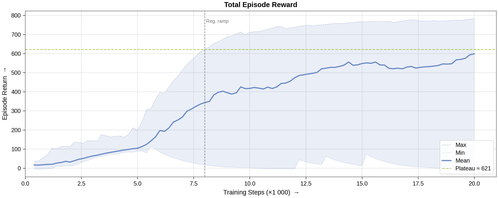
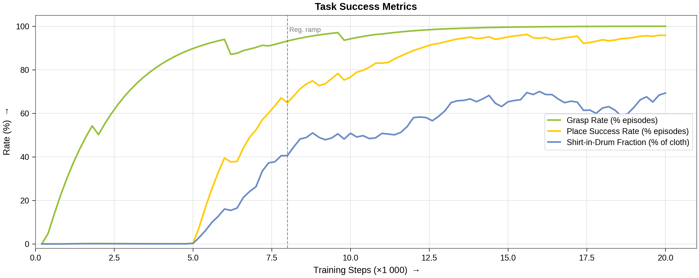
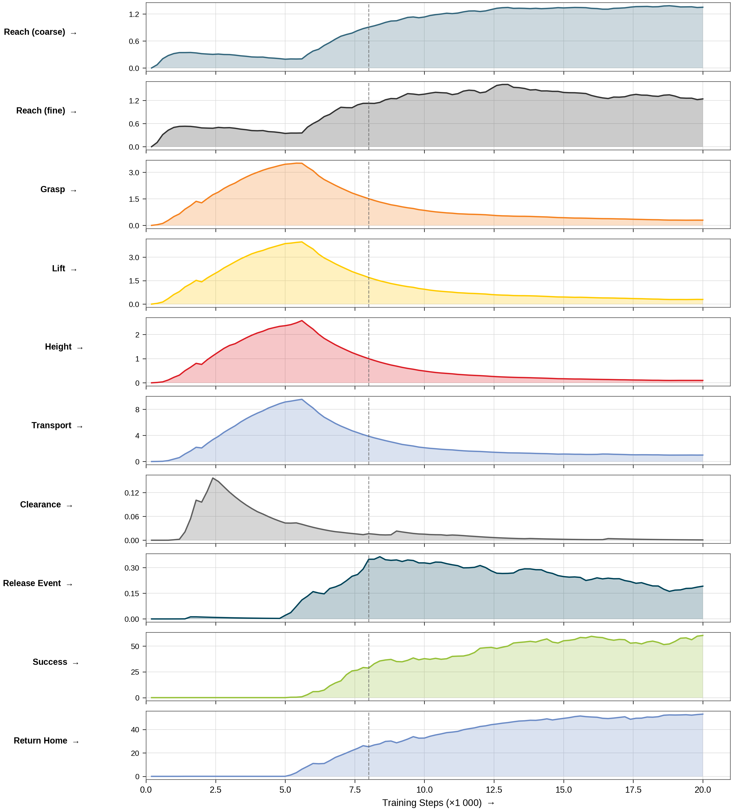
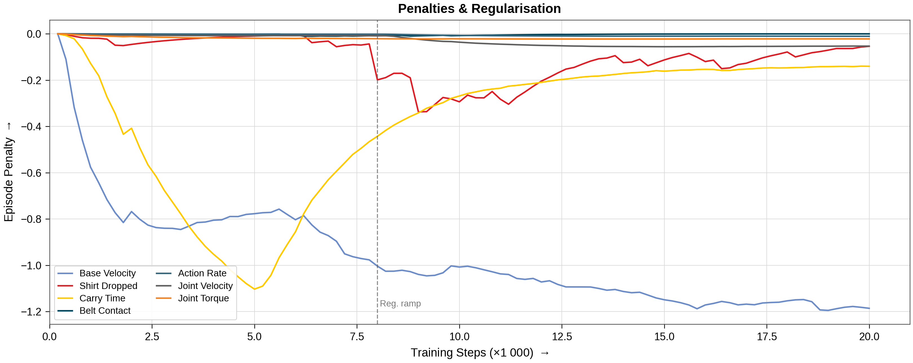
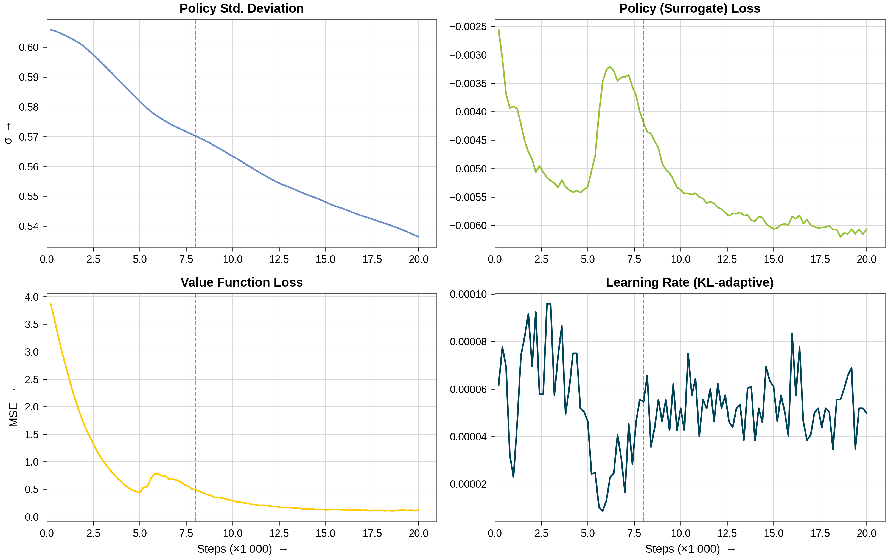
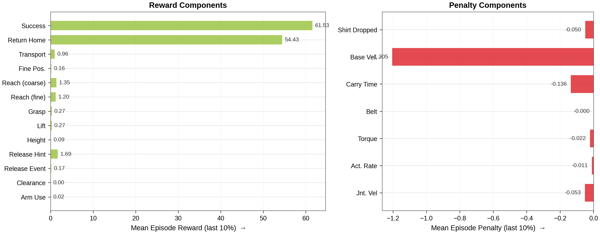
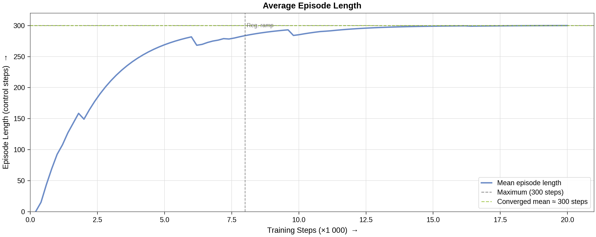

# Shirt Place Task

[← Back to extension overview](../../../../../../README.md) · [Project root](../../../../../../../../README.md)

Shirt pick-and-place with the 5-DOF tensegrity manipulator and Robotiq 2F-140
gripper.  The robot must grasp a **PBD-cloth-simulated T-shirt** from the
conveyor belt, lift it clear, carry it to a target drum, and release it so the
garment falls inside — then return to its neutral pose.


> **Status: trained & deployable (2026-07-02).**  The deterministic (mean-action)
> policy places the shirt in **100 % of evaluation episodes** with a mean
> **~93 % of cloth particles inside the drum**, then returns the arm toward its
> start pose.  Final checkpoint:
> `logs/skrl/shirt_place/2026-07-02_15-10-58_ppo_torch_seed1/checkpoints/agent_4000.pt`.

## Table of Contents

- [Goal](#goal)
- [Variants](#variants)
- [Scene](#scene)
- [Deterministic Cloth Grasp](#deterministic-cloth-grasp)
- [Controlled Joints](#controlled-joints)
- [Actions (6 dims)](#actions-6-dims)
- [Observations (policy group)](#observations-policy-group)
- [Rewards](#rewards)
- [Terminations](#terminations)
- [Curriculum](#curriculum)
- [Reset Events](#reset-events)
- [Simulation Parameters](#simulation-parameters)
- [Cloth Model](#cloth-model)
- [PPO Configuration & Determinism](#ppo-configuration--determinism)
- [Design Decisions & Lessons Learned](#design-decisions--lessons-learned)
- [Running](#running)
- [Training Results](#training-results)
- [Related](#related)

## Goal

Train an RL agent to perform a full pick → transport → place sequence with a
deformable cloth object (T-shirt):

1. **Reach** the shirt lying flat on the conveyor belt.
2. **Grasp** it at its highest point (deterministic attachment, see below).
3. **Lift** it above the belt surface.
4. **Transport** it laterally, suspended, to the drum centre.
5. **Release** it centred over the drum opening so the whole garment falls in.
6. **Success** accumulates per-step reward proportional to the *fraction of
   cloth particles* inside the drum (released cloth only).
7. **Return** the arm to its neutral/start pose after placement.

Success metrics (TensorBoard `Metrics/…`): `place_success_rate` (≥ 15 % of
particles in the drum after a release), `shirt_in_drum_fraction` (peak
released-particle fraction — the honest "how much of the shirt is in" number),
and `grasp_rate`.

## Variants

| Environment ID | Robot | Description |
|---|---|---|
| `Template-Tensegrity-Shirt-Place-v0` | 5-DOF PD | Standard training (512 envs default) |
| `Template-Tensegrity-Shirt-Place-Play-v0` | 5-DOF PD | Evaluation (50 envs) |
| `Template-Tensegrity-Shirt-Place-Physical-Tendon-v0` | Physical tendon | Body-force tendons (512 envs) |
| `Template-Tensegrity-Shirt-Place-Physical-Tendon-Play-v0` | Physical tendon | Evaluation (50 envs) |

All variants use `TensegrityShirtPlaceEnv` (custom `ManagerBasedRLEnv` subclass
with cloth integration, deterministic grasp, and latched
`was_grasped`/`was_placed` flags).

## Scene

Extends `ProjBaseSceneCfg` with a PBD particle-cloth T-shirt, an invisible
belt-surface box collider, and a kinematic centroid proxy.

| Element | Details |
|---|---|
| Robot | `TENS_5DOF_GRIPPER_CFG` at (0.15, 0.0, 2.30) m, ceiling-mounted |
| T-shirt (cloth) | PBD particle cloth, ~11 048 particles, 0.30 kg (`tshirt_clothesnet.usd`) |
| Shirt proxy | Kinematic cube (0.01 m, invisible, collision-free) — synced to the cloth centroid each step |
| Conveyor collider | Invisible static box (4.0 × 0.9 × 0.4 m), top face at belt height 0.80 m — PBD cloth tunnels through the conveyor USD's mesh colliders, so those are disabled and both cloth **and** gripper collide with this box instead |
| Target drum | Plastic drum at (0.15, 0.85, 0.0) m — Ø 0.547 m, 0.88 m tall |
| Conveyor | Dual belt (4 m total), surface at 0.80 m, **inactive** |
| Env spacing | 5.0 m · `replicate_physics=False` (required for per-env cloth) |

The shirt is laid **flat and fixed** at (0.18, 0.0) directly under the
gripper's default grasp position at every reset (no fold, no crumble, no
XY/yaw randomisation).  A one-off pre-settle at env init collapses the raw
garment mesh into a relaxed flat sheet that is reused as the per-reset rest
shape.

## Deterministic Cloth Grasp

Friction between the Robotiq pads and PBD cloth does **not** lift this shirt
(validated).  Instead the grasp is a *deterministic attachment* at the cloth's
highest point, mirroring the GarmentLab / DexGarmentLab `AttachmentBlock`:

- **Attach** — when the gripper is commanded closed AND the *dynamic finger
  tip* is within `ATTACH_TRIGGER_DIST = 0.10 m` of the cloth's highest region,
  the particle cluster within `ATTACH_WELD_RADIUS = 0.07 m` of the tip is
  grabbed; the per-particle offsets are recentred onto the tip (no float gap).
- **Hold** — each control step the grabbed cluster is pinned to the moving tip.
- **Detach** — commanding the gripper open releases the cluster.

Two mechanics are switchable via `SHIRT_GRASP_MODE` in
`shirt_place_scene_cfg.py`:

| Mode | Mechanism | Stretch ratio |
|---|---|---|
| `GraspMode.WELD` | Teleport cluster to tip each step (`set_positions`) | 1.03 |
| `GraspMode.ANCHOR` (**active**) | Pin particles as PBD solver anchors (inverse mass ≈ 0 via `set_masses`) — what a PhysX particle attachment does internally | **1.00** |

A literal runtime `PhysxPhysicsAttachment` is **not** viable in Isaac Lab's
tensorised pipeline (GPU physics is baked at `sim.reset()`; a mid-episode
attachment prim is not recognised — verified empirically).  `ANCHOR` is the
pipeline-safe equivalent.

The gripper linkage is driven **kinematically** to its commanded closure each
step (`_drive_gripper`, 4 rad/s → smooth ~0.2 s close): the native Robotiq PD
drives are too weak / fight the four-bar linkage, so the pads did not visibly
close.  Grasp/release decisions read the *commanded* finger target (robust to
a physically jammed gripper).

Mechanics are covered by a scripted regression test
(`scripts/model_validation/test_shirt_fixes.py`, 5 checks: stretch, released
fall, linkage coherence, tip-based grasp, small weld cluster) — keep it 5/5
PASS after any grasp/cloth change.

## Controlled Joints

| Joint | Type | Limits | Action Clip |
|---|---|---|---|
| `base_y_joint` | Prismatic | ±0.5 m | (−0.5, 0.5) |
| `base_z_joint` | Prismatic | −0.5 … 0.0 m | (−0.5, 0.0) |
| `elbow_joint` | Revolute | ±1.5 rad | (−1.5, 1.5) |
| `wrist_y_joint` | Revolute | ±0.8 rad | (−0.8, 0.8) |
| `wrist_x_joint` | Revolute | ±0.8 rad | (−0.8, 0.8) |
| `finger_joint` | Revolute | — | Binary (open=0.0, close=0.7854) |

## Actions (6 dims)

| Group | Dims | Type | Scale |
|---|---|---|---|
| `base_delta` | 2 | Joint position delta | 0.50 |
| `arm_action` | 3 | Joint position delta | 1.0 |
| `gripper_action` | 1 | Binary joint position | open=0.0, close=0.7854 |

## Observations (policy group)

| Term | Dim | Description |
|---|---|---|
| `joint_pos_rel` | 6 | Joint positions (arm + finger) |
| `joint_vel_rel` | 6 | Joint velocities |
| `ee_pos_w` | 3 | End-effector world position |
| `ee_vel_w` | 3 | End-effector linear velocity |
| `shirt_rel` | 3 | Shirt grasp point relative to grasp centre |
| `fingertip_shirt_rel` | 3 | Shirt grasp point relative to dynamic fingertip |
| `gripper_closure` | 1 | Normalised gripper closure [0–1] |
| `gripper_torque` | 1 | Normalised gripper torque residual |
| `shirt_vel` | 3 | Shirt centroid linear velocity |
| `drum_rel` | 3 | Drum relative to grasp centre |
| `actions` | 6 | Last actions |
| `was_placed` | 1 | Binary flag: shirt placed — lets the policy switch to return-to-neutral |

Total: **39** (normalised by a `RunningStandardScaler`).

## Rewards

Sequential structure: reach → grasp → lift → transport → clear-over-drum →
**release** → success → return-to-neutral.

> **Reward-scale note:** Isaac Lab multiplies reward terms by dt (1/60 s).  A
> per-step weight `w` earns ≈ `w × 5` over a full 5 s episode; a **one-shot**
> weight `w` earns only `w / 60`.  One-shot bonuses therefore carry weights
> ~60× larger than per-step terms.

| Phase | Term | Weight | Description / Gate |
|---|---|---|---|
| 1a | `reaching_shirt` | +2.0 | tanh fingertip→grasp-point (std=2.0) · off once grasped/placed |
| 1b | `reaching_shirt_fine` | +5.0 | tanh (std=0.5) · off once grasped/placed |
| 2 | `grasping` | +3.0 | closure × proximity + bonus while attached · off after placement |
| 3 | `lifting_shirt` | +5.0 | binary grasp-point above belt+0.06 · × hold-fade |
| 3b | `height_bonus` | +5.0 | grasp-point height up to `max_height=0.65` · × hold-fade |
| 4 | `goal_tracking` | +15.0 | tanh grasp-point XY→drum (std=1.0), `lift_threshold=0.25` · × hold-fade |
| 4b | `goal_tracking_fine` | +6.0 | tanh (std=0.20) · × hold-fade |
| 4c | `clearance_over_drum` | +4.0 | lowest particle above rim (margin 0.05 m) while over the footprint |
| 5 | `release` | +5.0 | per-step openness over drum (gradient hint only) |
| 5b | **`release_event`** | **+240.0** | **one-shot** the step the gripper opens over the drum, **graded ×(0.25…1.0)** by centering × whole-shirt-lift quality |
| 5c | `carry_time` | −1.5 | per-step while a lifted shirt is held unplaced (anti-hover) |
| 6 | **`shirt_in_target`** | **+120.0** | particle-fraction-in-drum × `was_grasped` × **released** (`~grasp_active`) |
| 7 | `return_to_neutral` | +200.0 | 1−tanh(joint deviation/0.40), gated `was_placed` |
| Reg. | `action_rate` | −3e-4 → **−3e-3** | curriculum ramp (see below) |
| Reg. | `joint_vel` | −3e-4 → −2e-3 | curriculum ramp |
| Reg. | `arm_utilization` | +0.10 | anti-frozen-arm · **off after placement** |
| Reg. | `belt_contact` | −10.0 | fingertip depth below belt |
| Reg. | `joint_torque` | −0.025 | arm joint effort |
| Reg. | `base_velocity` | −1.5 | prefer arm over base (tensegrity only) |
| Pen. | `shirt_off_conveyor` | −5.0 | shirt fallen below belt level **outside** the drum footprint |
| Metric | `metric_*` | ±0.01 | logging only |

### Anti-hover design (load-bearing — preserve these principles)

The release-required task breeds hover local-optima: per-step positioning
rewards can exceed the risky release payoff, so the policy parks the shirt
over the drum forever.  Three mechanisms break this:

1. **Placement pays only for *released* cloth** (`shirt_in_target` is gated on
   `~grasp_active`) — dipping the held shirt into the drum earns nothing.
2. **Positioning shaping fades to zero as the shirt clears** — lift, height,
   and goal-tracking are multiplied by `1 − clearance_fraction`, so a
   cleared-over-drum shirt is a reward desert; only releasing pays.  The
   clearance predicate must be *kinematically reachable*: full fade completes
   at a shirt-bottom height of 0.93 m (rim 0.88 + margin 0.05) — the arm's max
   lift.  (An earlier 0.20 m margin demanded 1.08 m, which is unreachable, so
   the fade never engaged.)
3. **Time pressure** — `carry_time` bleeds reward while a lifted shirt is held,
   and the one-shot `release_event` makes committing to the drop a discrete
   rewarded event whose magnitude grades drop quality (centred + fully lifted
   ≈ 4× a rim-graze).

A terminate-after-place termination was tried and **backfired** (ending the
episode cut the placed shirt's future return below hovering-to-timeout, so PPO
hovered).  Episodes always run to timeout; a placed shirt keeps earning
`return_to_neutral`.

## Terminations

| Term | Type | Condition |
|---|---|---|
| `time_out` | Truncation | Episode length exceeded (5.0 s / 300 control steps) |
| `joint_vel_diverged` | Truncation | Any controlled joint velocity > 100 rad/s |
| `belt_collision` | Truncation | Virtual fingertip > 0.12 m below belt (full-force grind state; the box collider physically stops the gripper ~0.125 m below at most, so 0.20 was dead code) |

## Curriculum

| Step Threshold | Change |
|---|---|
| 2 000 | `action_rate` weight: −3e-4 → −3e-3 |
| 2 000 | `joint_vel` weight: −3e-4 → −2e-3 |

`num_steps` counts `env.step()` calls (= trainer timesteps), **not** per-env
samples: a 150 000 threshold never fires within a 20 000-timestep run.  The
2 000-step ramp suits fine-tuning from a competent checkpoint; raise it toward
~8 000 for from-scratch runs so exploration is unconstrained until the
behaviour has formed (discovery happens ~5–9 k).

## Reset Events

| Event | Details |
|---|---|
| `reset_all` | Full scene reset to defaults |
| `reset_arm` | Base + arm joints offset by ±0.10 rad; velocities zeroed |
| `reset_gripper` | `finger_joint` reset to 0.0 (fully open) |
| Cloth reset | `_reset_cloth` lays the pre-settled flat shirt at the fixed pose (called by the env, not an EventTerm — the cloth view is env-owned) |

## Simulation Parameters

| Parameter | Value |
|---|---|
| Physics dt | 1/60 s (60 Hz) |
| Decimation | 1 (control at 60 Hz) |
| Episode length | 5.0 s (300 control steps) |
| Default num_envs | 512 (train cfg) / 128 used in practice / 50 (play) |
| `replicate_physics` | `False` (required for PBD cloth) |
| `gpu_collision_stack_size` | 2³¹−1 (int32 max; 2³¹ overflows negative → silent contact drops) |
| `solver_type` | TGS (`1`) |

## Cloth Model

The garment is a **flat-laid ClothesNet shirt**
(`res/Props/Cloth/tshirt_clothesnet.usd`, welded manifold mesh, ~11 k verts,
mean edge ≈ 0.0098 m).  `ClothObject` supports two backends
(`SHIRT_CLOTH_BACKEND` in `shirt_place_scene_cfg.py`); **PBD particle cloth**
is the trained default.

The decisive stability fix (see
`doc/reports/cloth_sim_research/RESEARCH_isaaclab_cloth.md`): **collision
offsets must track the mesh particle spacing** — `particle_contact_offset =
mean edge length`, `solid_rest_offset = ½ edge`.  Larger offsets put spring
neighbours inside each other's contact radius and the solver pumps energy →
divergence / self-collision explosions.

| Parameter | Value | Note |
|---|---|---|
| stretch / bend / shear stiffness | 1e5 / 100 / 100 | PBD projects stiff constraints stably |
| spring / material damping | 0.2 / 0.5 | |
| aerodynamic drag / lift | **0 / 0** | non-zero made the light cloth float like foil |
| adhesion | **0** | non-zero glued the cloth to belt & drum rim |
| mass | 0.30 kg | heavy enough to fall/hang naturally |
| particle_contact_offset | mean edge (≈ 0.0098 m); solid_rest = ½ edge | the key fix |
| solver iterations | 24 | curbs over-stretch during carry |
| self-collision / CCD | on / **off** | CCD unneeded at the gentle carry speeds |

**XPBD — PhysX surface deformable (FEM)** remains available as the sanctioned
5.1 alternative (`tshirt_clothesnet_xpbd.usd`, Young's modulus 5000, Poisson
0.3, thickness 1 mm, density 350; needs `/physics/enableDeformableBeta`).

Regime adapted from [GarmentLab](../../../../../../../../repos/GarmentLab) and
[DexGarmentLab](../../../../../../../../repos/DexGarmentLab).

## PPO Configuration & Determinism

`config/tensegrity/agents/skrl_ppo_cfg.yaml` (skrl 2.1.0, PPO): rollouts 48,
5 epochs, 8 minibatches, γ = 0.99, GAE λ = 0.95, KL-adaptive LR (1e-4,
threshold 0.004), running observation/value scalers, `rewards_shaper_scale`
0.5, network [256, 128, 64] ELU.

**The deployed policy plays the deterministic mean action** (`play.py`), so
the Gaussian head must be forced to *put the behaviour into the mean*:

| Parameter | Old | New | Why |
|---|---|---|---|
| `entropy_loss_scale` | 0.005 | **0.0** | the entropy bonus froze std at ~0.96 → the policy became a saturated-noise controller (mean \|action\| ≈ 0.98) that placed *stochastically* but did **nothing** deterministically |
| `initial_log_std` | 0.0 | **−0.5** | moderate initial exploration (σ ≈ 0.6) |
| `max_log_std` | 2.0 | **0.5** | cap noise |
| `min_log_std` | −2.5 | **−3.0** | allow annealing toward deterministic |

**Always select checkpoints by deterministic evaluation on an unseen seed**
(`scripts/skrl/_eval_diag.py`), never by training curves — training metrics
are stochastic-play numbers and have been observed identical between runs
whose deterministic drum-fractions differed by 2.5×.

## Design Decisions & Lessons Learned

### Reward terms are dt-scaled — one-shots need ~60× weights

Isaac Lab multiplies rewards by dt (1/60 s).  The original `release_event=80`
one-shot was worth **1.3** total while per-step terms earned hundreds — the
"dominant" release bonus was noise.  Budget one-shot weights as `w/60` vs
per-step `w×5`.

### Curriculum `num_steps` counts trainer timesteps

`modify_reward_weight(num_steps=150000)` in a 20 000-timestep run never fires.
The smoothness ramp silently stayed at the exploration weight for all early
runs.

### The determinism gap is an entropy artefact, not an ability gap

With entropy bonus 0.005 the std never annealed; PPO learned to exploit its
own noise (biased random walk) instead of committing the mean.  Removing the
entropy bonus and capping `log_std` closed the gap completely (0 % → 100 %
deterministic place) *without* hurting stochastic training performance.

### Success must require release, and shaping must fade at the goal

See [Anti-hover design](#anti-hover-design-load-bearing--preserve-these-principles).
Additionally, all pre-place shaping (reach/grasp) is gated **off after
placement** — otherwise the reach term keeps pulling the arm toward the cloth
lying *inside the drum*, fighting `return_to_neutral` (this was Bug A's
residual drift).

### Gate every predicate on reachable geometry

The clearance fade demanded a shirt-bottom height of 1.08 m; the arm's
kinematic maximum is ~0.93 m.  The belt-collision termination demanded 0.20 m
penetration; the box collider physically stops the gripper at ~0.125 m.  Both
were silent dead code.  When a gate never fires, first check whether its
threshold is physically reachable.

### The gripper *does* collide with the belt (Bug B was a misdiagnosis)

The invisible `conveyor_collider` box stops the gripper collision meshes
exactly at belt height (verified: meshes rest at 0.794 m vs belt 0.800 m,
base_z drive saturated at 200 N, fingers bent back by contact).  The perceived
"piercing" came from the *virtual* fingertip constant reading 0.12 m below the
real meshes in the jammed state, plus the post-place dive behaviour.  Probe:
`scripts/model_validation/diag_belt_collision.py`.

### Over-tightened release shaping creates a rim-release attractor

Tightening `goal_tracking_fine` (std 0.20 → 0.15, weight 6 → 8) produced
*identical training curves* but deterministic drum-fraction collapsed
0.91 → 0.37: the policy released early at the rim edge.  Reverted.  Fine
positional shaping near the goal is dangerous — grade the *release event*
instead.

### Fine-tuning from a good checkpoint beats re-rolling

`train.py --checkpoint <pt> --max_iterations N` (timesteps = N × 48) resumed
cleanly and each targeted fix (post-place gating; return-to-neutral ×2) took
effect within 4 000 timesteps.  Fine-tune checkpoints oscillate hard
(0.97 → 0.70 → 0.85 within 4 k steps) — deterministically evaluate **every**
checkpoint.

### History (do not re-litigate)

Friction grasping cannot lift this cloth → deterministic attach (§ grasp).
Adhesion glued cloth to belt/drum → 0.  Aero drag/lift floated it → 0.
Dragging instead of lifting → transport gated on carry height 0.25 m.
Dipping-while-held → success requires release.  Terminate-after-place →
hover trap, removed.  Runtime `PhysxPhysicsAttachment` → not viable, use
ANCHOR.

## Running

```bash
cd src/tensegrity_pick
source /home/robot/miniconda3/etc/profile.d/conda.sh && conda activate env_isaaclab

# Train from scratch (~6 h @ 128 envs on an RTX A6000; ~2 s/it late)
python scripts/skrl/train.py --task Template-Tensegrity-Shirt-Place-v0 \
    --num_envs 128 --headless --seed 1

# Fine-tune from a checkpoint (N iterations × 48 rollouts = timesteps)
python scripts/skrl/train.py --task Template-Tensegrity-Shirt-Place-v0 \
    --num_envs 128 --headless --seed 1 --max_iterations 100 \
    --checkpoint logs/skrl/shirt_place/<run>/checkpoints/agent_XXXX.pt

# Play (GUI, deterministic mean actions — the deployment mode)
python scripts/skrl/play.py --task Template-Tensegrity-Shirt-Place-Play-v0 \
    --num_envs 4 --checkpoint logs/skrl/shirt_place/2026-07-02_15-10-58_ppo_torch_seed1/checkpoints/agent_4000.pt

# Headless quantitative eval (prints grasp/place/drum-fraction/neutral-dev live)
DIAG_LIMIT=950 python scripts/skrl/_eval_diag.py \
    --task Template-Tensegrity-Shirt-Place-Play-v0 --num_envs 16 --seed 7 \
    --headless --checkpoint <ckpt>            # PLAY_STOCH=1 for stochastic

# Mechanics regression (keep 5/5 PASS after any grasp/cloth change)
python scripts/model_validation/test_shirt_fixes.py --headless

# Read training metrics without tensorboard
python scripts/model_validation/read_tfevents.py logs/skrl/shirt_place/<run> Metrics
```

## Training Results

Main run `2026-07-02_00-09-06_ppo_torch_seed1` (PPO, 128 envs, 20 000
timesteps, ~6.3 h) with the reworked rewards + determinism-fixed PPO config.
Plots generated with `scripts/plot_shirt_training_results.py`.

### Final policy (after two fine-tune stages)

| Stage | Run / checkpoint | Deterministic eval (16 envs × 3 episodes, unseen seeds) |
|---|---|---|
| From scratch | `2026-07-02_00-09-06` / `agent_14000` | place 0.98 · drum-fraction 0.91 (0.77–1.00) · \|act\| 0.37 |
| + post-place gating | `2026-07-02_12-40-34` / `agent_4000` | place 1.00 · drum-fraction **0.97** (0.95–1.00) · weaker arm return |
| + return-to-neutral ×2 | **`2026-07-02_15-10-58` / `agent_4000`** ← **final** | place **1.00** (96/96, seeds 7+12) · drum-fraction **0.93** (0.89–0.96) · \|act\| 0.36 · best return-home |

The final checkpoint trades ~4 % drum-fraction for a markedly better
post-place return and the smoothest actions; use the stage-2 checkpoint if
maximum drum-fraction matters more than the return behaviour.

For reference, the pre-rework policy (run `2026-07-01_20-36-06`, entropy
0.005) reached 89 % place *stochastically* but **0 %** deterministically.

### Key performance numbers (training, stochastic)

| Metric | Converged Value | Notes |
|---|---|---|
| **Place success rate** | ~96–100 % | from ~7 k steps onward |
| **Grasp rate** | 100 % | from ~5 k steps |
| **Shirt-in-drum fraction** | 0.7–0.98 (oscillating) | running average at resets; deterministic eval is the truth |
| **Policy std** | 0.61 → 0.53 | annealing (entropy bonus removed) |
| **Training duration** | 20 000 timesteps | ~6.3 h @ 128 envs (cloth-bound, ~1.8 s/it late) |

### Total Episode Reward



### Task Success

Grasp is learned within ~5 k steps; place and drum-fraction take off together
at ~5–7 k once the policy discovers the release.  The drum-fraction running
average keeps improving to ~0.7–0.98 late in the run.



### Sequential Skill Acquisition

Reach → grasp → lift → transport → release → success → return-home activate in
order.  Note the hold-fade: lift/height/transport *shrink* again late in
training as episodes spend less time in the (faded) carry phase and more time
in the success + return phases.



### Penalties & Regularisation



### Policy Diagnostics



### Converged Reward Breakdown



### Episode Length

Episodes run the full 300 steps throughout (no early terminations at
convergence).



Fine-tune-stage figures (short runs, mostly flat at ceiling) are in
`figures/tensegrity_finetune/`.

### Regenerating plots

```bash
cd src/tensegrity_pick
# tensorboard is NOT installed in env_isaaclab — the script uses a pure-python
# tfevents reader; run it with the Isaac Sim python (has matplotlib):
/home/robot/Isaac/IsaacLab/_isaac_sim/python.sh scripts/plot_shirt_training_results.py \
    --run 2026-07-02_00-09-06_ppo_torch_seed1 --label tensegrity
```

## Related

- [Optimization tracking report](../../../../../../../../doc/reports/shirt_place_optimization_tracking.md) — full phase-by-phase history
- [Cloth sim research](../../../../../../../../doc/reports/cloth_sim_research/RESEARCH_isaaclab_cloth.md) — PBD/XPBD backend research
- [Cube place task](../cube_place/README.md) — rigid-body pick-and-place (reference implementation)
- [Shirt sort task](../shirt_sort/README.md) — cloth sorting on active conveyor
- [Robot specification](../../../../../../../../res/Tensegrity/README.md) — kinematic chain, joint constraints, tendon geometry
- [Extension overview](../../../../../../README.md) — all registered tasks and scripts
