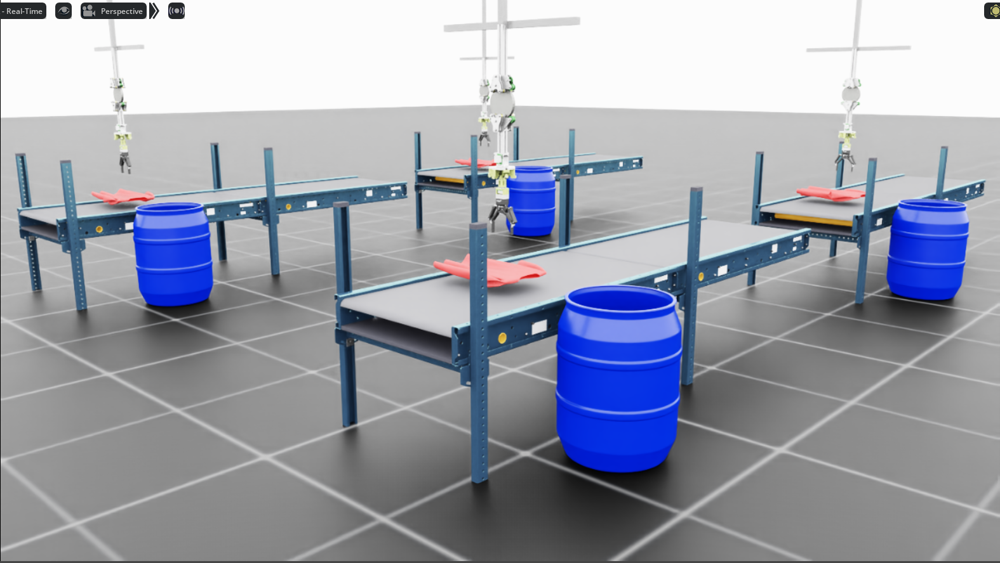

# Shirt Place Task

[← Back to extension overview](../../../../../../README.md) · [Project root](../../../../../../../../README.md)

Shirt pick-and-place with the 5-DOF tensegrity manipulator and Robotiq 2F
gripper.  The robot must grasp a cloth-simulated T-shirt from the conveyor
belt, transport it to a target drum, and release it inside.

> **Status: Template** — cloth simulation integration is pending.  The scene
> and environment configurations contain placeholder definitions that will be
> completed once deformable object support is integrated.



## Goal

Train an RL agent to perform a full pick → transport → place sequence with
a deformable cloth object (T-shirt):

1. **Reach** the shirt on the conveyor belt.
2. **Grasp** it with the Robotiq 2F gripper.
3. **Lift** it above the belt surface.
4. **Transport** it laterally toward the target drum.
5. **Release** the shirt above the drum opening.
6. **Success** accumulates per-step reward while the shirt rests in the drum.

## Variants

| Environment ID | Description |
|---|---|
| `Template-Tensegrity-Shirt-Place-v0` | Standard training (4 096 envs) |

## Scene

Extends `ProjBaseSceneCfg` with a cloth-simulated T-shirt.

| Element | Details |
|---|---|
| Robot | `TENS_5DOF_GRIPPER_CFG` at (0.15, 0.0, 2.30) m |
| Shirt | TODO: DeformableObjectCfg (cloth simulation) |
| Target drum | Plastic drum at (0.15, 0.85, 0.0) m |
| Conveyor | Dual belt, surface at 0.80 m, **inactive** |
| Env spacing | 4.0 m |

## Controlled Joints

| Joint | Type | Limits | Action Clip |
|---|---|---|---|
| `base_y_joint` | Prismatic | ±0.5 m | (−0.5, 0.5) |
| `base_z_joint` | Prismatic | −0.5 … 0.0 m | (−0.5, 0.0) |
| `elbow_joint` | Revolute | ±1.5 rad | (−1.5, 1.5) |
| `wrist_y_joint` | Revolute | ±0.8 rad | (−0.8, 0.8) |
| `wrist_x_joint` | Revolute | ±0.8 rad | (−0.8, 0.8) |
| `finger_joint` | Revolute | — | Binary (open=0.0, close=0.7854) |

## Actions (6 dims)

| Group | Dims | Type | Scale |
|---|---|---|---|
| `base_delta` | 2 | Joint position delta | 0.50 |
| `arm_delta` | 3 | Joint position delta | 1.0 |
| `gripper` | 1 | Binary joint position | open=0.0, close=0.7854 |

## Observations

<!-- TODO: Define observation terms once cloth simulation is integrated -->

## Rewards

<!-- TODO: Define reward terms once cloth simulation is integrated -->

The reward pipeline will follow the same 6-phase structure as the cube place
task (reach → grasp → lift → transport → release → success), adapted for
deformable object manipulation.

## Terminations

| Term | Type | Condition |
|---|---|---|
| `time_out` | Truncation | Episode length exceeded (8.0 s) |

## Simulation Parameters

| Parameter | Value |
|---|---|
| Physics dt | 0.01 s (100 Hz) |
| Decimation | 2 (control at 50 Hz) |
| Episode length | 8.0 s |
| Default num_envs | 4 096 |

## Training

<!-- TODO: Add training results once cloth simulation is integrated -->

## Running

```bash
cd src/tensegrity_pick

# Training
conda run --no-capture-output -n env_isaaclab python3 scripts/skrl/train.py \
    --task Template-Tensegrity-Shirt-Place-v0 --headless
```

## Related

- [Cube place task](../cube_place/README.md) — rigid-body cube pick-and-place (reference implementation)
- [Shirt sort task](../shirt_sort/README.md) — cloth sorting on active conveyor
- [Robot specification](../../../../../../../../res/Tensegrity/README.md) — kinematic chain, joint constraints, tendon geometry
- [Extension overview](../../../../../../README.md) — all registered tasks and scripts
