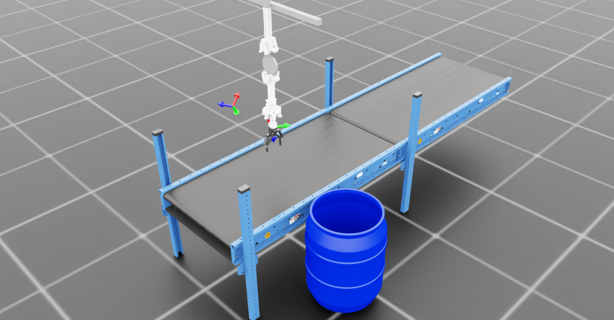
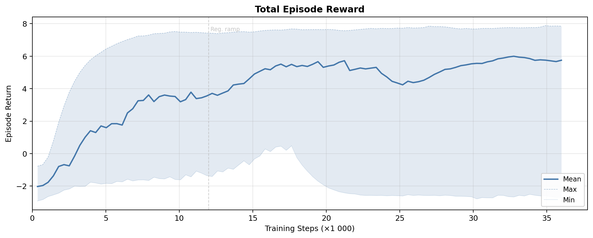
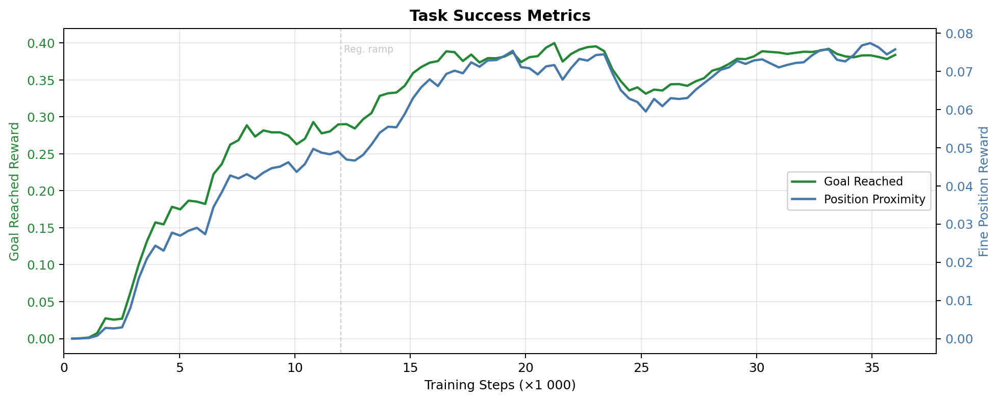
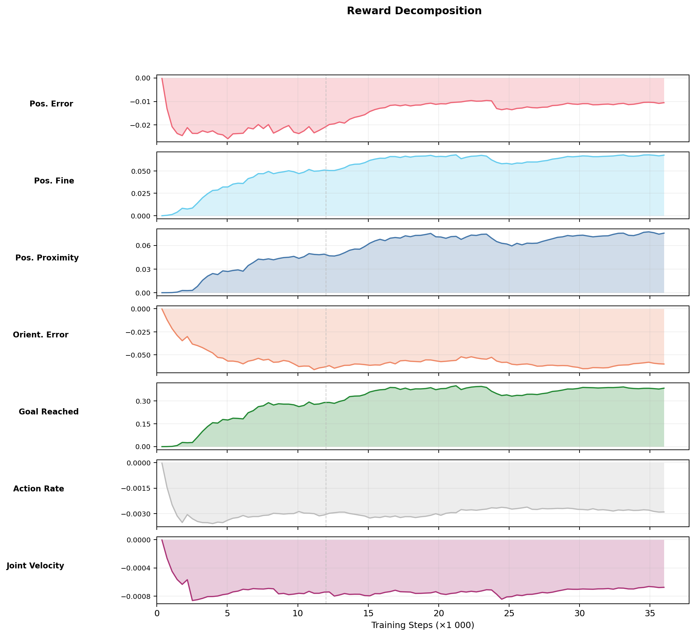
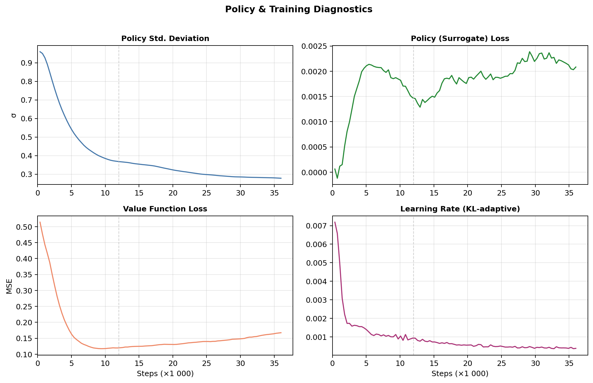
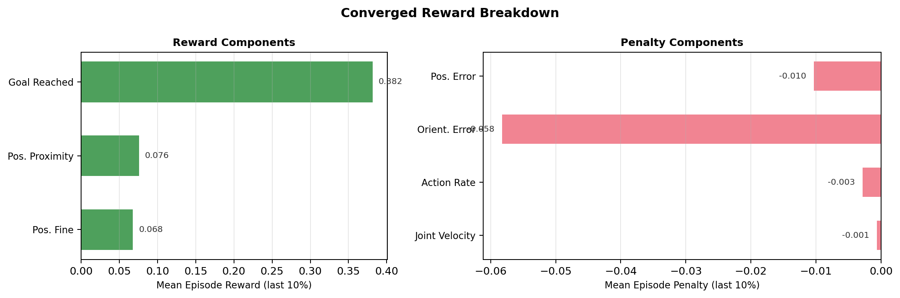

# Tensegrity Reach Task

[← Back to extension overview](../../../../../../README.md) · [Project root](../../../../../../../../README.md)

End-effector pose tracking for the 5-DOF tensegrity manipulator.  The robot
must move `tool_link_0` to randomly sampled target poses that are guaranteed
reachable by construction.



## Goal

Teach an RL agent to track arbitrary end-effector poses (position **and**
orientation) as quickly and smoothly as possible.  Targets are produced by a
custom **FK-Sampled Pose Command** generator that samples random joint
positions within the robot's limits, computes forward kinematics through the
physics engine, and stores the resulting pose as the command.  This guarantees
every target is reachable.

## Variants

| Environment ID | Actuation | Description |
|---|---|---|
| `Template-Tensegrity-Reach-v0` | PD (joint position) | Standard training (2 000 envs) |
| `Template-Tensegrity-Reach-Play-v0` | PD (joint position) | Evaluation (50 envs, no obs noise) |
| `Template-Tensegrity-Reach-Tendon-v0` | Tendon tensions | Tendon-driven training (2 000 envs) |
| `Template-Tensegrity-Reach-Tendon-Play-v0` | Tendon tensions | Tendon-driven evaluation (50 envs) |

All variants use the base `ManagerBasedRLEnv` as the gymnasium entry point
(no custom env subclass needed for reach).

## Scene

Inherited from `ProjBaseSceneCfg` (ground plane, dome light, dual conveyor
belts, target drum, 5-DOF robot with Robotiq 2F gripper).

| Element | Details |
|---|---|
| Robot | `TENS_5DOF_GRIPPER_CFG` at (0.15, 0.0, 2.30) m |
| Conveyor | Dual belt (4 m total), surface at 0.80 m, **inactive** |
| Target drum | Plastic drum at (0.15, 0.85, 0.0) m |
| Env spacing | 5.0 m |

No additional objects are added — the scene is the base scene only.

## Controlled Joints

| Joint | Type | Limits |
|---|---|---|
| `base_y_joint` | Prismatic | ±0.5 m |
| `base_z_joint` | Prismatic | −0.5 … 0.0 m |
| `elbow_joint` | Revolute | ±1.5 rad (±85.9°) |
| `wrist_y_joint` | Revolute | ±0.8 rad (±45.8°) |
| `wrist_x_joint` | Revolute | ±0.8 rad (±45.8°) |

The gripper is **not** controlled in the reach task.

## Actions

### PD variant (5 dims)

| Group | Dims | Type | Scale |
|---|---|---|---|
| `arm_action` | 5 | Joint position delta | 0.25 |

### Tendon variant (7 dims)

| Group | Dims | Type | Details |
|---|---|---|---|
| `base_action` | 2 | Joint position delta | `base_y_joint`, `base_z_joint`, scale=0.25 |
| `arm_tendon` | 5 | Tendon tensions | max_tension = 500 N, Jacobian transpose from URDF |

## Observations (policy group)

All observation terms are concatenated into a single vector.

| Term | Dim | Description |
|---|---|---|
| `joint_pos` | 5 | Relative joint positions (±0.01 uniform noise) |
| `joint_vel` | 5 | Relative joint velocities (±0.01 uniform noise) |
| `pose_command` | 7 | FK-sampled target pose (x, y, z, qw, qx, qy, qz) in root frame |
| `actions` | 5 or 7 | Previous actions (PD: 5, tendon: 7) |

Total (PD): **22**.  Total (tendon): **24**.

## Command Generator — FK-Sampled Pose

| Parameter | Value |
|---|---|
| Resampling interval | 4.0 s (fixed) |
| Success threshold | 0.05 m (position error) |
| Sampling method | Uniform random in `[joint_lower, joint_upper]` → FK |
| Debug visualisation | Frame markers for goal + current EE pose |
| Metrics reported | Position error, orientation error, success rate, reach time (mean + variance) |

## Rewards

### Task rewards

| Term | Weight | Function |
|---|---|---|
| `end_effector_position_tracking` | −0.2 | L2 position error (clamped to 1.0 m) |
| `end_effector_position_tracking_fine_grained` | +0.1 | `1 − tanh(d / 0.1)` (dense proximity) |
| `end_effector_position_tracking_proximity` | +0.2 | `1 − tanh(d / 0.03)` (fine proximity) |
| `end_effector_orientation_tracking` | −0.1 | Quaternion error magnitude (clamped) |
| `goal_reached` | +0.5 | Binary: 1.0 when `d < 0.05` m |

### Regularisation

| Term | Weight | Notes |
|---|---|---|
| `action_rate` | −0.001 → −0.01 | L2 action rate (curriculum ramp at 12k steps) |
| `joint_vel` | −0.0005 → −0.005 | L2 joint velocity (clamped to 10 rad/s, curriculum ramp) |

## Terminations

| Term | Type | Condition |
|---|---|---|
| `time_out` | Truncation | Episode length exceeded (12.0 s / 360 steps) |
| `joint_vel_diverged` | Truncation | Any joint velocity > 100 rad/s |

## Curriculum

| Step Threshold | Change |
|---|---|
| 0 → 12 000 | `action_rate` weight ramps from −0.001 to −0.01 |
| 0 → 12 000 | `joint_vel` weight ramps from −0.0005 to −0.005 |

## Reset Events

| Event | Details |
|---|---|
| `reset_robot_joints` | Controlled joints scaled to 75 %–125 % of defaults; velocities zeroed |

## Simulation Parameters

| Parameter | Value |
|---|---|
| Physics dt | 1/60 s ≈ 16.67 ms |
| Decimation | 2 (control at 30 Hz) |
| Episode length | 12.0 s (360 control steps) |
| PhysX stabilisation | Enabled |
| Default num_envs | 2 000 (train) / 50 (play) |

## Training

Training converges within 36k steps (PPO via SKRL with 2 000 parallel
environments).  The `skrl_ppo_cfg.yaml` is configured for 36 000 timesteps.

## Running

```bash
cd src/tensegrity_pick

# PD-driven training
conda run --no-capture-output -n env_isaaclab python3 scripts/skrl/train.py \
    --task Template-Tensegrity-Reach-v0 --headless

# Play latest checkpoint
conda run --no-capture-output -n env_isaaclab python3 scripts/skrl/play.py \
    --task Template-Tensegrity-Reach-Play-v0 --num_envs 10

# Tendon-driven training
conda run --no-capture-output -n env_isaaclab python3 scripts/skrl/train.py \
    --task Template-Tensegrity-Reach-Tendon-v0 --headless
```

## Training Results

Results from training run `2026-02-18_23-48-54` (PPO, 2 000 envs, 36k steps).
Plots generated with `scripts/plot_reach_training_results.py`.

### Total Episode Reward

The total reward curve shows the learning trajectory with min/max envelope.
The regularisation curriculum ramp begins at 12k steps, causing a slight
reward decrease as action smoothness penalties increase.



### Task Success

Goal reached reward (left axis) and fine position proximity reward (right axis)
track the agent's ability to reach target poses.  Both metrics improve
quickly in the first 10k steps and plateau as the regularisation ramp takes
effect.



### Reward Decomposition

All reward components shown over training.  Position error (negative weight)
decreases as the agent improves, while proximity rewards (positive weights)
increase.  The goal reached reward shows the clearest signal of task mastery.
Regularisation penalties appear in the lower two panels.



### Policy Diagnostics

Policy standard deviation, surrogate loss, value loss, and learning rate
(KL-adaptive) over training.  The standard deviation decreases as the policy
converges.  The learning rate adapts to maintain stable KL-divergence.



### Converged Reward Breakdown

Final performance averaged over the last 10% of training.  The goal reached
reward dominates the positive components, confirming that the agent
consistently reaches target poses.  Position and orientation tracking errors
are the main negative components.



### Regenerating Plots

```bash
cd src/tensegrity_pick
conda run --no-capture-output -n env_isaaclab python3 scripts/plot_reach_training_results.py
# Or specify a run:
conda run --no-capture-output -n env_isaaclab python3 scripts/plot_reach_training_results.py \
    --run 2026-02-18_23-48-54_ppo_torch
```

## Related

- [Robot specification](../../../../../../../../res/Tensegrity/README.md) — kinematic chain, joint constraints, tendon geometry
- [Tendon simulation](../../../../../../../../doc/tendon_simulation.md) — physics model and validation
- [Cube place task](../cube_place/README.md) — cube pick-and-place task
- [Cube sort task](../cube_sort/README.md) — cube sorting on active conveyor
- [Extension overview](../../../../../../README.md) — all registered tasks and scripts
